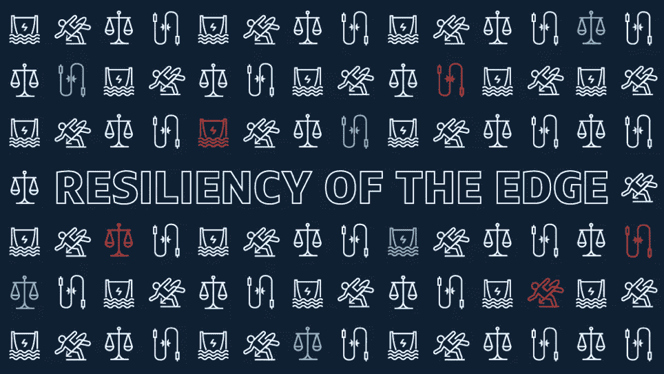
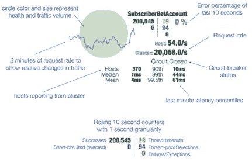

# Capital One 的移动边缘工程团队利用了 4 种弹性模式

> 原文：<https://medium.com/capital-one-tech/resiliency-patterns-at-the-edge-capital-one-a5b4d41d477e?source=collection_archive---------1----------------------->

Capital One 引领金融行业从实体产品向基于云的数字产品过渡。传统上，金融行业技术规范倾向于支持私有数据中心，托管陈旧的大型机系统，因此在采用现代技术方面存在固有的缓慢。作为我们技术发展的一部分，Capital One 正在努力整合敏捷方法，以包括交付自动化、解耦系统(即，通过明确定义的 API)和微服务架构。与任何高度活跃的交易系统的全系统转型一样，在这一转型中将会出现挑战。

大多数当前的体系结构通过采用负载平衡、集群和基础设施冗余等技术来考虑服务失败的风险。这些模式虽然有效，但只考虑了特定服务或组件的完全中断。与基于功能的中断中发现的细微问题相比，这些类型的问题可以很容易地检测和解决。发现微服务何时未按预期工作、性能不佳或导致下游故障可能是一项挑战。但是，他们需要自动进行自我识别和自我纠正，以便最大限度地减少对客户体验的影响。

Capital One 的移动团队自豪地通过 [Capital One 移动应用](https://www.capitalone.com/applications/mobile/)等产品为我们的客户提供屡获殊荣的数字体验。在设计分布式[微体验](/capital-one-developers/designing-microexperiences-on-the-edge-for-mobile-eb4e6c3a3f2e)(即*用户体验*聚焦的微服务)时，Edge 工程师评估了该领域的先驱，如[网飞和亚马逊网络服务](https://aws.amazon.com/solutions/case-studies/netflix/)，以了解他们如何在其环境中实现弹性。

在这篇博客中，我们将重点关注我们在边缘(面向外部的基础设施和我们的业务服务之间的智能技术层)实施的各种弹性模式，以改善我们的客户体验并保护我们的下游服务。

# 弹性模式

我们将考虑四种弹性模式，这些模式允许服务服务于我们的客户体验并保护我们的内部资源。这些弹性模式有助于防止问题蔓延到上游或下游系统。这四种模式是*客户端负载均衡、断路、回退、*和*隔离壁。*

## 客户端负载平衡模式

对于微服务架构，与服务器端负载平衡相比，客户端负载平衡模式更受青睐。原因是因为它易于扩展、高效地处理更新，并且消除了诸如瓶颈或单点故障之类的情况。负载平衡功能被推送到每个客户端，分配负载平衡的责任。

这种模式包括一个发现服务，如[网飞尤里卡](https://github.com/Netflix/eureka)或[哈希公司领事](https://www.consul.io/)。启动时，服务实例向发现服务器注册，公布其位置。发现服务将缓存服务实例的位置和健康状态。然后，发现客户端将从健康实例池中查找特定服务的实例。

如果服务实例由于负载或下游服务的问题而响应缓慢或抛出错误，客户端负载平衡器组件将检测并提供纠正措施。不正常的实例将从资源池中删除，防止其在将来被使用。即使发现服务停止运行，客户机上仍会保留一个本地副本，这样，就可以使用缓存副本中的最新信息继续连接。

## 断路器模式

此模式防止客户端继续调用失败或遇到性能问题的服务。软件断路器模式是模仿电气断路器的。电路断路器检测电涌并断开连接，以防止可能损坏电路或连接到电路的设备的功率过载的传播。

在软件服务的情况下，断路器与消耗资源一起使用。如果通话时间过长，断路器会切断通话，让通话“快速失败”如果对于给定的调用，对远程资源的失败请求太多，电路就会断开。开路允许服务继续运行，防止故障级联到其他系统，并为故障服务提供恢复时间。

目前，我们使用[网飞的 Hystrix](https://github.com/Netflix/Hystrix) 作为我们的断路技术。Hystrix 将所有对外部系统、资源或依赖关系的调用包装在一个 ***HystrixCommand*** 或***HystrixObservableCommand***对象中，该对象通常在一个单独的线程中执行。如果调用时间超过了设定的阈值，则基于给定资源的所有请求的 99.5%的性能，将发生超时。Hystrix 将为每个依赖关系维护一个预配置的线程。如果线程池变满，指向该资源的请求将被立即拒绝，而不是排队，从而防止下游服务过载。Hystrix 电路中断持续测量成功、失败、超时和线程拒绝，因此它知道何时关闭电路。一旦电路关闭，请求会自动重新建立。

## 后退模式

回退模式包括检测问题，然后在替代代码路径上执行。这种模式在原始代码路径失败时使用，它提供了一种机制，允许服务客户端通过替代方式进行响应。其他路径可能包括静态响应、存根回退、缓存响应，甚至是提供类似信息的替代服务。一旦检测到故障，可能通过其他弹性模式之一，系统可以回退。

例如，Capital One 的一些数字产品使用地图功能，显示我们的自动取款机、银行分行和其他实体服务网点的位置。通常，该服务将动态返回位置列表。然而，在失败的情况下，我们的服务将恢复到本地缓存的位置列表。用户体验到带有位置的地图显示，而不是错误。在大多数情况下，这将为用户带来更好的体验。

## 舱壁模式

服务可以使用多个分布式资源来显示对用户请求的响应。隔板模式将这些调用分隔开来，这样一个服务的低性能就不会对其他服务的结果以及最终的用户体验产生负面影响。舱壁模式是基于船舶设计中的一个常见概念。船只被分成水密舱室，以防止在船体破裂时水从一个舱室扩散到船上的其他区域。这些隔间中的每一个都被称为“隔板”这样，如果船体受损，沉船的风险就会降低。

Hystrix 通过限制对一个组件的并发调用的数量来提供隔板模式的实现。这样，等待组件回复的线程数量就有限了。在没有这种隔离的系统中，线程可能会耗尽，导致级联效应，干扰其他依赖项的性能。在这个场景中，单独的线程池充当隔板。如果某个请求停止响应(即挂起)，或者性能开始下降，该特定服务的线程将被耗尽，但其他服务将继续响应，从而将影响降至最低。

# 监视

这四种模式— *、客户端负载平衡、电路中断、故障恢复和隔板(*)是提高弹性的基本实现，但是在操作期间可视化状态可能是一个挑战。我们的团队使用了来自网飞的 Hystrix 库的对应功能，称为 [Hystrix 仪表板](https://github.com/Netflix/Hystrix/wiki/Dashboard)。该仪表板提供了每个呼叫或 ***HystrixCommand*** 的实时视图，减少了了解操作事件所需的时间。仪表板提供了按特定标准排序的单一视图，有助于根据音量、错误率、断路器状态和电路的整体健康状况来关注重要事件。作为进一步的扩展，我们启用了基于 ***HystrixCommand 的*** 电路断开频率的报警，以自动通知操作条件。

图 1.0 描述了仪表板中一个电路的图形表示，以及对可用数据点的解释。仪表板还能够汇总来自多个微体验或微服务的指标，并通过使用 [Hystrix 涡轮服务](https://github.com/Netflix/Turbine/wiki)给出每个集群实例的总体流量。

*图 1.0 仪表板的 Hystrix 电路示意图*

*Note: Values shown are based on a preconfigured 10 second rolling window and a 2-minute request rate.*

# 边缘生活

作为 Capital One Edge 工程团队的一部分，我们的移动微体验每天协调数百万个请求，通过 Capital One 生态系统转化为数十亿个呼叫；这一切都是为了向我们的客户提供屡获殊荣的金融产品和服务。

我们的工作是为用户提供无缝体验，即使遇到重大或轻微的故障，也能保持高可用性和弹性。我们不断致力于创新解决方案，以在高容量环境中提升分布式应用和客户端弹性。

*披露声明:这些观点是作者的观点。除非本帖中另有说明，否则 Capital One 不属于所提及的任何公司，也不被其认可。使用或展示的所有商标和其他知识产权都是其各自所有者的所有权。本文为 2018 首都一。*

# 资源

*   [https://medium . com/capital-one-developers/we-re-a-disruptive-bank-a21f 7 CCE 25 b 6](/capital-one-developers/we-re-a-disruptive-bank-a21f7cce25b6)
*   【https://github.com/Netflix/ribbon 
*   [https://github.com/Netflix/Hystrix/wiki](https://github.com/Netflix/Hystrix/wiki)
*   [https://github.com/Netflix/Hystrix/wiki/How-To-Use](https://github.com/Netflix/Hystrix/wiki/How-To-Use#Common-Patterns-FallbackStatic)
*   [https://medium . com/网飞-科技博客/making-the-网飞-API-more-resilient-a8ec 62159 c2d](/netflix-techblog/making-the-netflix-api-more-resilient-a8ec62159c2d)
*   [https://medium . com/网飞-科技博客/高容量分布式系统容错-91ab4faae74a](/netflix-techblog/fault-tolerance-in-a-high-volume-distributed-system-91ab4faae74a)
*   [https://github.com/Netflix/Hystrix/wiki/Dashboard](https://github.com/Netflix/Hystrix/wiki/Dashboard)
*   [https://www.capitalone.com/applications/mobile](https://www.capitalone.com/applications/mobile)
*   [https://www.consul.io/](https://www.consul.io/)
*   [https://medium . com/capital-one-developers/mobile-orchestration-innovation-on-the-edge-9835 E4 CBD 69 e](/capital-one-developers/mobile-orchestration-innovation-on-the-edge-9835e4cbd69e)

