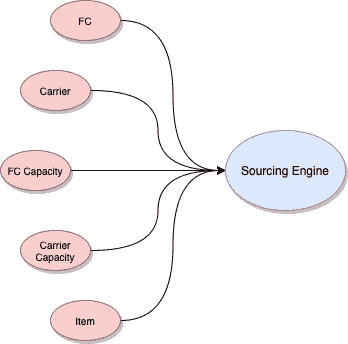
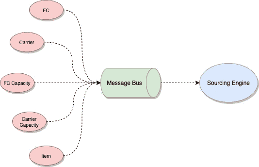

# 通过消息驱动的架构实现弹性

> 原文：<https://medium.com/walmartglobaltech/resiliency-through-message-driven-architecture-137c4547dc80?source=collection_archive---------0----------------------->

Photo credit: [Pixabay](https://pixabay.com/illustrations/letters-envelope-news-message-5614727/)

## 语境

弹性是现代系统的一个关键属性，被认为是保持业务的主要因素。在本文中，我们将研究 ***消息驱动的*** 架构如何在参考实现的帮助下为系统带来弹性。

## 什么是弹性？

> 在软件工程中，**弹性**被定义为尽管整个系统出现某些故障，仍能保持响应的能力。

现代系统在本质上是分布式的——多个组件(或微服务)一起工作来执行整个系统提供的业务。例如，一个电子商务网站可能有多个服务负责目录、项目、购物车、预订、库存等..所有这些服务协同工作，以方便客户购买产品。预订订单时显示 ***预期交付日期*** 这样的简单请求可能需要从多个微服务中提取信息，以便考虑库存、运输和位置来计算结果。如果一个(或多个)上游服务停止，站点会停止接受订单吗？弹性就是在这种局部故障下保持整个系统的响应。

## 什么是消息驱动架构？

> 在**消息驱动架构中**组件通过传递消息来相互交流。**消息**是发送到特定目的地的数据项。

消息在两个松散耦合的组件之间架起了一座上下文边界的桥梁。每个组件都拥有整个系统的一部分，并且独立工作。通过隔离组件，故障也包含在组件内，不会扩散到整个系统。处理故障是组件的局部问题，而不是整个系统的问题。

## 问题是

我们在上一节中简要地谈到了 ***预计交货日期*** 的计算问题，让我们放大到这一点。

假设购物车中的商品在几个*履行中心都有库存，为了简单起见，我们只考虑一个 ***FC*** 。有库存不代表能在恒定时间内发货。这将取决于许多属性，如****截止时间*** 等。每个 ***FC*** 可能与不同的 ***承运商*** 有关联，如 *FedEx 或 UPS* ，它们可能有自己的 ***工作日历*** *、* ***截止日期*** *、* ***运输时间*** 和其他贡献此外，每个 FC 可以在任何给定的一天处理一组有限的订单(称为 ***FC 能力*** *)。*每辆运输车可以装载一套固定的箱子( ***运输车容量*** *)* 也装在拖车里。项目维度决定了箱子的数量。物品属性过滤掉某些承运商，例如不通过*航空承运商*运输*危险品*物品。**

**如果你觉得上面的模型看起来很复杂，我同意你的观点！我刚刚试图用几句话解释一个电子商务网站的潜在的**采购引擎工作流程。无论如何，这里的关键是——有一个系统依赖于多个组件来执行其工作，如 ***图像图 1*** 所示****

****

**Figure 1**

**很明显，这些依赖组件中的一个组件的故障可能会对整个系统产生连锁效应。**、*、*、**或仔细定义的**、*、*、**的断路器可以用来把故障减少到一定程度。然而，某些依赖是无法避免的，我们可以实现的最好方法可能是快速失败。**

## **解决办法**

*****消息驱动*** 解决这个问题的方法如图 ***图 2*** 所示。所有相关系统都将其状态更改发布到消息总线。**关键的依赖性从它的运行时中被消除。上游组件故障是孤立的，不会级联到整个系统。****

****

**Figure 2**

## **警告**

*****消息驱动*** 架构并不适用于所有用例，应谨慎使用。使用它之前，需要考虑以下几点:**

*   **由于数据是异步流动的，它可能不如从源系统获取的数据新鲜。对于不能承受陈旧数据的系统，消息驱动可能不是最佳选择。**
*   **应该高效地实现消息消费者，以匹配生产者的速度。需要对滞后进行监控，并在达到阈值时发出警报。**
*   **还应该在生产者端实现一些智能监控，以捕捉消息发布或组件故障，这样消费者就不会误以为自己是最新的，并据此采取行动。**
*   **消费者端的存储应该高度冗余，否则将成为单点故障。**

## **结论**

**在分布式系统中，某些组件的故障是不可避免的。 ***消息驱动的*** 架构有助于构建真正解耦的组件，其中这种部分故障是允许的并且可以被包含。这种松散耦合为整个系统带来了弹性，并使其具有响应性。**

## **参考资料:**

1.  **[https://www.reactivemanifesto.org/](https://www.reactivemanifesto.org/)**
2.  **[https://developer . light bend . com/docs/akka-platform-guide/concepts/message-driven-event-driven . html](https://developer.lightbend.com/docs/akka-platform-guide/concepts/message-driven-event-driven.html)**