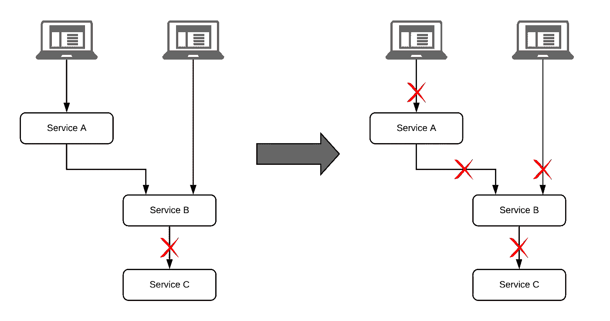
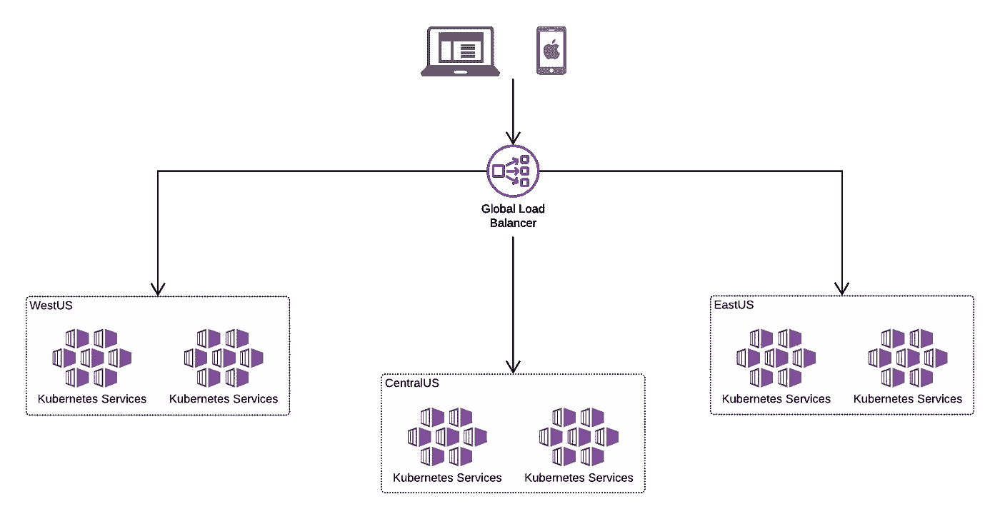
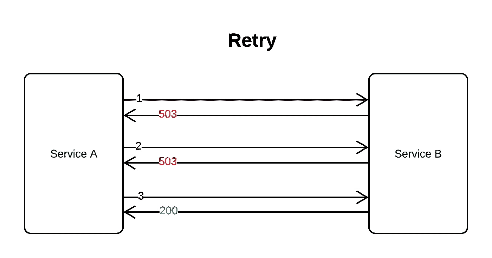
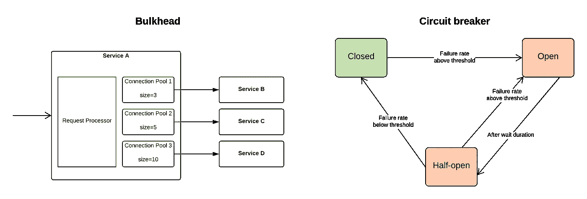

# 现实世界中的弹性 Web 应用程序

> 原文：<https://medium.com/walmartglobaltech/resilient-web-application-in-the-real-world-2a2d2ca0922a?source=collection_archive---------3----------------------->

*“没有什么是完全可靠的。任何事情都有失败的时候！”*

在这篇博客中，我将谈论*需要做什么*来使你的面向客户的网络应用 ***有弹性*** 。这些都是基于我为世界顶级零售商构建高度可伸缩的电子商务应用程序的经验。

*弹性*是系统以可接受的方式继续服务于传入请求的能力，即使它的一个或多个组件或依赖系统不起作用。

在一个微服务的世界里，仅仅因为其中一个微服务出现故障，就很容易遇到级联故障。此外，随着公共云的出现，您对资源的控制越来越少，失败比平常更常见。例如，假设*服务 A* 依赖于*服务 B* 而*服务 B* 依赖于*服务 C* 。如果*服务 C* 出现故障，则*服务 A* 和*服务 B* 均不可用。因此，为您的微服务设计弹性变得非常重要。

弹性设计应该与应用程序设计一起完成，而不应该是事后的想法。在此阶段，与您的依赖团队、DevOps 团队和企业架构师密切合作。

弹性应该在三个层次上设计:

1.  基础设施:

设计在多个区域部署服务器:
*这有助于确保即使一个区域出现故障，您也能够提供流量服务。例如，在 EastUS、CentralUS 和 WestUS 地区设立办事处会有所帮助。您可以利用公共云来构建这种设置。*

在区域内设计一套备份服务器:
*除了在多个区域部署服务器之外，计划在区域内部署多台服务器。这确保了在少数服务器出现故障的情况下，您不会将流量一直发送到一个遥远的区域。例如，每个地区有两个 Kubernetes 集群就很好。*

确保每个资源都是分布式的:
*无论是数据库、缓存、负载平衡器还是 KeyVault，都要确保请求处理中的每个资源都基于冗余架构。*

尽可能激活自动扩展:
*大多数云提供商在服务器、数据库等方面提供自动扩展功能。启用这些功能，这样您的应用程序就可以在没有手动干预的情况下处理激增的负载。*

2.**应用**:

无状态微服务:
*使用* ***无状态*** *微服务，每个请求可以发送到任何健康的服务器实例，从而保护应用程序免受实例重启和故障的影响。*

有备用资源:看看你是否能使用备用资源满足请求。如果数据库没有响应，应用程序可以使用缓存服务请求吗？如果您不能调用某个服务，是否可以将它发送到消息队列中，稍后再进行处理？

健康探测器:
*配置一个深度健康探测器，用于检查所有必须依赖的组件。例如，健康探测应该触及应用程序的服务端点，该端点与数据库和高度依赖的服务进行交互。*

3.**军种间通信**:

超时:
*确保在您拨打服务电话时配置了适当的超时。应该仔细选择超时值，因为太小的值可能导致太多的超时，太高的值可能导致等待浪费时间。*

重试次数:
*确保进行重试，因为您拨打的服务电话可能会因网络故障而失败。但是也不要重试太多次。对超时时间长的服务重试多次会使您的服务非常慢。在实现重试时，确保您调用的服务是等幂的。*

回退:
*确保在服务调用失败或超时时定义回退。这些回退可以是从缓存中取值、选择默认值或内部逻辑来计算近似值。*

避免:
*避免服务呼叫失败的最佳方法是避免服务呼叫。看看是否可以利用缓存，是否可以重用以前调用的值，等等。确保设置 TTL，以避免陈旧数据造成的影响。如果相关服务知道下一次更新的计划时间，这些 TTL 值可以由它们提供，或者您可以根据您对数据易变率的了解来选择它。*

设计模式和工具:
*实现电路断路器、隔板等设计模式，使用 Resilience4J 等工具或服务网格的弹性特性实现超时、重试、回退和连接池。*

**测试你的弹性**

使用在线弹性工具测试你的弹性设计。您可以将此作为部署管道的一部分，或者通过进行测试和监控应用程序可用性的演练来完成。

最后，在大多数情况下，设计弹性是一个迭代过程。在生产中监控您的应用程序，并调整配置，如重试、超时、缓存 TTLs 等，直到您认为它是最佳的。

在这篇文章中，我主要讨论了让你的应用程序具有弹性需要“做什么”。如果你有兴趣知道“如何”去做，请写下你的回答，我很乐意分享我的想法。