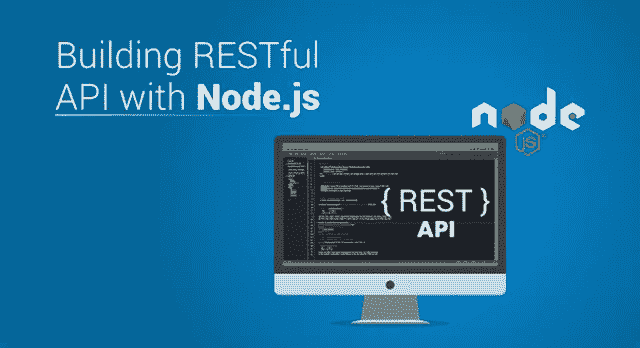
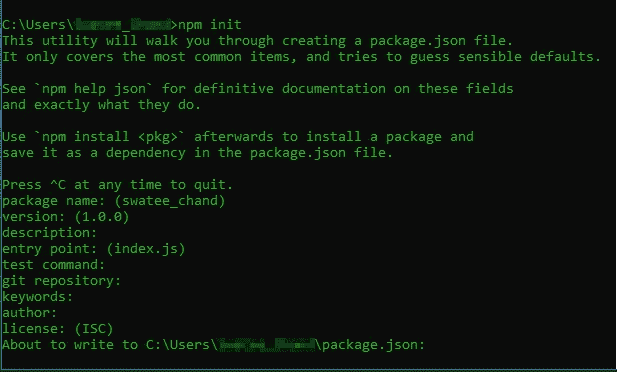
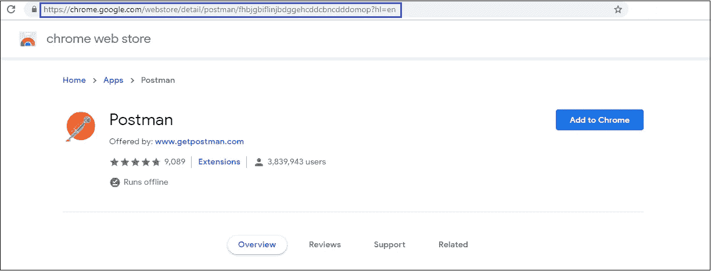
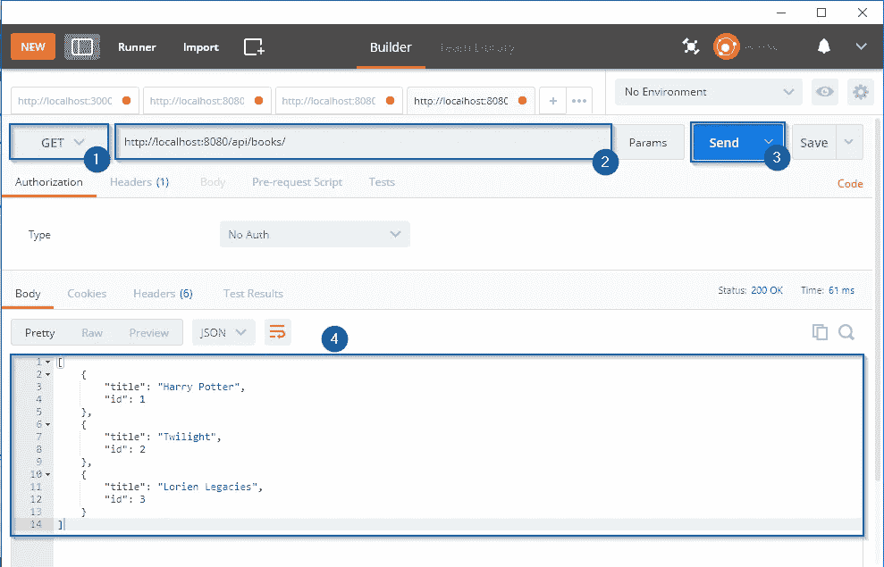
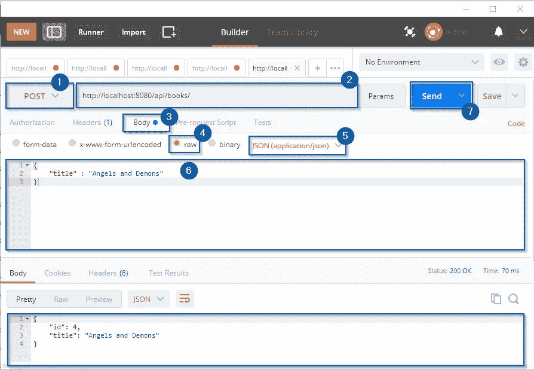
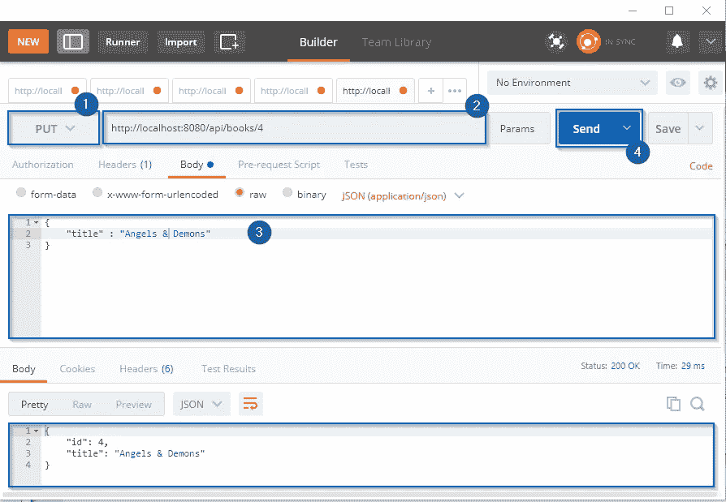
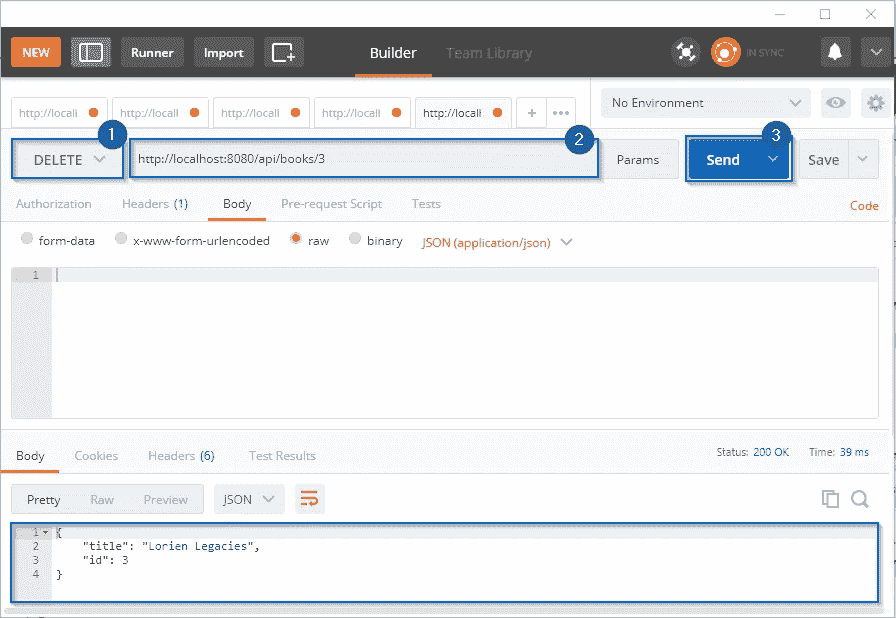
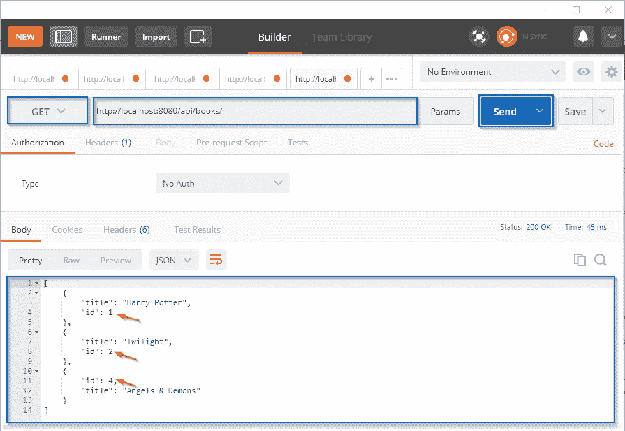

# 如何用 Node.js 从零开始构建 REST API？

> 原文：<https://medium.com/edureka/rest-api-with-node-js-b245e345f7a5?source=collection_archive---------0----------------------->



Build REST API With Node.js — Edureka

自从 WWW 发明以来，各种 web 技术如 RPC 或 SOAP 被用来创建和实现 web 服务。但是这些技术在处理任何通信任务时都使用了严格的定义。因此，REST 被开发出来，它有助于降低复杂性，并为设计基于网络的应用程序提供了一种架构风格。因为 Node.js 技术为前端开发人员带来了服务器的革命，所以在本文中，我将展示用 Node.js 从头开始构建 REST API 的过程。

以下是我将在本文中涉及的主题:

*   什么是 REST API？
*   休息原则
*   实践演示:用 Node.js 构建 REST API

# 什么是 REST API？

REST 或 **REST** ful 代表***RE****presental****S****tate****T****transfer。它是一种架构风格，也是一种用于通信目的的方法，经常用于各种 web 服务开发。简单地说，它是一个应用程序接口(API ),利用 HTTP 请求在 WWW 上获取、上传、发布和删除数据。*

REST 架构风格有助于利用较少的带宽，这使得应用程序更适合互联网。它通常被认为是互联网的“*”语言。它完全基于资源，其中每个组件都被视为一个组件，单个资源可以通过使用标准 HTTP 方法的公共接口进行访问。*

*为了更好地理解，让我们深入一点，看看 REST API 到底是如何工作的。基本上，REST API 分解一个事务，以便创建小模块。现在，这些模块中的每一个都用于处理交易的特定部分。这种方法提供了更多的灵活性，但是需要从头开始进行大量的工作。*

****任何基于 REST 的架构中使用的主要函数有:****

*   *提供对资源的只读访问。*
*   ***PUT**—创建新资源。*
*   ***删除**—删除资源。*
*   ***发布**—更新现有资源或创建新资源。*

*但凡是声称的都不能称为 RESTful API。为了被视为 RESTful API，您的应用程序必须满足某些约束或原则。在本文的下一部分，我将详细讨论这些原则。*

# *休息原则*

*菲尔丁博士提出了六条基本原则，他是 2000 年定义 REST API 设计的人。以下是休息的六个指导原则:*

## ***无状态***

*从客户端发送到服务器的请求包含完全理解它所需的所有必要信息。它可以是 URI、查询字符串参数、正文甚至标头的一部分。URI 用于唯一标识资源，主体保存请求资源的状态。一旦服务器完成处理，一个适当的响应将通过头、状态或响应体发送回客户端。*

## ***客户端-服务器***

*它有一个统一的接口，将客户机和服务器分开。分离关注点有助于提高跨多个平台的用户界面的可移植性，并增强服务器组件的可伸缩性。*

## ***统一接口***

*为了获得整个应用程序的一致性，REST 定义了四个接口约束，它们是:*

*   *资源标识*
*   *使用表示的资源操作*
*   *自我描述的消息*
*   *作为应用程序状态引擎的超媒体*

## ***可缓存***

*为了提供更好的性能，应用程序通常是可缓存的。这是通过隐式或显式地将来自服务器的响应标记为可缓存或不可缓存来实现的。如果响应被定义为可缓存的，那么客户机缓存可以在将来为等效的响应重用响应数据。它还有助于防止过时数据的重复使用。*

## ***分层系统***

*分层系统架构通过限制组件行为使应用程序更加稳定。这种体系结构支持负载平衡，并提供共享缓存来提高可伸缩性。分层架构还有助于增强应用程序的安全性，因为每一层中的组件都不能与其所在的下一层之外的组件进行交互。*

## ***按需编码***

*按需编码是一个可选的约束，使用最少。它允许通过接口下载和扩展客户代码或小应用程序，以便在应用程序中使用。本质上，它通过创建一个不依赖于自身代码结构的智能应用程序来简化客户端。*

*现在您已经知道了什么是 REST API，以及为了交付高效的应用程序您需要注意什么，让我们更深入地了解使用 Node.js 构建 REST API 的过程。*

# *实践演示:使用 Node.js 构建 REST API*

*这里，我们将使用 [Node.js 和 Express.js](https://www.edureka.co/blog/nodejs-tutorial?utm_source=medium&utm_medium=content-link&utm_campaign=rest-api-with-node-js) 为库管理创建一个简单的 CRUD REST 应用程序。要构建此应用程序，您需要安装以下软件:*

1.  *节点. js*
2.  *快递. js*
3.  *约伊*
4.  *节点监控器*

*在这个例子中，我将使用 WebStorm IDE 来编写和执行代码。您可以根据自己的选择使用任何 IDE 或代码编辑器。那么，我们开始吧。*

*首先，您需要创建您的项目目录。接下来，打开命令提示符并导航到您的项目目录。在那里，您需要使用下面的命令调用 npm:*

```
*npm init*
```

*当您点击 enter 时，Node.js 会要求您输入一些细节来构建。json 文件，例如:*

**

*在这里，您可以定义您的入口点以及其他一些信息。对于这个演示，我将使用 **script.js** 作为切入点。接下来，我们将使用以下命令安装 Express.js:*

```
*npm i express*
```

*最后，我将安装一个名为 **nodemon 的节点监控包。**它监视该文件夹中任何扩展名的所有文件。此外，有了观察器上的 nodemon，您不必在每次进行任何更改时都重新启动 Node.js 服务器。nodemon 将隐式地检测这些更改，并为您重新启动服务器。*

```
*npm i -g nodemon*
```

## ***package.json***

```
*{
"name": "samplerestapi",
"version": "1.0.0",
"description": "Edureka REST API with Node.js",
"main": "script.js",
"scripts": {
"test": "echo "Error: no test specified" &amp;&amp; exit 1"
},
"author": "Edureka",
"license": "ISC",
"dependencies": {
"express": "^4.16.4",
"joi": "^13.1.0"
}
}*
```

## ***script.js***

```
*const express = require('express');
const Joi = require('joi'); //used for validation
const app = express();
app.use(express.json());

const books = [
{title: 'Harry Potter', id: 1},
{title: 'Twilight', id: 2},
{title: 'Lorien Legacies', id: 3}
]

//READ Request Handlers
app.get('/', (req, res) => {
res.send('Welcome to Edurekas REST API with Node.js Tutorial!!');
});

app.get('/api/books', (req,res)=> {
res.send(books);
});

app.get('/api/books/:id', (req, res) => {
const book = books.find(c => c.id === parseInt(req.params.id));

if (!book) res.status(404).send('<h2 style="font-family: Malgun Gothic; color: darkred;">Ooops... Cant find what you are looking for!</h2>');
res.send(book);
});

//CREATE Request Handler
app.post('/api/books', (req, res)=> {

const { error } = validateBook(req.body);
if (error){
res.status(400).send(error.details[0].message)
return;
}
const book = {
id: books.length + 1,
title: req.body.title
};
books.push(book);
res.send(book);
});

//UPDATE Request Handler
app.put('/api/books/:id', (req, res) => {
const book = books.find(c=> c.id === parseInt(req.params.id));
if (!book) res.status(404).send('<h2 style="font-family: Malgun Gothic; color: darkred;">Not Found!! </h2>');

const { error } = validateBook(req.body);
if (error){
res.status(400).send(error.details[0].message);
return;
}

book.title = req.body.title;
res.send(book);
});

//DELETE Request Handler
app.delete('/api/books/:id', (req, res) => {

const book = books.find( c=> c.id === parseInt(req.params.id));
if(!book) res.status(404).send('<h2 style="font-family: Malgun Gothic; color: darkred;"> Not Found!! </h2>');

const index = books.indexOf(book);
books.splice(index,1);

res.send(book);
});

function validateBook(book) {
const schema = {
title: Joi.string().min(3).required()
};
return Joi.validate(book, schema);

}

//PORT ENVIRONMENT VARIABLE
const port = process.env.PORT || 8080;
app.listen(port, () => console.log(`Listening on port ${port}..`));*
```

*现在，下一步是检查处理程序是否正常工作。为此，我们将使用名为 Postman 的 Chrome 扩展。要安装 Postman，你可以访问这里的[](https://chrome.google.com/webstore/detail/postman/fhbjgbiflinjbdggehcddcbncdddomop?hl=en)****，点击“添加到 Chrome”。*****

**********

*****成功安装 Postman 后，打开它并开始测试您的应用程序。所以，让我们从测试 GET 方法开始。现在，为了做到这一点，您需要从下拉列表中选择 GET，键入定义的 URI 并点击 send。如果您的代码运行良好，那么您将会看到我们在代码中手动添加的所有书籍的列表。在下面的图片中，你可以看到我的结果。*****

**********

*****现在，让我们尝试将一本新书添加到我们的目录列表中。为此，从下拉列表中选择“POST ”,并输入为 POST 方法定义的 URI。现在，单击“Body ”,选择“raw ”,然后从下拉列表中选择“JSON ”,如下图所示。现在，在文本区，键入你的书名，如图所示，然后点击发送。*****

**********

*****如果您的 POST 方法运行良好，您的响应正文将包含书名和图书 id。现在，让我们尝试更新书名。目前，我的书名是“天使与魔鬼”，我将更新为“天使与魔鬼”。因此，要更新数据，您需要首先从下拉列表中选择“PUT ”,并输入 PUT 请求的 URI 以及您希望更新的图书 id。接下来在“正文”中，输入新书标题，然后按回车键。*****

**********

*****这将给你一个带有图书 id 和更新的书名的响应。*****

*****最后，让我们发送一个“删除”请求来删除一个现有的记录。从下拉列表中选择 DELETE，并键入删除请求处理程序的 URI 以及您想要删除的书的详细信息，然后按 enter 键。如果您的交易成功，您将在回复正文中看到已删除条目的完整详细信息。*****

**********

*****现在，让我们发送一个 GET 请求来获取我们的最终图书列表。*****

**********

*****从上面的截图中可以看到，响应正文总共包含三本书，其中缺少图书 id 3，因为我们已经删除了该条目。*****

*****至此，我们结束了这篇关于用 Node.js 构建 REST API 的文章。如果你想查看更多关于人工智能、Python、道德黑客等市场最热门技术的文章，你可以参考 Edureka 的官方网站。*****

*****请留意本系列中的其他文章，它们将解释 Node.js 的各个方面*****

> *****1. [NodeJS 教程](/edureka/node-js-tutorial-800e03bc596b)*****
> 
> *****2.[使用 Node.js 和 MySQL 构建一个 CRUD 应用程序](/edureka/node-js-mysql-tutorial-cef7452f2762)*****
> 
> *****3.[使用节点构建 CRUD 应用程序。JS 和 MongoDB](/edureka/node-js-mongodb-tutorial-fa80b60fb20c)*****
> 
> *****4.[提出 Node.js 请求的 3 种最佳方式](/edureka/node-js-requests-6b94862307a2)*****
> 
> *****5.[如何对 Node.js App 进行 Dockerize？](/edureka/node-js-docker-tutorial-72e7542d69d8)*****
> 
> *****6.[用 Node.js 构建 REST API](/edureka/rest-api-with-node-js-b245e345f7a5)*****
> 
> *****7.[提出 Node.js 请求的 3 种最佳方式](/edureka/node-js-requests-6b94862307a2)*****
> 
> *****8. [Express.js 基础](/edureka/learn-node-js-b3a9c6fb632c)*****

******原载于 2019 年 5 月 7 日 https://www.edureka.co**T21*[。](https://www.edureka.co/blog/rest-api-with-node-js/)*****