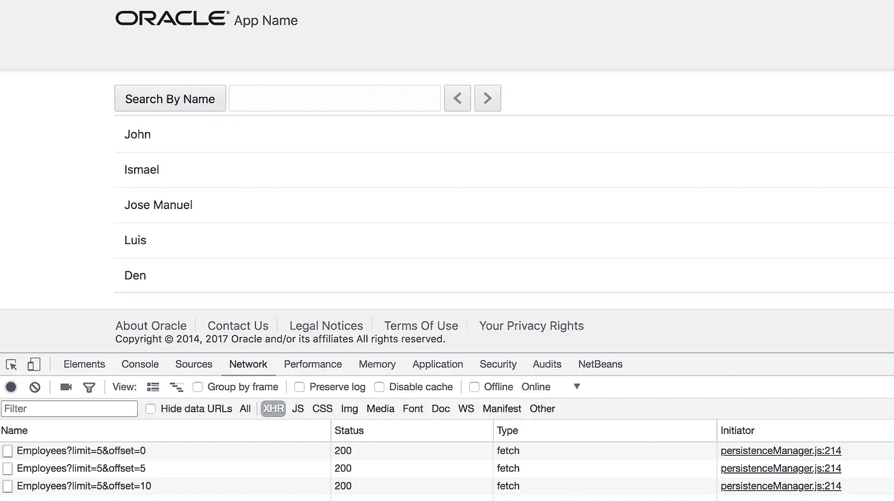
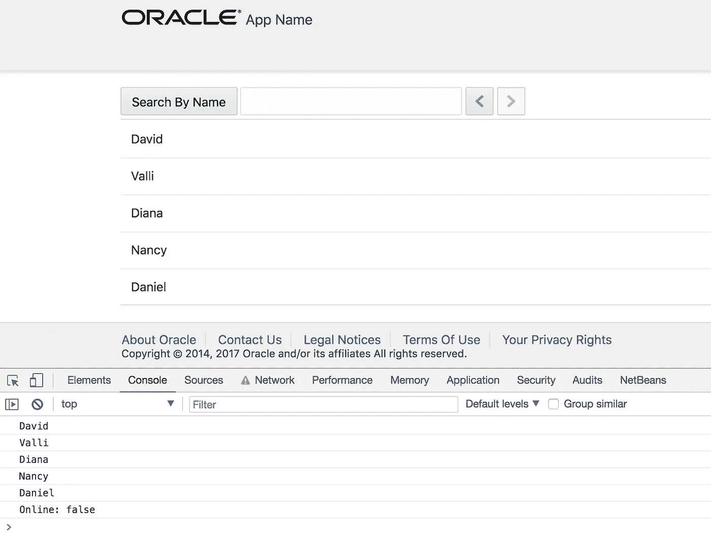
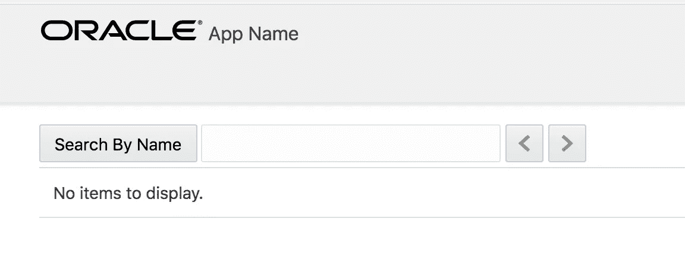
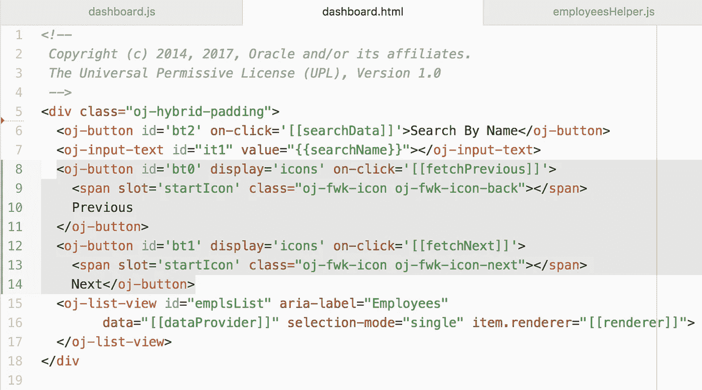
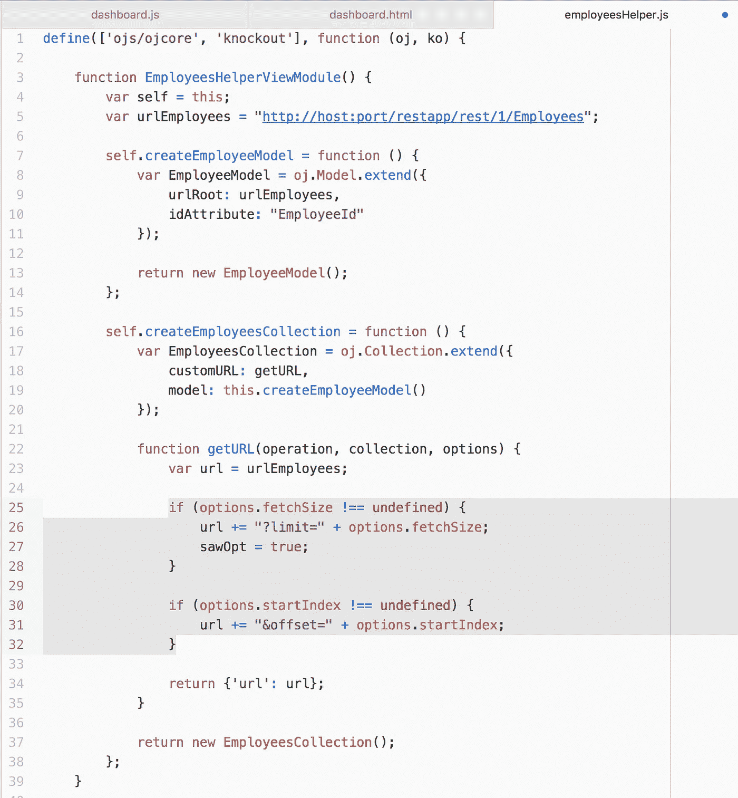
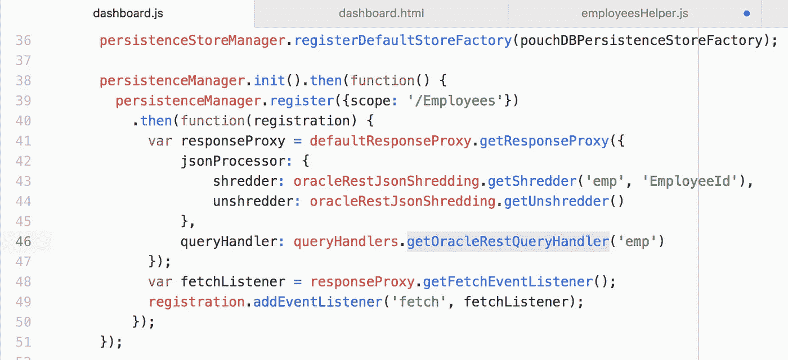
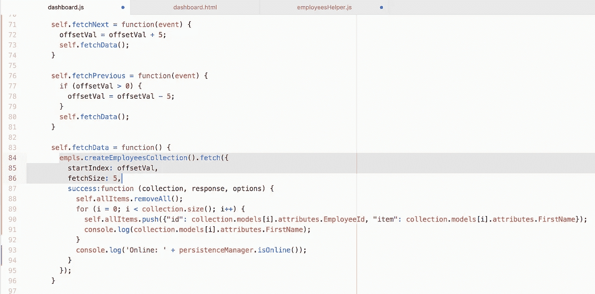

# JET 中 Oracle 离线持久性对 REST 分页的支持

> 原文：<https://medium.com/oracledevs/rest-paging-support-by-oracle-offline-persistence-in-jet-16a52d08055f?source=collection_archive---------1----------------------->

Oracle 离线持久性查询处理程序— [Oracle Rest 查询处理程序](https://oracle.github.io/offline-persistence-toolkit/queryHandlers.html)支持开箱即用的 Oracle ADF BC REST 服务分页。查看我以前的帖子，了解如何通过 ADF BC REST 服务的离线持久性工具包进行查询— [使用 JET 中的 Oracle 离线持久性进行分解和查询](http://andrejusb.blogspot.lt/2018/02/shredding-and-querying-with-oracle.html)。

对于大型 REST 资源来说，分页是必须的，Oracle offline persistence toolkit 支持分页真是太好了。让我们看看它的实际效果。

我用左/右箭头浏览数据，这触发了带有分页参数的 REST 调用——limit 和 offset。这些是 ADF BC REST 支持的标准参数。在线执行请求:

所有页面的数据都被离线工具包缓存，如果我们在离线时试图通过执行带有分页参数的 REST 请求来访问之前缓存的页面，我们将从离线工具包中获取数据。现在我切换到离线状态，并尝试导航到缓存页面之一—数据是自动从缓存中检索的:

如果我导航到未被缓存的页面(意味着在线时未被访问)，则不会返回任何结果。在这种情况下，我可以向后导航(分页参数将被更新),并且将显示缓存的页面的缓存数据:

分页导航控件按钮正在调用 JS 函数更新 startIndex:

示例应用程序使用 JET Collection API 来执行提取请求。使用 getURL 函数扩展集合，该函数设置限制和偏移参数以执行分页请求:

同样，确保在离线持久性工具包配置中使用 Oracle Rest 查询处理程序:

通过 JET 集合 API 调用 Fetch 函数。开始索引值是动态计算的—这允许执行分页请求。相同的功能在线和离线工作，无需担心连接状态，所有在线/离线逻辑由持久性工具包处理:

该职位的申请样本可在 [GitHub](https://github.com/abaranovskis-redsamurai/persistencejetapp) 上获得。

*原载于 2018 年 3 月 6 日*[*andrejusb.blogspot.com*](https://andrejusb.blogspot.lt/2018/03/rest-paging-support-by-oracle-offline.html)*。*