# 如何从快照恢复 EC2？

> 原文：<https://medium.com/edureka/restore-ec2-from-snapshot-ddf36f396a6e?source=collection_archive---------0----------------------->

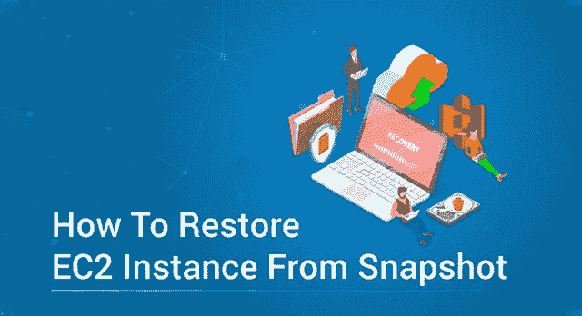

亚马逊 EC2 和 S3 是亚马逊使用最广泛的服务。EC2 是一种计算服务，S3 是一种轻量级存储服务。为您的 EC2 实例创建备份总是一个好的做法，这样，如果您的实例被删除或停止工作，您可以从创建的快照恢复 EC2。

创建备份和恢复模块是灾难管理的最佳方法之一。在数据丢失的情况下，您可以随时使用备份，这样您的工作和业务就不会受到影响。既然您已经知道为什么备份和恢复模块是必要的，那么让我来引导您完成我将在本文中讨论的主题，即“*如何从快照*恢复 EC2”。

*   什么是 EC2 和 S3？
*   什么是 EBS 体积？
*   什么是 EBS 快照？
*   演示:(创建一个实例，删除它并从快照恢复 EC2)

# 什么是 EC2 和 S3？

亚马逊网络服务(Amazon Web Services)俗称 AWS，是亚马逊的子公司，提供按需云计算平台。AWS 提供许多服务，其中 EC2 和 S3 是常用的服务。

亚马逊 EC2 构成了亚马逊云计算平台的核心部分。亚马逊允许个人租用虚拟电脑运行自己的应用程序。这些虚拟计算机被称为 EC2 实例。AWS 中的 EC2 实例是用最常用的操作系统预定义的，您也可以根据自己的需求创建操作系统。

亚马逊 S3 是亚马逊提供的“简单存储服务”，在 web 界面中提供对象存储。S3 使用可扩展的存储基础架构为其全球电子商务网络中的客户提供存储。

在本文中，我们将主要关注 EC2 和 S3。现在您已经知道了什么是 Amazon EC2 和 Amazon S3，让我们看看如何在使用快照恢复 EC2 实例的过程中使用它。

# 什么是 EBS 体积？

Amazon EBS(弹性块存储)提供原始块级存储，可以附加到 Amazon EC2，也可以在 Amazon RDS 中使用。亚马逊 EBS 于 2008 年 8 月推出。EBS 用于以下情况:

1.  频繁的数据更改
2.  需要长期保存的数据
3.  读写操作比较频繁的数据库。
4.  需要不断更新的数据
5.  数据库应用存储

# 什么是 EBS 快照？

EBS 快照用于通过拍摄即时快照将数据从 EBS 卷备份到 S3。快照只不过是增量备份。EBS 快照的性质与原始卷的性质相同(加密或未加密)，EBS 快照创建的卷的性质与快照的性质相同(加密或未加密)。

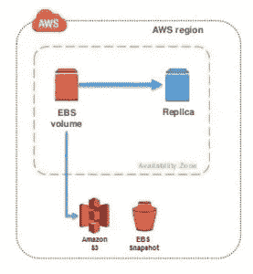

您可以通过拍摄时间点快照将 EBS 卷中的数据备份到亚马逊 S3。快照是增量备份。增量备份是指仅包含更新文件的副本。这有助于最大限度地减少创建备份所需的时间。

现在，您已经了解了与 Amazon 提供的存储服务相关的所有事情，让我们学习如何实际实现上面给出的信息。

# 演示:(创建一个实例，删除它并从快照恢复 EC2)

在关于如何从快照恢复 EC2 的文章中，我将做以下事情

1.  创建 EC2 实例
2.  在从快照恢复 EC2 的过程之后，创建要验证的文件
3.  为实例创建 EBS 快照
4.  删除 EC2 实例
5.  从快照恢复 EC2

*   从 EBS 快照创建 AMI
*   启动创建的 AMI

6.验证文件是否存在？

让我们仔细看看每个步骤。

## **创建一个亚马逊 EC2 实例**

*使用 AWS 控制台启动 EC2 实例。*

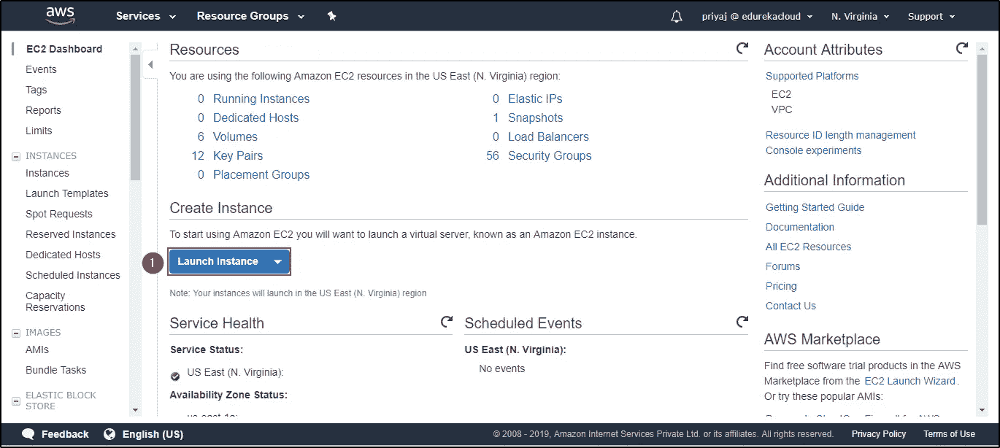

*选择实例的类型。*

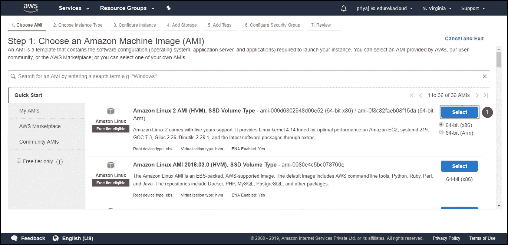

*选择存储类型。*

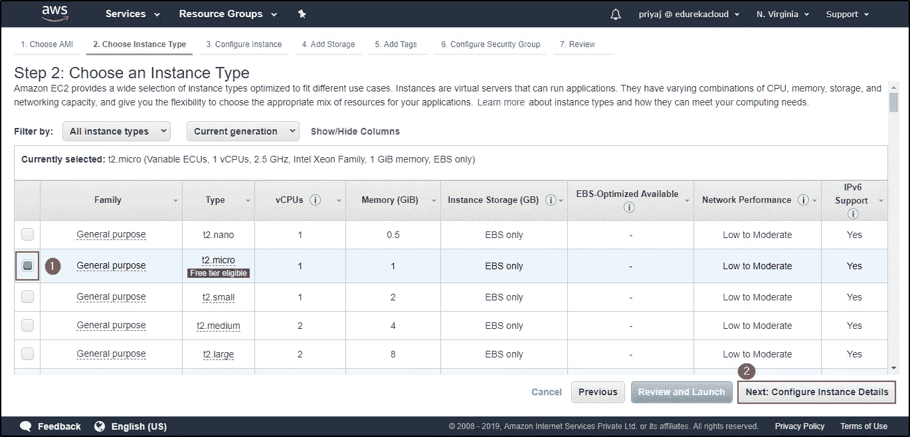

*选择您希望实例所在的 VPC 和子网。*

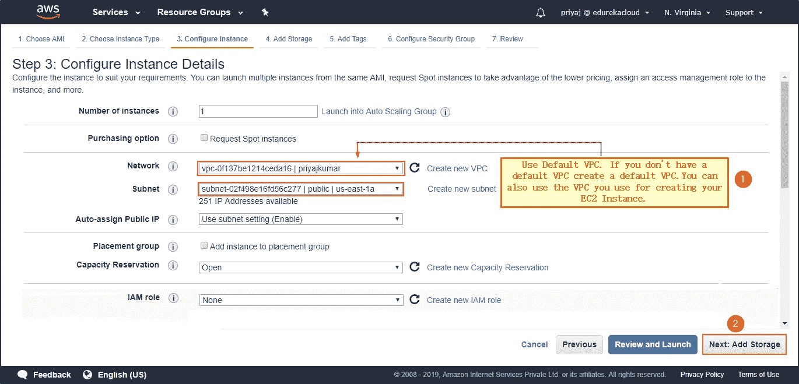

*添加存储。*

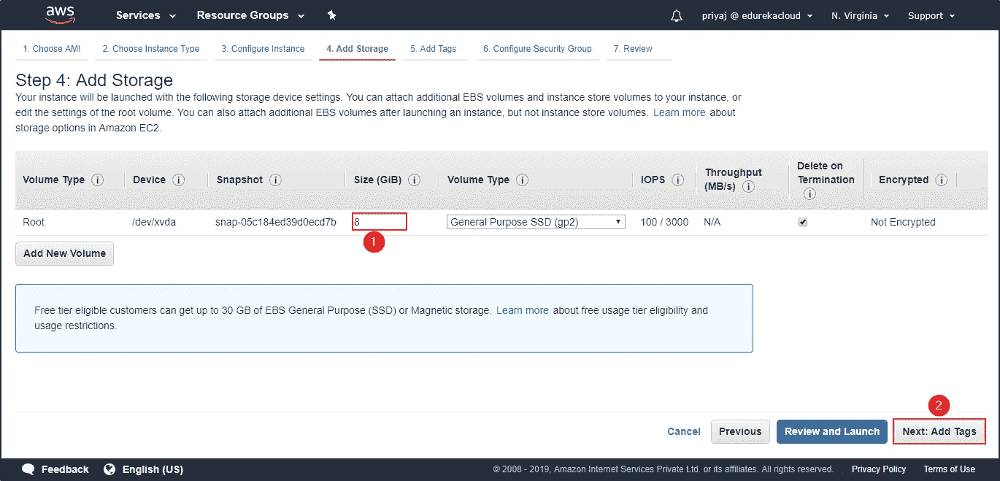

*向实例添加标签。*

*配置安全组。*

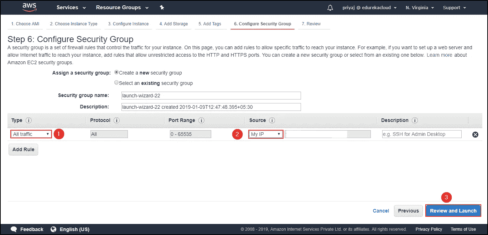

*核实详情。点击启动。*

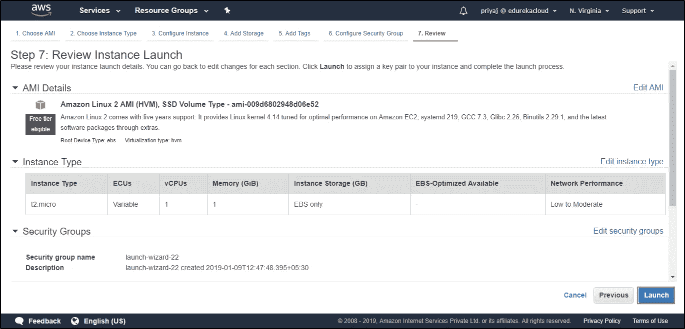

*选择密钥对以访问您的实例。您的实例已创建。现在是时候访问实例并创建文件了。*

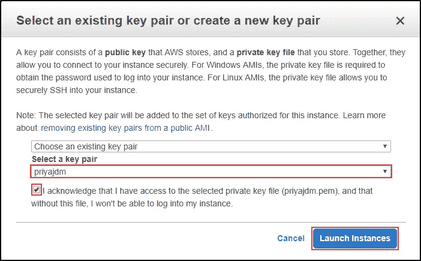

## **创建文件以便以后验证**

创建一个名为 EdurekaDemo 的目录。移动到目录。创建一个名为 edurekademotext.txt 的文件，打开文本文件。

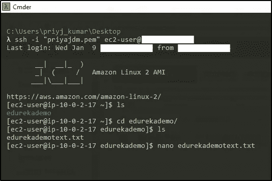

写一些文字，这样你就可以核实了。

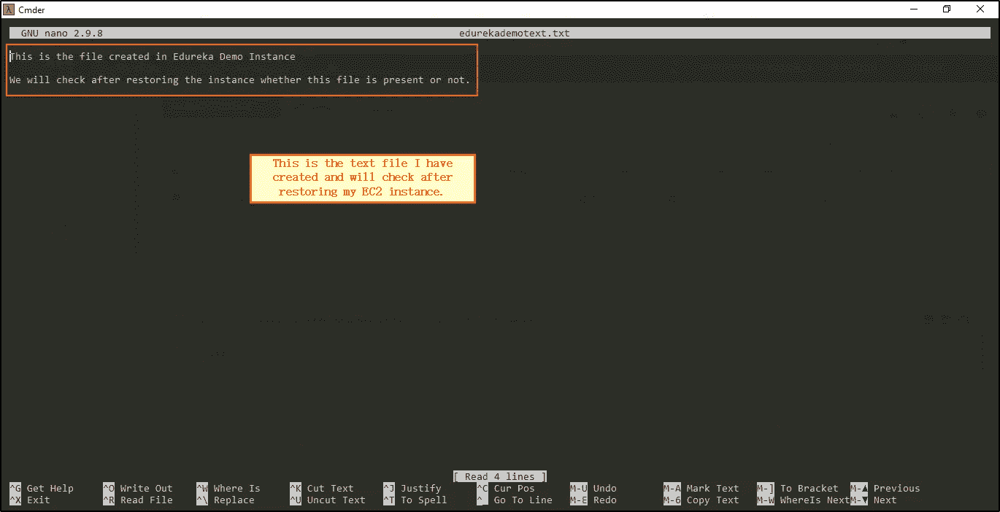

## **为实例创建 EBS 快照**

*定位卷。*

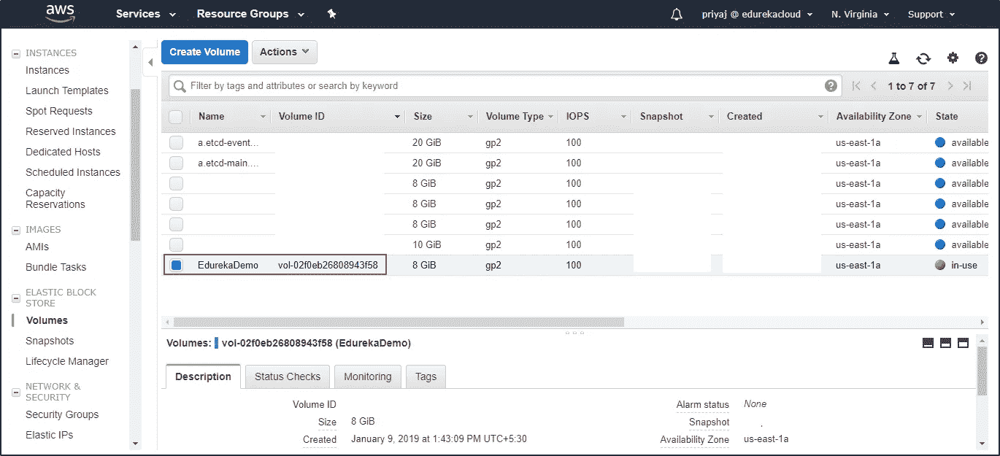

*创建快照。*

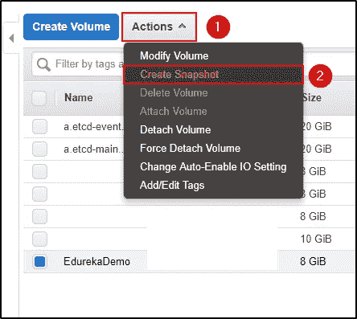

*描述您的快照并创建快照。*

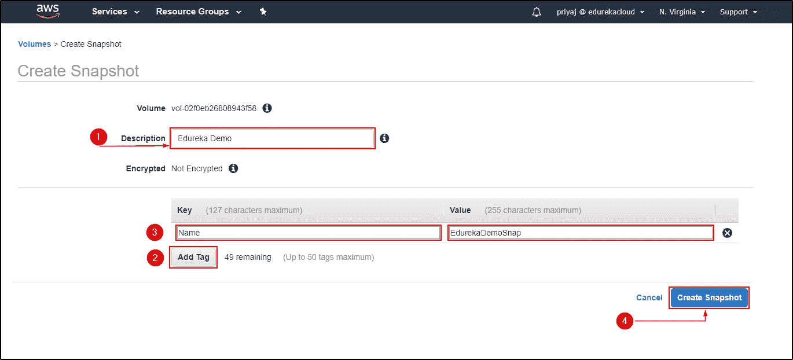

## **删除 EC2 实例**

*终止实例。*

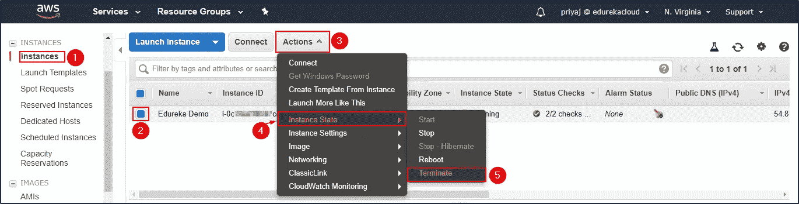

## **从快照恢复 EC2**

**从 EBS 快照创建 AMI**

*从 EBS 快照创建映像。*

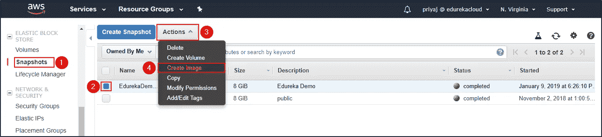

*选择名称和描述，不要忘记选择硬件辅助虚拟化。*

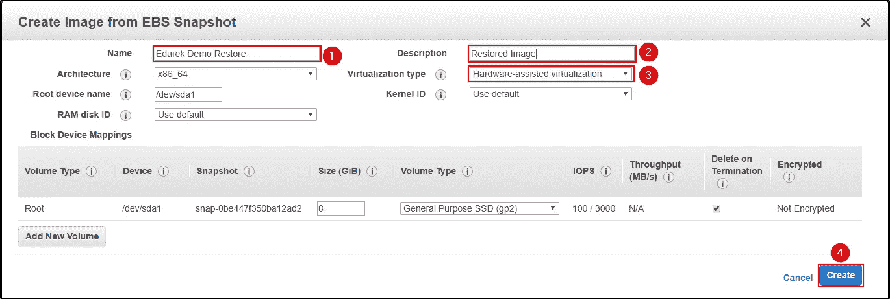

*您的图像创建请求已被处理，将在几分钟内创建完毕。*

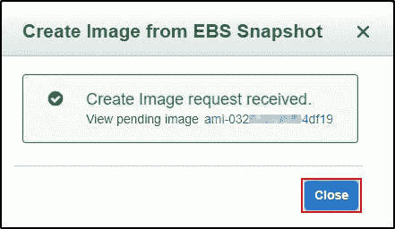

**启动已创建的 AMI**

*启动时创建，并重复创建* *EC2 实例时完成的所有步骤。*

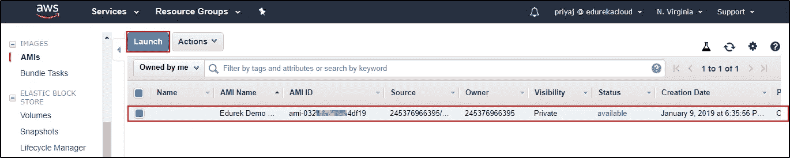

*您的 EC2 实例已恢复。*

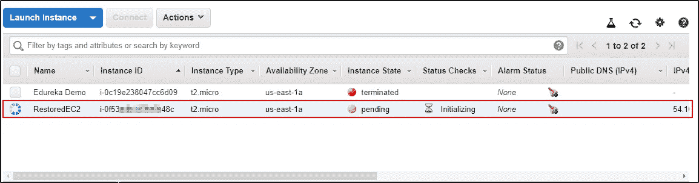

*您的 EC2 实例已创建。*

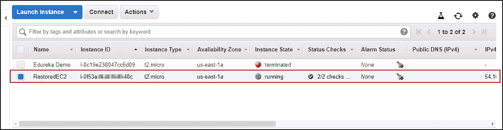

## **验证文件是否存在？**

*验证我们创建的文件是否存在:*

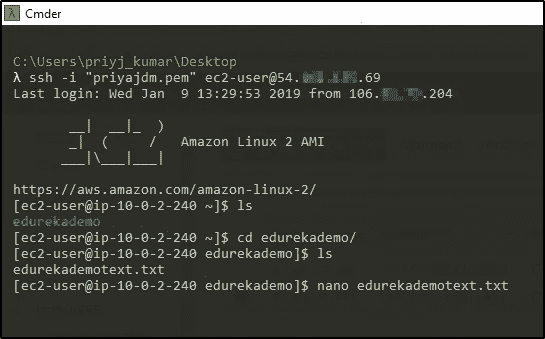

经过验证，我创建的目录和文件存在于恢复的 EC2 实例中。

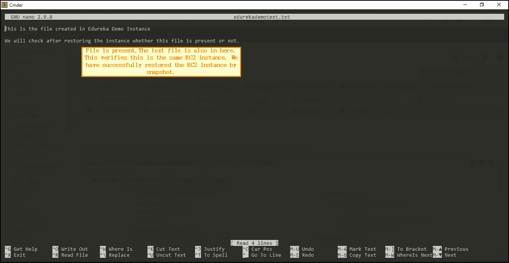

这是使用快照成功恢复 EC2 实例的过程。我希望你明白演示。最好的学习方法是实施它。去执行吧。

如果你想查看更多关于人工智能、DevOps、道德黑客等市场最热门技术的文章，你可以参考 Edureka 的官方网站。

如果你想查看更多关于人工智能、DevOps、道德黑客等市场最热门技术的文章，那么你可以参考 [Edureka 的官方网站。](https://www.edureka.co/blog/?utm_source=medium&utm_medium=content-link&utm_campaign=aws-resume)

请留意本系列中的其他文章，它们将解释 AWS 的各个方面。

> *1。* [*AWS 教程*](/edureka/amazon-aws-tutorial-4af6fefa9941)
> 
> *2。* [*AWS EC2*](/edureka/aws-ec2-tutorial-16583cc7798e)
> 
> *3。*[*AWS Lambda*](/edureka/aws-lambda-tutorial-cadd47fbd39b)
> 
> *4。* [*AWS 弹性豆茎*](/edureka/aws-elastic-beanstalk-647ae1d35e2)
> 
> *5。* [*AWS S3*](/edureka/s3-aws-amazon-simple-storage-service-aa71c664b465)
> 
> *6。* [*AWS 控制台*](/edureka/aws-console-fd768626c7d4)
> 
> *7。* [*AWS RDS*](/edureka/rds-aws-tutorial-for-aws-solution-architects-eec7217774dd)
> 
> *8。* [*AWS 迁移*](/edureka/aws-migration-e701057f48fe)
> 
> *9。*[*AWS Fargate*](/edureka/aws-fargate-85a0e256cb03)
> 
> *10。* [*亚马逊 Lex*](/edureka/how-to-develop-a-chat-bot-using-amazon-lex-a570beac969e)
> 
> *11。* [*亚马逊*](/edureka/amazon-lightsail-tutorial-c2ccc800c4b7)
> 
> *12。* [*AWS 定价*](/edureka/aws-pricing-91e1137280a9)
> 
> *13。* [*亚马逊雅典娜*](/edureka/amazon-athena-tutorial-c7583053495f)
> 
> *14。* [*AWS CLI*](/edureka/aws-cli-9614bf69292d)
> 
> *15。* [*亚马逊 VPC 教程*](/edureka/amazon-vpc-tutorial-45b7467bcf1d)
> 
> 15。 [*AWS vs Azure*](/edureka/aws-vs-azure-1a882339f127)
> 
> 17。 [*内部部署 vs 云计算*](/edureka/on-premise-vs-cloud-computing-f9aee3b05f50)
> 
> 18。 [*亚马逊迪纳摩 DB 教程*](/edureka/amazon-dynamodb-tutorial-74d032bde759)
> 
> *19。* [*AWS 简历*](/edureka/aws-resume-7453d9477c74)
> 
> 20。[*AWS code commit*](/edureka/aws-codecommit-31ef5a801fcf)
> 
> *21。* [*顶级 AWS 架构师面试问题*](/edureka/aws-architect-interview-questions-5bb705c6b660)
> 
> *二十二。* [*如何从快照恢复 EC2？*](/edureka/restore-ec2-from-snapshot-ddf36f396a6e)
> 
> *23。* [*使用 AWS 创建网站*](/edureka/create-websites-using-aws-1577a255ea36)
> 
> *24。* [*亚马逊路线 53*](/edureka/amazon-route-53-c22c470c22f1)
> 
> *25。* [*用 AWS WAF 保护 Web 应用*](/edureka/secure-web-applications-with-aws-waf-cf0a543fd0ab)

*原载于 2019 年 1 月 18 日*[*https://www.edureka.co*](https://www.edureka.co/blog/restore-ec2-from-snapshot/)*。*