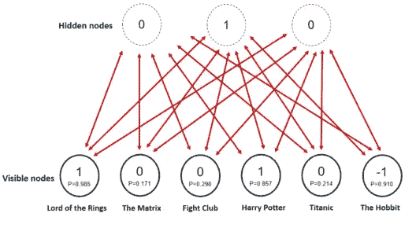

# 受限玻尔兹曼机器教程——RBM 初学者指南

> 原文：<https://medium.com/edureka/restricted-boltzmann-machine-tutorial-991ae688c154?source=collection_archive---------1----------------------->

Restricted Boltzmann Machine Tutorial — Edureka

在机器学习和深度学习的时代，**受限玻尔兹曼机**算法在降维、分类、回归等许多用于特征选择和特征提取的方面发挥着重要作用。本**受限玻尔兹曼机器教程**将按以下顺序为您提供对 RBMs 的全面了解:

*   什么是受限玻尔兹曼机？
*   自动编码器和 RBM 的区别
*   受限玻尔兹曼机中的层
*   受限玻尔兹曼机的工作
*   受限玻尔兹曼机的训练
*   协同过滤

让我们从最基本的问题开始我们的文章，

# **什么是受限玻尔兹曼机？**

受限玻尔兹曼机器是一种无向图形模型，在最近的深度学习框架中起着主要作用。它最初由 Paul Smolensky 于 1986 年*以 ***Harmonium*** 的名称推出，近年来在 Netflix 奖*的背景下大受欢迎，其中受限玻尔兹曼机器在协作过滤方面实现了最先进的性能，并击败了大多数竞争对手。**

*这是一种对降维、分类、回归、协作过滤、特征学习和主题建模有用的算法。*

*现在让我们看看受限玻尔兹曼机与其他自动编码器有何不同。*

# *自动编码器和 RBM 的区别*

***自动编码器**是一个简单的三层神经网络，其中输出单元直接连接回输入单元*。*通常，隐藏单元的数量远远少于可见单元的数量。训练的任务是最小化误差或重构，即找到输入数据的最有效的紧凑表示。*

**

*RBM 也有类似的想法，但是它使用具有特定分布的随机单元，而不是确定性分布。训练的任务是找出这两组变量实际上是如何相互联系的。*

*RBM 区别于其他自动编码器的一个方面是它有两个偏好。*

*   *隐藏的偏置帮助 RBM 在**正向传递**时产生激活，而*
*   *可见层的偏差帮助 RBM 学习在**反向通道**上的重建。*

*现在我们知道了什么是受限玻尔兹曼机，RBM 和自动编码器之间有什么区别，让我们继续我们的文章，看看他们的架构和工作。*

# *受限玻尔兹曼机中的层*

*受限玻尔兹曼机器是浅层的、两层的神经网络，构成了 ***深层信仰*** ***网络*** 的积木。RBM 的第一层叫做**可见**或输入层，第二层叫做**隐藏**层。每个圆圈代表一个类似神经元的单元，称为节点*。*节点跨层相互连接，但同一层没有两个节点链接。*

**

*受限玻尔兹曼机中的**限制**是**没有层内通信**。每个节点都是处理输入的计算点，并从随机决定是否传输输入开始。*

# *受限玻尔兹曼机的工作*

*每个可见节点从要学习的数据集中的一个项目中提取一个低级特征。在隐藏层的节点 1 处， **x 乘以**一个 ***权重*** 并加上一个 ***偏差*** 。这两个操作的结果被送入一个 ***激活函数*** ，该函数产生节点的输出，或者在给定输入 x 的情况下通过它的信号强度。*

**

*接下来，让我们看看几个输入如何在一个隐藏节点上组合。每个 **x 乘以**一个单独的权重，乘积相加，加到偏差上，结果再次通过激活函数产生节点的输出。*

**

*在每个隐藏节点，每个输入 **x 乘以**其各自的权重 w。也就是说，单个输入 x 在这里将有三个权重，总共 12 个权重(4 个输入节点 x 3 个隐藏节点)。两层之间的权重将始终形成一个矩阵，其中行等于输入节点，列等于输出节点。*

**

*每个隐藏节点接收乘以各自权重的四个输入。**这些乘积的总和**再次**加到偏置**(这至少迫使一些激活发生)，并且结果通过激活算法，为每个隐藏节点产生一个输出。*

*现在你对受限玻尔兹曼机是如何工作的有了一个概念，让我们继续受限玻尔兹曼机教程，看看 RBM 训练中涉及的步骤。*

# *受限玻尔兹曼机的训练*

*受限玻尔兹曼机器的训练不同于通过随机梯度下降的常规**神经网络**的训练。*

*两个主要的训练步骤是:*

## ***吉布斯采样***

*训练的第一部分叫做*吉布斯采样*。给定输入向量 **v** ，我们使用 **p(h|v)** 来预测隐藏值 **h.** 知道隐藏值后，我们使用 **p(v|h)** :*

**

*用于预测新的输入值 **v** 。这个过程重复 *k* 次。在 *k* 次迭代之后，我们获得另一个输入向量 **v_k** ，它是从原始输入值 **v_0** 重新创建的。*

**

## ***对比发散步***

*权重矩阵的更新发生在*对比发散*步骤期间。向量 **v_0** 和 **v_k** 用于计算隐藏值 **h_0** 和 **h_k :** 的激活概率*

**

*这些概率与输入向量 **v_0** 和 **v_k** 的外积之间的差导致更新的矩阵:*

**

*使用更新矩阵，可以用梯度**上升、**计算新的权重，由下式给出:*

**

*现在你对什么是受限玻尔兹曼机和 RBM 层有了一个概念，让我们继续我们的受限玻尔兹曼机教程，并借助一个例子来理解它们的工作。*

# *协同过滤*

**

*RBM 已经在降维、分类、协同过滤等方面得到应用。根据任务的不同，他们可以在有人监督或无人监督的情况下接受训练。*

## *识别数据中的潜在因素*

*让我们假设一些人被要求对一组电影进行 1-5 的评分，每部电影都可以用一组潜在因素来解释，如戏剧、幻想、动作等等。限制玻尔兹曼机器被用来分析和找出这些潜在的因素。*

**

*隐藏因素的分析以二进制方式执行，即，用户仅告知他们是否喜欢(评级 1)特定电影(评级 0)，并且它表示输入/可见层的输入。给定输入，RMB 然后试图在数据中发现可以解释电影选择的潜在因素，每个隐藏的神经元代表一个潜在因素。*

*让我们考虑下面的例子，其中用户喜欢*指环王*和*哈利波特*但是不喜欢*黑客帝国*、*搏击俱乐部*和*泰坦尼克号*。《霍比特人》还没有被看过，所以它的评级是-1。给定这些输入，玻尔兹曼机器可以识别三个隐藏因素*戏剧*、*奇幻*和*科幻*，它们对应于电影类型。*

## *利用潜在因素进行预测*

*在训练阶段之后，目标是预测尚未看过的电影的二进制评级。给定特定用户的训练数据，网络能够基于用户的偏好识别潜在因素，并且来自伯努利分布的样本可以用于找出哪些可见神经元现在变得活跃。*

**

*该图像显示了使用隐藏神经元值进行推断后的新评级。该网络将《T0》奇幻片《T1》确定为首选电影类型，并将《霍比特人 T2》评为用户喜欢的电影。*

*从**训练**到**预测**阶段的过程如下:*

*   *根据所有用户的数据训练网络*
*   *在推理期间，获取特定用户的训练数据*
*   *使用这些数据来获得隐藏神经元的激活*
*   *使用隐藏神经元值获得输入神经元的激活*
*   *输入神经元的新值显示了用户对尚未看过的电影的评价*

**这就把我们带到了“受限玻尔兹曼机器教程”这篇文章的结尾。我希望这篇文章对你有所帮助，并增加了你的知识价值。**

*如果你想查看更多关于人工智能、DevOps、道德黑客等市场最热门技术的文章，那么你可以参考 [Edureka 的官方网站。](https://www.edureka.co/blog/?utm_source=medium&utm_medium=content-link&utm_campaign=restricted-boltzmann-machine-tutorial)*

*请留意本系列中的其他文章，它们将解释深度学习的各个其他方面。*

> *1.[张量流教程](/edureka/tensorflow-tutorial-ba142ae96bca)*
> 
> *2. [PyTorch 教程](/edureka/pytorch-tutorial-9971d66f6893)*
> 
> *3.[感知器学习算法](/edureka/perceptron-learning-algorithm-d30e8b99b156)*
> 
> *4.[神经网络教程](/edureka/neural-network-tutorial-2a46b22394c9)*
> 
> *5.什么是反向传播？*
> 
> *6.[卷积神经网络](/edureka/convolutional-neural-network-3f2c5b9c4778)*
> 
> *7.[胶囊神经网络](/edureka/capsule-networks-d7acd437c9e)*
> 
> *8.[递归神经网络](/edureka/recurrent-neural-networks-df945afd7441)*
> 
> *9.[自动编码器教程](/edureka/autoencoders-tutorial-cfdcebdefe37)*
> 
> *10.[tensor flow 中的对象检测](/edureka/tensorflow-object-detection-tutorial-8d6942e73adc)*
> 
> *11. [PyTorch vs TensorFlow](/edureka/pytorch-vs-tensorflow-252fc6675dd7)*
> 
> *12.[用 Python 进行深度学习](/edureka/deep-learning-with-python-2adbf6e9437d)*
> 
> *13.[人工智能教程](/edureka/artificial-intelligence-tutorial-4257c66f5bb1)*
> 
> *14. [TensorFlow 图像分类](/edureka/tensorflow-image-classification-19b63b7bfd95)*
> 
> *15.[人工智能应用](/edureka/artificial-intelligence-applications-7b93b91150e3)*
> 
> *16.[如何成为一名人工智能工程师？](/edureka/become-artificial-intelligence-engineer-5ac2ede99907)*
> 
> *17.[问学习](/edureka/q-learning-592524c3ecfc)*
> 
> *18. [Apriori 算法](/edureka/apriori-algorithm-d7cc648d4f1e)*
> 
> *19.[用 Python 实现马尔可夫链](/edureka/introduction-to-markov-chains-c6cb4bcd5723)*
> 
> *20.[人工智能算法](/edureka/artificial-intelligence-algorithms-fad283a0d8e2)*
> 
> *21.[机器学习的最佳笔记本电脑](/edureka/best-laptop-for-machine-learning-a4a5f8ba5b)*
> 
> *22.[12 大人工智能工具](/edureka/top-artificial-intelligence-tools-36418e47bf2a)*
> 
> *23.[人工智能(AI)面试问题](/edureka/artificial-intelligence-interview-questions-872d85387b19)*
> 
> *24. [Theano vs TensorFlow](/edureka/theano-vs-tensorflow-15f30216b3bc)*
> 
> *25.[什么是神经网络？](/edureka/what-is-a-neural-network-56ae7338b92d)*
> 
> *26.[模式识别](/edureka/pattern-recognition-5e2d30ab68b9)*
> 
> *27.[人工智能中的阿尔法贝塔剪枝](/edureka/alpha-beta-pruning-in-ai-b47ee5500f9a)*

**原载于 2018 年 11 月 20 日 www.edureka.co***。***