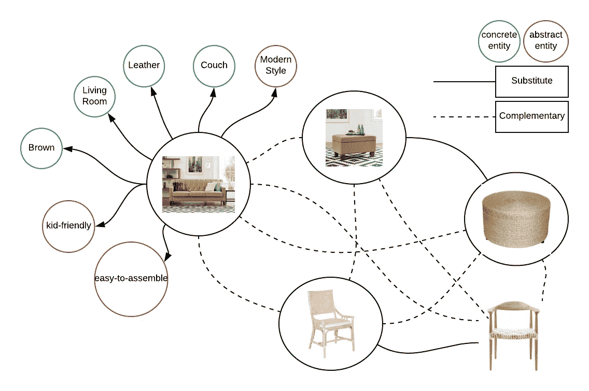
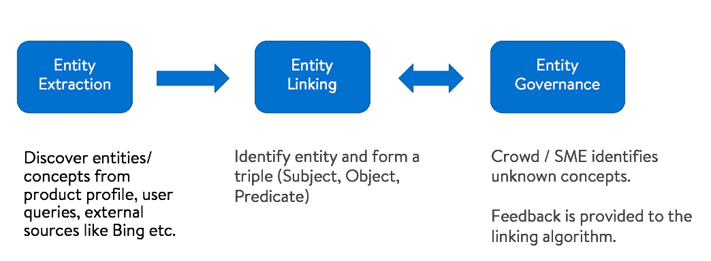
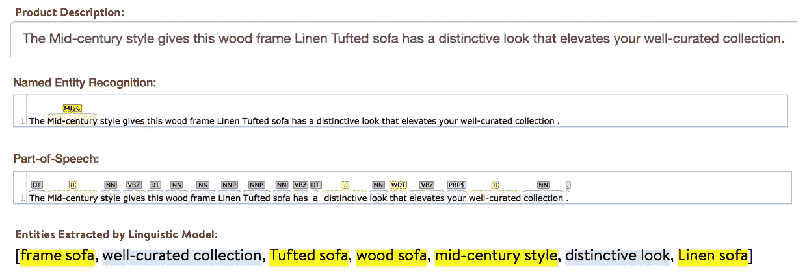
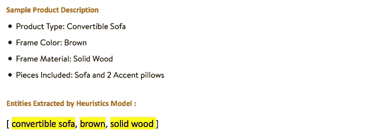
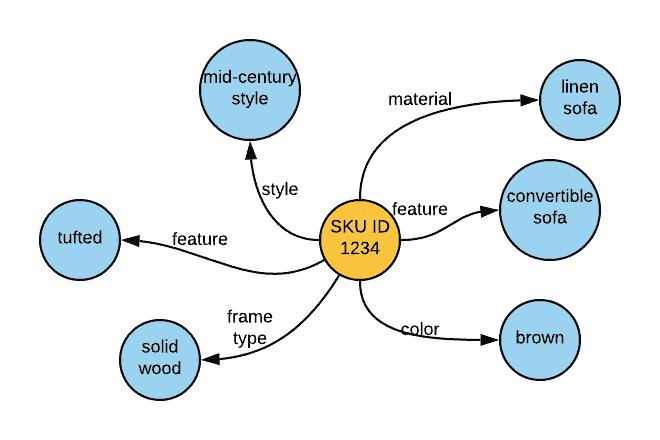
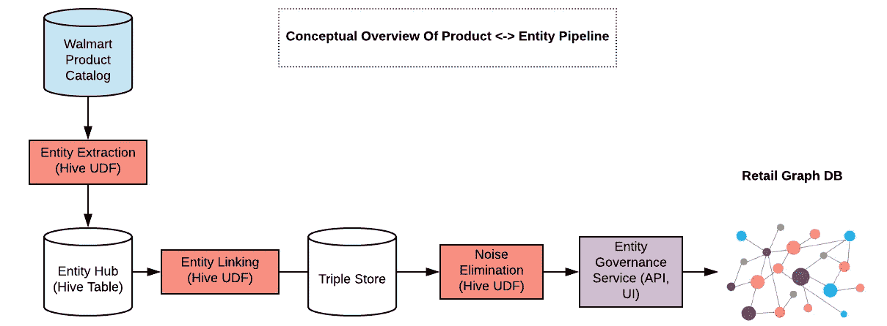
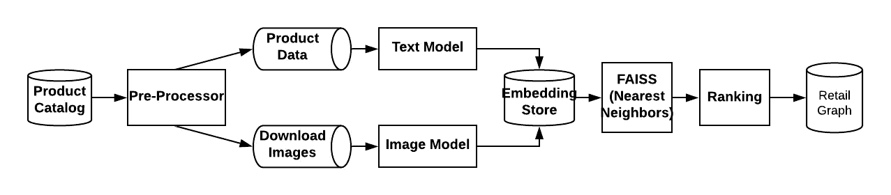

# 零售图表——沃尔玛的产品知识图表

> 原文：<https://medium.com/walmartglobaltech/retail-graph-walmarts-product-knowledge-graph-6ef7357963bc?source=collection_archive---------0----------------------->

Graph Data (Image credit actify)

# **语境**

电子商务目录是通过从卖家(3P)、供应商/品牌(1P)获取数据创建的。合作伙伴(卖家、供应商、品牌)提供的数据往往不完整，有时会遗漏客户正在寻找的关键信息。即使合作伙伴遵守规范(发送产品数据的约定格式)，标题、描述和图片中仍隐藏着大量数据。除了我们的合作伙伴提供的数据，互联网上还有大量的非结构化数据，如产品手册、产品评论、博客、社交媒体网站等。

在沃尔玛，我们正致力于构建一个 ***零售图*** ，该图捕捉关于产品及其相关实体的知识，以帮助我们的客户更好地发现我们目录中的产品。这是一个产品知识图表，可以回答关于零售环境中的产品和相关知识的问题。这种系统可以用于支持语义搜索、推荐系统等。本文进一步阐述了什么是零售图，我们如何构建它，围绕图模型的技术选择，数据库和一些用例。

# **沃尔玛的*零售图*** 是什么

零售图捕捉零售世界中存在的产品和实体之间的联系。实体是存在的物体、事物、概念或抽象概念，例如客厅、野生动物摄影、明亮的颜色、返校、农舍风格。我们主要关注两种类型的实体——抽象的(主观的，比如对孩子友好的)和具体的(属性，比如红色)。前者帮助我们回答诸如“夏季泳池派对用品”、“农舍客厅家具”、“野生动物摄影镜头”等问题，而后者帮助我们回答诸如“蓝色牛仔裤”、“木制餐桌”等问题。该图还将产品之间的关系分为两大类——替代品和补充品(配件、兼容产品等)。它还试图将抽象的概念，如明亮的颜色，映射到具体的产品属性。

我们在沃尔玛目录上工作过，知道建立这样一个系统的一些挑战。最大的挑战是缺乏产品数据的单一权威来源。此外，我们的目录也有来自合作伙伴的错误数据。所以，我们从:

*   构建一个二分图，一边是产品，另一边是相关实体
*   利用我们现有的分类法，并随着我们发现新的分类法而丰富实体。
*   将产品(SKU)与实体联系起来。

Conceptual Representation Of Walmart Retail Graph (edge labels are in legends) — Figure 1

# **构建零售图表**

在高层次上，我们主要关注以下关系，以构建我们的零售图:
1。产品< - >实体
2。产品< - >产品(广义分类为替代品&补品)

1.  **产品< - >实体** 为了构建产品到实体图，我们首先从产品内容中提取实体，然后将它们链接到抽象或具体的概念，形成三元组。我们添加了一个治理层，允许人们验证低于某个置信水平的三元组，以保持高质量。

**Process to build Product <-> Entity Graph — Figure 2**

**a .实体提取**

实体提取模块的目标是从产品标题和描述中提取“实体”。产品描述内容各种口味都有。有时内容冗长，有时可能是要点中的小短语。牢记这一点，我们开发了两种算法来从产品内容中提取实体:

**i .基于 NLP 的模型**
我们首先从产品标题、描述和其他元数据中提取实体。这是通过构建一个语言模型来实现的，该模型利用了由 Standford Core NLP 提供的 POS Tagger。这种模式更适合我们的用例，因为产品标题和描述通常以要点形式出现，突出产品亮点，而不是结构良好的句子。下面是我们基于 NLP 的模型的输出示例。

Entity Extraction Output From NLP Model — Figure 3

**二。启发式模型** 我们采用的另一种方法产生了良好的结果，那就是使用规则来解析描述。卖家/供应商使用特定的格式(HTML 标签)来突出产品的关键特征。我们围绕如何解析和提取关键信息建立了规则，对它们应用了一组试探法。以下是产品描述及其输出的示例:

Entity Extraction Output From Heuristic Model — Figure 4

在生产中，我们使用上述两种模型。这给了我们一个在启发式模型和 NLP 模型之间的很好的平衡，启发式模型非常精确，NLP 模型给了我们很好的覆盖率。

**b .实体链接**

一旦实体被提取出来，我们需要确定它们代表什么以及它们与产品的关系(SKU)。例如，对于像“中世纪沙发”这样的实体，我们必须确定在沙发的上下文中中世纪代表什么。这是通过称为实体链接的过程来实现的，在该过程中，我们试图找到所提取的实体与其 SKU 之间的关系。实体链接模块的另一个重要功能是消除给定上下文的歧义。例如,“樱桃”在蜡烛的上下文中可以表示气味，在果汁的上下文中可以表示味道，在家具的上下文中可以表示光洁度，在布料的上下文中可以表示颜色，在杂货店的上下文中可以表示水果。这里所指的上下文通常是产品类别或产品类型。链接者将上下文(产品类型)和实体作为输入，产生一个三元组(主语-宾语-谓语)。由于产品数据没有单一准确的真实来源，将实体联系起来的任务变得很困难。我们首先从一组最畅销的 SKU(假设最畅销的 SKU 有更准确的数据)创建一个产品类型、属性名称和属性值三元组的字典。第一步是使用这个字典，并确定可能的候选不可知的上下文。之后，第二个模型运行，通过使用上下文对它们进行排序。

对于上面提取的实体，链接器输出如下所示:

Triples from entity linking — Figure 5

**c .实体治理** 作为实体提取的一部分，大量的“噪音”也被提取出来。我们已经使用现有的产品元数据来构建字典，该字典用作将提取的实体分类为噪声或“未知”概念的参考。然后，我们添加了一个治理模块，它可以使用启发式和手动标记的组合来清除噪音。这确保了进入知识图的数据总是干净和可靠的。

**2。产品< - >产品** 为了识别给定 SKU 的替代品，我们利用文本数据和图像数据。在某些产品类别中，如家具、服装，视觉相似性在确定替代品时起着重要作用。我们为我们的 SKU 构建了图像嵌入和文本嵌入，并将它们推送到 [FAISS](https://github.com/facebookresearch/faiss) 索引中。(Faiss 是一个由脸书开发的用于高效相似性搜索和密集向量聚类的库)。对于每个 SKU，我们从文本嵌入和图像嵌入中生成其 KNN(k-最近邻),以得到候选集。在那之后，我们应用一个特定类别的排序逻辑来得到最终的集合。例如，在家具类别的情况下，“家居装饰风格”(世纪中期/沿海/农舍)在确定可替代性方面起着关键作用，并且它会使排名逻辑产生偏差。

# 体系结构

当我们开始构建零售图的旅程时，我们并不确定系统的最终状态会是什么样子。我们只知道我们需要一个组件来提取实体，链接它们，然后存储它们。鉴于我们目录的规模，我们知道每个目录都必须扩展到数以亿计的产品。此外，还需要快速试验、构建概念验证并快速迭代以获得反馈。我们决定采用[进化架构](https://evolutionaryarchitecture.com/)原则来构建我们的系统。

> 一个进化的架构支持渐进的、被引导的变化，作为跨越多个维度的首要原则。

实体提取和链接构建为简单的库，然后作为 REST API 公开，供其他系统集成。我们还在实体提取和实体链接器库的基础上构建了 Hive UDFs，以便在本地 Hadoop 集群上大规模运行它们。

## **数据处理管道**

我们有两条管道——一条用于生成产品实体，另一条用于产品产品。它们在由我们的数据平台团队管理的本地 Hadoop 集群上定期运行。一旦流程完成，我们利用批量摄取 API 将它们摄取到 Azure 上的 Cosmos DB 中。以下是数据处理管道的高度概述:

Product <-> Entity Pipeline — Figure 6 (Graph Image credit actify)

Product <-> Product Substitute Generation — Figure 7

## 图形数据模型和图形数据库

在集中讨论 LPG 之前，我们已经针对我们的读写用例评估了 LPG(标签属性图)和 RDF(资源描述框架)图形数据模型。[这是两者之间的一个很好的对比。在内部对图形数据库进行了几次实验后，我们缩小了范围，选择了](https://tech.flipkart.com/flipkart-commerce-graph-evaluation-of-graph-data-stores-8fe0f964affd) [Azure Cosmos DB(图形模型)](https://docs.microsoft.com/en-us/azure/cosmos-db/graph-modeling)。我们与 Azure 团队紧密合作，为我们提供了对批量数据摄取的 Java 支持。对于图形遍历，我们使用 [gremlin](https://tinkerpop.apache.org/gremlin.html) 。

## **沃尔玛内部的应用**

构建沃尔玛目录规模的产品知识图需要相当长的时间。我们已经采取了一次一个类别的方法，在建立这一点时，学习，然后扩展到其他类别。我们通过专注于家居和花园类别开始了这项工作。我们在沃尔玛产品页面上做了一个 A/B 测试，与我们的商品推荐团队合作，使用了产品产品关系。
我们的电子商务语义搜索团队正与我们紧密合作，利用零售图中的关系构建一个新的查询理解系统。我们目前正在进行交叉测试，A/B 测试，以收集客户对我们新的语义搜索实现的反馈。

**闭幕词**

很难在一篇文章中详细介绍零售图表的所有方面，但我希望这能提供一个体面的概述。我们只是触及了这个问题的表面，还有很长的路要走。像这样的计划需要快速的迭代、大量的实验以及在找到正确的方法之前愿意从错误中学习。我很幸运有一个伟大的工程师和数据科学家团队来合作这个有趣的项目！