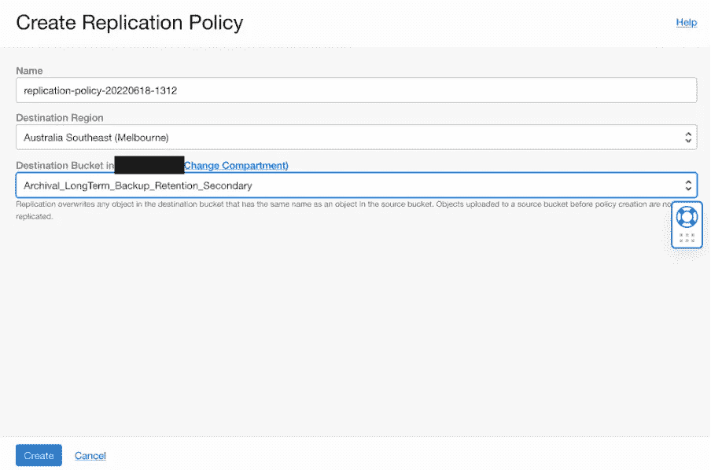

# Oracle 数据库云服务器云服务长期数据库备份保留和跨区域复制备份

> 原文：<https://medium.com/oracledevs/retain-database-backups-forever-and-replicate-backups-cross-region-on-oracle-exadata-database-af0fcc10c22d?source=collection_archive---------0----------------------->

## Oracle 云基础架构解决方案可永久保留备份，并将 Oracle 数据库备份跨区域归档到客户管理的存储桶中。


## 介绍

由于所在行业的各种法规遵从性要求，我们的许多客户都要求将其 Oracle 数据库备份跨区域存储在 Oracle 云基础架构(OCI)上并进行长期保留。企业客户向我提出的最常见的问题是:我如何才能将我的备份在 OCI 上存档七年或十年，以满足监管机构的要求？在本文中，我们将探讨如何在 OCI 数据库云服务器云服务上实现这一点

目前，数据库云服务器云服务(ExaCS)上默认提供的自动备份最多限于 60 天，并且不支持跨区域备份。自动备份和手动备份都存储在您无法直接访问的 Oracle 托管存储桶中。那么，我们如何在您自己的存储桶中进行归档备份，然后跨区域复制这些备份呢？

在本文中，我们将向您展示如何将数据库云服务器上的按需数据库备份转移到 Oracle 对象存储上的客户托管存储区，并跨区域复制备份数据。

# 解决办法

与最多只能保留 60 天的自动备份不同，数据库云服务器云服务提供了“永久保留”的归档备份功能。您可以使用 OCI 控制台或 dbaascli 实用程序创建这些按需备份。我们将使用 dbaascli 创建长期备份，然后使用 MV2BUCKET 实用程序将它们上传到客户管理的存储区，然后将该存储区复制到另一个区域。

**该解决方案由以下组件实施**

1.  MV2BUCKET 实用程序，可用于将备份从 Oracle 管理的存储桶复制到您自己的存储桶
2.  在 ExaCS 虚拟机节点上验证 [MV2BUCKET](https://support.oracle.com/epmos/faces/SearchDocDisplay?_afrLoop=524275329186190&_afrWindowMode=0&_adf.ctrl-state=1czlo73u8b_4#aref_section323) 的 OCI-CLI 命令行实用程序
3.  文件存储服务，用于在本地数据库云服务器节点上暂存备份
4.  用于存储备份的 Oracle 对象存储
5.  最后，将主区域中的对象存储桶跨区域复制到目标区域，以存储备份
6.  用于在数据库云服务器上备份数据库的 dbaascli 实用程序


Exadata Database Service Long-Term Backup Retention and Cross Region Replication Architecture

**先决条件**

1.  您拥有一个 OCI 用户，并且需要 IAM 权限来执行租赁中的所有操作
2.  您拥有对 ExaCS VM 集群节点的 opc 用户 SSH 访问权限

3.ExaCS VM 集群上存在一个数据库。在这个例子中，我们将使用一个名为' **TestDB** 的数据库


# 为 Oracle 对象存储设置 MV2Bucket、OCI CLI 和跨区域复制的步骤

1.  **在 ExaCS 节点上安装和配置 mv 2 bucket**

从 Oracle 技术支持**【1】**:(OCI)mv 2 BUCKET—Oracle 管理的 Bucket 内容管理器(文档 ID 2723911.1)下载并在数据库云服务器节点上以 root 用户身份安装最新版本的 MV2BUCKET rpm 文件

2.**创建一个 OCI 文件存储系统，并将其挂载到 ExaCS DB 节点上，用于暂存备份的[2]**

```
mkdir -p /shared_storesudo mount 10.10.1.120:/Prod-Apps-Shared /shared_store -o nolockmkdir -p /shared_store/db_backup/TestDB
```

3.**在主区域创建一个存储桶，在目标区域创建一个存储桶。创建两个存储桶后，在主区域存储桶上创建一个复制策略，将数据复制到目标区域存储桶[3]**


Primary Region Bucket


Destination Region Bucket

**4。在 ExaCS 所在的隔离专区中为 OSS 复制创建 IAM 策略**

```
Allow group ***<Group Name>*** to manage buckets in compartment ***<Compartment Name>***Allow group ***<Group Name>*** to manage objects in compartment ***<Compartment Name>***Allow service objectstorage-ap-sydney-1 to manage object-family in compartment ***<Compartment Name>***
```

5.**在您的主区域存储桶上创建复制策略到目标区域**



6.**以 root 用户身份在数据库云服务器云服务节点上安装 OCI-CLI**

```
-- Linuxbash -c "$(curl -L https://raw.githubusercontent.com/oracle/oci-cli/master/scripts/install/install.sh)"-- Oracle Linuxsudo yum install python36-oci-cli
```

使用您的用户配置 API 密钥，并将您的私钥和配置文件添加到/root/中。oci 目录。您将需要创建。安装 oci-cli 后手动安装 oci 目录

测试 oci cli 客户端是否安装正确

```
$ oci compute instance list --compartment-id ocid1.compartment.oc1..aaaaaa*******a
```

# 使用 DBAASCLI 进行备份并使用 MV2BUCKET 复制到客户管理的 Bucket 的步骤

1.  **登录到任何一个数据库云服务器节点，创建一个自定义备份，保留“keep-forever”**

```
**$ ssh opc@exacsnode1****$** **sudo -s****$ dbaascli database backup --dbname TestDB --start --archival --tag TestDBLongTermBackup2022***DBAAS CLI version 22.2.1.1.0
Executing command database backup --start --archival --tag TestDBLongTermBackup2022
DBaaS Backup API V1.5 @2022 Multi-Oracle home
-> Action : bkup_start
-> logfile: /var/opt/oracle/log/TestDB/bkup_api_log/bkup_api_4af4f585_20220618161130.837209.log
UUID 7fb45008eecd11eca48d02001700c06a for this backup
** process started with PID: 95722
** see log file for monitor progress
-------------------------------------*
```

或者，您也可以从 OCI 控制台创建长期保留备份


2.使用 dbaascli 命令检查备份状态

```
**$ dbaascli database backup --dbname TestDB --status --uuid 7fb45008eecd11eca48d02001700c06a***DBAAS CLI version 22.2.1.1.0
Executing command database backup --status --uuid 7fb45008eecd11eca48d02001700c06a
DBaaS Backup API V1.5 @2022 Multi-Oracle home
@ STARTING CHECK STATUS 7fb45008eecd11eca48d02001700c06a
[ REQUEST TICKET ]
[UUID    ->  7fb45008eecd11eca48d02001700c06a
[DBNAME  ->  TestDB
[STATE   ->  success
[ACTION  ->  create-backup-keep-forever
[STARTED ->  2022-06-18 06:11:36 UTC
[ENDED   ->  2022-06-18 06:15:44 UTC
[PID     ->  95722
[TAG     ->  TestDBLongTermBackup2022
[PCT     ->  100***$ dbaascli database backup --dbname TestDB --list***DBAAS CLI version 22.2.1.1.0
Executing command database backup --list
DBaaS Backup API V1.5 @2022 Multi-Oracle home
-> Action : list
-> logfile: /var/opt/oracle/log/TestDB/bkup_api_log/bkup_api_40a9cc5e_20220618161647.574847.log
-> Listing all backups
Backup Tag             Completion Date (UTC)            Type          keep
----------------------   -----------------------      -----------    --------
TAG20220618T155626     06/17/2022 20:00:39       full        False
TestDBLongTermBackup2022     06/17/2022 20:15:44       keep-forever        True
dbaascli execution completed*
```

3.**以“root”用户身份运行 mv2bucket.bin，将备份从数据库复制到暂存区，然后上传到主区域存储桶**

```
**-- Check content of Oracle managed bucket for the Database****$ /opt/mv2bucket/mv2bucket.bin list --dbuniquename TestDB_wd5_syd***|=============================================================================================================================================================|============|
|Oracle Managed Bucket content size                                                                                                                           |     2.67 GB|
|=============================================================================================================================================================|============|* **-- Copy data from Oracle Managed Bucket to Staging Area in FSS and then upload to Customer Managed Bucket****$ /opt/mv2bucket/mv2bucket.bin copy --dbuniquename TestDB_wd5_syd --bucketname Archival_LongTerm_Backup_Retention_Primary --stage /shared_store/db_backup/TestDB --parallel 5 --incremental***INFO: 2022-06-18 16:26:47: Im going to get '140' files missing on target 'Archival_LongTerm_Backup_Retention_Primary' and on stage '/shared_store/db_backup/TestDB'
INFO: 2022-06-18 16:26:47: Getting Oracle Managed Bucket incremental files size
INFO: 2022-06-18 16:26:47: Required stage area size for incremental is 2.67 GB
INFO: 2022-06-18 16:26:47: Available free space on stage area '/shared_store/db_backup/TestDB' is 8.00 EB
INFO: 2022-06-18 16:26:47: Getting '140' files from Oracle Managed Bucket, it will take time, please wait...
SUCCESS: 2022-06-18 16:27:01: Files downloaded from Oracle Managed Bucket successfully
INFO: 2022-06-18 16:27:01: Uploading files to own bucket, it will take time, please wait...
SUCCESS: 2022-06-18 16:27:39: Files Uploaded to 'Archival_LongTerm_Backup_Retention_Primary' successfully***-- Check the size of the Customer Managed Bucket****$ /opt/mv2bucket/mv2bucket.bin size --bucketname Archival_LongTerm_Backup_Retention_Primary***-------------------------------------------------
Bucket 'Archival_LongTerm_Backup_Retention_Primary' content
- Number of files : 140
- Total Files size: 2.67 GB
-------------------------------------------------***-- Check difference between Oracle Managed Bucket and Customer Managed Bucket****$ /opt/mv2bucket/mv2bucket.bin diff --dbuniquename TestDB_wd5_syd --bucketname Archival_LongTerm_Backup_Retention_Primary***INFO: 2022-06-18 16:32:30: Target Bucket 'Archival_LongTerm_Backup_Retention_Primary' existence check
INFO: 2022-06-18 16:32:31: Database 'TestDB_wd5_syd' existence check
INFO: 2022-06-18 16:32:32: Getting OPC file
INFO: 2022-06-18 16:32:33: Getting OPC file parameters
INFO: 2022-06-18 16:32:34: Checking Oracle Managed Bucket connectivity
INFO: 2022-06-18 16:32:35: Getting Oracle Managed Bucket informations, please wait...
INFO: 2022-06-18 16:32:35: Getting Oracle Managed Bucket files list
INFO: 2022-06-18 16:32:35: Getting target bucket 'Archival_LongTerm_Backup_Retention_Primary' files list
SUCCESS: 2022-06-18 16:32:36: Source and target bucket 'Archival_LongTerm_Backup_Retention_Primary' are having the same files.*
```

数据进入主存储桶后，会自动复制到目标区域存储桶。检查目标区域中的时段


**4。再次同步到本地存储器**

```
**-- Sync to Local Storage** **$ /opt/mv2bucket/mv2bucket.bin get --dbuniquename TestDB_wd5_syd --bucketname Archival_LongTerm_Backup_Retention_Primary --stage /shared_store/db_backup/TestDB --incremental --parallel 5*****-- Upload to Object Storage Bucket*****$ /opt/mv2bucket/mv2bucket.bin get --dbuniquename TestDB_wd5_syd --bucketname Archival_LongTerm_Backup_Retention_Primary --stage /shared_store/db_backup/TestDB --incremental --parallel 5****-- Final Check****$ /opt/mv2bucket/mv2bucket.bin diff --dbuniquename TestDB_wd5_syd --bucketname Archival_LongTerm_Backup_Retention_Primary***SUCCESS: 2022-06-18 17:00:50: Source and target bucket 'Archival_LongTerm_Backup_Retention_Primary' are having the same files.*
```

**5。获取 OPC 和钱包文件信息**

```
**$ /opt/mv2bucket/mv2bucket.bin opcinfo --dbuniquename TestDB_wd5_syd**
```

因此，我们成功地对数据库云服务器进行了长期归档备份，并将其复制到客户管理的存储桶中，跨区域复制了备份数据。

准备好了解更多信息了吗？请访问 oracle.com/database 了解更多信息。

也可以[访问我们的公懈讨论](https://bit.ly/devrel_slack)！

# 参考

[1] (OCI) mv2bucket — Oracle 托管存储桶内容管理器(文档 ID 2723911.1)

[2][https://docs . Oracle . com/en-us/iaas/Content/File/Concepts/filestorageoverview . htm](https://docs.oracle.com/en-us/iaas/Content/File/Concepts/filestorageoverview.htm)

[3][https://docs . Oracle . com/en-us/iaas/Content/Object/Tasks/using replication . htm](https://docs.oracle.com/en-us/iaas/Content/Object/Tasks/usingreplication.htm)