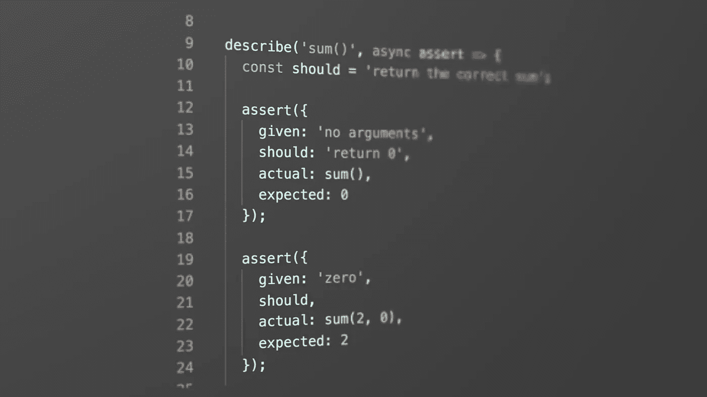

# 重新思考单元测试断言

> 原文：<https://medium.com/javascript-scene/rethinking-unit-test-assertions-55f59358253f?source=collection_archive---------0----------------------->



写得好的自动化测试在失败时总是充当好的错误报告，但是很少有开发人员花时间去考虑好的错误报告需要什么信息。

有[每个单元测试必须回答的 5 个问题](/javascript-scene/what-every-unit-test-needs-f6cd34d9836d)。我之前已经详细描述过它们，所以这次我们只略读一下:

1.  被测试的单元是什么(模块、函数、类等等)？
2.  它应该做什么？(散文描述)
3.  实际产量是多少？
4.  预期产出是多少？
5.  你如何重现失败？

许多测试框架允许你忽略这些问题中的一个或多个，这导致错误报告不是很有用。

让我们用一个虚构的测试框架来看看这个例子，这个框架提供了常见的`pass()`和`fail()`断言:

```
describe('addEntity()', async ({ pass, fail }) => {
  const myEntity  = { id: 'baz', foo: 'bar' }; try {
    const response = await addEntity(myEntity);
    const storedEntity = await getEntity(response.id);
    pass('should add the new entity');
  } catch(err) {
    fail('failed to add and read entity', { myEntity, error });
  }
});
```

我们的方向是正确的，但是我们遗漏了一些信息。让我们试着用测试中的数据来回答 5 个问题:

1.  **被测单位是什么？** `addEntity()`
2.  **它应该做什么？**
3.  实际产量是多少？ *哎呀。我们不知道。我们没有向测试框架提供这些数据。*
4.  **预期产出是多少？** *又来了，我们不知道。我们在这里不测试返回值。相反，我们假设如果它不抛出，一切都按预期运行——但是如果它不抛出呢？如果函数返回值或解析承诺，我们应该测试结果值。*
5.  **如何再现失败？** *我们可以在测试设置中看到这一点，但我们可以更清楚地了解这一点。例如，最好有一个你输入的文字描述，让我们更好地理解测试用例的意图。*

我会给这个打 2.5 分。失败。这个测试没有完成它的工作。它显然没有回答每个单元测试必须回答的 5 个问题。

大多数测试框架的问题是，他们忙于让你通过他们“方便的”断言走捷径，以至于忘记了当测试失败时，测试的最大价值才被实现。

在失败阶段，编写测试的便利性比阅读测试时找出错误的容易程度重要得多。

在[“每个单元测试必须回答的 5 个问题”](/javascript-scene/what-every-unit-test-needs-f6cd34d9836d)中，我写道:

> *`*equal()*`是我最喜欢的论断。如果每个测试套件中唯一可用的断言是 *equal()，*那么世界上几乎所有的测试套件都会更好。”*

*在我写下那篇文章后的几年里，我更加坚信这一点。当测试框架忙于添加更“方便”的断言时，我写了一个薄薄的包装器，只暴露了一个深度相等的断言。换句话说，我采用了已经最小的磁带库，并且*移除了特性*以使测试体验更好。*

*根据 RITEway 测试原则，我将包装器库命名为“ [RITEway](https://github.com/ericelliott/riteway) ”。测试应该是:*

*   *准备就绪*
*   ***I** 隔离(用于单元测试)或 **I** 集成(用于功能和集成测试，测试应隔离，组件/模块应集成)*
*   ***T**h rough，和*
*   *透明的*

*RITEway 迫使您编写可读的、隔离的和显式的测试，因为这是您使用 API 的唯一方式。它还使测试断言变得如此简单，以至于您想编写更多的测试断言，从而使测试变得更加彻底。*

*这是 RITEway`assert()`的签名:*

```
*assert({
  given: Any,
  should: String,
  actual: Any,
  expected: Any
}) => Void*
```

*断言必须在一个`describe()`块中，该块将被测单元的标签作为第一个参数。完整的测试如下所示:*

```
*describe('sum()', async assert => {
  assert({
    given: 'no arguments',
    should: 'return 0',
    actual: sum(),
    expected: 0
  });
});*
```

*这会产生以下内容:*

```
*TAP version 13
# sum()
ok 1 Given no arguments: should return 0*
```

*让我们再看看上面的 2.5 星测试，看看我们是否可以提高分数:*

```
*describe('addEntity()', async assert => {
  const myEntity  = { id: 'baz', foo: 'bar' };
  const given =  'an entity';
  const should = 'read the same entity from the api'; try {
    const response = await addEntity(myEntity);
    const storedEntity = await getEntity(response.id); assert({
      given,
      should,
      actual: storedEntity,
      expected: myEntity
    });
  } catch(error) {
    assert({
      given,
      should,
      actual: error,
      expected: myEntity
    });
  }
});*
```

1.  ***被测单位是什么？***
2.  *它应该做什么？ `'given an entity: should read the same entity from the api'`*
3.  *实际产量是多少？ `{ id: 'baz', foo: 'bar' }`*
4.  ***预期产出是多少？** `{ id: 'baz', foo: 'bar' }`*
5.  ***你如何重现失败？现在，消息中更加明确地说明了重现测试的说明:提供了给定和应该的描述。***

*不错！现在我们通过了测试。*

# *一个深度相等的断言真的足够了吗？*

*一年半以来，我几乎每天都在几个大型制作项目中使用 RITEway。它已经进化了一点。我们已经把接口*做得比原来更简单了*，但是我从来没有想要另一个断言，我们的测试套件是我整个职业生涯中见过的最简单、可读性最强的测试套件。*

*我认为是时候与世界分享这一创新了。如果您想从 [RITEway](https://github.com/ericelliott/riteway) 开始:*

```
*npm install --save-dev riteway*
```

*它将改变你对测试软件的看法。*

*简而言之:*

> *简单测试是更好的测试。*

**附注:我在本文中一直使用“单元测试”这个术语，但那只是因为它比“自动化软件测试”或“单元测试、功能测试和集成测试”更容易输入，但我在本文中所说的关于单元测试的一切适用于我能想到的所有自动化软件测试。对于功能测试，我也更喜欢这些测试，而不是黄瓜/小黄瓜。**

# *后续步骤*

*[TDD 日](https://tddday.com/)是一个在线录制的网络研讨会，深入探讨了测试驱动开发、不同类型的测试及其作用、如何编写更多可测试的软件，以及[TDD 如何让我成为更好的开发人员](/javascript-scene/tdd-changed-my-life-5af0ce099f80)，以及它如何为你做同样的事情。这是一个伟大的大师班，帮助您或您的团队达到 TDD 实践的下一个水平，以 5 小时的视频内容和测试您的记忆的互动测验为特色。*

*更多关于测试驱动开发的视频课程可供 EricElliottJS.com 成员使用。如果你还不是会员，今天就注册吧。*

****艾里克·艾略特*** *著有《书籍》、* [*【排版软件】*](https://leanpub.com/composingsoftware)*[*【编程 JavaScript 应用】*](http://pjabook.com) *。作为*[*【EricElliottJS.com】*](https://ericelliottjs.com)*和*[*devanywhere . io*](https://devanywhere.io)*的联合创始人，他教授开发者必备的软件开发技能。他为加密项目组建开发团队并提供建议，为 Adobe Systems、* ***、Zumba Fitness、*** ***【华尔街日报、*******【ESPN、*******BBC、*** *以及包括* ***Usher、弗兰克·奥申、金属乐队在内的顶级录音*******

***他和世界上最美丽的女人享受着与世隔绝的生活方式。***