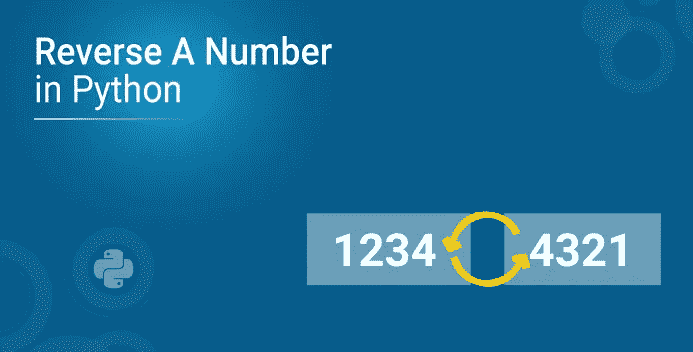
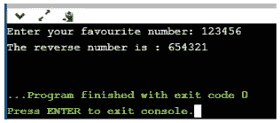
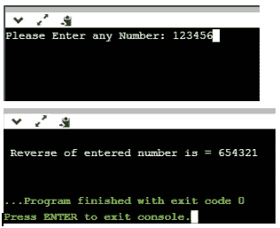

# 在 Python 中反转数字

> 原文：<https://medium.com/edureka/reverse-a-number-6eeb7eed0309?source=collection_archive---------1----------------------->



Python 是一种具有不同应用的解释型、高级、通用编程语言。为了学习 Python 的基本概念，有一些标准程序可以让你对所有的概念有一个简单的了解。在 Python 中反转一个数字是这些程序中的一个，它让学习者对循环和算术运算符有深刻的理解。这篇文章将帮助你理解和实现反转一个数字的方法。它将涵盖以下主题-

*   如何在 Python 中求一个数的倒数？
*   Python 程序反转一个数字
*   使用循环
*   使用递归

# 如何在 Python 中求一个数的倒数？

很简单！您可以编写一个 Python 程序，它接受一个输入数字，并对其进行反向处理。整数值存储在使用条件检查的变量中，然后数字的每个数字存储在另一个变量中，该变量将打印反转的数字。在 Python 中，可以使用不同的方法来反转数字，让我们来看看实现相同功能的 Python 程序。

## Python 程序反转一个数字

在 Python 编程语言中，有两种方法可以反转一个数字

*   使用循环
*   使用递归

# 使用循环反转数字

```
# Get the number from user manually
num = int(input("Enter your favourite number: "))
# Initiate value to null
test_num = 0
# Check using while loop
while(num>0):
#Logic
remainder = num % 10
test_num = (test_num * 10) + remainder
num = num//10
# Display the result
print("The reverse number is : {}".format(test_num))
```

**输出**:



**节目解说**

用户值:数字= 123456，反向= 0

**第一次迭代**
提醒= Number %10
提醒= 123456%10 = 6
反向=反向*10 +提醒
反向= 0 * 10+6 = 0+6 = 6
Number = Number//10
Number = 123456//10 = 12345

**第六次迭代**
从第二次迭代开始，Number 和 Reverse 的值都被修改为 Number = 1，Reverse = 654320+1 = 654320+1 = 654321
Number 结束:

# 使用递归反转一个数

```
# Python Program to Reverse a Number using RecursionNum = int(input("Please Enter any Number: "))Result = 0
def Result_Int(Num):
    global Result
    if(Num > 0):
        Reminder = Num %10
        Result = (Result *10) + Reminder
        Result_Int(Num //10)
   return Result
Result = Result_Int(Num)
print("n Reverse of entered number is = %d" %Result)
```

**输出**:



如果你想查看更多关于人工智能、DevOps、道德黑客等市场最热门技术的文章，你可以参考 Edureka 的官方网站。

请留意本系列中的其他文章，它们将解释 Python 和数据科学的各个方面。

> *1。*[*Python 中的机器学习分类器*](/edureka/machine-learning-classifier-c02fbd8400c9)
> 
> *2。*[*Python Scikit-Learn Cheat Sheet*](/edureka/python-scikit-learn-cheat-sheet-9786382be9f5)
> 
> *3。* [*机器学习工具*](/edureka/python-libraries-for-data-science-and-machine-learning-1c502744f277)
> 
> *4。* [*用于数据科学和机器学习的 Python 库*](/edureka/python-libraries-for-data-science-and-machine-learning-1c502744f277)
> 
> *5。*[*Python 中的聊天机器人*](/edureka/how-to-make-a-chatbot-in-python-b68fd390b219)
> 
> *6。* [*蟒蛇收藏*](/edureka/collections-in-python-d0bc0ed8d938)
> 
> 7。 [*Python 模块*](/edureka/python-modules-abb0145a5963)
> 
> *8。* [*Python 开发者技能*](/edureka/python-developer-skills-371583a69be1)
> 
> *9。* [*哎呀面试问答*](/edureka/oops-interview-questions-621fc922cdf4)
> 
> *10。* [*一个 Python 开发者的简历*](/edureka/python-developer-resume-ded7799b4389)
> 
> *11。*[*Python 中的探索性数据分析*](/edureka/exploratory-data-analysis-in-python-3ee69362a46e)
> 
> *12。* [*蛇与 Python 的游戏*](/edureka/python-turtle-module-361816449390)
> 
> *13。* [*Python 开发者工资*](/edureka/python-developer-salary-ba2eff6a502e)
> 
> *14。* [*主成分分析*](/edureka/principal-component-analysis-69d7a4babc96)
> 
> *15。*[*Python vs c++*](/edureka/python-vs-cpp-c3ffbea01eec)
> 
> *16。* [*刺儿头教程*](/edureka/scrapy-tutorial-5584517658fb)
> 
> *17。*[*Python SciPy*](/edureka/scipy-tutorial-38723361ba4b)
> 
> *18。* [*最小二乘回归法*](/edureka/least-square-regression-40b59cca8ea7)
> 
> *19。* [*Jupyter 笔记本小抄*](/edureka/jupyter-notebook-cheat-sheet-88f60d1aca7)
> 
> *20。* [*Python 基础知识*](/edureka/python-basics-f371d7fc0054)
> 
> *21。* [*Python 模式程序*](/edureka/python-pattern-programs-75e1e764a42f)
> 
> 22。 [*用 Python 进行网页抓取*](/edureka/web-scraping-with-python-d9e6506007bf)
> 
> *23。* [*Python 装饰器*](/edureka/python-decorator-tutorial-bf7b21278564)
> 
> *24。*[*Python Spyder IDE*](/edureka/spyder-ide-2a91caac4e46)
> 
> 25。 [*移动应用使用 Python 中的 Kivy*](/edureka/kivy-tutorial-9a0f02fe53f5)
> 
> *二十六。* [*十大最佳学习书籍&练习 Python*](/edureka/best-books-for-python-11137561beb7)
> 
> 27。 [*机器人框架与 Python*](/edureka/robot-framework-tutorial-f8a75ab23cfd)
> 
> *28。*[*Python 中的贪吃蛇游戏*](/edureka/snake-game-with-pygame-497f1683eeaa)
> 
> *29。* [*Django 面试问答*](/edureka/django-interview-questions-a4df7bfeb7e8)
> 
> 30。 [*十大 Python 应用*](/edureka/python-applications-18b780d64f3b)
> 
> *31。*[*Python 中的哈希表和哈希表*](/edureka/hash-tables-and-hashmaps-in-python-3bd7fc1b00b4)
> 
> *32。*[*Python 3.8*](/edureka/whats-new-python-3-8-7d52cda747b)
> 
> *33。* [*支持向量机*](/edureka/support-vector-machine-in-python-539dca55c26a)
> 
> *34。* [*Python 教程*](/edureka/python-tutorial-be1b3d015745)

*原载于 2019 年 9 月 24 日*[*https://www.edureka.co*](https://www.edureka.co/blog/how-to-reverse-a-number/)*。*