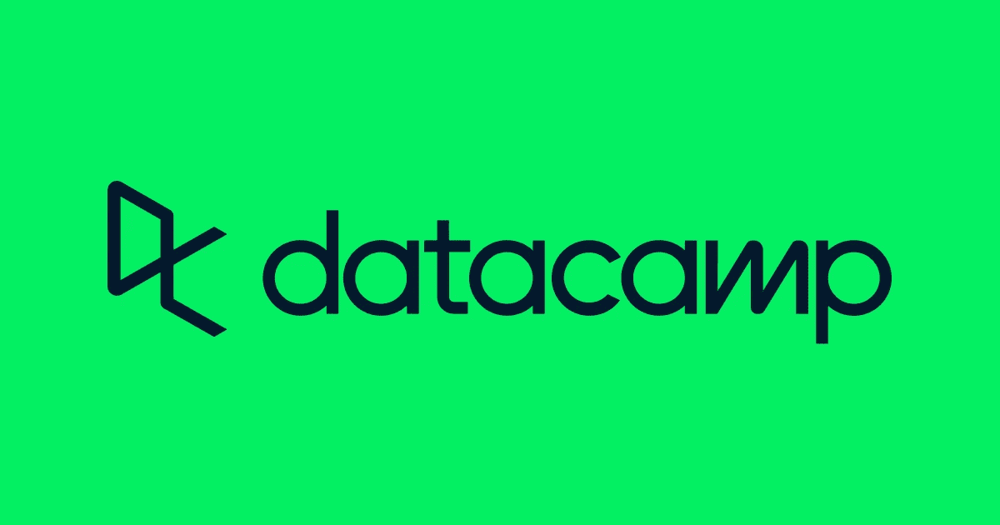
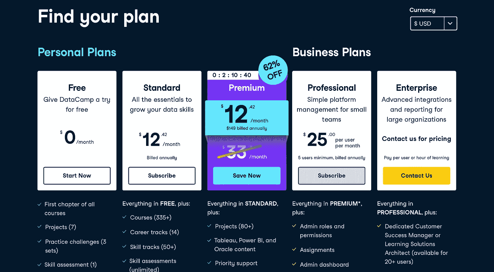
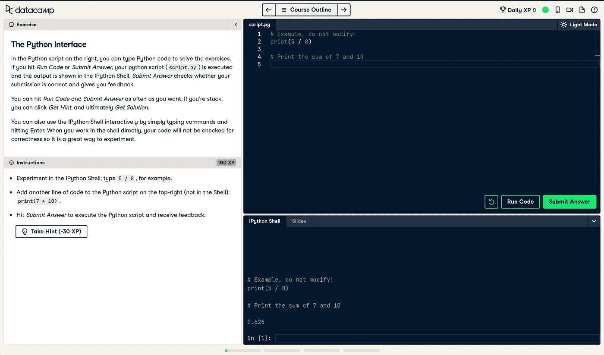

# 回顾数据营——为未来工作学习技能

> 原文：<https://medium.com/double-pointer/review-of-datacamp-learning-skills-for-the-future-of-work-3dfafd012212?source=collection_archive---------3----------------------->

> **请考虑通过** [**注册**](https://bit.ly/3OvimpR) **付费媒体账户来支持我们。**

数据科学是当今计算机科学中最热门的领域之一，预计在未来几年将呈指数级增长。要求数据科学家的职位招聘数量稳步增长，催生了许多在线教育科技公司，这些公司出售课程，向买家传授数据辩论技巧。根据 LinkedIn 的数据，2018 年 8 月，美国科技行业正面临 15 万名数据科学家的短缺，自那以来，对数据科学技能的需求越来越大。 [**DataCamp**](https://bit.ly/36sXr2Y) 是在线教育技术行业的新贵，它为几乎没有数据科学及相关领域技术背景的人提供培训。DataCamp 和它的在线同行们正在填补技术熟练的专业人员不足的缺口，他们以极低的成本提供补充教育，代替正规的大学学位。

[**Grokking the Coding Interview: Patterns for Coding Questions**](https://bit.ly/3agTSNt)

简而言之， [DataCamp](https://bit.ly/36sXr2Y) 订阅只有在你是数据科学领域的新手时才值得。对于中级和高级用户来说，这些课程不够全面和深入，无法提供太多价值。请继续阅读详细的评论。

数据营于 2013 年由 [Martijn Theuwissen](https://www.linkedin.com/in/martijn-theuwissen-b569b933/) 、 [Jonathan Cornelissen](https://www.linkedin.com/in/jonathan-cornelissen/) 和 [Dieter De Mesmaeker](https://www.linkedin.com/in/dieterdemesmaeker/?originalSubdomain=be) 创立。从那时起， [DataCamp](https://bit.ly/36sXr2Y) 已经走过了漫长的道路，现在提供了许多课程，这些课程针对在数据科学领域广泛使用的语言和工具，如 Python、R、Power BI、Excel 等，具有不同的技能和难度。由于用户数量的爆炸式增长，到目前为止，该公司据称已经筹集了 3110 万美元，最近一次融资是在 2017 年筹集的 2500 万美元。

该网站为用户定制学习体验提供了多种选择。指令格式的范围如下:

*   追求**个人课程**迎合一个具体而狭窄的主题。
*   报名参加**技能培训**，该培训由一系列旨在教授更广泛技能的精选课程组成，例如“导入和清理数据”或“数据操作”。
*   遵循**职业轨迹**，专注于教授行业角色所需的几项技能，如数据科学家、R 程序员、数据工程师、机器学习科学家等。

DataCamp 为个人和企业提供不同的定价等级。但是，您只能购买年度订阅，尽管市场营销将每月显示为每月费用(按年计费)。这与其他教育科技公司略有不同，比如提供包月服务的教育科技公司。免费层允许您访问每个课程的第一章，此外还有七个项目、三个实践挑战和一个技能评估。您可以注册来获得用户界面的外观和感觉，并进行体验。

总的来说，课程的质量相当不错。每门课程都旨在与浏览器内的代码执行互动，并配有视频教程。您可以根据自己的喜好轻松切换各种模式。当你在旅途中时，还可以选择从在桌面上阅读课程切换到在手机上阅读。该界面是游戏化的，如果用户在没有收到提示或看到答案的情况下成功完成练习，就可以获得称为“XP”的分数。这些课程是不评分的，并在结束时提供一份完成声明，可以在用户的 LinkedIn 个人资料上分享。

请注意，课程内容在任何意义上都不新颖。你可以在谷歌上搜索任何免费的主题，并在你的本地机器上设置一个 Python IDE 进行实践。**data camp 提供的真正价值是通过一站式门户简化您的学习体验**。你不必费心在你的本地机器上安装一个潘多拉工具箱和依赖项，也不必为你在谷歌上找到的每个在线博客打开一打 chrome 标签。与此同时，DataCamp 缺乏大学学位在数据科学方面的可信度和严谨性，而是教授实用的、以行业为重点的工具和技能。大多数教育科技公司都回避伴随数据科学和数据营的枯燥理论和令人头晕的数学，这没有什么不同。

[***Grokking Modern System Design for Software Engineers and Managers***](https://bit.ly/3bD3IOS)

**一个显著的缺点** [**DataCamp**](https://bit.ly/36sXr2Y) **苦于缺少面试准备内容。我们预计 DataCamp 的大多数读者是学生、初露头角的技术人员以及从其他职业转向计算机科学领域的人。这些用户的最终目标是一份高薪工作，而数据科学是实现这一目标的手段。DataCamp 烤出了蛋糕，但缺少糖衣。如果 DataCamp 推出类似于 [Educative](https://bit.ly/3oGEdNL) 提供的课程，只专注于数据科学工作的面试准备，那将是理想的。Educative 的一些竞争产品包括:**

*   [**数据科学面试手册**](https://bit.ly/3oGEdNL)
*   [**钻研数据科学**](https://bit.ly/2SGYEMG)
*   [**面向非程序员的数据科学**](https://www.educative.io/courses/data-science-for-non-programmers?affiliate_id=5457430901161984)
*   [**用 Bash Shell 学数据科学**](https://www.educative.io/courses/learn-data-science-with-bash-shell?affiliate_id=5457430901161984)
*   [**生产中的数据科学:构建可扩展的模型管道**](https://www.educative.io/courses/data-science-in-production-building-scalable-model-pipelines?affiliate_id=5457430901161984)
*   [**Python 数据分析与可视化**](https://www.educative.io/courses/python-data-analysis-and-visualization?affiliate_id=5457430901161984)
*   [**软件工程师的机器学习**](https://bit.ly/2xH4mXO)
*   [**应用机器学习:TensorFlow**](https://www.educative.io/courses/industry-case-study-tensorflow?affiliate_id=5457430901161984) 行业案例研究

总而言之，如果你是一个积极的自学者或正在考虑转行的人， [DataCamp](https://bit.ly/36sXr2Y) 是一个很好的开始，尤其是对于那些想要花费数千美元参加大学认可的数据科学项目的人来说。您可以从 DataCamp 开始，亲身体验在数据科学领域工作的感觉，这很像在投入大量资金之前确定您在该领域资质的试金石。