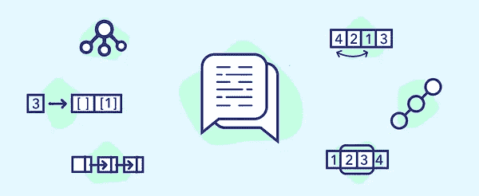

# 《探索编码面试:编码问题的模式》评介

> 原文：<https://medium.com/double-pointer/review-of-grokking-the-coding-interview-patterns-for-coding-questions-84cfe372aa4?source=collection_archive---------1----------------------->

**更新**:该课程已经从 Educative 中脱颖而出，可以在 [DesignGurus 平台购买，终身访问](https://bit.ly/3BR7O0s)。

[**Grokking the Coding Interview: Patterns for Coding Questions**](https://bit.ly/3agTSNt)

> **请考虑通过** [**注册**](https://bit.ly/3OvimpR) **付费媒体账户来支持我们。**

如果你只有不到一周的时间来准备全职面试，我推荐两个策略。首先，如果你是…