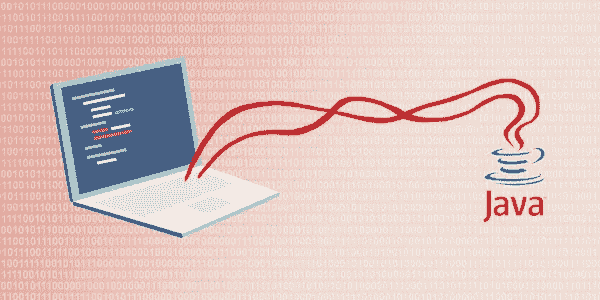

# 面向高级工程面试的 Java 多线程回顾

> 原文：<https://medium.com/double-pointer/review-of-java-multithreading-for-senior-engineering-interviews-1e6c9cf7308f?source=collection_archive---------1----------------------->

*如果您正在面试，请查看我们的综合准备课程* [***面向工程面试的 Java 多线程***](https://www.interviewjek.com/course/java-multithreading-for-engineering-interviews) ***。***

Interviewing? consider buying our number#1 course for [Java Multithreading Interviews](https://bit.ly/2QfKXCK).

> **请考虑通过** [**注册**](https://bit.ly/3OvimpR) **付费媒介账户来支持我们。**

今天，我们将回顾高级工程面试中最受欢迎的课程之一 Educative.io [**Java 多线程**](https://bit.ly/2QfKXCK) 。这是…