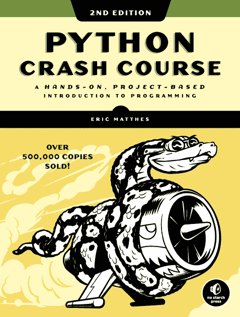
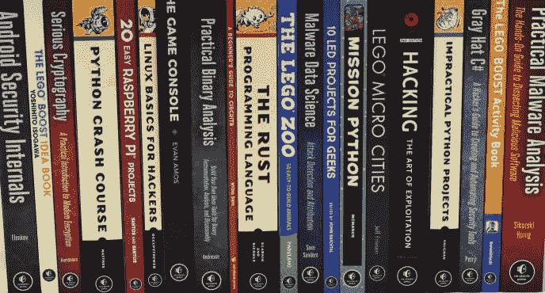
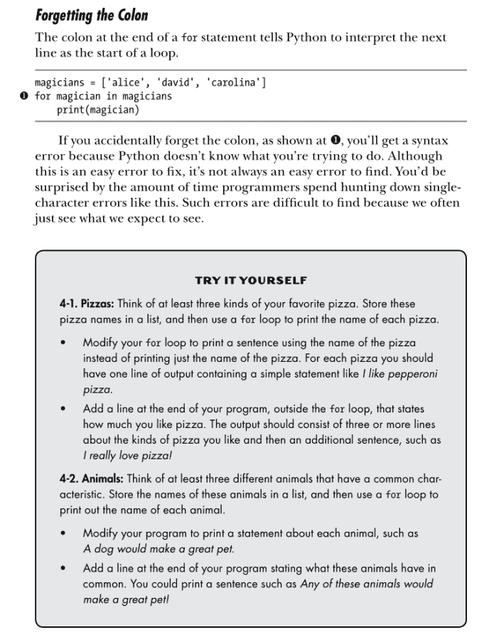
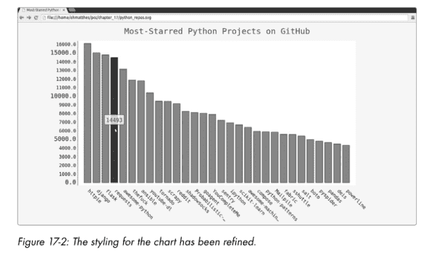

# 复习:Python 速成班

> 原文：<https://medium.com/quick-code/review-python-crash-course-78e83b761509?source=collection_archive---------0----------------------->

*原载于 2019 年 8 月 27 日*[*【https://letslearnabout.net】*](https://letslearnabout.net/books/review-python-crash-course/)*。*

Python Crash Course

如果你需要尽快学会 Python，不要再犹豫了。Python 速成课程的编写是为了让 Python 新手可以立刻开始编写自己的程序。

使用基于项目的学习方式快速学习编程的基础知识，这样您就可以专注于构建您想要的东西:网站、数据可视化、web 应用程序，甚至编写一个 Raspberry Pi。

# 简介—什么是 Python 速成班？

[*Eric Matthes*](https://twitter.com/ehmatthes) *(on the left) the author of Python Crash Course*

Python 速成课是世界上最畅销的 Python 书籍。句号。

Eric Matthes 的《Python 速成教程》已经出了第二版，成为直接介绍 Python 编程基础的最佳书籍之一。

没有绒毛或不必要的信息，可以混淆(和恐吓)新人，这本书的风格是直接和解决问题。现实世界，解决问题。

# 《Python 速成班好吗》这本书？

No Starch Press, its publishing company

Python 速成班会让你很快熟悉 Python。

虽然学好一门语言需要几个月(好吧，几年……)，但这本书通过使用 Python 为一般编程概念提供了坚实的基础，从而加快了你的学习过程。

## 第一部分:基础知识

学习什么是变量，简单的数据结构，if 语句，用户输入，while 循环，类和函数，如何读写文件…

Python 中的所有基础知识都包含在单独的一章中。

在每一章的开始，我们都有一个关于本章将要涵盖的内容和我们将要学习的内容的简要说明。

然后我们跳到代码。不太多，就几行作为例子。然后我们回到理论，只是为了在下一段中再次回到编码。

这本书使用了我喜欢的风格:将理论和编码交织在一起，这样用户可以同时学习和编码。在第一次印刷前没有无聊的 7 页理论。没有解释我们在看什么，就没有编码。

你边编码边学习，边学习边编码。

然后，练习。

[Theory — Code — Exercises](https://nostarch.com/download/samples/PythonCrashCourse2E_Sample_Ch2.pdf)

几页之后，你有一个“自己尝试”部分，它强化了你所学到的东西，通过让你解决问题，把读者推出你自己的舒适区。

我喜欢这样的书，因为它是学习、编码和自己编码的完美融合。这使得阅读变得有趣。学习 Python 也很有趣。

毫无疑问:学习是困难的，但是当学习变得有趣时，我们会鞭策自己学习更多。这本书在这方面做得很成功。

## 第二部分:项目

在所有 Python 基础知识的第一部分之后，这本书进入第二部分:项目。

没时间讨论理论了:现在我们正在建造真实的东西。

用 [PyGame](https://www.pygame.org/news) 做一个视频游戏，用 [Django](https://www.djangoproject.com/) 做一个网站，用 [mathplotlib](https://matplotlib.org/) 做一点数据可视化，这些都是我们将在这本书的第二部分构建的项目。

超越基础，创造真正的项目。

Creating Data Visualization with Mathplotlib

还有真的。不小的问题，如“迭代从 0 到 100 的所有数字，只打印除以 5 或 3 得出 0 的数字”。

不，我们建造真实的东西。

例如，我在工作中使用 Django，这是一个基于 Python 的 web 框架。事实上，它是我最喜欢的框架。

有多少初级书是这样的？

所以，回答这个问题的题目:是的，Python 速成课是本好书。非常好的一个。

# 利弊

## 赞成的意见

*   一本非常适合初学者的好书。它教你，不会让你厌烦，更重要的是:它让学习成为一种愉快的经历
*   Nails 完美地平衡了教学、编码和让读者自己编码之间的关系。
*   现在的版本是第二版。这是最畅销的书。这不是偶然的。
*   有实际应用的有意义的项目(嗯，也许你不会用 PyGame 编写反恐精英或巫师 3)。

## 骗局

*   有点浅薄。它为你提供了一个解决大多数问题的方法，但并不深入。因此，如果你是一个初学者，你是黄金，但如果你是有经验的，这本书不适合你。
*   与其他书籍相比，40 美元似乎有点贵。
*   PyGame 项目对年轻人来说可能很有趣，但老年人学习 Python 来构建他们想要的东西或因为工作需要它可能会感到无聊。

# 结论

Python 速成课程是一本很棒的书，非常适合在创纪录的时间内学习 Python 基础知识和其他知识。

针对编程世界的新手，尤其是年轻人，它让你对学习越来越感兴趣。

最初我想每天写一章。我在一周或不到一周的时间里完成了基础部分(11 章)。

如果你正在寻找一本开始用 Python 编程的书，不要再找了:Python 速成班是你最好的选择之一。

Python 速成班:[https://nostarch.com/pythoncrashcourse2e](https://nostarch.com/pythoncrashcourse2e)

无淀粉出版社目录:[https://nostarch.com/catalog.htm](https://nostarch.com/catalog.htm)

[在 Twitter 上联系我](https://twitter.com/DavidMM1707)

[我的 Youtube 教程视频](https://www.youtube.com/channel/UC9OLm6YFRzr4yjlw4xNWYvg?sub_confirmation=1)

[我的 Github](https://github.com/david1707)

[在我的博客上了解更多信息](https://letslearnabout.net/)