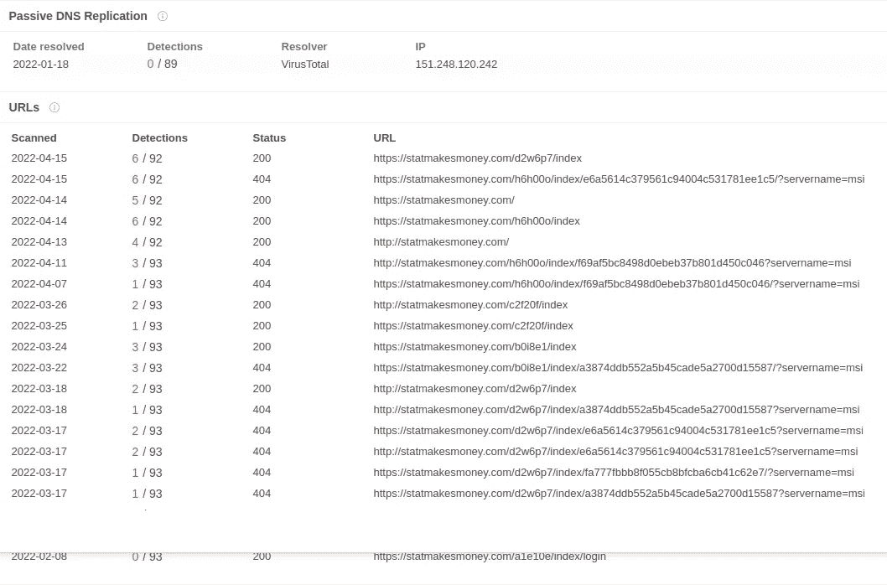
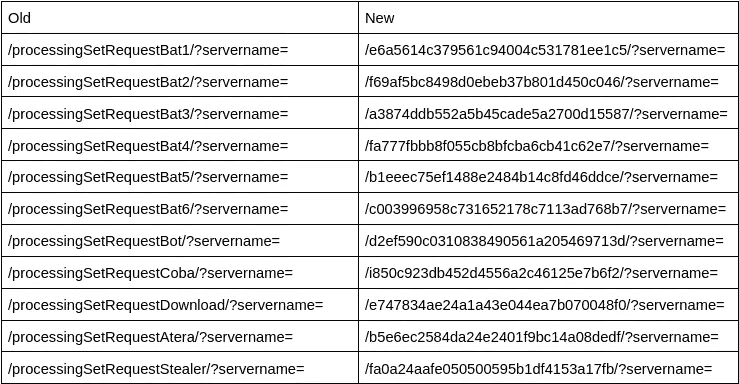

# 重访蝙蝠装载机 C2 结构

> 原文：<https://medium.com/walmartglobaltech/revisiting-batloader-c2-structure-52f46ff9893a?source=collection_archive---------4----------------------->

作者:杰森·里维斯和约书亚·普拉特


由 Mandiant[7]命名的 BatLoader 是一个有趣的分发/加载系统，之前已经讨论过[1，2]并被各种参与者利用。最近的媒体头条显示了在多个组织[4]中断后与 Zloader[3]的连接，但这不是 Zloader 的独家服务。

关于中断的报道包括在他们的报告中简短提及 BatLoader。我们认为这不是他们最近的破坏活动的目标，因为服务仍在运行。在研究新的 BatLoader 活动时，我们注意到自从我们的上一篇博客[1]以来，他们改变了加载过程的 C2 结构:



Ref: Virustotal.com

该结构看起来与我们之前报告的类似，但是一些数据现在看起来像哈希值。

前情提要:

```
/processingSetRequestBat1/?servername=
/processingSetRequestBat2/?servername=
/processingSetRequestBat3/?servername=
/processingSetRequestBat4/?servername=
/processingSetRequestBat5/?servername=
/processingSetRequestBat6/?servername=
/processingSetRequestBot/?servername=
/processingSetRequestCoba/?servername=
/processingSetRequestDownload/?servername=
/processingSetRequestAtera/?servername=
```

所以这些哈希值不仅仅是处理字符串的哈希值，对吗？

```
>>> hashlib.md5('processingSetRequestBat1').hexdigest()
'e6a5614c379561c94004c531781ee1c5'
```

啊，原来如此。然后我们可以根据新的模式创建新的 suricata 规则。但是，我注意到如果散列以数字开头，那么开发人员会将其更改为字符，例如:

```
>>> hashlib.md5('processingSetRequestBat3').hexdigest()
'73874ddb552a5b45cade5a2700d15587'
```

然而，流量模式中使用的哈希是:

```
a3874ddb552a5b45cade5a2700d15587
```

从其他蝙蝠的请求来看，它们似乎是按顺序进行的；a、b、c、d…因此我们可以继续将哈希值映射到新的请求结构:

```
/e6a5614c379561c94004c531781ee1c5/?servername=
/f69af5bc8498d0ebeb37b801d450c046/?servername=
/a3874ddb552a5b45cade5a2700d15587/?servername=
/fa777fbbb8f055cb8bfcba6cb41c62e7/?servername=
/b1eeec75ef1488e2484b14c8fd46ddce/?servername=
/c003996958c731652178c7113ad768b7/?servername=
/d2ef590c0310838490561a205469713d/?servername=
/fa0a24aafe050500595b1df4153a17fb/?servername=
/i850c923db452d4556a2c46125e7b6f2/?servername=
/b5e6ec2584da24e2401f9bc14a08dedf/?servername=
/e747834ae24a1a43e044ea7b070048f0/?servername=
```

除了部署一个窃取者，这个映射如下:



大多数报道还显示，msi 安装程序的模板是基于 Zoom 和 Teamviewer 的虚假安装程序，但是正如我们之前提到的，这项服务涉及许多分支机构。初始 MSI 文件的假冒软件模板的更详尽列表可以在下面找到:

```
zoom
teamviewer
AnyDesk
Telegram
youtube
cheats
ccleaner
discord
thunderbird
luminar
adobe reader
chrome
firefox
brave
gemini
grammarly
quicken
robinhood
amazon
smbc
fidelity
logmein
```

**参考文献**:

1:[https://medium . com/walmartglobaltech/signed-dll-campaigns-as-a-service-7760 AC 676489](/walmartglobaltech/signed-dll-campaigns-as-a-service-7760ac676489)

2:[https://news . sophos . com/en-us/2022/01/19/zloader-installs-remote-access-back doors-and-delivers-cobalt-strike/](https://news.sophos.com/en-us/2022/01/19/zloader-installs-remote-access-backdoors-and-delivers-cobalt-strike/)

3:[https://www . Microsoft . com/security/blog/2022/04/13/拆解-zloader-how-恶意-ads-led-to-disabled-security-tools-and-ransomware/](https://www.microsoft.com/security/blog/2022/04/13/dismantling-zloader-how-malicious-ads-led-to-disabled-security-tools-and-ransomware/)

4:[https://blogs . Microsoft . com/on-the-issues/2022/04/13/zloader-botnet-disrupted-malware-Ukraine/](https://blogs.microsoft.com/on-the-issues/2022/04/13/zloader-botnet-disrupted-malware-ukraine/)

5:[https://www . welivesecurity . com/2022/04/13/ESET-takes-part-global-operation-disrupt-zloader-botnets/](https://www.welivesecurity.com/2022/04/13/eset-takes-part-global-operation-disrupt-zloader-botnets/)

6:[https://decoded . avast . io/vladimirmartyanov/zloader-the-silent-night/](https://decoded.avast.io/vladimirmartyanov/zloader-the-silent-night/)

7:[https://www . man diant . com/resources/SEO-poisoning-bat loader-atera](https://www.mandiant.com/resources/seo-poisoning-batloader-atera)