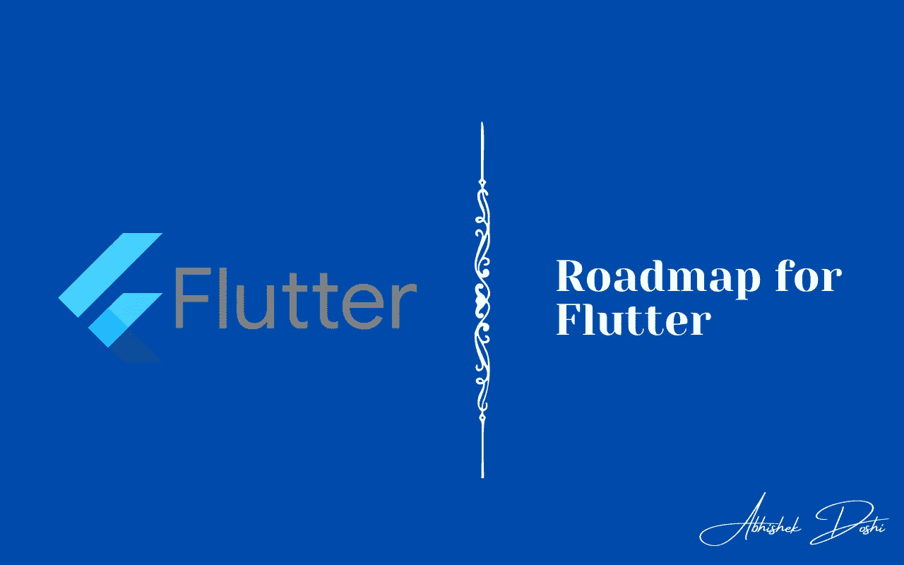
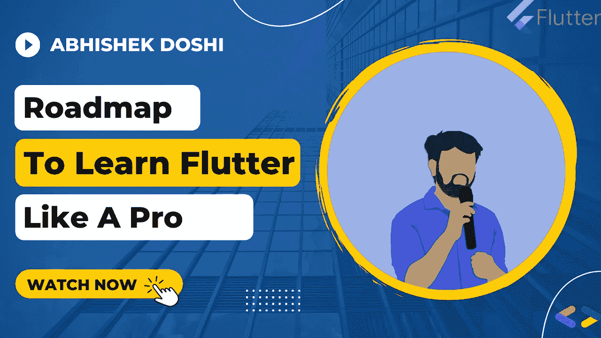

# 像专业人士一样学习 Flutter 的路线图！

> 原文：<https://medium.com/google-developer-experts/roadmap-to-learn-flutter-like-a-pro-594f5c38e74a?source=collection_archive---------0----------------------->

## 学习任何技术/语言都需要时间和耐心。不要中途停留，不要提前出发，不要和别人比较你的旅程！

Flutter 是当前 IT 行业中最受欢迎和采用的技术之一。但是为什么会这样呢？为什么颤振趋势这么多？也有其他框架，那么为什么要颤振呢？所以在这篇文章中，让我们先看看什么是 flutter，为什么它会成为趋势，然后我们将看看如何像专业人士一样学习 Flutter！

等等，不喜欢文章？请随意查看 YouTube 视频💙

# 什么是颤振？

Flutter 是 Google 的 UI 工具包，用于从单一代码库为移动、web、桌面和嵌入式设备构建漂亮的本地编译应用程序。所以换句话说，如果你使用 Flutter 制作你的应用或网站，它会比其他框架或技术更漂亮，更快！**那么，为什么 Flutter 如此受欢迎呢？**

*   Flutter 将代码编译成本国语言。
*   创业公司很容易采用 Flutter，创造 MVP。
*   广泛的平台支持(Android、iOS、Windows、macOS、Linux、嵌入式，更多即将推出！)
*   优秀的文档和丰富的资源可供学习
*   大型支持社区！
*   开源！

# 像专业人士一样学习 Flutter 的路线图！

## 步骤 0:先决条件

在开始使用 Flutter 之前，您至少应该了解 OOP 概念。Flutter 使用 Dart 语言，Dart 使用 OOP 概念。因此，最起码要学习任何语言的 OOP 概念(首选 Java)。学习原生 Android 总是一个好主意，这样你可以更容易地理解 Flutter。不是强迫，而是更好的探索方式。如果你是一名应届毕业生，现在你有责任创建一个作品集或网上形象来脱颖而出！所以，学 GIT。在 GitHub 上托管您的项目，无论是什么项目！[在你的系统中安装 Flutter](https://flutter.dev/docs/get-started/install) ，这样你就可以开始你的旅程了！

## 第一步:从基础开始！

Dart 是一种广泛的语言，需要时间来掌握。在使用应用程序之前，至少应该学习 Dart 语言的基础知识。如果您已经了解 Java，那么从 Java 到 Dart 的转换将会非常容易！不要在不了解 Dart 的情况下直接跳到 Flutter。您应该了解的几个概念:

*   列表
*   地图
*   λ函数
*   混合蛋白
*   等待和异步

一旦你完成了 dart 的基本概念，你就可以随意探索 Flutter 了。

## 第二步:接触 UI 开发！

每当我们开始一门新的语言时，我们都需要每天学习的动力。当我们第一次开始 UI 开发时，它给我们带来了解脱。当你的 app 1st 的屏幕在你的设备上弹出，如你所料，那就是你觉得有动力的时候了！此外，开发人员在 Flutter 中进行 UI 开发时会面临许多问题和错误。那么你能做什么或者怎么做 UI 开发呢？

*   从 [Dribbble](https://dribbble.com/) 中取出任何 UI，并在 Flutter 中执行相同的操作
*   创建克隆应用程序，如 Whatsapp 克隆，抖音克隆等。

## 步骤 3:学习 API 调用

一旦你对 UI 开发有了信心，你应该从学习 API 调用开始。无论何时创建任何应用程序，都需要 API。API 调用可以使用不同的可用包来完成，如 [http](https://pub.dev/packages/http) 、 [dio](https://pub.dev/packages/dio) 、[改型](https://pub.dev/packages/retrofit)、 [chopper](https://pub.dev/packages/chopper) 等。基本的一个是 HTTP，其他包是 HTTP 的包装器，功能不多。您可以选择其中的任何一个，但是最好从 http 开始，然后是任何其他的包。你可以从[https://jsonplaceholder.typicode.com](https://jsonplaceholder.typicode.com/)获得许多假的 API 来集成你的应用

一旦集成了一个 API 并进行一个 API 调用，您就需要将该 API 响应解析成一个模型类:

 [## 在 Flutter 解析 JSON！

### 使用 API？响应通常是 JSON 格式的！

abhishekdoshi26.medium.com](https://abhishekdoshi26.medium.com/parsing-json-in-flutter-7519293f5168) 

## 步骤 4:学习数据库集成

数据库是任何应用程序不可或缺的一部分。总是需要存储应用程序中的某些数据。可以与 Flutter 一起使用的一些数据库:

*   [燃烧基地](https://firebase.flutter.dev/docs/overview/)
*   [Supabase](https://supabase.io/)
*   [SQFLite](https://pub.dev/packages/sqflite) (本地数据库)
*   [Hive](https://pub.dev/packages/hive) (本地数据库)
*   [摩尔](https://pub.dev/packages/moor)(本地数据库)
*   还有更多…

## 步骤 5:学习状态管理

状态管理是颤振中最重要的概念之一。当我们的应用程序变得越来越大、越来越复杂时，管理你的屏幕和应用程序的状态就变得非常困难。假设您想将数据从第 1 页传递到第 2 页。那很简单。我们可以在航行中通过它。但是，假设您想将数据从第 1 页传递到第 5 页。在这种情况下，状态管理是有帮助的！有许多可用的状态管理技术和软件包。但是不要给自己太大压力！用你觉得舒服的那个。您可以从[提供者](https://pub.dev/packages/provider)开始，因为这是基本的状态管理包之一。

## 步骤 6:学习项目结构或架构

维护项目结构非常重要。它有助于新手快速审查代码。它还有助于轻松跟踪 bug，或者在需要时添加或删除功能，而不会破坏当前的功能。有许多预定义的架构可用，如 MVVM、MVC、TDD 等。这些真的很棒，是经过适当研究后创造的。但是它们不是强制使用的。你可以随时创建适合你和你的团队的架构。永远记住在您的架构中保持以下几点:

*   吻(保持简单，笨蛋！)
*   可攀登的
*   功能之间最小的相互依赖性
*   代码可重用性

如果你的架构满足以上几点，那就好走了！

**注意:这个路线图是我创建的，其他人可以有不同的观点和策略。总是使用给你最好的学习！**

## 希望你喜欢这篇文章！

如果你喜欢，你可以 [**给我买杯咖啡**](https://www.buymeacoffee.com/abhishekdoshi26) **！**

# 不要忘记通过以下方式与我联系:

*   [**Instagram**](https://www.instagram.com/abhishekdoshi26/)
*   [**推特**](https://twitter.com/AbhishekDoshi26)
*   [**领英**](https://www.linkedin.com/in/AbhishekDoshi26)
*   [**GitHub**](https://github.com/AbhishekDoshi26)

> 不要停止，直到你在呼吸！💙
> -阿布舍克·多希