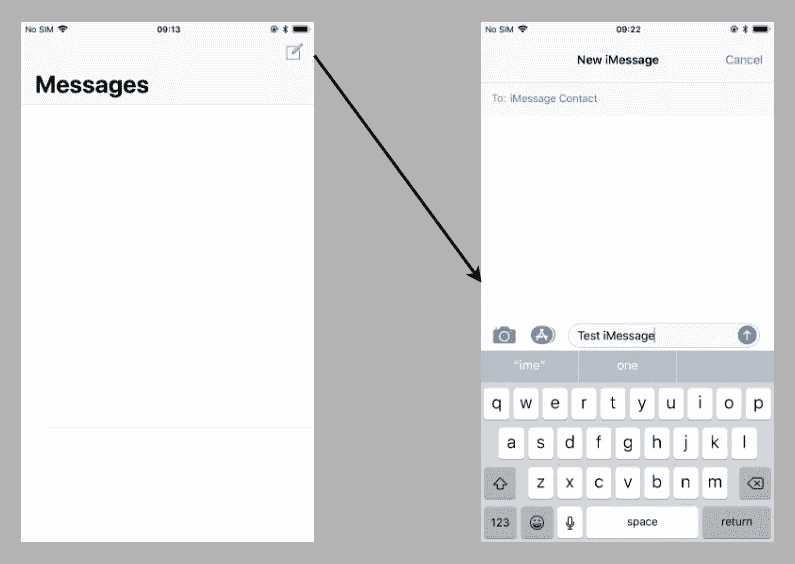

# XCUITest 的机器人模式测试

> 原文：<https://medium.com/capital-one-tech/robot-pattern-testing-for-xcuitest-4c2f0c40b4ad?source=collection_archive---------0----------------------->

## 在 iOS 上使用机器人模式


我最近在 [iOSDevUK](https://www.iosdevuk.com/) 上做了[发言，概述了我们如何在 Capital One 测试我们的旗舰 iOS 应用。我被问到的最常见的后续问题是关于使用**机器人图案**。我在](https://rwapp.co.uk/2018/09/08/iOSDevUK-18/)[幻灯片中简单地提到了机器人模式](https://rwapp.co.uk/A-Swift-Testing-Journey.IOSDevUK.September2018.pdf)，但显然这是其他人有兴趣了解更多的东西

[机器人模型](https://jakewharton.com/testing-robots/)由[杰克·沃顿](https://twitter.com/JakeWharton)在广场设计，用于在科特林测试。因此，许多可用的信息都集中在科特林和浓缩咖啡测试上。在 iOS online 上使用机器人模式的相对较少。然而，Capital One 英国移动团队决定使用机器人模式，因为这意味着我们的 Android 和 iOS 测试方法一致。下面是它在 iOS 应用程序中的工作原理。

## **为什么使用机器人模式**

在编写 XCUI 测试时使用 Robot 模式有三大原因。

1.  **易于理解**
    我们从葫芦来到 XCUITests，在那里我们的测试用[黄瓜](https://docs.cucumber.io/)编写。黄瓜接近自然语言。这意味着我们可以快速轻松地阅读和理解正在测试的内容，而不需要知道测试是如何进行的。用本地代码编写测试，并且已经有了一个学习曲线来知道什么正在被测试，什么没有被测试。
2.  通过将我们的测试分解成步骤，每个实现步骤都可以根据需要重复使用。如果你的应用程序在执行任何操作之前有一个登录界面，那么每次测试都需要大量的设置。相反，您可以每次只调用 login()，然后转移到您的测试的更具体的区域。如果您确实需要做一些稍微不同的事情，您可以将参数传递到函数中。
3.  **隔离实现细节**
    无论你的应用使用什么架构，你的目标都是单一责任原则。坚持这一点允许您用新的实现将一个对象换成一个新的对象，同时仍然保持对象的核心功能。这使得代码更容易维护、测试和改进。那么为什么你的测试应该是不同的呢？杰克·沃顿将此描述为将“什么”与“如何”分开。你的测试应该只关注“什么”,也就是说，如果你的观点改变了屏幕上事情出现或发生的方式，你不需要改变你的整个测试套件。

## **编写一个 XCUITest**

假设我们正在为苹果内置的 Messages 应用程序编写 UI 测试。如果你从暂停状态加载应用程序，你会在屏幕顶部看到一个大标题“消息”和一个创建新消息的按钮。让我们假设我们正在测试点击这个按钮，并用 iMessage 向用户发送一条新消息。



我们的 XCUITest 可能如下所示:

```
func test_sendNewiMessage() {
   let app = XCUIApplication()
   app.launch()

   app.buttons[“new_message”].tap()

   let newMessage = app.staticTexts[“New Message”]
   let predicate = NSPredicate(format: “exists == true”)
   let expectation = XCTNSPredicateExpectation(predicate: predicate, object: newMessage)
   let result = XCTWaiter.wait(for: [expectation], timeout: 5)
   XCTAssertEqual(result, .completed)

   app.typeText(“iMessage Contact”)

   let newimessage = app.staticTexts[“New iMessage”]
   let newimessagePredicate = NSPredicate(format: “exists == true”)
   let newiMessageExpectation = XCTNSPredicateExpectation(predicate: newimessagePredicate, object: newimessage)
   let newiMessageResult = XCTWaiter.wait(for:   [newiMessageExpectation], timeout: 5)
   XCTAssertEqual(newiMessageResult, .completed)

   let firstField = app.textFields[“messageField”]

   firstField.typeText(“test iMessage”)
   app.buttons[“send”].tap()

   let message = app.staticTexts[“test iMessage”]
   let messagePredicate = NSPredicate(format: “exists == true”)
   let messageExpectation = XCTNSPredicateExpectation(predicate: messagePredicate, object: message)
   let messageResult = XCTWaiter.wait(for: [messageExpectation], timeout: 5)
   XCTAssertEqual(messageResult, .completed)
}
```

很明显，这个测试有几个问题——有很多重复的代码，很难跟踪正在测试的内容。但是，如果我们还想测试向 SMS 联系人发送新消息，该怎么办呢？我们必须重复整个测试。然后，如果我们对 UI 进行真正的更改，我们必须更改两个测试。

## **创造机器人**

在测试过程中，我们将访问两个屏幕。

*   最初的对话列表，有一个大标题“消息”。
*   点击新消息按钮后出现的对话详细信息屏幕。

我们将创建一个基本的机器人类，包含一些常见的功能，如断言元素存在和在屏幕上点击。每个屏幕都有自己的机器人类来扩展机器人。这些特定于屏幕的机器人包含特定于该屏幕的动作，因此我们的对话列表将包含一个创建新消息的高级功能。我们的对话细节有更多关于这个测试的内容，因为这是我们要花大部分时间的地方。

```
import XCTestclass Robot {
         var app = XCUIApplication()

         func tap(_ element: XCUIElement, timeout: TimeInterval = 5) {
                  let expectation = XCTNSPredicateExpectation(predicate: NSPredicate(format: “isHittable == true”), object: element)
                  guard XCTWaiter.wait(for: [expectation], timeout: timeout) == .completed else {
                          XCTAssert(false, “Element \(element.label) not hittable”)
                  }
         }

         func assertExists(_ elements: XCUIElement…, timeout: TimeInterval = 5) {
                  let expectation = XCTNSPredicateExpectation(predicate: NSPredicate(format: “exists == true”), object: elements)
                  guard XCTWaiter.wait(for: [expectation], timeout: timeout) == .completed else {
                           XCTAssert(false, “Element does not exist”)
                   }
         }
}class ConversationListRobot: Robot {

         lazy private var newConversationButton = app.buttons[“new_message”]

         func newConversation() -> ConversationDetailRobot {
         tap(newConversationButton)
         }
}class ConversationDetailRobot: Robot {

         private var messageType = “Message”
         lazy private var screenTitle = app.staticTexts[“New \(messageType)”]
        lazy private var contactField = app.textFields[“contact”]
        lazy private var cancel = app.buttons[“Cancel”]
        lazy private var messageField =     app.textFields[“messageField”]
        lazy private var sendButton = app.buttons[“send”]

        func checkScreen(messageType: String) -> Self {
                 self.messageType = messageType
                 assertExists(screenTitle, contactField, cancel, message   Field, sendButton)
                 return self
        }

        func enterContact(contact: String) -> Self {
                 tap(contactField)
                 contactField.typeText(contact)
                 return self
        }

        func enterMessage(message: String) -> Self {
                 tap(messageField)
                 messageField.typeText(message)
                 return self
        }

        func sendMessage() -> Self {
                 tap(sendButton)
                 return self
        }

        @discardableResult
        func checkConversationContains(message: String) -> Self {
                 let messageBubble = app.staticTexts[message]
                 assertExists(messageBubble)
                 return self
        }
}
```

这样，我们就可以将这些函数链接起来创建测试，所以上面的例子变成了:

```
func test_sendNewiMessage() {

  let message = “test message”

   XCUIApplication().launch()

   ConversationListRobot()
   .newConversation()
   .checkConversationContains(message: “Message”)
   .enterContact(contact: “iMessage Contact”)
   .checkScreen(messageType: “iMessage”)
   .enterMessage(message: message)
   .sendMessage()
   .checkConversationContains(message: message)
}
```

立即，这是更容易阅读和理解一目了然，而不必知道应用程序如何工作或如何编写 Swift。

## **积木**

根据我们想要测试的内容，这些高级功能可以在不同的配置中链接在一起。假设我们想尝试同样的方式，但使用短信联系。我们做了一个新的测试，将我们的联系人改为“SMS 联系人”，在我们的第二个 checkScreen()上，我们的消息类型将是“消息”。

使用这种技术，我们可以很容易地从我们创建的构件中构建几个测试:

*   无效的联系人。
*   返回消息列表。
*   试图发送空白邮件。
*   发送媒体

都使用这些基本函数，传递不同的值，或者以不同的顺序传递值，或者在需要的地方添加新的值。如果用来发送消息的按钮改变了，我们只需要在 sendMessage()的实现中改变它，而不是在每个测试中。

## 结论

我强烈推荐您熟悉 XCUITesting，这是一种非常简单的方法来测试您的应用程序呈现给用户的内容是否是您所期望的。据我所知，它没有被充分利用。机器人模式被证明是一种干净、简单的技术，为我们的团队解决了许多问题。这真的值得考虑它是否会为你做同样的事情。

虽然很少有关于在 Swift 和 iOS 上使用机器人模式的文档，[Faruk topta](https://twitter.com/faruktoptas)在[的文章](/android-bits/espresso-robot-pattern-in-kotlin-fc820ce250f7)中提供了一些示例 Android Kotlin 代码，机器人模式的设计师 Jake Wharton 就其设计背后的决策进行了精彩的[介绍性发言](https://academy.realm.io/posts/kau-jake-wharton-testing-robots/)。

*声明:这些观点仅代表作者个人观点。除非本帖中另有说明，否则 Capital One 不属于所提及的任何公司，也不被其认可。使用或展示的所有商标和其他知识产权都是其各自所有者的所有权。本文为 2018 首都一。*