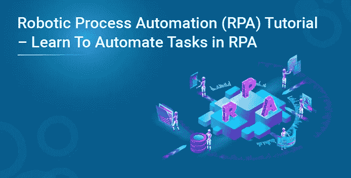
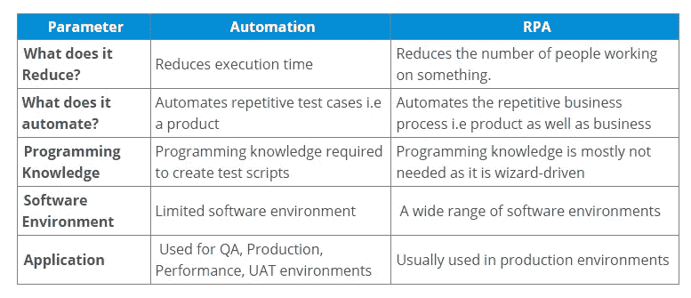
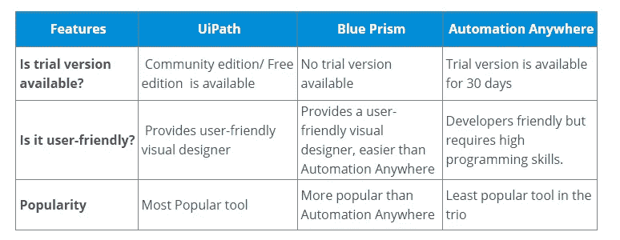
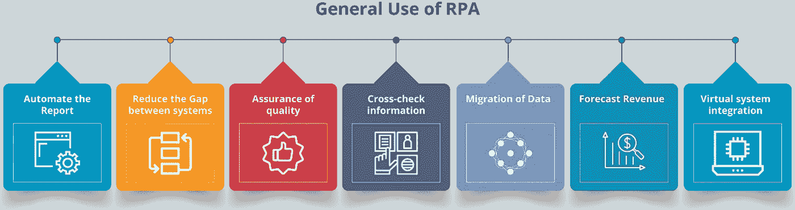
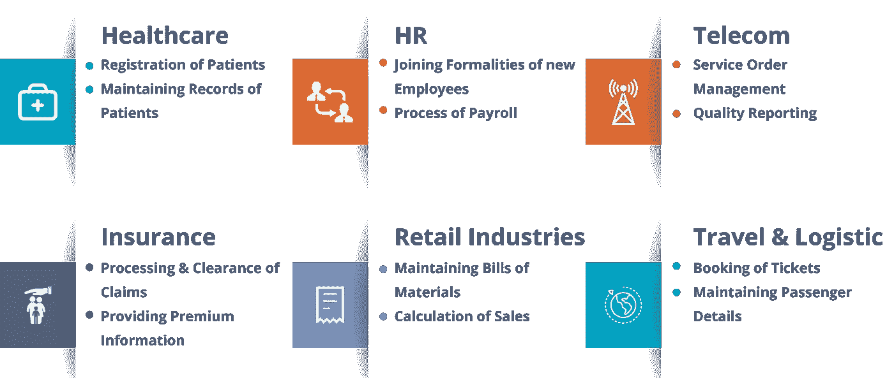
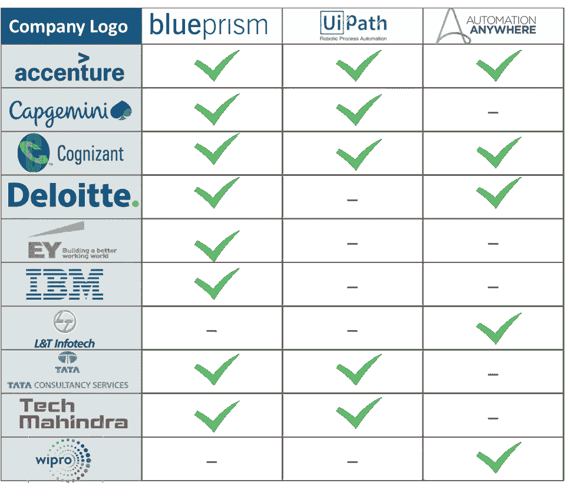

# 机器人流程自动化(RPA)教程—学习自动化 RPA 中的任务

> 原文：<https://medium.com/edureka/robotic-process-automation-b61c8d5cafd7?source=collection_archive---------8----------------------->

# RPA 教程

这个 RPA 教程博客将探索一种技术，该技术允许人类配置计算机软件或机器人来解释现有的应用程序、操纵数据并与各种其他系统通信。

以下是本 RPA 教程中涵盖的主题:

*   什么是机器人过程自动化？
*   自动化虚拟服务器 RPA
*   RPA 的生命周期
*   RPA 工具
*   RPA 的优势
*   RPA 的神话
*   RPA 的使用
*   使用 RPA 的行业
*   使用 RPA 的公司

# 什么是机器人过程自动化？

考虑一个实例，你想在每天特定的时间在不同的社会团体上发表你的文章。你是希望自己手动完成，还是指定一名员工专门负责每天发布文章？

这将花费你很多钱，也会让员工感到厌烦。不是吗？

相反，你可以让机器人替你做！

你可以配置计算机软件或机器人来解释人类的行为并模仿它们。

所以，在这里你可以配置一个机器人每天在提到的时间发布文章。这不仅会减少你的花费，还会减少你的疲劳。

因此，在没有任何人类干预的情况下，模仿人类的行动来执行一系列步骤，从而导致有意义的活动，这被称为**机器人流程自动化**。

现在，你可能会有一个问题，自动化与机器人流程自动化到底有什么不同？

# 自动化虚拟服务器 RPA

自动化甚至在 RPA 出现之前就已经存在了。尽管这两者之间存在多重重叠，但与 RPA 不同，自动化是一种新技术的发明，可以在需要人工干预的情况下解决现实生活中的问题。

请参考下表，了解自动化和 RPA 之间的区别。

现在，您已经了解了自动化和 RPA 之间的基本区别，让我们来看看 RPA 生命周期的不同阶段。

# RPA 的生命周期

RPA 的典型生命周期有 4 个阶段。分析、Bot 开发、测试以及支持和维护。

*   **分析** —业务团队& RPA 架构师一起分析 RPA 开发的业务流程。
*   **Bot 开发**——开发团队开始为不同开发环境中的需求开发自动化工作流。
*   **测试** —运行 SDLC 等测试周期，分析质量并纠正缺陷。
*   **支持&维护**——在开发&测试阶段之后，机器人进入维护阶段，在这个阶段中，它提供持续的支持，并帮助立即解决缺陷。

了解方法论之后，您还应该知道如何实施 RPA。这个问题的答案是使用市场上的各种 RPA 工具。

# RPA 工具

市场上有许多可用的工具，每种工具都根据您的需要提供不同的功能。但是，当今市场上排名前三的工具是三巨头( **UiPath** 、**蓝棱镜**和 **Automation Anywhere** )。

请参考下表，了解这 3 种工具之间的比较。

# RPA 的优势

下面列出了 RPA 的一些好处。

*   多个流程可以同时自动化。
*   成本削减技术和加强资源优化。
*   不需要预先的编程知识。
*   支持并允许定期合规流程，并进行无错误审核。
*   易于建模、扩展和部署自动化流程。
*   使跟踪缺陷变得容易。
*   持续构建和发布管理。
*   不需要训练时间，因为它不需要人工干预

众所周知，在过去几年中，RPA 已成为最具颠覆性的技术之一。尽管围绕 RPA 有很多议论，但对 RPA 仍有许多误解。

因此，现在让我们来看看关于 RPA 的神话。

# 关于 RPA 的神话

下面列出了关于 RPA 的神话及其背后的真相。

**1。机器人将取代人类。**

众所周知，各种业务流程都可以通过 RPA 实现自动化。这可能会向所有人提出一个问题，机器人会复制人类吗？

让我告诉你们，这些技术目前还不是完全独立的。他们需要人类进行高级思维。同时，RPA 允许员工提高他们的效率和生产力。体力劳动者肯定会减少，但绝不会取代完整的体力劳动者。

**2。RPA 软件机器人 100%准确。**

众所周知，机器人没有常识。你让他们做什么，他们就会做什么。因此，如果机器人的框架存在缺陷，那么它将允许一个明显的错误爬进提供给机器人的指令中。除非有人阻止，否则它们会复制工作流中存在的错误。

为了避免这种失误，我们应该确保流程得到优化，并在自动化的初始阶段对机器人进行监控。

**3。RPA 在小型工业中不起作用。**

一个常见的误解是 RPA 仅用于大规模生产行业。但是，RPA 可以应用于任何行业类型中几乎任何重复的、基于规则的高容量业务活动。

# RPA 的使用

除了模仿人类动作，重复大量任务和同时执行多项任务。RPA 还可用于执行以下操作:

**图 1:**RPA 在各个领域的使用— RPA 教程

*   **自动生成报告** —通过自动执行提取数据的过程，生成准确及时的报告。
*   **缩小系统之间的差距** —通过阻止定制实施来缩小系统之间的差距。
*   **质量保证** —通过执行测试和自动化客户用例场景来交付高质量的产品。
*   **交叉验证信息** —跨系统的数据被交叉验证以确认信息。
*   **数据迁移** —与传统系统不同，RPA 允许通过系统自动迁移数据。
*   **预测收入** —更新财务报表以自动预测收入预测。
*   **虚拟系统集成** —自动化系统通过在用户界面级别连接不同的遗留系统，在它们之间传输数据。

# 使用 RPA 的行业

RPA 用于各种行业，以帮助人类实现工作自动化，同时加快这一规模化行业的工作速度。请参考下图，了解 RPA 的几个应用示例。

**图 2:** 各行业使用 RPA — RPA 教程

# 使用 RPA 的公司

不仅在各种行业，而且许多高速增长的公司(如下所列)都使用 RPA 来维持行业发展。

如果你想查看更多关于人工智能、DevOps、道德黑客等市场最热门技术的文章，那么你可以参考 [Edureka 的官方网站](https://www.edureka.co/blog/?utm_source=medium&utm_medium=content-link&utm_campaign=rpa-in-various-domains/#healthcare)

*原载于 2018 年 6 月 13 日*[*https://www.edureka.co*](https://www.edureka.co/blog/rpa-tutorial/)*。*