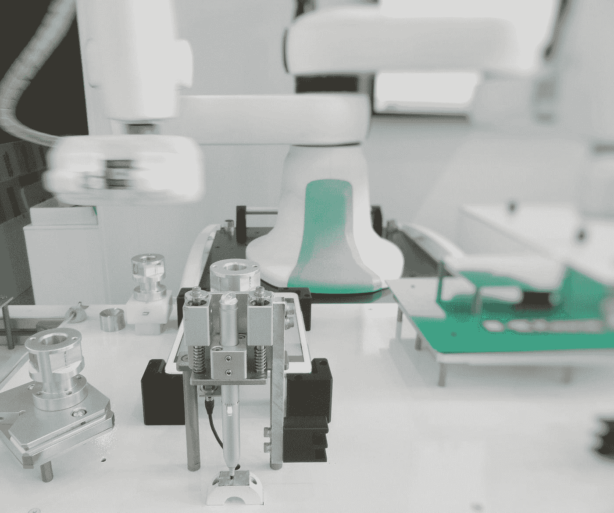

# 机器人过程自动化(RPA):改变人、过程和观念

> 原文：<https://medium.com/version-1/robotic-process-automation-rpa-changing-people-processes-and-perceptions-5c32896340d1?source=collection_archive---------3----------------------->

作为 Version 1 的 [Accelerate](https://www.version1.com/careers/accelerate/) 研究生项目的一部分，我加入了他们的创新实验室，这给了我探索和使用最新尖端技术的机会。毕业后我有软件工程和数据分析的背景，我喜欢尝试新技术作为我工作的一部分。我最近研究的一个技术例子是[机器人流程自动化(RPA)](https://www.version1.com/it-service/innovationlabs/rpa/) 。

在本文中，我想介绍一下 RPA 以及我的使用体验。

# **什么是 RPA？**

RPA 是在机器人的帮助下实现业务运营自动化的过程，以减少人工干预。为了简单起见，术语 RPA 可以分解为:

***机器人:*** 模仿人类动作的实体(机器人)。

***过程:*** 导致有意义活动的一系列步骤。比如泡茶的过程。

***自动化:*** 应用技术使机器人在没有人工干预的情况下执行特定任务。

RPA 是技术的应用，由业务逻辑和结构化输入控制，以自动化业务流程。使用 RPA，公司可以配置软件(即机器人)来捕获和解释应用程序，以便处理交易、操纵数据、触发响应以及与其他数字系统通信。RPA 场景从简单的自动回复电子邮件到部署数千个机器人，每个机器人都被编程为自动执行 [ERP 系统](https://www.cio.com/article/2439502/enterprise-resource-planning/enterprise-resource-planning-erp-definition-and-solutions.html)中的作业。实施 RPA 不需要复杂的集成，RPA 位于现有 IT 系统之上。

**RPA 的主要目标是通过虚拟劳动力来自动化由人类执行的重复性和枯燥的任务。RPA 不需要开发代码，也不需要直接访问应用程序的代码或数据库。**

# **为什么选择 RPA？**

**考虑一下任何业务中的典型场景:**

组织必须不断发展他们的产品、系统和实践等，以在当今不断变化的市场中成长并保持竞争力。典型的组织利用多个 IT 系统来运行其运营。如果任何业务流程发生变化，这些 IT 系统必须根据新的需求进行更改。

然而，由于预算、时间和实施的复杂性，对这些 IT 系统的更改并不频繁。因此，业务流程不能准确地映射 IT 系统中映射的技术流程。

要解决这个问题，组织必须雇佣一名员工来填补系统和流程之间的空白。例如，假设一个组织对其销售流程进行了更改，要求必须预付 50%的款项才能确认购买产品。这还没有编码到 IT 系统中，这意味着人类员工将不得不手动检查发票和付款细节来处理销售订单，只要他们可以看到 50%的预付款已经支付。

现在，这里的问题是什么？人类。

随着业务流程的任何变化，组织将需要雇用新员工或培训现有员工，以确保 IT 系统和业务流程得到准确映射。这种方法效率不高，因为这两种方法都很费时和金钱。

**爱国军前来救援**

借助机器人流程自动化，组织可以部署模仿人类员工的虚拟员工。**随着流程的改变，几行代码总是比重新培训数百名员工更快、更便宜。**

将 RPA 与人类员工进行比较时，很明显 RPA 应被视为未来的关键 it 支持，因为:

RPA 可以全天候工作，不会出现任何精神疲劳。

员工的平均工作效率为 60%，有一些错误，相比之下，RPA 的工作效率为 100%，没有任何错误。

与人类员工相比，RPA 在多任务处理方面要好得多。

现在，我们来看看 RPA 的一些优势和使用情形。

# **RPA 的优势**

**降低运营成本:** RPA 已被证明能够将运营成本优化高达 50%[。](https://www.cloverinfotech.com/services/robotic-process-automation-services.aspx)

**分析能力:**RPA 期间生成的流程日志包含大量[【大数据】](https://www.uipath.com/blog/rpa-and-big-data)，可对其进行进一步分析，以获得洞察力和燃料决策。

**遵守法规:**完全支持 RPA 的流程可以让组织跟踪每项操作并创建完整的文档。

**提高效率:**借助 RPA，企业可以拥有全天候运行的自动化流程。随着可用性的提高，这也确保了零错误和 100%的效率。

员工生产力:随着重复性任务的处理，组织可以利用他们的员工完成更复杂和智能的任务。

**提高客户满意度:**RPA 全天候工作，可确保客户在方便的时候收到即时响应和信息。

# RPA 的示例

RPA 可针对以下业务流程实施:

Photo by [Franck V.](https://unsplash.com/@franckinjapan?utm_source=medium&utm_medium=referral) on [Unsplash](https://unsplash.com?utm_source=medium&utm_medium=referral)

**客户服务:**自动化客户服务系统可以对查询进行分类，并向客户提供初步回应。这里可以应用 RPA 来根据业务流程自动化和简化客户呼叫，以实现对客户的高效响应。

**发票处理:** RPA 可用于数据输入，将不同来源的数据整合到一个财务数据库中，并做出基于规则的决策。

**HR Operations:** RPA 可以执行与薪资相关的活动，如新员工入职流程、薪资处理和雇用入围候选人。

**旅行和物流:** RPA 可以部署在这里，用于订票、订单跟踪和支付状态检索、维护库存更新、会计等。

**保险:**可以实施 RPA 来检索保费和保单信息、处理索赔、处理客户请求和服务等。

# **关于 RPA 的神话:**

关于 RPA 的一些误解包括:

1.**编码对于实施 RPA 是强制性的:**要使用 RPA，有必要了解该工具如何从前端工作，以及如何将其用于自动化。

2. **RPA 不需要人工监管:**需要人工来配置 RPA、为其分配自动化任务并对其进行管理。

3. **RPA 仅适用于大量使用软件的行业:** RPA 可用于某些重复性手动任务，与行业无关。

# **版本 1 创新实验室内的 RPA**

创新实验室高度专注于实施尖端技术，RPA 就是其中之一。我们与一家英国政府机构合作实施了一个基于 RPA 的解决方案来解决他们的业务问题。我们的 RPA 解决方案使我们的客户能够使用机器人来执行流程，减少了时间和手动工作。此 RPA 解决方案帮助减少了 60%的处理时间。

RPA 的实施显示了我们对使用最新技术解决客户业务问题的坚定信念。该项目提高了我们在 RPA 领域的知名度和可信度，并展示了版本 1 作为 RPA 服务提供商的能力。自从加入公司以来，我已经了解了很多关于 RPA 的知识，并且非常期待看到 RPA 在不久的将来会如何发展。

*创新实验室自 2018 年以来一直在运作，并以成功的协作价值证明(POV)的形式拥有许多成功的故事。我们热衷于在没有现有客户和新客户的情况下吸引更多客户，以展示最新技术如何为他们的业务增加价值。要了解更多关于版本 1 的创新，* [*请访问我们这里的*](http://www.version1.com/innovation) *。*