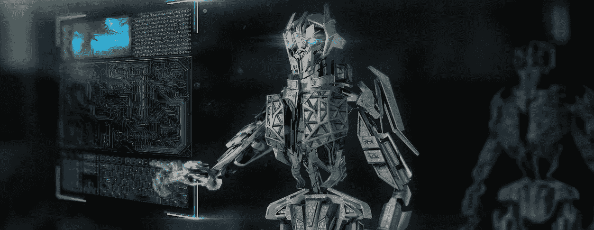
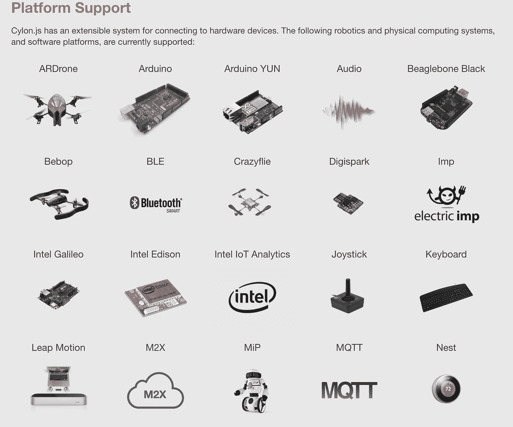
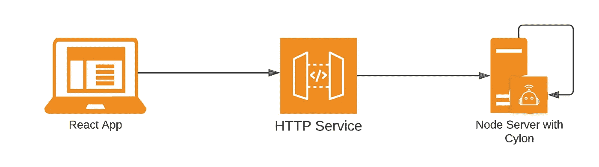
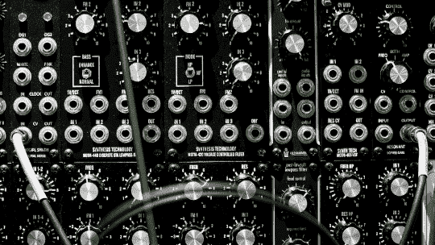
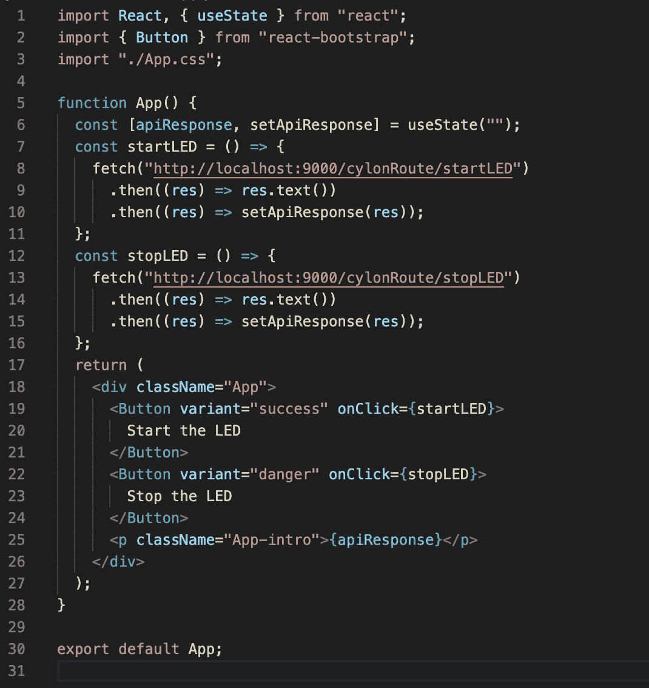
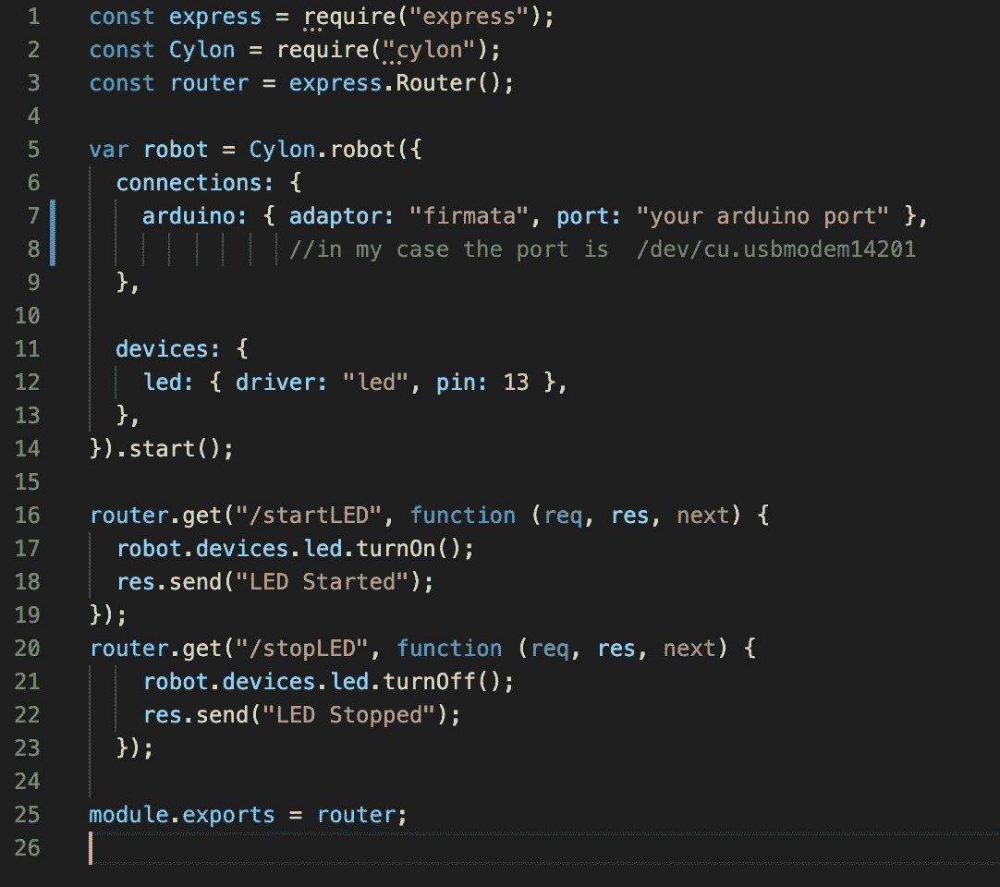

# JS 中的机器人——用 UI 命令赛昂机器人

> 原文：<https://medium.com/globant/robotics-in-js-command-cylon-robots-with-ui-fa6f1929711b?source=collection_archive---------1----------------------->

工程师指挥🛰

仍然想知道机器人和 JavaScript 有什么关系？

如果你是这个领域的新手，可以看看我以前的文章， [**实现机器人——JS 你的潜力是无穷的！**](/globant/implementing-robotics-js-your-potential-is-endless-cff64691b95f)

在本文中，我们将更深入地挖掘 Cylon.js，看看它如何将您的机器人想象力转化为现实。虽然它不能帮助编程卫星和火箭，但它确实有潜力创造良好的物联网和机器人应用程序。

查看 Cylon.js 支持的平台[这里](https://cylonjs.com/documentation/platforms/)

Credits — cylonjs.com

在上一篇文章中，我们使用 node.js CLI 进行编程。然而，如果您是一名普通的 web-UI 开发人员，想知道如何将 Cylon.js 与您最喜欢的 web 框架(如 React 或 Angular)连接起来，那么这篇文章就是为您准备的！

# 解决悬案！

我们将开发一个程序，点击网页上的一个按钮就能触发一个机器人。

这是 web 应用程序和运行 Cylon.js 的节点服务器之间交互的高级架构

有了这种体系结构，人们可以从任何地方通过浏览器简单地访问网页来连接到节点服务器，从而连接到机器人。

> 传统上，机器人与计算机相连，我们必须从物理上控制它们，现在使用 Cylon.js，我们可以在世界的任何角落操作和控制它们，这要归功于 HTTP ❤️

# **让我们编码**

我们将考虑一个非常著名的例子，在没有任何机器语言知识的情况下，使用我们喜爱的 JavaScript 来调谐 LED。

**先决条件**

1.带 USB 电缆的 Arduino 板

2.带跳线的试验板

3.led 灯

4.带有集成开发环境的计算机

5.DIY 态度😊

# **连接电线**

从库
[https://github.com/avoram/explore-react-cylon-integration](https://github.com/avoram/explore-react-cylon-integration)中克隆客户端和服务器代码

按照视频设置 Arduino，并使用试验板连接 LED。

**让我们让 JavaScript 代码工作起来**

**注意** —如果您想在本地运行设置，服务器和客户端都需要使用 **npm start** 命令启动

**反应过来**

导航到文件 explore-react-cylon-integration/cylon-client/src/app . js

**节点**

导航到文件 explore-react-cylon-integration/cylon-server/routes/cylon-route . js

**注意——第 7 行上的端口应该是 Arduino 连接的 com 端口(在视频中有解释)**

使用以下命令在客户端和服务器根文件夹中安装依赖项

**npm 安装**

然后开火

**npm 开始**

一旦网络客户端启动，你可以看到屏幕上有两个按钮来打开或关闭 LED。点击开始 LED 按钮，“瞧”看到你的工作在行动！

希望你喜欢阅读这篇文章，就像我喜欢为你编译它一样！
快乐编码...

# **关闭思路**

你知道如何写 JavaScript 代码，想探索无穷想象力的机会？
你刚刚经历的是一个完整的框架，让你的机器人思想飞翔！

> 照现在的样子看东西，可能会毁了你的创造力！