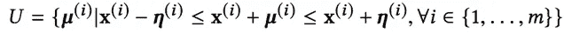

# 鲁棒因式分解机

> 原文：<https://medium.com/walmartglobaltech/robust-factorization-machines-1a9ef9f75abf?source=collection_archive---------0----------------------->

> 数据不全？嘈杂的设置？让我们来探索一下[鲁棒因式分解机器](https://dl.acm.org/citation.cfm?id=3186148)，这是监督学习领域中最新的防噪声产品。

***鲁棒因式分解机*** *，*最近在 WWW'18 上提出，是一个非线性分类器家族，考虑到任何潜在的数据不完全性/噪声。他们将稳健优化的原则融入到高度表达的因式分解机器中。结果，经过训练的模型表现出高噪声弹性。

> 这篇博客试图提供对*鲁棒因子分解机*的直观理解。我们将跳过大部分数学和证明之类的东西。

严谨的数学解释请参考原[论文](https://dl.acm.org/citation.cfm?id=3186148)。[这篇博客](/@surabhi.punjabi/robustness-for-user-response-prediction-1dd2253f62c5)很好地捕捉到了这篇论文背后的动机，以及在用户反应预测领域鲁棒性是多么令人满意。

让我们从理解两个关键词开始:
1。稳健性，
2。因式分解机。

# 稳健性

**最基本的机器学习(ML)流水线是什么样子的？** 取一些 ML 分类器，把数据放进去，出来一个模型！简单。

**数据呢？** 数据质量很重要！数据科学家花费大量时间致力于获得“干净的数据集”。但正如许多人会同意的那样，只能做这么多的数据工程和清理工作。

> 如果一个分类器可以解决这个问题，❤，会怎么样？

## 鲁棒分类器优于标准分类器？

分类器在训练数据的处理上不同，因此优化问题也不同。

**标准分类器:** ——假设数据精确已知。
-被框定为损失最小化问题 w.r.t. a 权向量*(****w****)*-如图 1 (a)所示。

**稳健分类器:** ——假设 ***不确定性*** 与每个数据点相关联。*确定性的概念，基于不确定性的集合**。参见等式。1.这允许数据点现在存在于超矩形流形中的任何地方。参见图 1。
-框定为 ***极小极大*** 问题， ***极小化*** 损失 w.r.t .一个权重向量*(***)*同时也 ***最大化*** w.r.t .一个不确定性*(* ***——如图 1 (b)所示。*****

******

***Eq. 1\. Uncertainty set definition. Uncertainty is defined over each datapoint. Here ***x*** represents a single data point and **m** is the number of data points.***

******

***Fig. 1\. (a) Standard classifier v/s (b) Robust classifier. Note how the introduction of uncertainty in (b) results in ‘hyper-rectangles’ over the data points, thus leading to change in the learnt classifier boundary.***

> ***简而言之，鲁棒优化寻求学习一个分类器，该分类器在**最坏情况不确定性实现**下保持**可行**和**接近最优**。***

# ***因式分解机器***

***让我们来看一个分类场景。
对于具有两个特征(*项目 _ 类别和设备)的购买预测问题，*如果我们知道*“服装”类别*经常在*“手机”*上购买，而不是在*“桌面”*上购买，我们如何捕捉这样的特征交互？一个模型如何捕捉诸如“设备=移动和类别=服装”这样的特征交互比只考虑单个特征更重要？单靠一个线性模型是不够的。***

**Steffen Rendle 提出的 ***因子分解机器(FMs)*** 是一个非线性分类器家族，设计用于捕获潜在空间中的特征交互。也就是说，对于每个特征，学习一个 *p* 维向量，产生一个 *d* x *p* 维权重矩阵，其中 *d* 是特征的原始数量。然后，两个特征之间的相似性由这些潜在向量的点积给出，例如在图 2 中，交互强度 b/w 特征 *j* 和 *k* 将被计算为以下两个向量的点积:*特征 j (v_j)的潜在向量*和特征 k 的*潜在向量(* v *_k)* 。**

****

**Fig. 2\. Computation of similarity b/w feature j and feature k. Parameter Matrix V is learnt s.t. similarity of features j and k is computed using a dot product b/w rows j and k of the matrix V.**

# **鲁棒因式分解机**

**既然我们已经开发了一些关于鲁棒性和因式分解机器的直觉，是时候揭示题为“[用于用户响应预测的鲁棒性因式分解机器](https://dl.acm.org/citation.cfm?id=3186148)”的论文的关键方面了。**

**这篇论文是利用*用户反应预测*问题中的噪声和不完整数据编写的。结帐我们的 [***博客***](/@surabhi.punjabi/robustness-for-user-response-prediction-1dd2253f62c5) 描述了领域中对健壮性的需求。**

**关键思想是使用稳健优化的原理来扩展因式分解机器。然后，通过导出损失 w.r.t .的上限和不确定性矩阵 ***U*** ，将所得的极大极小公式转化为纯极小化问题。**

> **本文提出了两种新的算法:
> -鲁棒因子分解机(RFM)。
> -稳健的场感知因子分解机器(RFFM)。**

**在真实世界大规模数据集上的大量实验给出了所提出算法的性能和可扩展性的见解。**

> **有希望的结果:
> -在嘈杂的环境中对数损耗显著降低(4.45%至 38.65%)。
> -在无噪音设置下，性能略有下降(-0.24%至-1.1%)。**

**这里有一个基于 Spark 的开源分布式算法实现[。在各种分类场景中评估 RFM 和 RFFMs 是一个值得探索的有趣领域。](https://www.dropbox.com/sh/ny6puvtopl98339/AACExLZ0waDL_ibWhfNItJfGa?dl=0)**

> **RFMs 和 RFFMs 是独立于域的公式，适用于任何有噪声/不完整数据的域。**

## **将健壮性放在首位**

**随着输入信号中噪声的增加，设计包含这种不确定性的分类器是很重要的。区域渔业管理系统和区域渔业管理系统是朝着这个方向迈出的一步。在树集成和深度神经网络中结合鲁棒性是一个有前途的研究领域。**