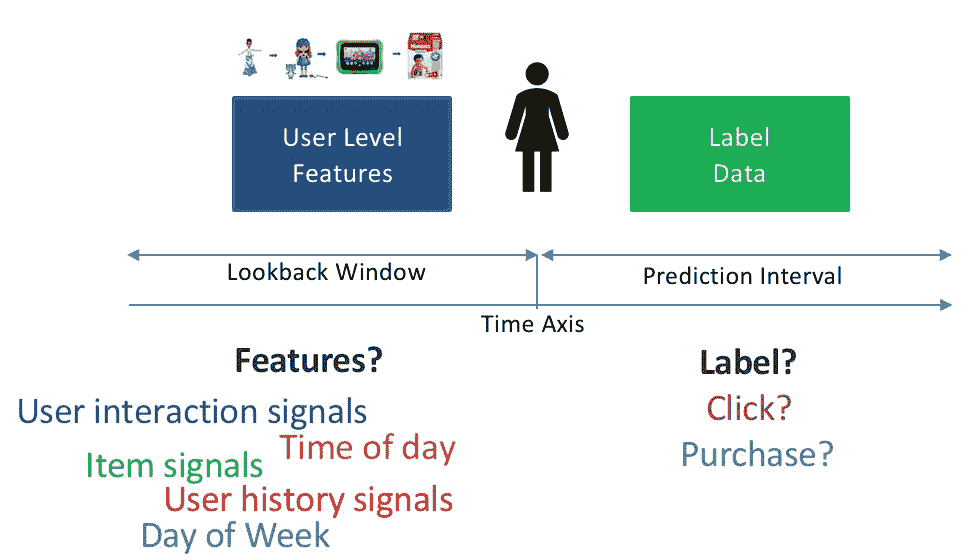
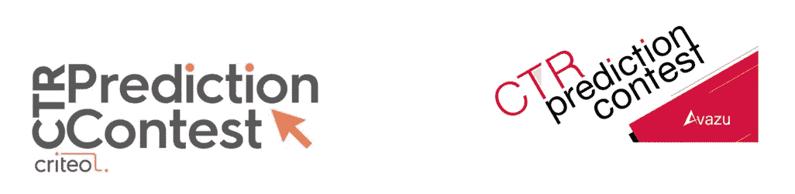
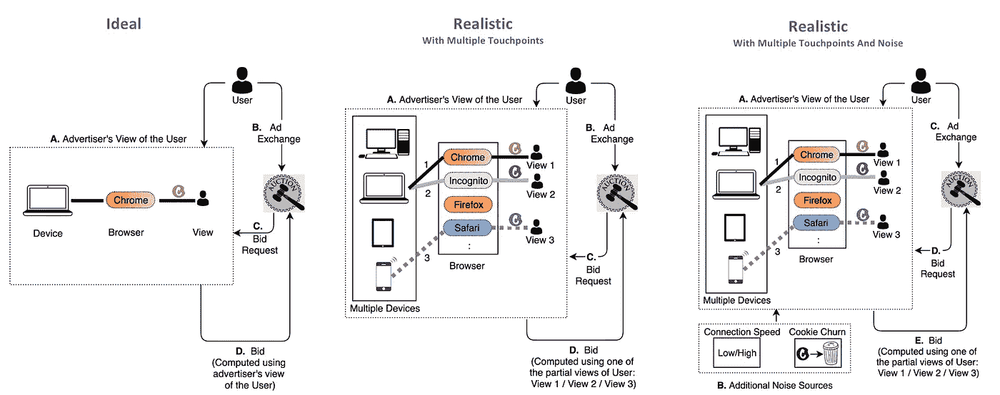
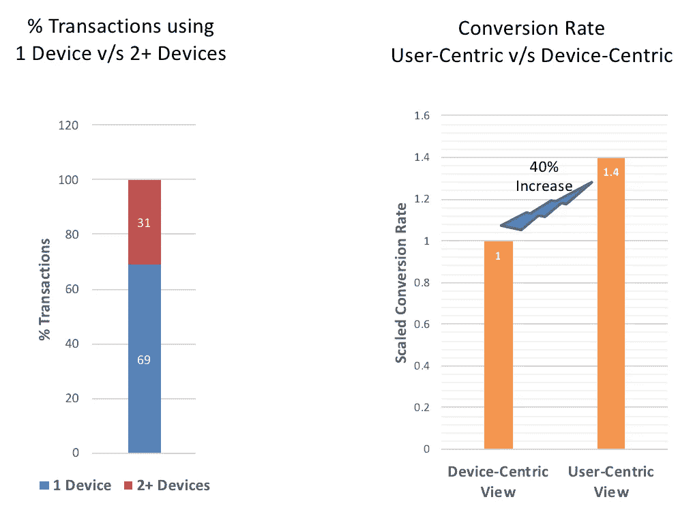

# 用户响应预测的鲁棒性

> 原文：<https://medium.com/walmartglobaltech/robustness-for-user-response-prediction-bae97d7f064f?source=collection_archive---------3----------------------->

Image Credits : Shutterstock

ser 响应预测是计算广告领域的一个中心问题。量化用户意图允许广告商将广告瞄准正确的用户。这导致了对营销资金的明智使用，也带来了愉快的用户体验。

现有的分类器，如逻辑回归和因式分解机，已经广泛用于响应预测问题，假设用户信号是绝对真实的**。**

**在本文中，我们描述了这种方法的缺陷，并主张需要分类器来模拟用户信号中的固有噪声和不确定性，即使在最坏的情况下也能优雅地执行。**

> **我们在 WWW'18 会议上接受的名为[用于用户响应预测的鲁棒因式分解机](https://dl.acm.org/citation.cfm?id=3186148) n 的工作是试图将数据不确定性视为分类设置中的**一等公民**。**

**要在更深层次上探索健壮的因式分解机器，请参考[这篇博客](/@priyankabhatt91/robust-factorization-machines-b44e2d906f15)。**

## **了解广告生态系统**

**用户通常会与广告商的应用程序或网站进行交互，执行一些操作，如查看商品、添加到购物车，并且可能会在没有购买的情况下离开。**

**为了重新吸引用户，广告商在开放网络上为用户竞价，以便向他们展示个性化广告。这个出价是作为用户倾向**的函数来计算的，用户倾向**点击或转换给定的广告印象。**

**用户响应预测，转换或点击预测的总括术语，通常被公式化为给定用户站点活动信号和相关上下文的二元分类任务。**

> ****转化预测(CVR 建模)**:如果显示广告印象，用户是否会购买？**
> 
> ****点击预测(CTR 建模)**:用户会点击广告印象吗？**

****

**Prediction Problem : Given user signals along with item attributes and context for a lookback period, can we predict whether a click or purchase will happen in the defined prediction interval?**

## **最先进的**

*****逻辑回归(LR)*** 已经成为反应预测的优选分类算法，因为它是可扩展的并且产生可解释的模型。使用 LR 的缺点是不能捕捉到特征交互的效果。例如，如果“用户设备=移动”和“类别=服装”是购买的强烈指示，LR 模型将不能在其特征权重中捕捉这种关联。**

**Steffen Rendle 提出的*因式分解机(FMs)，允许在潜在空间中捕捉特征交互。也就是说，对于每个特征，学习一个 *p* 维向量，并且两个特征之间的相似性由这些潜在向量的点积给出。***

***因式分解机及其变体已经在几个 Kaggle 竞赛中展示了优越的性能。 [Criteo](https://dl.acm.org/citation.cfm?id=3054185&dl=ACM&coll=DL) 和 [Adroll](http://tech.adroll.com/blog/data-science/2015/08/25/factorization-machines.html) 在生产数据方面也表现出色。***

******

***Field aware factorization machines, a variant of FM is the best performing algorithm for several CTR prediction challenges. (Image Credits : Kaggle)***

## ***为什么是鲁棒性？***

******Cookies*** 和 ***设备 id***是广告主可以通过其访问网站上之前的用户活动的主要标识符。***

***在理想的设置中，广告商对用户活动有完整的了解，以生成购买/点击概率。然而，用户通过多个接触点访问广告商的网站。并且用户的不同化身可能具有不同的浏览模式。***

****例如，同一个用户 A 可以通过移动设备访问广告客户应用程序，稍后在桌面上查看其他产品。然而，对于广告客户来说，对于同一用户有两个部分视图 A1 和 A2。在移动设备上，广告客户可能会看到一个突发的浏览模式，表明是一个随意的浏览器，而同一用户在桌面上可能看起来是一个狂热的购物者。****

******

***导致广告客户端的不良用户视图的附加噪声诱发因素是:***

> ***-高饼干流失率。***
> 
> ***-可变的网络连接速度。***
> 
> ***-操作系统的细微差别。***

***由于上述因素，广告客户具有不完整的用户视图。当出价时，广告商将使用来自用户的这些部分视图中的仅仅一个的信号来计算响应概率。如果广告商知道合并的用户视图，响应预测将会更加准确。***

## ***问题有多严重？***

******

***Criteo 的一项[研究强调，近 31%的在线交易涉及两个或更多设备，与部分**设备为中心的视图相比，以**用户为中心的视图**中的买家行程和转化率增加了约 40%。**](http://www.criteo.com/ resources/cross- device- commerce- report- h2- 2016/)***

***因此，对广告商可用的用户信号中的这种潜在不完整性进行建模是至关重要的。然而，用于响应预测的现有算法假设用户信号是精确已知的，并且对输入信号中的任何扰动都是敏感的。***

> ***由于完整的用户简档整合仍然是一个开放的问题，分类器将不得不**加强**并对数据不确定性建模。***

## ***好消息..***

***最近在 WWW 2018 上提出的鲁棒因子分解机(RFM)和鲁棒场感知因子分解机(RFFM) [，利用鲁棒优化原理对数据不确定性进行建模。总体思想是学习一个分类器，该分类器通过最小化最坏情况损失来展示噪声弹性。查看我们的](https://dl.acm.org/citation.cfm?id=3186148)[博客](/@priyankabhatt91/robust-factorization-machines-b44e2d906f15),获得对鲁棒因式分解机器的直观理解。***

## ***最后..***

***坚固性是一个理想的特性。不仅仅是在计算广告领域，多个接触点的存在使得噪声弹性势在必行，在任何对噪声敏感的领域也是如此。***

> ***RFM 和 RFFM 是通用预测器，可用于任何分类任务。***

## ***下一步是什么？***

***鲁棒分类器在对最坏情况损失建模时采取相当保守的观点。我们能使用一些利用数据分布的范例来了解潜在的不确定性吗？分布式鲁棒性和数据驱动的鲁棒性优化是两个有趣的方向，可以为此进行探索。***