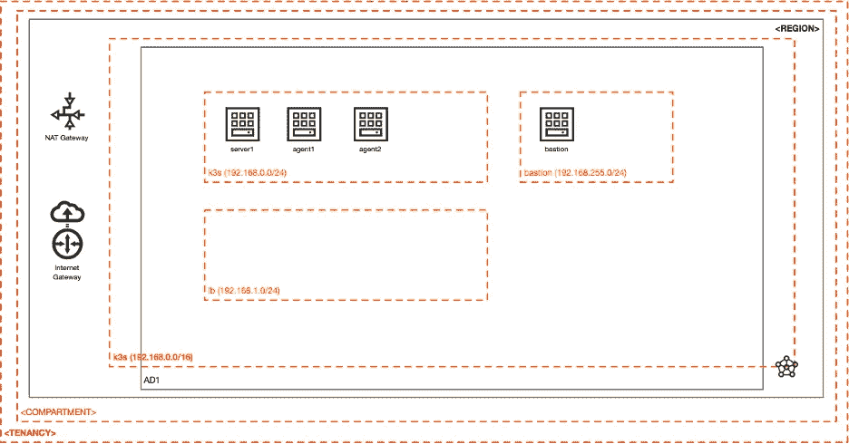
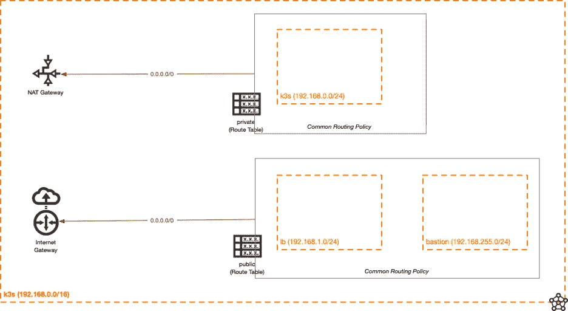
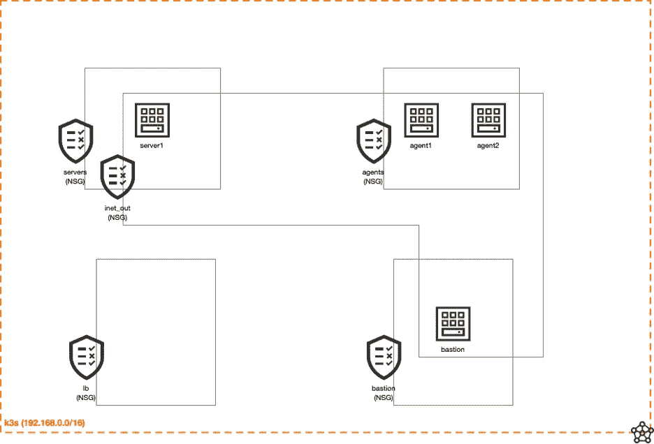

# 坚如磐石的 Solid K3s 第 1 部分

> 原文：<https://medium.com/oracledevs/rock-solid-k3s-on-oci-part-1-dbfeaa69d670?source=collection_archive---------0----------------------->


Photo by Leon Macapagal: [https://www.pexels.com/photo/aerial-view-of-city-buildings-beside-water-6622898/](https://www.pexels.com/photo/aerial-view-of-city-buildings-beside-water-6622898/)

Kubernetes (K8s)是一个非常棒的编排引擎。它可以用于大型企业环境，甚至嵌入式/边缘物联网用例(有时称为“雾计算”)。成熟的 K8s 对大多数用户来说是一个很好的选择，因为它以稳定和可扩展的格式提供了丰富而健壮的功能集。对于可用资源较少的环境，轻量级 K8s 实现是理想的。

如果您需要托管 K8s 服务，我强烈推荐您使用 [OCI 容器引擎](https://docs.oracle.com/en-us/iaas/Content/ContEng/home.htm)(通常缩写为 OKE)。它提供了一个完全托管的企业级 K8s 环境，全部由 OCI 提供支持并与之集成。像 [OCI 负载平衡器](https://docs.oracle.com/en-us/iaas/Content/ContEng/Tasks/contengcreatingloadbalancer.htm)、[块存储卷](https://docs.oracle.com/en-us/iaas/Content/ContEng/Tasks/contengcreatingpersistentvolumeclaim.htm)等东西可以在 OCI 容器引擎中为您管理。节点池(支持 x86_64 和 aarch64 架构)、K8s 版本升级等等都可以通过 [OCI 容器引擎](https://docs.oracle.com/en-us/iaas/Content/ContEng/home.htm)轻松完成。

如果你使用 OCI 永远免费帐户，你需要找到另一个选项，因为 OKE 在免费层帐户中不可用。也就是说，在一个自由层帐户中，你确实得到了相当多的处理“哼”!如果浪费了那就太可惜了。这可能是轻量级 K8s 部署的理想选择…

[K3s](https://k3s.io/) 是一个轻量级 Kubernetes (K8s)实现，专为嵌入式和轻量级环境而设计。它非常小，对资源的要求非常低。这大部分是通过合并流程和消除不必要的组件来实现的。它使用 K3s 服务器和 K3s 代理的概念，K3s 服务器运行控制平面，K3s 代理主要用于运行容器(工作节点)。除了 [K3s](https://k3s.io/) 之外还有其他的轻量级 K8s 实现，比如 [Minikube](https://shipit.dev/posts/minikube-vs-kind-vs-k3s.html) 和 [MicroK8s](https://microk8s.io/compare) 。

有几个步骤涉及到这个站起来。为了使这个更容易管理，我把它组织成一个多部分的系列。以下是我们将在本系列中看到的内容的快速概述:

*   简介(第 1 部分—本文)
*   OCI 基础设施(第 1 部分—本文)
*   K3s 安装(第二部分)
*   OCI 云控制器管理器安装(第 3 部分)
*   OCI 云控制器存储安装(第三部分)
*   入口控制器(第三部分)
*   示例应用程序部署(Jupyter 和 Node-RED)(第 4 部分)

在该系列的最后，我们将部署可能用于机器学习和物联网实验的应用程序。当然，您也可以将它用于其他应用程序！选择权在你。您将拥有一个出色的轻量级 K8s 平台，能够运行不同的应用程序。

# 入门指南

首先，你需要注册一个 OCI 账户。请前往[https://cloud.oracle.com/](https://cloud.oracle.com/)并点击“注册”按钮。确保您可以登录到 OCI 控制台，并准备好部署 K3s。

本文的剩余部分将集中在创建所需的 OCI 基础设施，并为我们安装 K3s 做好准备。我们走吧！

# OCI 基础设施

我建议您为所有 OCI 资源选择一个单独的隔间。由于一张图胜过千言万语，以下是所需 OCI 资源的结构视图:



Structural view of OCI resources

首先创建一个 VCN，具有以下属性:

*   名称:k3s
*   IPv4 CIDR: 192.168.0.0/16

这是资源的逻辑图，显示了我们将要配置的路由策略:



Logical diagram of OCI infrastructure

在 VCN 创建一个 NAT 网关和一个 Internet 网关，以及两张路由表:

名称:私人

*   路由规则:0.0.0.0/0 > NAT 网关

名称:公共

*   路由规则:0.0.0.0/0 >互联网网关

继续在新创建的 VCN 中创建三个子网:

**子网 1**

*   名称:k3s
*   IPv4 CIDR 地址块:192.168.0.0/24
*   子网访问:专用子网
*   路由表:私有
*   DNS 标签:k3s

**子网 2**

*   名称:堡垒
*   IPv4 CIDR 地址块:192.168.255.0/24
*   子网访问:公共子网
*   路由表:公共
*   DNS 标签:堡垒

**子网 3**

*   名称:lb
*   IPv4 CIDR 地址块:192.168.1.0/24
*   子网访问:公共子网
*   路由表:公共
*   DNS 标签:lb

让我们创建将要使用的网络安全策略。为此，我们将设置几个[网络安全组](https://docs.oracle.com/en-us/iaas/Content/Network/Concepts/networksecuritygroups.htm)(NSG)，如下图所示:



OCI Network Security Groups

在同一个 VCN 中创建以下 NSG 和 NSG 规则。请注意，您需要先浏览并创建空的 NSG，然后返回并向它们添加规则。这是因为许多规则与 NSG(而不是 CIDR 数据块)之间有往来，这意味着 NSG 需要存在，相关规则才能引用它们。

**名称:服务器**

规则 1:

*   方向:出口
*   IP 协议:所有协议
*   目的地类型:网络安全组(NSG)
*   目的地 NSG:服务器
*   描述:允许子网内流量(出站)。

规则二:

*   方向:入口
*   IP 协议:所有协议
*   来源类型:网络安全小组(NSG)
*   来源 NSG:服务器
*   描述:允许子网内流量(入站)。

规则三:

*   方向:入口
*   IP 协议:所有协议
*   来源类型:网络安全小组(NSG)
*   资料来源:NSG 特工
*   描述:允许来自代理的流量(入站)。

规则 4:

*   方向:出口
*   IP 协议:所有协议
*   目的地类型:网络安全组(NSG)
*   目的地 NSG:代理商
*   描述:允许代理的流量(出站)。

规则五:

*   方向:入口
*   IP 协议:TCP
*   来源类型:CIDR
*   资料来源:192.168.255.0/24
*   目标端口范围:22
*   描述:允许来自 bastion 子网的 SSH (tcp/22)

**名称:代理商**

规则 1:

*   方向:出口
*   IP 协议:所有协议
*   目的地类型:网络安全组(NSG)
*   目的地 NSG:代理商
*   描述:允许子网内流量(出站)。

规则二:

*   方向:入口
*   IP 协议:所有协议
*   来源类型:网络安全小组(NSG)
*   来源 NSG:服务器
*   描述:允许来自服务器的流量(入站)。

规则三:

*   方向:出口
*   IP 协议:所有协议
*   目的地类型:网络安全组(NSG)
*   目的地 NSG:服务器
*   描述:允许到服务器的流量(出站)。

规则 4:

*   方向:入口
*   IP 协议:所有协议
*   来源类型:网络安全小组(NSG)
*   资料来源:NSG 特工
*   描述:允许子网内流量(入站)。

规则五:

*   方向:入口
*   IP 协议:所有协议
*   来源类型:网络安全小组(NSG)
*   资料来源:NSG:堡垒

规则 6:

*   方向:入口
*   IP 协议:TCP
*   来源类型:CIDR
*   资料来源:192.168.1.0/24
*   描述:允许 LB 子网的所有 TCP 端口

规则 7:

*   方向:入口
*   IP 协议:TCP
*   来源类型:CIDR
*   资料来源:192.168.255.0/24
*   目标端口范围:22
*   描述:允许来自 bastion 子网的 SSH (tcp/22)

**名称:inet_out**

规则 1:

*   方向:出口
*   IP 协议:TCP
*   目的地类型:CIDR
*   目的地:0.0.0.0/0
*   目标端口范围:443
*   描述:允许 HTTPS (tcp/443)访问 web

规则二:

*   方向:出口
*   IP 协议:TCP
*   目的地类型:CIDR
*   目的地:0.0.0.0/0
*   目标端口范围:80
*   描述:允许 HTTP (tcp/80)访问 web

规则三:

*   方向:出口
*   IP 协议:UDP
*   目的地类型:CIDR
*   目的地:0.0.0.0/0
*   目标端口范围:53
*   描述:允许 DNS (udp/53)访问 web

**名称:堡垒**

规则 1:

*   方向:出口
*   IP 协议:所有协议
*   目的地类型:网络安全组(NSG)
*   目标:服务器
*   描述:允许对服务器的出站访问

规则二:

*   方向:出口
*   IP 协议:所有协议
*   目的地类型:网络安全组(NSG)
*   目的地:代理商
*   描述:允许代理出站访问

规则三:

*   方向:出口
*   IP 协议:所有协议
*   目的地类型:网络安全组(NSG)
*   目的地:lb
*   描述:允许对 LB 的出站访问

规则 4:

*   方向:入口
*   IP 协议:TCP
*   来源类型:CIDR
*   来源:
*   目标端口范围:22
*   描述:允许来自允许的 IP 的 SSH (tcp/22)

**名称:lb**

规则 1:

*   方向:入口
*   IP 协议:所有协议
*   来源类型:网络安全小组(NSG)
*   资料来源:bastions
*   描述:允许来自堡垒的所有流量

规则二:

*   方向:出口
*   IP 协议:所有协议
*   目的地类型:网络安全组(NSG)
*   目的地:代理商
*   描述:允许从 LB 到 K3s 代理的所有流量

规则三:

*   方向:入口
*   IP 协议:所有协议
*   来源类型:CIDR
*   来源:
*   描述:允许来自允许访问 CIDR 的所有流量

# 计算实例

我们现在可以创建 OCI 计算实例了，我们将用它来运行 K3s！我们已经设置了很多资源，现在是高潮，为安装 K3s 做准备。

我假设您没有在 OCI 永久免费租赁中使用任何计算资源，允许我们将它们用于 K3s 解决方案。

继续创建以下计算实例。对于所有实例，我都使用 Oracle Linux 8 和相同的 SSH 密钥。注意，OCI 可以为您生成 SSH 密钥，或者您可以使用自己的 SSH 密钥。不管怎样，记住它们，因为你以后会用到它们。

**名称:堡垒**

*   摆放位置:
*   外形:VM。Standard.E2.1.Micro(假设您使用的是 OCI 免费帐户，否则选择合适的形状)
*   VCN: k3s
*   子网:堡垒
*   公共 IP 地址:*分配一个公共 IP 地址*
*   (在*联网*框中点击*显示高级选项*)
*   选中*使用网络安全组控制流量*复选框，添加以下 NSG:inet _ out、bastions

**名称:服务器 1**

*   位置:
*   外形:VM。Standard.E2.1.Micro(假设您使用的是 OCI 免费帐户，否则选择合适的形状)
*   VCN: k3s
*   子网:k3s
*   公共 IP 地址:*不分配公共 IP 地址*
*   (在*联网*框中点击*显示高级选项*)
*   选中*使用网络安全组控制流量*复选框，添加以下 NSG:inet _ out，servers

**名称:代理 1**

*   摆放位置:
*   外形:VM。标准. A1.Flex
*   VCN: k3s
*   子网:k3s
*   公共 IP 地址:*不分配公共 IP 地址*
*   (点击*联网*框中的*显示高级选项*
*   选中*使用网络安全组控制流量*复选框，添加以下 NSG:inet _ out、代理

**名称:代理 2**

*   摆放位置:
*   外形:VM。标准. A1.Flex
*   VCN: k3s
*   子网:k3s
*   公共 IP 地址:*不分配公共 IP 地址*
*   (在*联网*框中点击*显示高级选项*)
*   选中*使用网络安全组控制流量*复选框，添加以下 NSG:inet _ out、代理

# IAM 策略

我们将使用[实例主体](https://docs.oracle.com/en-us/iaas/Content/Identity/dynamicgroups/managingdynamicgroups.htm)对 OCI 进行认证。这意味着一个或多个 OCI 实例将被赋予一个身份，允许它调用 OCI API 并被视为该身份。

创建一个动态组，名称为 *k3s_master* ，描述为 *K3s master dyn group* ，有一个匹配规则:

```
All { [instance.compartment.id](http://instance.compartment.id/) = ‘<COMPARTMENT_OCID>’, [instance.id](http://instance.id/) = ‘<SERVER1_OCID>’ }
```

接下来，在您正在使用的区间中创建一个 IAM 策略，它引用了 *k3s_master* 动态组(名称: *k3s* ，描述: *K3s 实例主体语句*)。将以下语句添加到 *k3s* IAM 策略中:

```
allow dynamic-group k3s_master to use instance-family in compartment id <COMPARTMENT_OCID>,allow dynamic-group k3s_master to manage virtual-network-family in compartment id <COMPARTMENT_OCID>,allow dynamic-group k3s_master to manage load-balancers in compartment id <COMPARTMENT_OCID>,allow dynamic-group k3s_master to manage volume-family in compartment id <COMPARTMENT_OCID>
```

# 访问实例

创建了所有 OCI 计算实例后，您将希望通过 SSH 连接到堡垒，理想情况下使用*-一个* SSH 命令行参数启用代理转发(假设您使用的是 MacOS 或 Linux)。使用 [Putty](https://the.earth.li/~sgtatham/putty/0.77/htmldoc/Chapter9.html#pageant-forward) 、 [SecureCRT](https://www.vandyke.com/support/tips/agent_forwarding.html) 或许多其他终端模拟器，可以实现类似的代理转发配置。

这里有一个例子，说明如何到达不同的实例:

```
Your computer
      |
      |
  (SSH session with Agent Forwarding enabled)
      |
      V
bastion (OCI instance)
    |
    |
 (SSH session)
    |
    V
server1, agent1 or agent2
```

以下是命令示例:

```
ssh -A -i <your SSH priv key> opc@<bastion_pub_ip>
```

在此会话中:

```
ssh <priv_ip>
```

其中<priv_ip>是服务器 1、代理 1 或代理 2 的私有 IP(或 FQDN——见下一段)。当我们安装 K3s 和其他组件时，这些命令(和流)将在本系列的后续部分中大量使用。</priv_ip>

作为一种捷径，理想的做法是使用 OCI 实例的完全限定域名(FQDN )(而不是实例的私有 IP ),这意味着您不必知道(或查找)不同 OCI 实例的私有 IP。例如:

```
ssh server1.k3s.k3s.oraclevcn.com
ssh agent1.k3s.k3s.oraclevcn.com
ssh agent2.k3s.k3s.oraclevcn.com
```

上述命令是从堡垒到不同内部 OCI 计算实例的快速友好的 SSH'ng 方式。

# 包装它

只需点击几下键盘，我们就可以在我们的 OCI 永远免费租赁中设置运行 K3s 所需的 OCI 资源！在本系列的下一部分，我们将设置 K3s。下一篇文章再见。

如果你对甲骨文开发人员在他们的自然栖息地发生的事情感到好奇，来[加入我们的公共休闲频道](https://bit.ly/odevrel_slack)！我们不介意成为你的鱼缸🐠