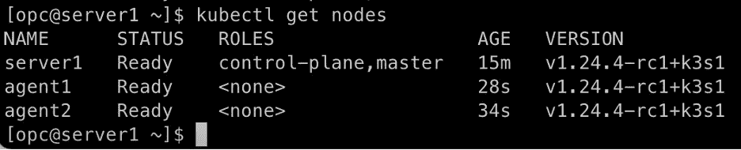

# 坚如磐石的 solid K3s 第二部分

> 原文：<https://medium.com/oracledevs/rock-solid-k3s-on-oci-part-2-4f7b95faca88?source=collection_archive---------0----------------------->


Photo by Leon Macapagal: [https://www.pexels.com/photo/aerial-view-of-city-buildings-beside-water-6622898/](https://www.pexels.com/photo/aerial-view-of-city-buildings-beside-water-6622898/)

这是在 OCI 永远免费租赁中运行 K3s 系列的第二部分。您应该已经完成了第一部分中的 OCI 基础设施设置。如果你还没有这样做，回头看看[第一部分](/@timclegg/rock-solid-k3s-on-oci-part-1-dbfeaa69d670)的介绍和所需的 OCI 资源列表。

这一部分在我们在[第一部分](/@timclegg/rock-solid-k3s-on-oci-part-1-dbfeaa69d670)中创建的 OCI 计算实例上设置 K3s。让我们忙着安装 K3s 吧…

# 安装 K3s 服务器—禁用防火墙

**注意:**对于长期安装来说，这不是最佳实践或推荐的方法(当然不适合生产环境！).这是基于 [Rancher K3s 文档](https://rancher.com/docs/k3s/latest/en/advanced/#additional-preparation-for-red-hat-centos-enterprise-linux)中给出的建议。

在服务器上运行以下命令，禁用基于主机的防火墙( *firewalld* )的运行:

```
sudo systemctl stop firewalld
sudo systemctl disable firewalld
```

# 安装 K3s 服务器—创建 K3s 配置目录和文件

有几个 YAML 文件将用于配置 K3s。继续创建 */etc/rancher/k3s* 目录，这些文件将放置在该目录中:

```
sudo mkdir -p /etc/rancher/k3s
```

下面将创建一个 kubelet 配置文件，这是必需的:

```
sudo su -c 'OCID=$(curl -s -H "Authorization: Bearer Oracle" -L [http://169.254.169.254/opc/v2/instance/](http://169.254.169.254/opc/v2/instance/) | jq .id | tr -d "\"")
printf "apiVersion: [kubelet.config.k8s.io/v1beta1](http://kubelet.config.k8s.io/v1beta1)
kind: KubeletConfiguration
providerID: $(echo $OCID)" > /etc/rancher/k3s/$(hostname)-kubelet.yaml'
```

上面的命令查询 OCI 实例可用的 OCI 实例元数据，获取存储在配置文件中的实例 OCID。参见 [OCI 文档](https://docs.oracle.com/en-us/iaas/Content/Compute/Tasks/gettingmetadata.htm)获取更多关于 OCI 实例元数据的信息。

创建附加配置文件:

```
sudo su -c 'printf "write-kubeconfig-mode: \"0644\"
kubelet-arg=config: \"/etc/rancher/k3s/$(hostname)-kubelet.yaml\"
kubelet-arg=cloud-provider: \"external\"
kube-controller-manager-arg=cloud-provider: \"external\"
" > /etc/rancher/k3s/config.yaml'
```

# 安装 K3s 服务器— K3s 安装

运行以下命令来安装 K3s 服务器:

```
curl -sfL [https://get.k3s.io](https://get.k3s.io) | INSTALL_K3S_VERSION=$(curl -s "[https://api.github.com/repos/k3s-io/k3s/tags](https://api.github.com/repos/k3s-io/k3s/tags)" | jq .[0].name | tr -d "\"") sh -s - server --disable-cloud-controller --disable servicelb --disable traefik --kubelet-arg="cloud-provider=external" --kubelet-arg="provider-id=$(curl -s -H "Authorization: Bearer Oracle" -L [http://169.254.169.254/opc/v2/instance/](http://169.254.169.254/opc/v2/instance/) | jq .id | tr -d "\"")"
```

我们将获得最新的 K3s 版本，并从实例元数据中获得 OCID。正在修改一些默认设置，如默认云控制器、Traefik、service LB 等。这是因为我们将使用 OCI 云控制器(稍后安装)将 K3s 安装与 OCI 集成。

# 安装 K3s 服务器—污染 K3s 服务器节点

玷污节点对 [OCI 云控制器管理器](https://github.com/oracle/oci-cloud-controller-manager)很重要:

```
kubectl taint nodes server1 [node-role.kubernetes.io/master=true:NoSchedule](http://node-role.kubernetes.io/master=true:NoSchedule)
```

此时，您应该已经安装了 K3s 服务器。让我们继续安装 K3s 代理程序。

# 配置 K3s 代理

我们有两个 K3s 代理需要设置:agent1.k3s.k3s.oraclevcn.com 和 agent2.k3s.k3s.oraclevcn.com。虽然我只列出了一次指令，但是您需要在两个代理实例上执行相同的步骤！

# 配置 K3s 代理—禁用防火墙

**注意:**对于长期安装来说，这不是最佳实践或推荐的方法(当然不适合生产环境！).这是基于[牧场主 K3s 文档](https://rancher.com/docs/k3s/latest/en/advanced/#additional-preparation-for-red-hat-centos-enterprise-linux)中给出的建议。

运行以下命令禁用基于主机的防火墙( *firewalld* ):

```
sudo systemctl stop firewalld
sudo systemctl disable firewalld
```

# 配置 K3s 代理—创建 K3s 配置目录和文件

从 K3s 服务器获取令牌，代理需要该令牌来注册 K3s 服务器并与之通信。从 K3s 服务器的 SSH 会话中，运行:

```
sudo cat /var/lib/rancher/k3s/server/node-token
```

这将把 K3s 令牌输出到屏幕上。把它复制到你的剪贴板上，因为很快就会用到它。

K3s 代理也使用 YAML 文件来配置 K3s。我们现在就来建造它们。

创建 */etc/rancher/k3s* 目录:

```
sudo mkdir -p /etc/rancher/k3s
```

下面将创建一个 kubelet 配置文件，这是必需的:

```
sudo su -c 'OCID=$(curl -s -H "Authorization: Bearer Oracle" -L [http://169.254.169.254/opc/v2/instance/](http://169.254.169.254/opc/v2/instance/) | jq .id | tr -d "\"")
printf "apiVersion: kubelet.config.k8s.io/v1beta1
kind: KubeletConfiguration
providerID: $(echo $OCID)" > /etc/rancher/k3s/$(hostname)-kubelet.yaml'
```

上面的命令查询 OCI 实例可用的 OCI 实例元数据，获取存储在配置文件中的实例 OCID。参见 [OCI 文档](https://docs.oracle.com/en-us/iaas/Content/Compute/Tasks/gettingmetadata.htm)获取更多关于 OCI 实例元数据的信息。

创建附加配置文件:

```
sudo su -c 'printf "kubelet-arg=config: \"/etc/rancher/k3s/$(hostname)-kubelet.yaml\"
kubelet-arg=cloud-provider: \"external\"
kube-proxy-arg=healthz-bind-address: "0.0.0.0:10256"
node-label:
- \"[k3s.io/role=agent\](http://k3s.io/role=agent/)"
server: \"[https://server1.k3s.k3s.oraclevcn.com:6443\](https://server1.k3s.k3s.oraclevcn.com:6443/)"
selinux: true
" > /etc/rancher/k3s/config.yaml'
```

# 配置 K3s 代理程序—安装 K3s 代理程序

运行以下命令安装 K3s 代理:

```
curl -sfL [https://get.k3s.io](https://get.k3s.io) | K3S_URL=[https://server1.k3s.k3s.oraclevcn.com:6443](https://server1.k3s.k3s.oraclevcn.com:6443) K3S_TOKEN=<YOUR_K3S_TOKEN_HERE> INSTALL_K3S_VERSION=$(curl -s "[https://api.github.com/repos/k3s-io/k3s/tags](https://api.github.com/repos/k3s-io/k3s/tags)" | jq .[0].name | tr -d "\"") sh -
```

确保您给它的 K3s 令牌是从 K3s 服务器复制的！

# 验证代理节点

在 K3s 服务器上(SSH 进入 bastion，然后进入 K3s 服务器)，运行以下命令:

```
kubectl get nodes
```

您应该会看到如下所示的内容:



Sample output from kubectl get nodes

如果您没有看到两个 K3s 代理，请查看缺失实例上的代理安装步骤。

# 包装它

我们现在有 K3s 运行在我们的 OCI 永远免费帐户！恭喜你。但是我们还没有完成…接下来我们将设置 OCI 云控制器管理器，它将允许我们的 K3s 环境管理诸如 OCI 负载平衡器和块存储卷之类的东西！这非常值得我们花费时间和精力，所以这将是我们本系列的下一篇文章。

如果你对甲骨文开发人员在他们的自然栖息地发生的事情感到好奇，来[加入我们的公共休闲频道](https://bit.ly/odevrel_slack)！