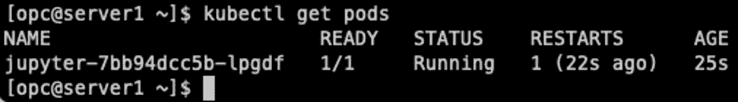

# 坚如磐石的 Solid K3s 第四部分

> 原文：<https://medium.com/oracledevs/rock-solid-k3s-on-oci-part-4-bc47b20e38a6?source=collection_archive---------1----------------------->


Photo by eberhard grossgasteiger: [https://www.pexels.com/photo/low-angle-shot-of-rock-formation-1366909/](https://www.pexels.com/photo/low-angle-shot-of-rock-formation-1366909/)

这是本系列的第四篇也是最后一篇文章(至少目前如此)。这是一个有趣的旅程，第一部分关注于建立所需的 OCI 资源。[第二部分](/oracledevs/rock-solid-k3s-on-oci-part-2-4f7b95faca88)发现我们正在进行 K3s 安装，然后在[第三部分](/oracledevs/rock-solid-k3s-on-oci-part-3-129efce08b81)我们安装了 OCI 云控制器管理器和 nginx 入口控制器。

让我们使用这个新创建的环境，在 K3s 环境中部署一些应用程序。我们将部署两个应用程序:

*   Jupyter
*   [红色节点](https://nodered.org/)

# 设置 TLS

首先创建一个自签名证书，我们将在访问应用程序时使用它。接下来的几个命令直接取自 [OCI 文档](https://docs.oracle.com/en-us/iaas/Content/ContEng/Tasks/contengsettingupingresscontroller.htm)(参见*创建 TLS 秘密*一节):

```
# Run in: K3s Server SSH session

$ openssl req -x509 -nodes -days 365 -newkey rsa:2048 -keyout tls.key -out tls.crt -subj "/CN=nginxsvc/O=nginxsvc"

$ kubectl create secret tls tls-secret --key tls.key --cert tls.crt
```

尽管这不是您在“真实”(生产)环境中想要做的事情，但这将允许我们至少加密来往于我们的应用程序的流量。

# 朱皮特

Jupyter 是一个数据科学平台，通常用于人工智能/人工智能工作。我已经写了一篇文章，描述了如何使用你的网络浏览器在 OCI 上运行 Jupyter。按照[文章](/oracledevs/launching-jupyterlab-jupyter-on-oci-using-your-web-browser-dddbb01f4a0e)中的步骤创建 Jupyter 容器，并将容器推送到 [OCI 容器注册处](https://docs.oracle.com/en-us/iaas/Content/Registry/Tasks/registryviewingimagedetails.htm) (OCIR)。确保获得 OCIR 容器的完整路径…您马上就会需要它！要获得完整路径，请单击存储库(它将展开以显示标签)。点击你的标签(如果你按照我给的指示，它将是 *v1.0.0-ol8* )。详细信息将显示在屏幕右侧)，其中*完整路径*是属性之一。

从可以访问 K3s API 的系统(我选择了 SSH 到 K3s 服务器)，复制并粘贴以下内容到一个文件中(我选择将其命名为 *jupyter.yml* ):

```
---
apiVersion: apps/v1
kind: Deployment
metadata:
  name: jupyter
  namespace: default
  labels:
    app: jupyter
spec:
  replicas: 1
  selector:
    matchLabels:
      app: jupyter
  template:
    metadata:
      labels:
        app: jupyter
        ver: v1.0.0
    spec:
      containers:
      - name: jupyter
        image: <region>.ocir.io/<namespace>/jupyter:v1.0.0-ol8
        imagePullPolicy: Always
        ports:
        - containerPort: 8888
          protocol: TCP
        command:
          - jupyter
          - lab
          - --allow-root
          - --notebook-dir
          - /jupyter
          - --no-browser
          - --autoreload
          - --ip=0.0.0.0
          - --NotebookApp.base_url=/jupyter
      imagePullSecrets:
      - name: ocirsecret
      nodeSelector:
        kubernetes.io/arch: arm64
---
apiVersion: v1
kind: Service
metadata:
  name: jupyter-svc
spec:
  selector:
    app: jupyter
  ports:
    - port: 8888
      targetPort: 8888
  type: ClusterIP
---
apiVersion: networking.k8s.io/v1
kind: Ingress
metadata:
  name: jupyter-ing
  annotations:
    kubernetes.io/ingress.class: "nginx"
    nginx.ingress.kubernetes.io/app-root: /jupyter
spec:
  tls:
  - secretName: tls-secret
  rules:
  - http:
      paths:
        - path: /jupyter
          pathType: Prefix
          backend:
            service:
              name: jupyter-svc
              port:
                number: 8888
```

**注意**:注意我们如何使用一个服务名 *jupyter-svc* 而不是 *jupyter* ，就像 deployment(以及许多其他应用程序引用)一样？有几个环境变量被注入到 Jupyter pod 中，其中一些可能被 Jupyter 用于设置配置(如 *JUPYTER_PORT* ，它已被设置)。通过使用 *jupyter-svc* ，变量 *JUPYTERLAB_PORT* 由 K8s 设置，jupyter 不看(默认)。

继续并应用它:

```
# Run in: K3s Server SSH session

$ kubectl apply -f jupyter.yml
```

如果您查看我在运行 Jupyter 上写的前一篇文章[中的示例清单，就会发现有一些不同之处。这和文章清单都声明了一个部署和一个服务，但是服务类型是不同的…我们使用了一种类型的 *ClusterIP* ，而不是一种类型的 *LoadBalancer* 。因为我们使用了一个入口，所以我们也为 Jupyter 定义了一个入口。入口使用 TLS(使用我们之前配置的自签名证书)并将 */jupyter* 路径与我们定义的服务相关联。](/oracledevs/launching-jupyterlab-jupyter-on-oci-using-your-web-browser-dddbb01f4a0e)

通过执行“kubectl get pods ”,确保 Jupyter pod 正在运行。您应该会看到如下所示的内容:



在确保 Jupyter pod 正在运行之后，我们还可以查看几个命令。查看以下命令(和输出):

```
# Run in: K3s Server SSH session

$ kubectl get deployments
NAME      READY   UP-TO-DATE   AVAILABLE   AGE
jupyter   1/1     1            1           77d

$ kubectl get ingress
NAME          CLASS    HOSTS   ADDRESS          PORTS     AGE
jupyter-ing   <none>   *       <pub_ip>         80, 443   74d
```

部署正在运行，可以通过入口(命令输出中显示的公共 IP 地址)进行访问。

入口将显示 OCI 负载平衡器(LB)的 IP 地址。还有另一种方法来查看 LB IP 地址:

```
# Run in: K3s Server SSH session

$ kubectl get services --no-headers -l app.kubernetes.io/component=controller -n ingress-nginx -o custom-columns=:status.loadBalancer.ingress[0].ip | grep -v '<none>'
<pub_ip>
```

打开一个网页浏览器到:https: <pub_ip>/jupyter</pub_ip>

您将被带到 Jupyter 登录屏幕。您的浏览器(如果它正在工作的话)会提醒您正在使用不可信的(自签名)证书。在确保您的浏览器继续运行后，您将看到熟悉的 Jupyter 登录屏幕。请输入您的密码。成功！让我们将 Node-RED 添加到组合中。

# 红色节点

现在是我们设置第二个应用程序的时候了: [Node-RED](https://nodered.org/) 。Node-RED 允许“低代码、事件驱动的编程”(几乎一字不差地抄袭他们的网站)。本质上，您可以配置当给定的触发器被激活时将运行的操作。这对于将不同的 API(系统)缝合在一起特别方便。这是一个试验物联网系统的绝佳平台。让我们开始设置它。

因为我们只为 K3s 代理节点(那些运行 pods 的节点)使用 A1 (arm)计算，所以我们不需要构建容器的 amd64(又名 x86_64)变体。我们只需要节点红色容器的 arm64 (aka aarch64)版本。为了加快速度，我建议您 SSH 到您的堡垒，然后 SSH 到其中一个代理并在那里构建容器:

```
$ ssh -A <bastion_pub_ip>
$ ssh agent1.k3s.k3s.oraclevcn.com
```

为我们的工作创建一个新目录(尽量保持整洁)并输入它:

```
# Run in: K3s Agent1 SSH session

$ mkdir node-red
$ cd node-red
```

将以下内容放入名为 *Dockerfile* 的新文件中:

```
FROM container-registry.oracle.com/os/oraclelinux:8-slim
ARG NODEREDPASSWORD

RUN microdnf install oraclelinux-developer-release-el8 dnf && dnf groupinstall "Development Tools" -y && dnf install -y nano python39-pip python39-numpy python39-devel wget && dnf clean all -y
RUN pip3 install wheel cython pandas scikit-learn bcrypt && pip3 install tensorflow
RUN wget https://nodejs.org/dist/v18.10.0/node-v18.10.0-linux-arm64.tar.xz

RUN mkdir -p /usr/local/lib/nodejs
RUN tar -xJvf node-v18.10.0-linux-arm64.tar.xz -C /usr/local/lib/nodejs
ENV PATH="/usr/local/lib/nodejs/node-v18.10.0-linux-arm64/bin:$PATH"
RUN npm install -g --unsafe-perm node-red
RUN mkdir -p ~/.node-red

COPY settings_template.js /.
RUN echo $NODEREDPASSWORD >> /provided_password.txt && \
  settings_file=$(< /settings_template.js) && \
  source /dev/stdin  <<<"$(echo 'cat <<EOF'; echo "$settings_file"; printf '\nEOF';)" > /root/.node-red/settings.js && \
  rm /provided_password.txt && \
  rm /settings_template.js

EXPOSE 1880/tcp
CMD node-red
```

在同一个目录下创建另一个名为 *settings_template.js* 的新文件，并将以下内容放入其中(如果没有找到 settings.js 文件，则从 Node-RED 生成的默认设置文件复制并稍作修改):

```
module.exports = {
      flowFile: 'flows.json',
      credentialSecret: "$(yes `cat /provided_password.txt` | node-red admin hash-pw | awk '{print $2}')",
      flowFilePretty: true,

      adminAuth: {
         type: "credentials",
         users: [{
             username: "admin",
             password: "$(yes `cat /provided_password.txt` | node-red admin hash-pw | awk '{print $2}')",
             permissions: "*"
         }]
      },
      uiPort: process.env.PORT || 1880,
      apiMaxLength: '5mb',
      httpNodeRoot: '/nodered/',
      httpAdminRoot: ‘/nodered/’,
      diagnostics: {
          enabled: true,
          ui: true,
      },
      runtimeState: {
          enabled: false,
          ui: false,
      },
      logging: {
          console: {
              level: "info",
              metrics: false,
              audit: false
          }
      },
      editorTheme: {
          projects: {
              enabled: true,
              workflow: {
                  mode: "manual"
              }
          },

          codeEditor: {
              lib: "monaco",
              options: {
              }
          }
      },
      functionExternalModules: true,
      debugMaxLength: 1000,
      mqttReconnectTime: 15000,
      serialReconnectTime: 15000,
  }
```

如果您没有在 agent1 上安装 podman，那么现在就安装吧( *sudo dnf install podman* )。继续在 agent1 上创建容器(确保使用正确的密码):

```
# Run in: K3s Agent1 SSH session

$ NODEREDPASSWORD=<your_password_here> podman build --pull --build-arg NODEREDPASSWORD -t nodered:ol8-arm64-v8 .
```

现在容器映像已经构建好了，是时候把它推送到 OCI 容器注册中心(OCIR)了:

```
# Run in: K3s Agent1 SSH session

$ podman login <region>.ocir.io
$ podman image tag nodered:ol8-arm64-v8 <region>.ocir.io/<namespace>/nodered:v1.0.0-ol8-arm64-v8
$ podman push <region>.ocir.io/<namespace>/nodered:v1.0.0-ol8-arm64-v8
```

OCIR 文档有不同地区的可用 URL。请确定您使用的是您所在地区的正确 URL。

另一个警告:确保使用正确的用户名格式( *<名称空间> / <用户名>* 或者如果您使用 IDCS、 *<名称空间>/oracleidentitycloudservice/<用户名>* )。密码将是与您的帐户相关联的身份验证令牌。查看 [OCI 文档](https://docs.oracle.com/en-us/iaas/Content/Registry/Tasks/registrypushingimagesusingthedockercli.htm)了解更多信息。

随着我们的容器成功构建并推送到 OCIR，是时候在我们的 K3s 集群上创建部署并运行 Node-RED 了！SSH 回到 K3s 服务器(或者任何可以运行 kubectl 并访问 K3s API 的机器)。从那里，创建一个名为 *node-red.yml* 的新文件，将以下内容放入其中(确保在您的环境中更新值的占位符):

```
---
apiVersion: apps/v1
kind: Deployment
metadata:
  name: nodered
  namespace: default
  labels:
    app: nodered
spec:
  replicas: 1
  selector:
    matchLabels:
      app: nodered
  template:
    metadata:
      labels:
        app: nodered
        ver: v1.0.0
    spec:
      containers:
      - name: nodered
        image: <region>.ocir.io/<namespace>/nodered:v1.0.0-ol8-arm64-v8
        imagePullPolicy: Always
        ports:
        - containerPort: 1880
          protocol: TCP
      imagePullSecrets:
      - name: ocirsecret
      nodeSelector:
        kubernetes.io/arch: arm64
---
apiVersion: v1
kind: Service
metadata:
  name: nodered-svc
spec:
  selector:
    app: nodered
  ports:
    - port: 1880
      targetPort: 1880
  type: ClusterIP
---
apiVersion: networking.k8s.io/v1
kind: Ingress
metadata:
  name: nodered-ing
  annotations:
    kubernetes.io/ingress.class: "nginx"
spec:
  tls:
  - secretName: tls-secret
  rules:
  - http:
      paths:
        - path: /nodered
          pathType: Prefix
          backend:
            service:
              name: nodered-svc
              port:
                number: 1880
```

在确保使用正确的区域、名称空间和任何其他可能与您的环境不同的内容后，应用节点红色清单:

```
# Run in: K3s Server SSH session

$ kubectl apply -f node-red.yml
deployment.apps/nodered created
service/nodered-svc created
ingress.networking.k8s.io/nodered-ing created
```

让我们检查以确保部署和入口准备就绪:

```
# Run in: K3s Server SSH session

$ kubectl get deployment nodered
NAME      READY   UP-TO-DATE   AVAILABLE   AGE
nodered   1/1     1            1           119s

$ kubectl get ingress nodered-ing
NAME          CLASS    HOSTS   ADDRESS          PORTS     AGE
nodered-ing   <none>   *       <pub_ip>         80, 443   2m25s
```

让我们在网页浏览器中进入 https:// <pub_ip>/nodered 查看一下吧！在让您的浏览器平静下来之后(由于使用了自签名证书),您应该会看到登录屏幕，然后是主节点——登录后的红色屏幕。</pub_ip>

# 结论

对我来说，这是一次有趣的旅程。我希望它对你有帮助和有趣！虽然这不是我在生产环境中考虑的解决方案，但我认为这是开发和测试的绝佳场所。

因为 K3s 提供了丰富的 K8s API 和体验，所以从这样的轻量级 K3s 实现迁移到成熟的、功能丰富的企业级 K8s 实现，如用于 Kubernetes (OKE) 的 [OCI 容器引擎，是一件轻而易举的事情。这种“前进路径”是我认为 K3s 优于其他轻量级容器编排引擎(尤其是那些不基于 K8s 的引擎)的主要优势之一。](https://docs.oracle.com/en-us/iaas/Content/ContEng/home.htm)

在我看来，OCI 负载平衡器和(可选)OCI 块卷的紧密集成和管理是一大优势。这是由 OCI 云控制器管理器(以及可选的 CSI，如果您选择安装它)实现的。

至此，我们已经在构建 K3s 环境上投入了相当多的时间。另一方面，部署新的 [OKE](https://docs.oracle.com/en-us/iaas/Content/ContEng/home.htm) 集群非常容易(也非常快),这使它成为我首选的 K8s。尽管如此，对于一个非常轻量级的实现来说，这个解决方案可以满足目的。

直到下一次，愿你所有的清单都能成功应用！

加入我们在 Slack 上的[甲骨文开发者频道，讨论其他话题！](https://bit.ly/odevrel_slack)

免费在 Oracle 云上构建、测试和部署您的应用！访问 [OCI 云免费层](https://www.oracle.com/cloud/free/)！