# 使用 Oracle SQL Developer 摇摆用户定义的报表

> 原文：<https://medium.com/oracledevs/rocking-user-defined-reporting-with-oracle-sql-developer-b941e67d716f?source=collection_archive---------1----------------------->


SQL Developer 最好的特性之一是报告。内置报告只是查询字典和动态视图。此外，还有一个用户定义的报告功能。因此，现在任何人都可以使用定制的查询创建报告。

用户定义的报告使最好的 SQL Developer 特性变得更好。然而，关于如何设置用户定义的报告和正确构建查询的官方文档却很少。

因此，在本文中，我将展示一些更有趣的报告，以及所需的查询结构，因为这很重要。如果没有结构正确的查询，报告将会失败。

要创建用户定义的报告，只需选择“新建报告”:


在那里，您可以选择“仪表”或“图表”:

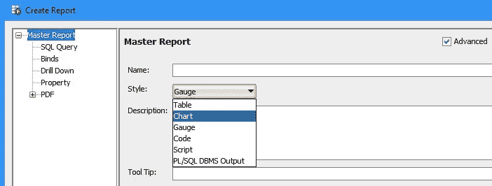

如果您选择“仪表”，那么您可以在“拨号”或“状态”之间进行选择:

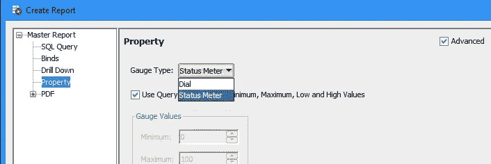

或者，如果您选择“图表”，那么您可以选择图表的类型:

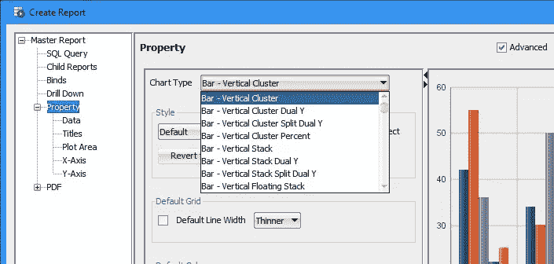

大多数图表要求定制的查询返回至少 3 列，分别代表:

*   组列
*   系列列
*   值列

不需要将列命名为 group、series 和 value，因为用户定义的报表将假设这 3 列按照结果集中的特定顺序出现。

首先，我们需要设置一个沙坑环境并安装示例模式。下面详细介绍了如何安装示例模式:

> [https://docs . Oracle . com/en/database/Oracle/Oracle-database/19/comsc/installing-sample-schemas . html # GUID-1e 645d 09-F91F-4ba 6-A286-57 C5 EC 66321d](https://docs.oracle.com/en/database/oracle/oracle-database/19/comsc/installing-sample-schemas.html#GUID-1E645D09-F91F-4BA6-A286-57C5EC66321D)

示例模式中的一些表数据已经存在很多年了。无论如何，模式非常有用，查询仍然可以工作。

因此，让我们检查一些仪表状态仪表、刻度盘和图表。我还将展示驱动报告的查询。

# 仪表状态指示器

对于结果集的每一行，这是一个简单的指示器。仪表的范围是从 0 到 100，所以该值最好表示一个百分比。如果该值不是一个自然的百分比，那么将其标准化。例如乘以 10。

```
-- example query for demonstration purposes
select
  median ( rating )*10 product_median_rating_pct
from   co.products, json_table (
    product_details, '$.reviews[*]'
    columns (
      rating int path '$.rating'
    )
)
where product_name like 'Women''s Skirt%'
group by product_name
order by product_name
```

该查询返回一个单独的列，仪表状态表将假定该列代表该值。

输出将为结果集的每一行显示一个计数器。对于所使用的查询，结果集中有 2 行，因此每行有一个计数器。

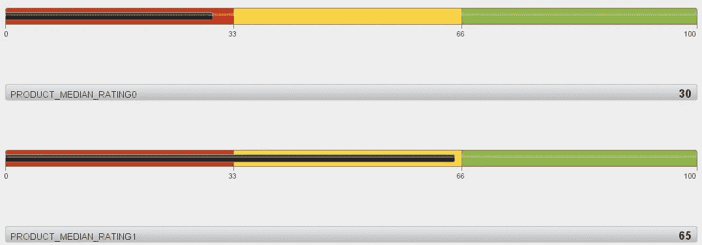

Gauge Status

# 仪表刻度盘

与仪表状态指示器一样，仪表刻度盘是结果集每一行的简单指示器。

```
-- example query for demonstration purposes
select
  product_median_rating,
  0 minimum,
  10 maximum,
  product_lowest_rating,
  product_highest_rating
from
(
  select product_name, 
         median ( rating ) product_median_rating,
         min ( rating ) product_lowest_rating,
         max ( rating ) product_highest_rating
  from   co.products, json_table (
    product_details, '$.reviews[*]'
    columns (
      rating int path '$.rating'
    )
  )
  where product_name like 'Women''s Skirt%'
  group by product_name
  order by product_name
)
```

但是，我们现在有机会指出表盘的其他 4 个属性，这些属性也将显示出来。刻度盘的属性将是:

*   最低限度
*   最高的
*   低的
*   高的

因此，查询总共必须返回 5 列，值为第 1 列。值列之后是 4 个属性列。

结果集的每一行都有一个 dial。因此 2 行的结果集将显示为 2 个刻度盘。

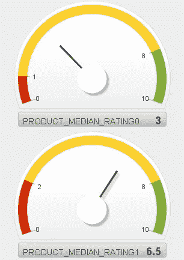

Gauge Dial

# 折线图

线状报告与您预期的一样，但是通过正确的查询，将在同一个图表上绘制多条线。

```
-- example query for demonstration purposes
select TO_CHAR(TRUNC(o.order_datetime,'MM'), 'MON') month,  -- group
       TO_CHAR(TRUNC(o.order_datetime,'YY'), 'YYYY') yr,  -- series
       sum ( oi.quantity * oi.unit_price ) value_of_orders  -- value
from   co.orders o
join   co.order_items oi
on     o.order_id = oi.order_id
group by TRUNC(o.order_datetime,'YY'), TRUNC(o.order_datetime,'MM')
order by TRUNC(o.order_datetime,'YY') DESC, TRUNC(o.order_datetime,'MM')
```

在查询中，第一列是组(即月)，第二列是系列(即年)，第三列是要绘制的值。

因此，每年的值绘制如下。

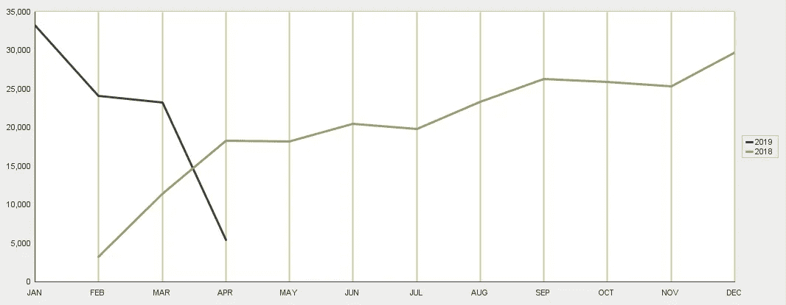

Line

# 饼图

饼图报表非常简单，在演示中，将使用 hr.employees 表。

```
-- example query for demonstration purposes
select
  null "employees",  -- group
  DEPARTMENT_NAME,  -- series
  count(*)      -- value
from hr.employees e 
inner join hr.departments d 
on (e.department_id=d.department_id) 
group by department_name
order by count(*)
```

图表将遵循结果集的值列的顺序。

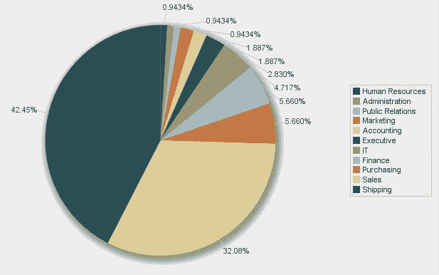

Pie

# 带条形图的饼图

这个特殊的饼图报告将添加一个条形图，将饼图的最右边部分拆分成一个条形图。所以对于直饼图报告，结果集的顺序很重要。

为了列出最大的部分，查询需要对行进行排序，以确保饼图中最大的部分位于结果集的顶部。

```
-- example query for demonstration purposes
select
  job_id,
  department_name,
  c,
  SUM(c) OVER (PARTITION BY department_name) ct
from
(
  select JOB_ID,      -- group
    DEPARTMENT_NAME,  -- series
    count(*) c        -- value
  from hr.employees e 
  inner join hr.departments d 
  on (e.department_id=d.department_id) 
  group by department_name, job_id
  order by count(*)
)
order by ct desc, department_name, c desc
```

在查询中，将针对饼图报告的最大部分对组进行分类。

下面的报告显示了 shipping department 拆分为条形，因为 shipping department 位于结果集的顶部。

查询的前 3 行是装运部门，因为这是最大的部门。因此，装运部门的 3 行被分解为条的 3 个组成部分。

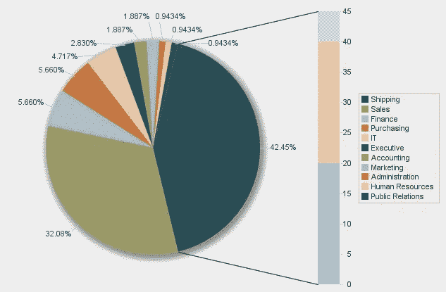

Pie With Bar

# 带横条的环形图

使用与带棒线的饼图相同的查询，我们可以尝试带棒线的环。

不同之处在于，值的总数(即 106)由报告自动计算，并放在环的中心。

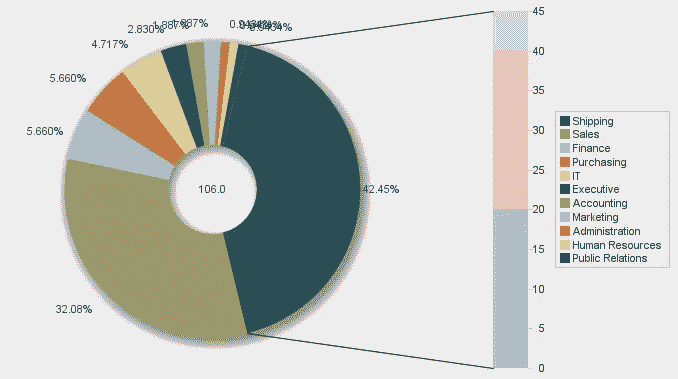

Ring With Bar

# 垂直堆叠分割图

在这里，我们将按月演示垂直堆栈拆分报告。

```
-- example query for demonstration purposes
SELECT
   TO_CHAR(TRUNC(time_id,'MM'), 'MON') month,  -- group
   TO_CHAR(TRUNC(time_id,'YY'), 'YYYY') yr,  -- series
   SUM(sales.amount_sold)  sold    -- value
FROM sh.sales, sh.products, sh.customers, sh.countries
WHERE sales.prod_id=products.prod_id
   AND customers.country_id = countries.country_id 
   AND sales.cust_id=customers.cust_id 
GROUP BY TRUNC(time_id,'MM'), TRUNC(time_id,'YY')
order by TRUNC(time_id,'MM'), TRUNC(time_id,'YY')
```

查询的第一列是组，接下来是系列，然后是值。

因此，该图是按月份划分的值的图表，这将使比较月份更容易，因为它们是并排的。

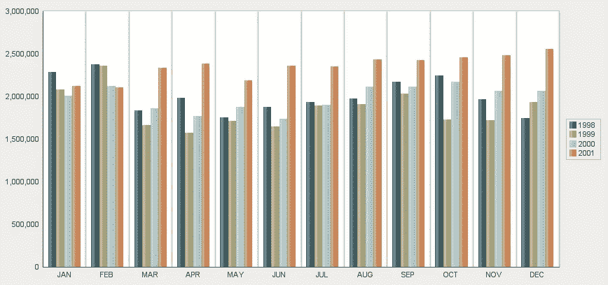

Vertical Stack Split (by month)

另一个图表是按年而不是按月来划分。按年拆分是修改查询的一个简单例子，因此年是组，月是系列。

```
-- example query for demonstration purposes
SELECT
   TO_CHAR(TRUNC(time_id,'YY'), 'YYYY') yr,  -- group
   TO_CHAR(TRUNC(time_id,'MM'), 'MON') month,  -- series
   SUM(sales.amount_sold)  sold    -- value
FROM 
..
```

该图现在按年份拆分，这使得比较每年的月份变得更加容易。

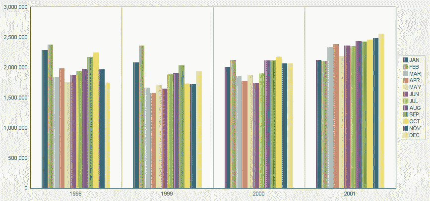

Vertical Stack Split (by year)

# 三维条形图

重复使用与垂直堆栈拆分相同的查询，我们可以一起显示所有月份。

```
-- example query for demonstration purposes
SELECT
   TO_CHAR(TRUNC(time_id,'YY'), 'YYYY') yr,  -- group
   TO_CHAR(TRUNC(time_id,'MM'), 'MON') month,  -- series
   SUM(sales.amount_sold)  sold    -- value
FROM sh.sales, sh.products, sh.customers, sh.countries
WHERE sales.prod_id=products.prod_id
   AND customers.country_id = countries.country_id 
   AND sales.cust_id=customers.cust_id 
GROUP BY TRUNC(time_id,'YY'), TRUNC(time_id,'MM')
order by TRUNC(time_id,'YY'), TRUNC(time_id,'MM')
```

图表现在变成三维，如下所示。

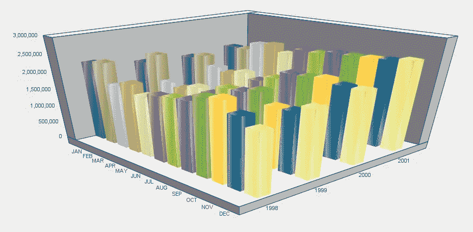

3D Bar

# 漏斗图

当您需要将一系列组作为一个比率进行比较时，漏斗是理想的选择。

```
-- example query for demonstration purposes
WITH base AS (
  select   product_name, 
         median ( rating ) product_median_rating
  from   co.products, json_table (
    product_details, '$.reviews[*]'
    columns (
      rating int path '$.rating'
    )
  )
  where product_name like 'Women%'
  group by product_name
)
select
  product_name,     -- group
  1 series,
  product_median_rating rate    --value
from base
UNION ALL
select
  product_name,     -- group
  2 series,
  10 rate           --value
from base
```

上述查询的结果集前半部分由系列#1 组成，后半部分由系列#2 组成。

漏斗将显示第一个系列相对于第二个系列的百分比。

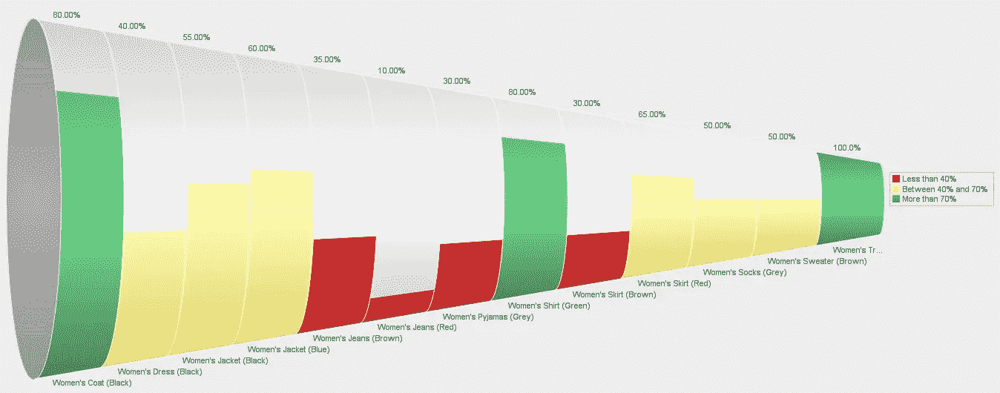

Funnel

当然，有了 Oracle SQL Developer，每个人都会有所收获。有关 Oracle SQL Developer 用户定义报表的更多信息，请访问:

> [https://docs . Oracle . com/en/database/Oracle/SQL-developer/19.4/RP tug/SQL-developer-concepts-usage . html # GUID-6b7e 132d-779 b-4eb 7-8439-dbc4 b5 bea 837](https://docs.oracle.com/en/database/oracle/sql-developer/19.4/rptug/sql-developer-concepts-usage.html#GUID-6B7E132D-779B-4EB7-8439-DBC4B5BEA837)

*Paul Guerin 是一名专注于 Oracle 数据库的国际顾问。Paul 在东南亚的全球交付中心工作，但他的客户来自澳大利亚、欧洲、亚洲和北美。此外，他还出席了一些世界领先的甲骨文会议，包括甲骨文 2013 年世界开放大会。自 2015 年以来，他的工作一直是 IOUG 最佳实践技巧小册子以及 AUSOUG、Oracle Technology Network 和 Oracle Developers (Medium)出版物的主题。2019 年，他被授予 My Oracle 支持社区最有价值贡献者。他是一名 DBA OCP，并将继续参与 Oracle ACE 计划。*