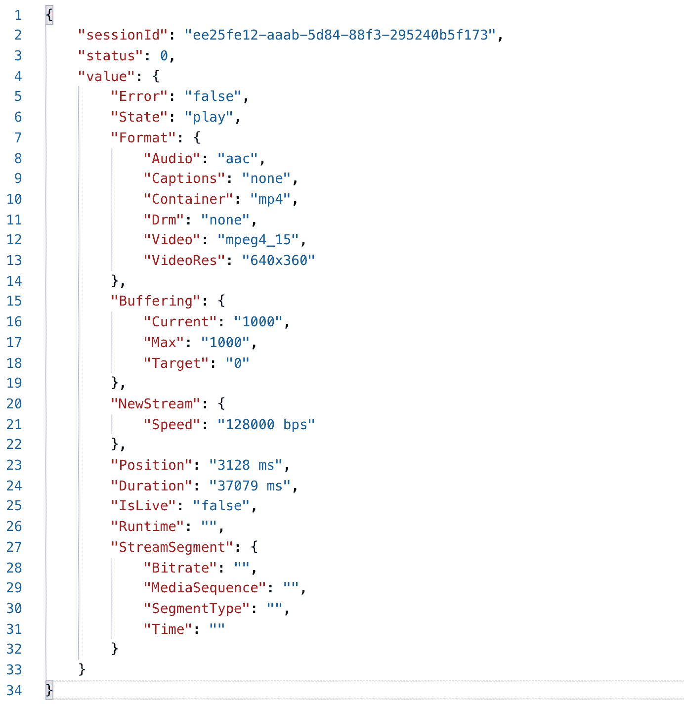

# Roku 测试自动化——应对常见挑战的高级技巧和创造性解决方案

> 原文：<https://medium.com/globant/roku-test-automation-advanced-tips-and-creative-solutions-for-common-challenges-940c18a18b7a?source=collection_archive---------0----------------------->

## 概观

在我的上一篇文章《Roku WebDriver 测试自动化:来自现场的经验教训》中，我概述了 Roku 平台的官方测试自动化解决方案，讨论了在该平台上自动化测试的价值，并给出了一些利用开箱即用解决方案在该平台上创建有效测试的技巧。在这篇文章中，我将深入挖掘并分享一些额外的实现想法和建议，以使您的 Roku 自动化更上一层楼。在开始之前，我建议您阅读上面链接的我以前的文章，或者熟悉核心的 Roku WebDriver 解决方案。本文旨在通过讨论一些常见的挑战，并提出一些可以用来解决它们的方法，从而超越实现 Roku 测试自动化解决方案的基础。虽然本文的主要焦点是使用 Roku WebDriver 的测试自动化开发，但是一些概念和建议同样适用于其他 OTT 测试自动化解决方案。

## 处理动态内容和测试数据

**保持频繁更新**

可以预期，典型 Roku 频道上的内容将是极其动态和个性化的。大多数流媒体服务每天都会推出新内容，并在特定工作日的不同时间定期更新。为了吸引用户，内容几乎总是会以某种方式个性化。即使是最基本的频道设计通常也包括某种“收藏夹”或“最近观看”列表，以方便用户返回他们感兴趣的内容。大多数频道还结合了推荐算法来个性化他们的产品。这些设计并不是 Roku 独有的，但是在为该平台开发端到端自动化测试时，您需要以某种方式考虑这一点。

**模拟数据和受控测试数据的使用**

自动化 UI 测试的一个常见实践是使用模拟数据或另一个受控的测试数据源。许多人认为这是最佳实践。模拟数据通常是嵌入到应用程序源存储库中的数据，可以用来验证应用程序的功能，而不需要从外部请求数据。其他类型的受控测试数据可能包括测试自动化解决方案通过代理注入的数据，或者位于应用程序和测试自动化解决方案都可以使用的另一个静态数据源中的数据。

使用您可以控制的数据运行测试将允许您以一致、可预测的方式运行您的测试，并设计隔离应用程序组件功能的测试。它还允许您确保您的测试覆盖特定的场景，例如，具有特定长度的文本字段，包括按钮或其他具有特殊功能的交互元素的场景，用户可能会遇到或可能不会遇到这些场景，这取决于在特定时间特定用户的提要中有哪些动态内容。

在 Roku 通道的上下文中，您将需要您的开发通道配备一种机制来利用模拟数据或另一种受控数据源来利用这种方法。

如果利用模拟数据或者其他受控的测试数据是您团队工作流程的一部分，您当然应该将它合并到您的测试自动化工作流程中。如果您计划实现基于自动化端到端测试的持续集成的入口，那么以一种允许您的测试保持稳定的方式来控制内容将是可取的。

也就是说，创建一个利用模拟数据的解决方案并生成和更新数据本身需要投入时间和资源。我合作过的一些 Roku 团队在工作流程中很少使用模拟或受控数据。您将需要使用适当编码的流来测试视频回放，以复制实际的最终用户体验。当您想出一个成功实现您的测试自动化目标的计划时，考虑您需要从您的测试内容和您可用的资源中得到什么。

**在测试自动化中使用有代表性的动态数据**

在我使用视频流服务的经验中，我发现开发团队面临的最大挑战之一是跟上不断发展的、似乎永无止境的场景，这些场景涉及内容提要中返回的动态数据。我在测试 Roku 应用程序时看到的许多最严重的错误都是由来自生产或测试内容提要的某种意外数据引起的，而该频道没有能力处理这些数据。这些问题中有许多导致了崩溃。帮助确保您的 Roku 通道能够承受真实世界数据混乱的最佳方式是用真实世界的数据来测试它！

我用来将真实世界的数据整合到测试自动化工作流程中的方法是“飞行前”测试数据。在测试运行程序启动通道并运行一组测试之前，测试自动化解决方案调用相同的内容 API，就像 Roku 通道那样。然后，测试可以使用与通道相同的数据，这些数据可以告知测试的预期结果和/或告诉您的测试运行人员导航到正确位置以执行目标场景所需的正确按钮按压次数。在这种情况下，测试相对于呈现的数据可以是动态的。例如，有些测试可能会运行，也可能不会运行，这取决于所需的内容是否可用，或者可能会根据存在的数据以不同的方式执行。这将为您的测试解决方案和测试本身增加一定程度的不稳定性，但是它也将迫使您跟踪您的 Roku 通道需要处理的服务端更改，并帮助确保您的自动化测试正确地代表最终用户体验，

**可预测性和稳定性或代表性结果？**

上面描述的方法并不是测试自动化中最常规的，有些人反对这样做。如果您希望您的测试始终绿色运行，这在某种程度上将无可否认地与此背道而驰。就我个人而言，我很享受让我的测试变得动态的机会。我也喜欢在测试中使用随机化。例如:测试人员可以选择一个行列表并随机导航到该行中的一个项目，或者随机选择页面上的一行来导航。您的测试不会每次都以完全相同的方式运行，但是当测试经过深思熟虑，并且更准确地代表用户可能遇到的场景类型时，这可能是一个好处。您不会有无限的时间来运行每一个可能的测试场景，所以向您的测试添加一些变化将增加跨测试运行的覆盖率，并通过暴露一些问题来增加长期价值，这些问题可能会被每次运行时以完全相同的方式执行的测试所忽略。我将这比作由测试工程师手动运行的回归测试，这些测试在不同的运行中有相似的变化。你会有失败，你需要投入时间和精力来分析测试结果，但是如果做得好，这将是一个让产品变得更好的好工具。

**专门构建的测试套件**

您总是可以创建多个测试套件来满足不同的目的。例如，您可以创建一个包含最关键、最稳定的测试的套件，以满足诸如构建验证等需要更多一致性的需求，同时为另一个套件保留需要更多分析的更易变和面向细节的测试。这样，你可以两全其美。

## 测试视频回放

**Roku WebDriver 播放器方法**

对 Roku WebDriver **player** 方法的请求将返回关于视频播放器的最基本的状态信息，包括当前播放器位置、剪辑/片段的总运行时间和传输状态(播放、暂停、倒带、快进等。)您还可以利用 Roku Webdriver **element** 方法来查询加载到播放器上的任何 UI 元素。根据实现的不同，用户体验的一些元素可能无法通过测试自动化来实现，但是最初我们会关注那些我们可以测试的东西。

*图 1:查询 Roku WebDriver 的* ***player*** *方法后返回的样例 JSON 输出。*

**利用和测试“书签”**

大多数 Roku 频道都包括一个“书签”功能，允许用户在退出播放器后从停止的地方继续播放。当播放超过 15 分钟的 VOD 内容时，实现该功能是 Roku 频道认证的要求。测试自动化是测试这类特性的好方法。在这种情况下，流式视频提供商的 Web 服务应该有一个 API，可以用来获取和设置当前回放位置，这将允许以多种方式控制回放测试。通过将实际回放位置与服务在运行测试之前返回的回放书签位置进行比较，您应该能够断言回放是否在正确的位置恢复。通过 Web 服务设置回放位置，您还应该能够设置使用传输控件手动设置会很繁琐的测试场景，例如在广告插播前或结束卡加载前开始回放。然而，在这个环境中有效地使用测试自动化需要对具体的实现有很好的理解，包括熟悉客户在这个环境中使用的 Web 服务。

如果服务提供商将前滚内容作为单独的视频文件或播放列表提供，则 Roku Webdriver **player** 方法返回的位置和运行时间将对应于该片段。然而，一些服务使用“服务器拼接”播放列表将与内容相关的所有视频片段组合成一个片段。在后一种用例中，您将只能使用**播放器**方法来检查整体播放位置和传输状态，但是使用标准 WebDriver **元素**查询可以测试加载到播放器上的任何交互元素或指示器。例如，您应该能够确认广告指示器、倒计时器、播放前内容的跳过按钮和结束卡是否按预期加载和运行。

**测试播放器广告整合**

如上所述，您可以利用书签 API 调用来设置测试，这些测试检查广告中断的 UI 元素是否在正确的时间按预期加载。您还可以编写测试来确认在广告插播期间快进和快退控件被禁用。使用 Roku WebDriver，这些测试将结合使用**元素**查询、**玩家**查询和**远程**命令。发出远程命令后，您可以使用**播放器**查询来检查传输是否处于预期状态(例如:播放 vs 快进或倒带)。

我在通过自动化测试广告集成时遇到的一个障碍是，广告中断持续时间(以及实际的广告内容)可能会因播放实例而异。在这种情况下，您可以通过对内容提供商的 Web 服务的 API 调用来确定广告的插入点。然而，在执行测试之前，您的测试可能不知道广告中断的预期播放持续时间，因为该功能通常由与 Roku 视频播放器集成的第三方服务管理。如果频道设计在 UI 中的广告播放期间显示倒计时定时器，您可以关闭 UI 来确定何时从广告插播过渡到特色内容。

**Roku 视频播放器的自动化限制**

Roku 视频播放器中的一些交互是由操作系统控制的。不幸的是，操作系统驱动的内置菜单目前无法通过 Roku WebDriver 查询。这意味着您很可能无法测试隐藏式字幕和语言菜单选项是否按预期出现，也无法在测试中确定这些控件的状态。

## 处理崩溃和意外的应用程序退出

**我们最大的恐惧**

对于我们这些被委托测试 Roku 频道的人来说，也许我们最大的恐惧是一个高度可见的崩溃错误会在我们的注视下找到通往全国或世界各地客户电视屏幕的道路。如果它影响到非常突出的标题，比如一部受欢迎的电影在全球疫情期间直接发布到流媒体服务，结果会更糟！你为 Roku 创建测试自动化的目标应该是在消费者发现之前找到这些崩溃的 bug。

因为我们的测试自动化的主要目标是暴露这些类型的问题，所以当我们设计我们的测试自动化解决方案时，我们也需要在某种程度上准备好处理这些场景。这是 Roku 自动化更具挑战性的方面之一，遗憾的是，官方的 Roku WebDriver 解决方案并不包含任何功能或工具来帮助你。

**Roku 上的崩溃类型**

我们需要关注两种基本的崩溃类型:

1.  逻辑崩溃
2.  内存崩溃

逻辑崩溃的一个例子是，调用函数时使用了开发人员不希望处理的值或数据类型，从而导致逻辑失败。在这种情况下，当使用[调试器](https://developer.roku.com/docs/developer-program/debugging/debugging-channels.md)测试侧面加载的通道构建时，应用程序可能会冻结，调试服务器输出(可通过在端口 8080 上通过 telnet 连接到设备进行监控)将启动交互式调试器。对于从 Roku Channel Store 加载您的频道的最终用户，应用程序将在这些用例中强制关闭。通过追溯导致崩溃的步骤，这些类型的崩溃通常可以一致地重现。

当用户的行为与通道用来管理数据的逻辑结合起来，使应用程序或 Roku OS 本身达到临界点时，就会发生内存崩溃。这些类型的问题通常更难重现，尤其是在执行手动测试时。长时间重复的自动化测试是暴露这类问题的好方法。当内存崩溃发生时，它可能以与逻辑崩溃相同的方式表现出来(通过调试器)，但另一个常见的结果是 Roku 将在通道运行时关闭并重新启动。

如果你不考虑这些情况，当它们发生时，你的 Roku 自动化列车将会出轨。这种类型的场景很可能会延长测试的执行时间，因为如果没有某种类型的干预，您的测试运行人员将会继续发出远程命令和其他查询来断言预期的测试结果。与此同时，实际的 Roku 甚至可能不再在屏幕上显示您的频道！

**日志记录和崩溃检测**

我们如何缓解这种情况？我的第一个建议是在您的自动化解决方案中包含一个日志组件，通过 telnet 自动连接到 Roku 调试器，并在每次测试运行开始时将输出流式传输到一个文件中。即使您什么也不做，通过将此功能添加到您的解决方案中，您将确保保存与您的测试运行相对应的调试输出，以便您可以与您团队中的 BrightScript 开发人员共享它，以便在发生崩溃或其他意外事件时了解根本原因。

您可以进一步利用日志记录功能，通过查找字符串“Brightscript Debugger >”的匹配来检测 telnet 流中的崩溃，这将在交互式调试器启动时发生。您可以在运行结束时添加一组测试，以检查记录的输出中所关心的问题，从而根据日志文件中任何地方的崩溃明确触发故障。除了使用上面的字符串检测崩溃之外，您还可以检查警告和其他基于日志输出的场景，以便开发团队解决。一种更复杂的方法是实时检测崩溃，并修改测试运行的方式来缓解问题(稍后会有更多内容)。

但是那些导致 Roku 重启的可怕的内存崩溃怎么办？在这种情况下，日志输出可能会突然停止，您与 Roku 的 telnet 连接将会中断，因此您无法通过日志输出中的字符串匹配来检测到这一点。但是，使用 Roku WebDriver，可以调用“current_app”方法来确定哪个通道有焦点。重启后，当前通道方法将立即报告“Roku”。如果在这样的崩溃之后的测试序列中，你的测试一直试图按下应用程序外部的按钮，Roku 很可能会启动另一个碰巧安装在系统上的随机通道，并开始尝试与之交互。你开始看到这有多乱了吗？

**定制碰撞检测解决方案**

我的解决方案是开发一个定制的 monitor 服务，它在测试运行程序运行时运行，以跟踪设备状态。我在上面提到的两个场景中都使用了这个方法(逻辑崩溃和内存崩溃)。因为我的测试自动化解决方案是针对多个 Roku 设备并行执行的，所以我使用每个设备的 ID 来跟踪哪个设备崩溃了，但是我对多个设备使用相同的服务。该服务可以接收 GET 和 POST 请求，以检查设备状态或更新设备状态。如上所述，使用字符串匹配很容易检测到逻辑崩溃，所以我设计了我的日志记录模块，它具有在设备崩溃时根据设备的 telnet 端口 8080 的日志输出发送到 monitor 服务的逻辑。

跟踪应用程序焦点需要更微妙的逻辑。我的解决方案定期检查“current_app ”,并将该信息推送到 monitor 服务。如果预期的应用程序没有在多个检查点上聚焦，你可以确信你的 Roku 测试自动化列车已经偏离了轨道。这不仅可以处理 Roku 崩溃和重启的情况，还可以检测到发出远程命令的测试运行程序与用户体验不同步的情况，这种情况会导致用户出于任何其他原因离开目标 Roku 通道。这种情况可能比您预期的要多，尤其是在支持内容服务行为不当的情况下，这会导致用户在测试运行期间看到您没有预料到的错误。

**崩溃处理**

一旦设备进入这些故障状态之一，您就可以决定您想要从那里做什么，但是在涉及远程导航的多步骤测试序列中，试图在序列中间将测试运行程序返回到预期状态可能是一个高要求。我自己并没有试图这样做。我的目标不是防止依赖测试失败，而是防止依赖测试以正常方式执行。如果我们知道设备已经崩溃或通道处于意外状态，继续向 WebDriver 发送远程命令并查询 WebDriver 元素来检查状态是否如预期的那样是浪费时间。我的解决方案使用“断路器”设计来防止这些事情发生。

我的团队已经在使用定制的 JavaScript 库来查询 WebDriver，因为我们在 Roku 发布他们的 JS 库之前就开始了我们的项目，所以我修改了我们的库来包含这个功能。对于那些使用 Roku 的 WebDriver 库(用于 JavaScript 或 Robot 框架)的人来说，你需要扩展这个库来支持它。在我的解决方案中，在每次测试运行之前，都会查询 monitor 服务来检查设备状态。如果返回健康状态，一切正常工作，但一旦设备进入确定的故障状态，断路器就会启动并阻止 WebDriver API 发送远程命令、状态查询和相关轮询尝试的请求，以便测试快速失败，而不会使 Roku 测试设备遭受不必要的折磨。

**断路器实施**

“断路器”设计模式通常用于微服务架构。在这种情况下，我使用的术语更笼统，但其概念类似于微服务中使用的模式，以及典型家庭车库中的物理断路器。基本上，这个想法是您实现允许您触发中断器(例如:在 x 次失败后停止发送远程命令并查询应用程序状态以找到预期的焦点应用程序)和重置中断器(一旦采取了干预措施来恢复应用程序的状态，就再次开始发送命令)的方法。

虽然我的测试套件通常有一系列远程导航事件和状态检查的扩展序列，但我也用退出通道并重新启动它的远程命令来启动每个主要测试部分。这允许该组测试以有限的依赖性独立运行(尽管请记住，诸如用户是否登录，或者父母控制限制是否到位之类的持续状态通常会在渠道发布期间持续存在，并且需要加以考虑)。我实现的缓解崩溃的解决方案在重启应用程序的每个测试块的开始调用 monitor 服务，有效地将断路器翻转回其默认位置，以便可以再次发送远程命令和状态查询。

**崩溃处理的附加提示**

1.  如果您实现了断路器设计，请确保用于退出和重新启动应用程序的任何方法或函数都有办法绕过抑制其他远程命令的机制，否则套件中的所有其他测试都将失败，您将无法有效地从崩溃状态中恢复。
2.  当实现测试 Brightscript 调试器检测的解决方案时，您可以在侧面加载构建之前，通过向通道源代码中的常用函数添加“STOP”命令来测试这一点。通过这种方式，您可以以一致的可再现方式触发交互式调试器。
3.  如果如上所述实现了通道焦点检测，您可以在测试过程中简单地使用遥控器退出通道，或者拔下设备来模拟内存崩溃重启。

# 结论

我们已经讨论了影响 Roku 通道测试自动化解决方案的各种挑战以及解决这些挑战的解决方案:

*   我们可以使用模拟数据来获得对我们的测试和/或来自服务的飞行前真实数据的更多控制，以便我们的测试更能代表最终用户体验，并反映快速变化的内容所暴露的问题。
*   Roku Webdriver 的**播放器**方法给了我们关于视频播放器状态的核心细节。通过利用 API 与内容提供商的服务进行交互，我们可以设置各种各样的播放器测试场景，这些场景对于手动测试来说很繁琐，比如准确地验证回放是否从书签位置继续。
*   向我们的测试自动化解决方案中添加日志功能是相当容易做到的，并且将有助于调试崩溃
*   通过监控日志和应用程序焦点，我们可以实现其他缓解策略，以允许我们的测试在中断发生时更顺利地运行和/或更快地失败。