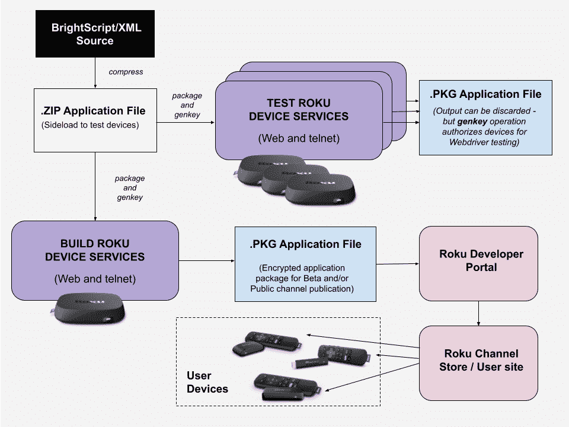

# Roku 测试自动化

> 原文：<https://medium.com/globant/roku-test-automation-more-lessons-from-the-field-a655b4d9d08e?source=collection_archive---------1----------------------->

## 更多实地经验

# 概观

在我以前关于 Roku 测试自动化的文章中，我介绍了 Roku WebDriver 入门的基础知识和更高级的主题，包括使用动态内容、测试视频回放场景以及开发解决方案来减轻测试运行期间的崩溃。在我的 Roku 测试自动化系列的第三部分中，我将介绍 Roku 测试自动化开发人员感兴趣的一些其他主题:在 Beta 和公共渠道上运行测试自动化，在 CI 工作流中引入自动化，在解决方案中引入屏幕捕获功能，以及设备兼容性测试。

如果您错过了本系列的前两篇文章，您可以在这里阅读:

*   Roku WebDriver 测试自动化:来自现场的教训
*   [Roku 测试自动化——应对常见挑战的高级技巧和创造性解决方案](/globant/roku-test-automation-advanced-tips-and-creative-solutions-for-common-challenges-940c18a18b7a)

# 将 Roku WebDriver 与侧装通道和 Beta 或公共通道一起使用

## 安装具有不同测试含义的测试通道的不同方法

测试 Roku 通道开发的最常见方法是从带有源输出的 zip 文件中将通道加载到设备上。这是您构建 Roku WebDriver 解决方案时应该开始的地方，因为这是测试 Roku 通道最通用的方法。然而，Roku 也为开发团队提供了一个选项，称为“测试频道”，允许开发中的 Roku 频道通过用户的 Roku 帐户加载到设备上，方式类似于消费者从 Roku 频道商店下载的公共频道。您甚至可能想要对 Roku 渠道商店中的公共渠道运行自动化测试，这是您的团队负责开发的。在这里，我们将根据您的通道如何部署到设备来讨论运行自动化测试的含义。

## 侧加载通道测试考虑因素

使用侧面加载的通道通常是使用测试自动化的一种方式，因为这个选项可以让您完全访问 Roku 的调试工具，并且在设置测试时可以跳过的关卡最少。如果您想使用 telnet 在端口 8085 上监视设备的调试输出，并使用交互式调试器，那么您需要侧载您的构建。如果您打算使用内置于设备开发人员服务中的屏幕捕捉实用程序，这同样适用。

但是，还有一些其他注意事项需要注意。当运行快速退出并重新打开侧加载通道的自动化测试时，我观察到与设备注册表的读写操作相关的意外错误和崩溃。您的开发渠道的设计可能是一个因素，但我在这里遇到的问题在测试版或公共渠道上无法以同样的方式重现。在退出通道后，在重新启动以开始一组新的测试之前，添加几秒钟的定时延迟似乎可以可靠地防止这种类型的奇怪行为。我还认为您会发现，侧加载通道的调试功能会增加被测 Roku 设备的资源需求，这可能是测试低内存设备时的一个因素。

最后，一些与 Roku 商店集成的功能，如设备上的订阅升级和降级路径，无法通过侧载频道进行测试。由于逻辑原因，这些路径通常是最难自动化的，所以手工测试这些流程可能是最容易的。不过，如果你想通过自动化测试它们，你必须通过与 Roku 服务相关的测试频道或公共频道来进行。

## 测试版和公共渠道出版物的包装渠道

要发布测试版或公共 Roku 频道，需要使用 Roku 设备来“打包”频道。打包过程对通道源代码进行加密，这样就不会暴露内部逻辑。输出是一个扩展名为. pkg 的文件，可以上传到 Roku 的[开发者网站](https://developer.roku.com/)进行分发。通常，打包过程将在团队的构建过程中处理，最好是在自动化的持续集成解决方案中。

在将您的渠道提交给 Roku 渠道商店之前，测试测试渠道是测试最终消费者体验的最常见方式。这也是测试某些功能的唯一方法，比如 Roku Pay 集成。然而，在测试测试版和公共频道时，需要记住一些重要的限制。在测试测试版或公共频道时，您将无法使用 Roku 的 telnet 调试工具或使用设备上的屏幕捕捉功能。您还必须以一种非常特殊的方式设置您的测试设备，以便自动化在这种情况下工作。

## 自动化的测试版/公共频道打包要求

虽然这看起来可能违反直觉，但要在测试版或公共渠道中运行 Roku WebDriver automation(相对于侧装)，您将需要在您打算用来运行测试自动化的每一个测试设备上完成 Roku 的打包过程。 [Roku WebDriver 文档](https://developer.roku.com/en-ca/docs/developer-program/dev-tools/automated-channel-testing/web-driver.md)声明如下:

*“要使用 Roku Web 驱动程序 API 测试生产频道，* [*使用链接到生产版本频道的同一个 Roku 开发者帐户，将频道*](https://developer.roku.com/docs/developer-program/publishing/packaging-channels.md#rekeying) *打包到您的 Roku 设备上。”*

如果您尝试使用 Roku WebDriver 与公共或测试频道，而该频道未打包在您用来测试的唯一设备上，您将只能发送远程命令；您将无法从通道中查询元素或检索 XML 源。这是一种安全机制，防止您看到其他开发人员的渠道是如何工作的。如果没有源代码和通过 Roku 的服务部署的通道的适当权限，它还会阻止您实现任何有价值的测试自动化解决方案。

虽然您必须在您独特的测试设备上打包通道，以便以这种方式运行自动化，但是您不需要在每次运行打包实用程序时将二进制文件重新上传到 Roku developer portal。例如，您可以使用您的构建系统打包构建，通过 Roku developer 站点将二进制文件上传到 beta 通道，然后在您用来运行测试自动化的设备上重新打包相同的构建。

您将需要访问 Roku Developer 帐户，该帐户用于发布测试中的通道、打包的通道二进制文件、源代码以及最初打包时用于加密通道的密码。然后，您可以使用此处的说明[在您的设备上“重置”频道。除了生成一个可以上传到 Roku 的 pkg 文件之外，这个过程还将为您的测试设备提供使用设备内置的打包实用程序所需的授权，并在通道上执行 Roku WebDriver 查询。](https://developer.roku.com/docs/developer-program/publishing/packaging-channels.md)

**注意:**上传测试频道到 Roku 开发者网站的过程目前还不能完全自动化，因为 Roku 实现了一个“验证码”机制。对可以访问这些版本的用户数量也有限制，对测试版频道的运行时间也有限制。然而，在你的团队的工作流程中加入测试渠道仍然是有价值的。

Figure 1\. Roku build and packaging workflow as applicable when automating Beta or Public channels.

# 将测试自动化合并到持续集成工作流中

## Roku 硬件的集成

如上所述，打包 Roku 构建的过程需要直接访问 Roku 硬件。这可能是 Roku 持续集成工作流的最大障碍。您要么需要在运行持续集成(CI)实例的同一网络上有一个测试设备，要么需要通过 CI 解决方案可以到达的静态 IP 提供设备的 IP 和适用的端口。然而，许多 Roku 团队使用 Jenkins 或其他 CI 解决方案来生成 Roku 版本。如果您的 CI 解决方案可以通过网络访问 Roku 硬件，那么您可以类似地集成您的测试自动化脚本。然而，如果这是您的测试自动化计划的一部分，有一些逻辑上的考虑要考虑。

## 远程数据中心注意事项

如果您正在创建构建或针对远程数据中心的设备进行测试，您应该计划一种远程重启设备的方法。Roku 不提供远程命令方法来启动设备重启。从技术上讲，远程命令可以用来导航系统菜单，但是没有办法断言系统菜单内容的状态。不同的设备型号或 Roku OS 版本可能有不同的系统菜单选项，因此可靠地自动化系统菜单带来了挑战。您可能偶尔会使您的设备处于无法响应远程命令的状态。最好的恢复方法是使用可以通过网络远程控制的电源开关。即使这样，您可能会遇到需要实际接触机器或远程查看屏幕输出的情况。如果 Roku 检测到一个尚未安装的操作系统更新，它将阻止侧加载的构建安装，直到操作系统更新。在看不到设备屏幕的情况下，我不知道有什么方法可以解决这个问题(如果有足够的时间，它应该会自动安装并重新启动，但是如果您正在尝试构建一个客户端或者在截止日期前运行一个自动测试，这对您来说没有什么安慰)。与大多数 10 英尺体验设备一样，Roku 设备是严格为消费者设计的，因此它们不具备集成到企业 IT 工作流中的设备常见的 IT 管理功能。虽然 Roku 提供了一个屏幕捕获特性，可以获取一个活跃的侧装开发频道的图像，但是应该注意到这个特性是设计来从你的侧装频道构建中捕获屏幕的。它不允许您在显示系统菜单时捕捉屏幕，因此在规划解决方案时请记住这一点。

## 设备分配

对于 CI 解决方案，我建议至少保留一个设备专门用于构建操作，并在单独的专用设备上运行测试自动化。自动化测试更有可能崩溃或锁定设备，并且您不希望测试自动化活动阻碍您的构建工作。类似地，假设您正在运行一个测试自动化作业。在这种情况下，您将希望避免团队成员触发一个重新启动通道并中断测试自动化过程的构建操作。

## 视频播放和 HDCP

视频播放测试将需要连接到一个现场显示，否则你将需要管理 HDCP(高带宽数字内容保护)。通常，如果 HDCP 链断开，你的视频播放请求将会失败，如果你的设备连接到一个 HDMI 开关，而该开关没有主动将你的 Roku 信号推送到显示器，就会发生这种情况。不幸的是，这排除了为并行自动化作业运行一堆无头 Rokus 的可能性。

## 门控构建流程步骤

不言而喻，如果您想要通过自动化 UI 测试来控制构建，您应该有选择地将哪些测试合并到这些工作流中。您不希望来自不稳定或偶然测试的失败阻碍构建或不必要地延迟构建过程。您将希望确保任何影响构建过程的失败都被清楚简明地报告，以便开发团队成员可以处理分析失败。

我会避免使用 Roku 测试自动化来控制构建，并将 CI 集成限制在预定的或按需的任务上。这些类型的 UI 测试可能会很耗时，因此最好有一个每晚运行并在每天早上向您报告结果的作业，或者在新的构建完成后开始并在作业完成后向您的团队发送结果消息。但是，您应该有一个允许您的测试也在本地运行的配置。简单地观察测试运行通常是理解失败的最佳方式，您也可能会发现您的断言将会忽略的 UI 问题。

# 屏幕截图的使用

## 平台上有限的屏幕捕获功能

将屏幕捕捉合并到测试自动化解决方案中是很常见的。大多数现代开发平台都提供了一种从测试设备获取屏幕截图的简单方法。典型的屏幕捕获应用程序将定期存储图像，以便在出现故障时作为调试参考，或者利用可视化测试工具来分析图像内容，并在测试执行时针对图像内容做出断言。遗憾的是，Roku WebDriver 解决方案没有收集截图的 API 方法。

## 屏幕捕获解决方法

虽然 Roku WebDriver 不包括屏幕捕捉方法(Roku 的外部控制协议 API 也不支持它)，但如果您正在对侧加载通道进行测试，则可以在没有外部视频捕捉硬件的情况下从 Roku 设备远程检索屏幕截图。

您可以将 Web 浏览器连接到 Roku 的 IP 地址，并使用相同的内置 Web 服务器应用程序从 Roku 频道手动收集屏幕截图，该应用程序允许您下载构建。使用广泛可用的 Web 调试工具(包括大多数 Web 浏览器内置的工具)，您可以观察 Roku 内置的 Web 服务用来查询设备和收集屏幕捕获二进制文件的方法。通过一点逆向工程，您可以向您的测试框架添加一个模块，该模块将复制这些交互，以便您的测试框架可以从您的设备收集屏幕截图。

*Figure 2: The Web-based utility shown above is available on Roku devices configured for developer use and can be used as a model for screen capture interactions.*

## 屏幕捕获可靠性挑战

虽然使用上述过程可以直接从设备上进行屏幕捕获，但我要提醒不要过分依赖 Roku 测试自动化解决方案。我的团队实现了一个屏幕捕获模块，我们用它在调试的测试运行中收集屏幕截图，但是我们发现有时检索屏幕截图的请求会莫名其妙地失败。我也见过使用 Roku 的开发者工具手动检索截图的情况。重启测试设备通常可以解决问题。尽管如此，如果您设计测试时依赖于通过屏幕捕获获取的图像，这种问题可能会有破坏性的风险。

如果利用可视化测试服务是 Roku 测试自动化解决方案的目标，我建议从概念实现的证明开始，或许可以考虑使用外部图像捕获硬件。尽管如此，这种方法也有其自身需要克服的挑战(例如，如果您从设备的 HDMI 输出中捕捉图像，需要找到一种方法来绕过 HDCP 内容保护)。

此外，请注意，设备内置的屏幕捕捉功能将不包括 Roku 视频播放器渲染的图像。假设您试图在视频播放器在屏幕上时捕获屏幕。在这种情况下，您将在输出中看到应用程序呈现的覆盖元素(按钮、文本等)。)而不是播放器呈现的实际视频内容。

# Roku 测试自动化的设备选择

## Roku 上的设备兼容性测试

设备兼容性是 Roku 平台上一个关键的测试考虑因素。Roku 要求提交到 Roku Channel store 的应用程序保持与当前和可更新设备的兼容性，详见其[硬件规格列表](https://developer.roku.com/docs/specs/hardware.md)。开发新 Roku 频道的团队可能犯的最大和最昂贵的错误之一是未能在较旧、较慢的设备上测试体验，从而导致性能问题未被发现。

## 用于快速反馈的快速设备

当开始一个新的 Roku 测试自动化计划时，我建议从顶级的 Roku 硬件开始。这是目前 Roku Ultra 系列设备，具有快速处理器和以太网连接。你的目标之一应该是快速反馈，所以你会希望你的功能测试快速运行，只要你的通道能够跟上，然后如果你开始看到不代表实际世界使用场景的失败，就放慢速度。Roku Streaming Stick+设备、最新型号的 Roku Express 设备以及集成 Roku 操作系统的新型智能电视也应该可以很好地用于测试自动化，过去几年的高端设备也应该如此(Premiere、Premiere+、Ultra)。使用各种各样的设备将会是扩展自动化测试的设备覆盖率的一个很好的方法。

## 影响自动化的资源限制

我不太倾向于使用自动化来针对较旧、较慢的设备进行一般功能测试自动化(包括任何 3 年以上的 Express 设备或 Streaming Stick 型号以及较旧的编号型号:Roku 1、Roku 2 和 Roku 3)。Roku 并不经常贬低设备，其市场策略的一部分是以低价营销设备，以降低消费者的准入门槛。一些目前支持的设备在 8 年多前上市，当在操作系统中导航系统菜单时，几乎很难跟上。这些设备中的一些仍然在平台上受支持，但是不再被消费者广泛使用。Roku WebDriver 查询的使用，以及开发工具(如日志)将增加对硬件的需求，超出典型的消费者工作流程。您可能会发现当用户使用遥控器在现实环境中执行时不会发生的失败场景。在这些较旧、较慢的设备上，您可能还会遇到 GUI 呈现问题，这些问题只有在观看屏幕时才会明显，即使 Roku WebDriver 报告这些元素存在于 XML 中。

最终，对哪些设备运行测试自动化是您的团队的商业决策。尽管如此，由于上述问题，我觉得低端设备兼容性测试是最适合手工测试执行的领域。我看到了针对低端设备的特定自动化测试的价值。Roku 渠道认证要求为两种特定设备指定了性能指标标准，第一代 Roku Express 设备(“little field”37 XXX)和 Roku Streaming Stick+(“Amarillo-2019”3810 x)，因此您可以创建一些基本测试，在这些设备上启动您的应用程序，然后分析日志输出，以使用 Roku 的[信号信标](https://developer.roku.com/en-ca/docs/developer-program/performance-guide/measuring-channel-performance.md)来测量启动时间，如果没有其他事情的话。“Littlefield”设备通常表现不佳，所以我不愿意在自动化功能测试中广泛使用它们。然而，只要您有设备和屏幕来呈现它们的输出，您就应该能够在其他设备上并行运行这些测试。

# Roku 自动化替代方案

除了上面提到的这些技巧，根据我在该平台上的工作经验，我必须提到还有一些替代的 Roku 自动化解决方案值得考虑:

*   [Rokul Runnings](https://github.com/willowtreeapps/rokul-runnings)——这个 TypeScript 解决方案曾出现在 Roku 开发者博客的[客座博文中。它扩展了基本的 Roku WebDriver 解决方案，增加了一些 Roku 没有的特性。查看他们的屏幕捕获组件库，它似乎使用了与我上面描述的类似的方法。](https://blog.roku.com/developer/customizing-rokus-test-automation-software-guest-post)
*   [RTA (Roku 测试自动化)](https://www.npmjs.com/package/roku-test-automation) —这种 npm 解决方案使用了完全不同的方法，因为它没有利用 Roku 基于 Go 的 WebDriver 服务器。相反，它使用 Roku 的外部命令协议和一个自定义的 BrightScript 插件，您可以将该插件合并到您的测试构建清单中。该解决方案还具有屏幕捕获功能和其他功能，如代理功能。

# 最后的想法

总而言之，我们了解到:

*   当运行自动化测试时，侧面加载的构建提供了最大的便利和灵活性，但是测试自动化也可以针对公共(生产)渠道和 beta 渠道执行，但有一些限制。这是自动化需要 Roku 渠道商店集成的功能(如订阅工作流)的唯一方法。
*   像其他自动化解决方案一样，Roku 测试自动化可以集成到持续集成工作流中。但是，这样做需要 CI 解决方案能够直接访问 Roku 设备。一些使用场景要求您能够查看 Roku 的屏幕，或者让显示器持续通电并连接到 Roku 设备，这带来了特殊的挑战，在您定义 CI 解决方案时需要考虑这些挑战。
*   虽然 Roku WebDriver 框架不包含屏幕捕获方法，但我们可以通过复制 Roku Web service for developers 使用的请求来实现我们的解决方案，但有一些限制和注意事项。
*   设备兼容性测试是渠道分销的重要步骤。不过，尽管自动化测试可以针对大多数 Roku 设备运行，但测试自动化执行和调试工具所需的额外资源使得高端和中端设备更适合高端和中端设备，更适合我们的大部分功能性 Roku 测试自动化任务。
*   有一些很棒的开源替代 Roku 自动化解决方案，其功能超出了基本解决方案，我们可以在我们的项目中利用或分析和学习。