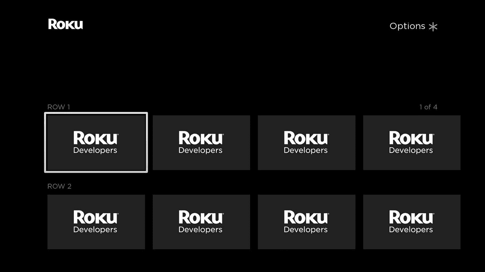
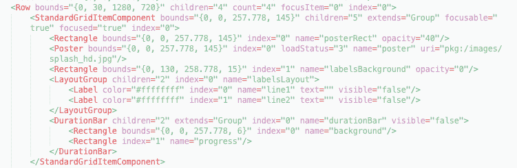
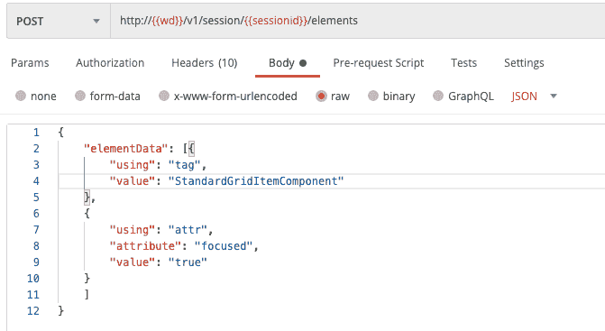
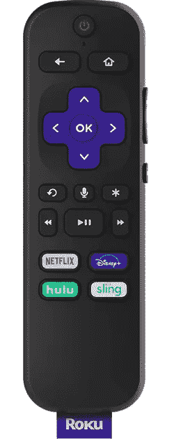

# Roku WebDriver 测试自动化:来自现场的教训

> 原文：<https://medium.com/globant/roku-webdriver-test-automation-lessons-from-the-field-4ee27b520732?source=collection_archive---------0----------------------->

# 概观

今年早些时候的一项研究发现，美国 80%有电视的家庭至少有一台联网电视(CTV)设备。Roku 品牌的智能电视和机顶盒设备占据了美国 CTV 市场的 39%。2008 年推出的第一款 Roku 机顶盒将仍处于起步阶段的网飞流媒体视频服务带入了消费者的电视机。此后不久，Roku Channel Store 推出，并推出了一个 SDK，允许开发者轻松地向平台发布内容。今天有超过 1800 个 Roku 频道。

虽然 Roku 在过去的 12 年里已经成为美国领先的 CTV 平台，但在 Roku 上有效地自动化测试的能力是最近才发展起来的。2019 年 12 月，Roku，Inc .发布了 Roku WebDriver，这是 Roku 测试自动化的官方解决方案，源自流行的开源 Selenium WebDriver，用于其他平台。在此之前，该平台上的自动化选项极其有限。

当 Roku 推出他们的自动化解决方案时，我刚刚开始从事一个实验性的 Roku 测试自动化项目，所以我的团队能够在 Roku WebDriver 发布后不久就利用它。随着时间的推移，我们使用 Roku WebDriver 构建的解决方案对我的团队来说是无价的，因为它允许快速和彻底的反馈，加快了缺陷的识别。

尽管 Roku WebDriver 源自 Selenium，但它是针对 CTV 优化的解决方案的一个子集，目前仍处于起步阶段。此外，用户通常与 CTV 用户界面交互的方式，以及 Roku 通道如何开发的细节，都是影响测试自动化团队的额外挑战。在这篇文章中，我将概述 Roku WebDriver 的分类，并分享在 Roku web driver 发布以来的一年中从直接使用 Roku web driver 的经验中学到的技巧。

# Roku 的自动化案例

将自动化测试作为 Roku 渠道开发工作的一部分有很多很好的理由，但这里有一些亮点:

*   **繁琐的按钮序列:**由于与 Roku 频道交互的标准方式是通过一个简单的遥控器，带有一个基本的 [d-pad](https://en.wikipedia.org/wiki/D-pad) 控制器和一些其他按钮，一些重要的操作执行起来可能相当繁琐(例如:使用屏幕键盘键入电子邮件地址和密码以进行身份验证)。尽管 CTV 体验不需要用户经常执行这些功能，但它们是回归测试中包含的关键场景，并且不难自动化。
*   **商店认证要求:**向 Roku 渠道商店发布渠道需要满足一套相当严格的[认证标准](https://developer.roku.com/docs/developer-program/certification/certification.md)。这些需求包括[深度链接](https://developer.roku.com/docs/developer-program/discovery/implementing-deep-linking.md)标准，手动测试这些标准也很耗时，因为所有渠道都必须支持各种不同的深度链接场景。这些使用场景可以使用 Roku WebDriver 轻松实现自动化。
*   **开发工具限制:**Roku 频道的开发是使用一种叫做 BrightScript 的语言来完成的，这种语言几乎专门用于 Roku 频道的开发。BrightScript 缺少其他现代编程语言所具备的工具，因此编写单元测试和林挺等实践在团队中并不标准，构建通道的方式在不同的组织中可能会有很大的差异。还有，BrightScript 语言本身不如其他语言高级。直到刚刚发布的最新 9.4 OS 版本，还没有一个 BrightScript 等同于 [try/catch](https://developer.mozilla.org/en-US/docs/Web/JavaScript/Reference/Statements/try...catch) 。由于这些因素，Roku 通道可能很脆弱，一个简单的编码错误就可能导致通道崩溃。如果没有标准化的代码分析工具来在构建生成之前发现这些类型的错误，那么测试的需求就会增加，并且自动化测试尤其有价值。
*   **设备限制和兼容性** : Roku 设备使用廉价的硬件，因此处理、内存和存储资源比典型的笔记本电脑或智能手机更加有限。更老的 Roku 机型更是如此，所有频道都必须支持。自动化可以帮助我们发现应用程序何时被推到极限。这种性质的内存和性能缺陷很难通过手工测试以一致的方式隔离和重现。自动化包含大量重复的场景的机会有助于识别有问题的场景，并提供了一种在解决性能问题的同时测量进度的方法。

*注意:不可能使用虚拟化来模拟 Roku。出于内容安全原因，该平台受到高度保护，因此所有开发和测试都必须使用物理 Roku 设备。*

面对所有这些挑战，我的建议是，除了最简单的 Roku 渠道开发工作之外，所有工作都应该计划在测试自动化方面投入资源。这将减少手工回归测试所需的工作量，并允许更有效和全面的测试。

# 弄脏你的手

要开始使用 Roku WebDriver，请参考 Roku 开发者网站上的 API 文档:

*   [Roku WebDriver 开发者文档](https://developer.roku.com/docs/developer-program/dev-tools/automated-channel-testing/automated-testing-overview.md)

在上面的页面中，你还会找到 [Roku WebDriver API 文档](https://developer.roku.com/docs/developer-program/dev-tools/automated-channel-testing/web-driver.md)、 [Roku WebDriver 机器人框架库](https://developer.roku.com/docs/developer-program/dev-tools/automated-channel-testing/robot-framework-library.md)和 [Roku WebDriver JavaScript 库](https://developer.roku.com/docs/developer-program/dev-tools/automated-channel-testing/javascript-library.md)的链接。如果你想使用另一种语言，如 Java、C#或 Ruby，这应该也是可行的，但由于 Roku 没有为这些语言提供库，你需要编写自己的库来调用 WebDriver 的 REST API 或从外部寻找第三方库。

Roku 提供的解决方案的核心是一个 HTTP 服务器解决方案，可用于查询受测 Roku 设备的状态，以及通过 ECP(外部控制协议)发送远程命令。Roku 提供以下内容:

*   用 Go 语言编译服务器的 GitHub repo
*   Robot 框架和 JavaScript 中的 WebDriver 库
*   用于查询 WebDriver API 的 Postman 集合
*   示例测试脚本和一个演示通道，您可以将它们加载到测试设备上运行测试。

**注意:**您需要运行 Roku OS 9.1 或更高版本的 Roku 设备来执行测试。要侧装应用程序进行测试，您可以使用通过零售或在线渠道购买的标准 Roku 设备(不需要像其他一些 CTV 平台那样的特殊“开发套件”)。但是，在将构建加载到您的设备上进行测试之前，您确实需要在设备上运行一个特殊的过程来将其设置为开发设备。如果你还不熟悉这个过程，你可以在这篇博客文章中学习如何去做。

如果你要为这个平台开发测试，我建议按照 Roku 在 Roku WebDriver 开发文档[中规定的步骤来编译服务器二进制文件，加载测试 Roku 通道，并运行他们在 Robot Framework 和/或 JavaScript 中提供的示例测试。从那里，他们提供的邮差收集是一个很好的方式来深入挖掘，以更好地了解引擎盖下的东西。](https://developer.roku.com/docs/developer-program/dev-tools/automated-channel-testing/automated-testing-overview.md)

Roku 提供的示例测试是一个很好的开始，但是在平台上自动化测试时，它们仅仅触及了表面。它们提供了最基本的构建模块，但是您不应该期望像 Selenium for Web 或 Appium for mobile testing 这样的解决方案会带来大量方便的方法。记住 Roku WebDriver 还不是一个成熟的、被广泛采用的、经过时间考验的解决方案。它公开发布才一年左右，所以我们很可能会在未来看到增强，要么通过 Roku 直接提供的更新，要么通过开源插件。现在，期望做一些你自己的创新来扩展解决方案。

在 Roku WebDriver 解决方案包含的示例测试脚本中，大多数测试都是简单的远程导航事件，然后是基本的查询，以检查源代码中是否存在文本、海报图像或其他元素。这是一个很好的开始，但是，如果您能够断言页面上组件的关系，您将能够编写更有效的测试，而不是发出一系列查询来查看各种元素是否存在。

Roku 的示例测试方法通常不解析 WebDriver HTTP 服务器返回的响应。在大多数情况下，他们只是检查对 API 的查询是否返回成功的响应(200“OK”)，而不是失败代码(通常是 500“内部服务器错误”)。但是，当您向 API 发送“element”查询时，它会返回一个 JSON 格式的响应，表示被查询的底层组件。因此，您可以编写一个查询来返回被测通道中的视图、小部件或其他元素，然后编写自己的代码来解析返回的 JSON 内容。一个常见的例子是测试 Roku 频道中包含的网格，该频道有一系列代表多媒体内容的图像缩略图供用户查看。在这个场景中，您可以编写一个返回“grid”元素 JSON 的查询，然后您可以解析响应以返回您所关心的属性。

例如，您可能想要测试以下内容:

*   网格中的项目以正确的顺序出现。
*   每个项目都引用了正确的图像文件源 url。
*   网格中的图像已从其来源成功下载。
*   纠正网格中每个项目的标题负载。

这些类型的检查需要直接解析元素 JSON 或 XML。

**Fig 1\. Screenshot of a grid in a Roku demonstration channel.**

# 使用 Roku 的 XML 源代码

Roku 通道使用基于 XML 的源来定义应用程序组件，这些组件通过代码中的 BrightScript 语言来控制。虽然这种模型类似于 HTML 和 JavaScript 在 Web 应用程序中的使用方式，但 Roku 解决方案要落后得多。直到大约五年前，Roku 引入了“SceneGraph”来允许丰富的 UI 开发，Roku 频道都是使用 BrightScript 来操作预定义的 UI 模板。Roku 上没有 CSS 的直接等价物。从测试自动化的角度来看，使用 Roku XML 与使用 HTML/CSS/JavaScript DOM 有很大的不同，所以我将在这里讨论一些核心概念。

首先，Roku 通道中可呈现的 UI 元素由三种基本元素类型组成:

*   标签
*   海报
*   长方形

标签显示文本，海报渲染图像，矩形不言自明。

您还会遇到各种类型的元素，包括列表、网格、布局组、可呈现节点和任意数量的自定义元素，但是所有这些元素都使用上面的三个基本元素在屏幕上绘制 UI 元素。

Roku WebDriver API 有一个 ***source*** 方法，它返回 base64 编码的 XML 源代码。当我为 Roku 通道中的新组件开发测试时，我手动导航到我将测试的视图，并使用 Postman 库查询 ***源*** API 方法，以在我将编写断言的状态下检查我的通道的 XML(因为响应是以 base64 返回的，所以我使用 Postman 中的脚本将 base64 解码为 XML，然后将 XML 复制到文本编辑器并格式化，以便于阅读)。

**Fig 2\. Sample excerpt of XML representing a grid component in the Roku demonstration channel.**

我发现查看 XML 是可视化我的测试将断言的底层元素的结构的最简单的方法。在实践中，我的自动化测试将 ***元素*** 查询发送到 Roku WebDriver API，而不是 ***源*** 查询，但是尽管 ***元素*** JSON 直接关联到 XML，但它不是非常可读，这就是为什么我使用 XML 来理解底层结构。在我的项目中，我们使用一个定制库来解析 ***元素*** 响应体。每次我们测试一个新的通道组件时，我们都会编写代码来解析该组件的 JSON 响应，以返回我们希望以简化形式断言的元素的属性。

**Fig 3\. a POST request sent to a local instance of Roku WebDriver to retrieve information about the focused “StandardGridItemComponent” element shown in the XML example above.**

**Fig. 4\. A portion of the JSON wire protocol response received from the above elements query.**

因为所有 Roku UI 元素都使用上面的三种基本元素类型在屏幕上呈现元素，所以我们在解析 JSON 响应时的主要任务是定位这些基本元素及其属性。然而，我们也希望了解它们与父元素和结构的关联。

您可能希望在测试中检查的属性将包括标签的文本、海报的 URL 以及描述焦点状态和基本元素可见性的属性。需要注意的是，Roku WebDriver 返回的属性中，有些样式属性不可用于分析。例如，字体细节和文本大小通常不会作为 XML 源的一部分返回供您检查。此外，断言给定元素是否实际出现在屏幕上可以使用返回的“bounds”属性来完成，但是这些值在 XML 树中是相关的，因此断言起来很复杂。随着 Roku WebDriver 解决方案的成熟，这种类型的操作有望在未来得到简化。

# 远程交互

与大多数其他 CTV 平台一样，典型用户与 Roku 频道互动的方式是通过 Roku 设备或电视附带的基本遥控器。用户将用来控制 Roku 频道内设备的主要按钮是 d-pad 按钮(上、下、左、右)、后退按钮和传输控制(快进、倒带、播放/暂停)。Roku 还提供了一个模拟物理遥控器按钮的移动应用程序，并包括一个用于字符输入的虚拟键盘。这些远程功能可以通过 Roku WebDriver API 来模拟。然而，WebDriver API 目前不支持按住功能，用户可以使用该功能流畅地在多个项目之间导航。如果您希望包含使用按住功能的测试，您可以使用 [ECP](https://developer.roku.com/docs/developer-program/debugging/external-control-api.md) 直接调用设备，它提供了实现这一点的功能。

由于 Roku 频道(以及大多数其他 CTV 平台)没有鼠标或触摸屏来直接与给定页面上的元素进行交互，因此需要在频道及其各个页面中进行大量的点击导航来访问许多功能。这将对你构建框架和测试的方式有很大的影响。您可能希望在解决方案中实现助手方法，通过一系列键盘交互以各种方式导航您的通道。您的解决方案的可配置性越高，您就越有可能准备好适应随着渠道的发展而可能发生的变化。虽然您可以使用一些技术来检测一些失败状态并解释它们，但是像在页面上添加一个新按钮或者改变它的位置这样简单的改变都会破坏测试序列。您将需要设计足够健壮的导航序列，以容忍一定量的运行时不一致(例如:在尝试在页面中导航之前，等待足够长的时间来加载页面)，但是您将无法考虑所有可能的场景。

当涉及到平台上的测试脚本设计时，这呈现了一个显著的困境。将测试设计为独立执行被认为是自动化测试中的最佳实践。但是，这里有几个重要的考虑因素:

*   Roku 频道中的许多功能将需要一系列重要的远程事件来导航。
*   信道可靠地响应远程导航事件的能力对于最终用户也是至关重要的。
*   应用程序启动和导航事件可能需要大量时间来执行。
*   不是以性能方式设计的 Roku 信道可能会给用户带来问题，这些问题只有在用户会话中进行大量导航后才会出现。

我的团队从“工作流”风格的测试脚本中获得了很多价值，这些脚本通过一系列事件导航，并在检查状态的过程中做出大量断言。这意味着许多检查严重依赖于如预期发生的先前事件的结果，这不是常规方法。工作流早期的一次失败可能会导致多米诺效应，导致该序列中的所有后续测试失败。这在测试套件中产生了一些脆弱性的风险。然而，您可以通过在更短的时间内执行大量的测试来以这种方式实现效率，我认为这在这个平台上很重要。

通过在一个会话中执行许多页面导航事件来覆盖大量内容的工作流可能会暴露通道中的性能问题，例如导致通道变得缓慢或无响应的内存泄漏。众所周知，这些类型的问题很难通过手工测试来识别和重现，因此拥有能够以一致的方式重现这些类型问题的测试脚本是非常有价值的。这种方法也可能增加监控测试运行和分析自动化测试结果所需的努力，但是在我的项目中，风险是值得的。最终，您需要根据您的应用程序的需求做出深思熟虑的决定，并在测试独立性、测试稳定性和获得快速反馈的能力之间进行权衡。

# 结论

Roku 为他们的平台发布了一个 WebDriver API，为有效的 UI 测试自动化打开了大门。尽管 Roku WebDriver 资源相对较新，因此不像其他平台的自动化工具那样成熟，但它们为我们提供了使用 JavaScript 或 Robot 框架语言开始自动化测试所需的基础知识。由于自动化是围绕 HTTP 服务器标准化的，所以测试自动化开发团队有很大的机会利用和进一步扩展这些资源，以满足他们团队和 Roku 通道的特定需求。

对高质量体验的强烈需求和对平台测试的特定需求(包括 Roku 渠道商店认证标准)使得投资测试自动化成为一项值得的努力。

引文

福布斯和布拉德·阿德盖特。2020.“联网电视收看率没有恢复到疫情之前的水平。”Forbes.com。[https://www . Forbes . com/sites/bradadgate/2020/06/12/connected-TV-viewing-is-not-return-pre-of-疫情-levels/？sh=107087463aa5。](https://www.forbes.com/sites/bradadgate/2020/06/12/connected-tv-viewing-is-not-returning-to-pre-pandemic-levels/?sh=107087463aa5.)