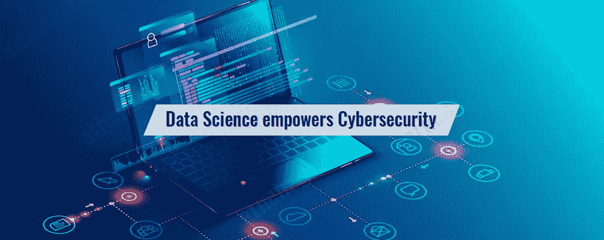

# 数据科学在网络安全中的作用

> 原文：<https://medium.com/quick-code/role-of-data-science-in-cyber-security-46eb67b72075?source=collection_archive---------0----------------------->

现代数据科学最基本的形式就是理解。它包括研究、处理和从一系列信息中提取有价值的见解。虽然这个词和过程已经存在了几十年，但它主要是计算机科学的一个子集。今天，它已经发展成为一个独立的领域，因此，有兴趣的人可以学习和主修它。

Data Science In Cyber Security

这是一个令人惊奇的研究领域，有很多有前途的职业机会和许多用途。

数据科学的一个现代应用包括网络安全。抱着提高网络安全的希望研究数据科学听起来可能很奇怪，但在现实中，这很有意义，原因如下。更多附加信息请点击 [**数据科学在线培训**](https://onlineitguru.com/data-science-course.html)

**大数据与网络安全的关系**

通过应用数据分析和一些机器学习工具，组织可以对收集的信息进行彻底的分析。专业人员可以仔细检查数据，以揭示趋势、模式和可操作的情报。

例如，您可能会发现组织中的所有网络攻击都发生在晚上，当时办公室里没有人。或者，也许你可以学到足够的知识，将概率缩小到你网络上的某个终端。除此之外，您可以使用提取的信息来预测未来可能发生的潜在攻击。

**预测和主动入侵检测系统**

网络安全真的是一场猫捉老鼠的游戏。黑客和攻击者使用一系列工具和入侵方式来获取访问权限。正是在这里，主动和预防性的入侵检测系统开始发挥作用。这些系统监控网络上的用户和设备，并标记危险活动。

现代数据科学可以增强和简化这些工具的使用。通过将当前和历史数据输入机器学习算法，该系统可以精确地检测潜在的问题。随着时间的推移，这样的系统变得更加精确；它可以预测未来的攻击，并发现各种漏洞。

**保护有价值的信息**

数据攻击的另一个问题是丢失极有价值的数据和信息，这可能会对您的组织造成严重损害。通过使用高度复杂的签名或加密等安全措施，您可以阻止任何人探查数据集。通过涉及数据科学，你可以开始建立难以理解的协议。例如，通过分析您的网络攻击历史，您可以开发 [**网络安全课程**](https://onlineitguru.com/cyber-security-training.html) 算法来检测最常被攻击的数据块。

总体而言，通过有效分析系统的数据科学有助于增强网络安全行业。它允许 It 专业人员提出更有效、更具防御性和更积极的措施来防止网络攻击。来自知名机构的在线数据科学计划可以帮助您利用数据科学的力量来增强由自我改进算法驱动的网络。