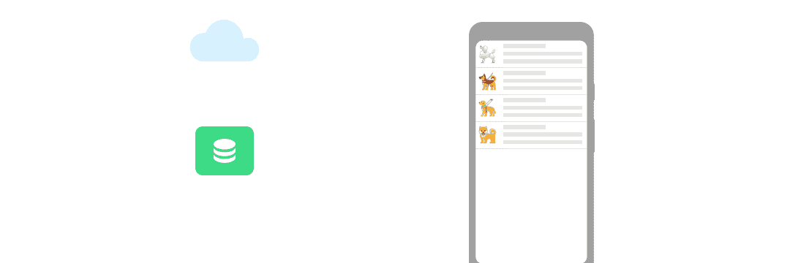

# 房间🔗流动

> 原文：<https://medium.com/androiddevelopers/room-flow-273acffe5b57?source=collection_archive---------0----------------------->



Flow support in Room

Room 中的协程支持在每个版本中都有所增加:Room 2.1 增加了对单次读/写操作的[协程支持](/androiddevelopers/room-coroutines-422b786dc4c5)，而 Room 2.2 现在支持可观察的读操作，并通过`[Flow](https://kotlin.github.io/kotlinx.coroutines/kotlinx-coroutines-core/kotlinx.coroutines.flow/-flow/)`使您能够获得数据库中变化的通知。


Room async queries support

# 行动中的流动

假设我们有一个狗的数据库，其中名字是主键，因此，我们不能在数据库中有 2 只同名的狗。

```
@Entity
data class Dog (
    @PrimaryKey val name: String,
    val cuteness: Int,
    val barkingVolume: Int
)
```

为了显示狗的完整列表以及它们的所有信息，我们将在我们的 [DAO](https://developer.android.com/training/data-storage/room/accessing-data) 中编写这样一个查询:

```
@Query("SELECT * FROM Dog")
fun getAllDogs(): List<Dog>
```

因为狗的吠叫音量会随着时间的推移而变化，我们希望确保我们的 UI 是最新的，所以我们希望在 Dogs 表中发生的每一次变化都得到通知:添加新的狗、删除或更新狗。为此，我们更新查询以返回`Flow`:

```
@Query("SELECT * FROM Dog")
fun getAllDogs(): **Flow**<List<Dog>>
```

像这样，每当数据库中的狗被更新，那么狗的整个列表**被再次发出。例如，假设我们在数据库中有以下数据:**

```
(Frida, 11, 3)(Bandit, 12, 5)
```

当我们第一次呼叫`getAllDogs`时，我们的`Flow`会发出:

```
[(Frida, 11, 3), (Bandit, 12, 5)]
```

如果班迪特变得兴奋，他的吠叫音量被更新为 6: `(Bandit, 12, 6)`，则`Flow`将再次发出，狗表的全部内容都是最新值:

```
[(Frida, 11, 3), **(Bandit, 12, 6)**]
```

现在让我们说，我们可以在一个新的屏幕中打开一个狗的细节。因为我们也想确保我们总是拥有关于狗的最新数据并实时获得更新，所以我们返回一个`Flow`:

```
@Query("SELECT * FROM Dog WHERE name = :name")
fun getDog(name: String): Flow<Dog>
```

现在，如果我们调用`getDog("Frida")`，`Flow`将返回一个对象:`(Frida, 11, 3)`。

每当对表进行任何更改时，不管哪一行被更改，查询都将被重新触发，并且`Flow`将再次发出。因此，如果弗里达得到更新，我们将收到最新的信息。

然而，数据库的这种行为也意味着，如果我们更新一个不相关的行，比如 Bandit，我们的`Flow`将再次发出，结果是相同的:`(Frida, 11, 3)`。因为 SQLite 数据库触发器只允许表级别的通知，而不允许行级别的通知，所以 Room 无法知道表数据中到底发生了什么变化，因此它重新触发 DAO 中定义的查询。在您的代码中，使用像`[distinctUntilChanged](https://kotlin.github.io/kotlinx.coroutines/kotlinx-coroutines-core/kotlinx.coroutines.flow/distinct-until-changed.html)`这样的`Flow`操作符，以确保您只在感兴趣的数据发生变化时得到通知:

```
@Dao
abstract class DoggosDao { @Query("SELECT * FROM Dog WHERE name = :name")
    abstract fun getDog(name: String): Flow<Dog> fun getDogDistinctUntilChanged(name:String) =   
           getDog(name).distinctUntilChanged()
}
```

通过使用`Flow`的可观察读取开始获得数据库变化的通知！加上 Jetpack 库中添加的其他协同程序支持，如[生命周期感知协同程序作用域](https://developer.android.com/topic/libraries/architecture/coroutines#lifecycle-aware)、[暂停生命周期感知协同程序](https://developer.android.com/topic/libraries/architecture/coroutines#suspend)或[从](https://developer.android.com/reference/kotlin/androidx/lifecycle/package-summary#aslivedata) `[Flow](https://developer.android.com/reference/kotlin/androidx/lifecycle/package-summary#aslivedata)` [到](https://developer.android.com/reference/kotlin/androidx/lifecycle/package-summary#aslivedata) `[LiveData](https://developer.android.com/reference/kotlin/androidx/lifecycle/package-summary#aslivedata)`的转换，您现在可以在整个应用程序中使用协同程序和流程。

要了解更多关于在您的应用程序中使用`Flow`的信息，请查看[这篇文章](/androiddevelopers/lessons-learnt-using-coroutines-flow-4a6b285c0d06)，了解在 Android Dev Summit 2019 应用程序中使用`Flow`时学到的经验。