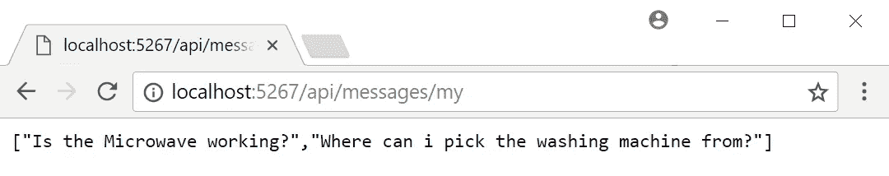
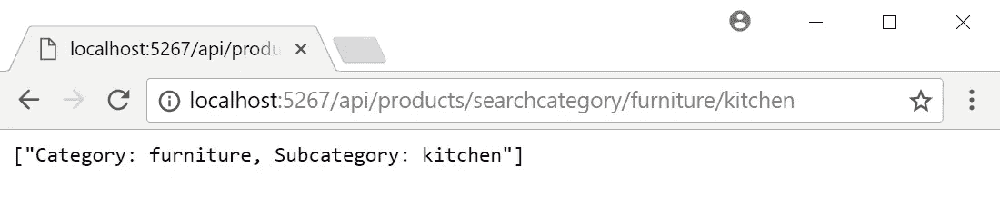
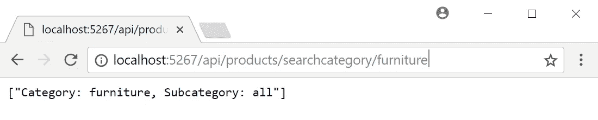

# ASP.NET 核心中的路由

> 原文：<https://medium.com/quick-code/routing-in-asp-net-core-c433bff3f1a4?source=collection_archive---------0----------------------->

ASP.NET 核心中的路由是将传入请求映射到驻留在控制器和方法中的应用程序逻辑的过程。

ASP。NET Core 基于您在应用程序中配置的**路由**来映射传入的请求，并且对于每个路由，您可以设置特定的配置，比如默认值、消息处理程序、约束等等。

在 ASP.NET 核心应用程序中，有几种控制路由的方法，但是在本文中，我们将集中讨论两种最常见的方法:

*   **常规路由**:路由是根据路由模板中定义的约定确定的，在运行时，路由模板会将请求映射到控制器和动作(方法)。
*   **基于属性的路线**:路线是根据您在控制器和方法上设置的属性确定的。这些将定义控制器动作的映射。

# 传统路由

在传统的路由风格中，在应用程序启动期间，您定义路由模板，每次收到传入请求时都会查询这些模板，以便进行 URL 匹配。这个过程最终会映射到一个控制器和其中的一个方法。如果没有为传入请求找到路由，将向调用者返回 HTTP 错误 404(未找到)。

当你在你的启动类中调用了`ConfigureServices`方法内的`AddMvc`和`Configure`方法内的`UseMvcWithDefaultRoute`方法，同时，在幕后，MVC 框架添加了一个路由处理程序，并将路由设置为默认模板，看起来是这样的:

```
"{controller=Home}/{action=Index}/{id?}"
```

该模板定义了对于收到的每个请求，请求管道将尝试断开其 URL，以便第一部分将被映射到控制器名称，第二部分(`/`之后的部分)将被映射到控制器内部的方法，第三部分(如果存在)将被用作路由参数(用花括号`{}`括起来)以映射到使用`id`方法的参数。

当 ASP.NET 核心搜索控制器时，它从模板中取出控制器部分，并将其与后缀控制器连接起来。这意味着，您可以只编写`/Example/SomeAction`，而不是使用`/ExampleController/SomeAction`形式的 URL。

## 定义新的路线模板

要在应用程序中定义路由模板，最简单的方法是使用`UseMvc`方法，而不是在启动类的`Configure`方法中使用`UseMvcWithDefaultRoute`。此方法允许您在应用程序中定义想要的路线。例如，在`GiveNTake`应用程序中，如果我们希望我们的应用程序不仅支持默认路由，还公开带有`api`前缀的 RESTful API(即以`/api/[controller]/[action]`形式的 URL)，那么这就是我们需要如何更改我们的`Configure`方法:

```
public void Configure(IApplicationBuilder app, IHostingEnvironment env)
{
    ...    app.UseMvc(routes =>
   {
       routes
           .MapRoute(name: "default", template: "{controller=Home}/{action=Index}/{id?}")
           .MapRoute(name: "api", template: "api/{controller}/{action}/{id?}");
   });}
```

`MapRoute`方法是您可以为您的应用程序定义路线的方法，您可以多次调用它来设置多个路线模板。

为了测试您刚刚配置的路由，在`Controllers`文件夹中添加一个新的空类，并将其命名为`MessagesController`。将以下代码粘贴到您创建的文件中。它应该如下所示:

```
using Microsoft.AspNetCore.Mvc;namespace GiveNTake.Controllers
{
    public class MessagesController : Controller
    {
        public string[] My()
        {
            return new[]
            {
                "Is the Microwave working?",
                "Where can i pick the washing machine from?",
            };
        } public string Details(int id)
        {
            return $"{id} - Is the Microwave working?";
        }
    }
}
```

运行项目并在浏览器中导航到`[http://localhost:{port}/api/messages/my](http://localhost:{port}/api/messages/my.)` [。](http://localhost:{port}/api/messages/my.)

您的浏览器应该会显示如下页面:



`MapRoute`方法允许您以更高级的方式控制路线。这里是完整的`MapRoute`签名，但是它有重载，使得一些参数是可选的:

```
IRouteBuilder MapRoute(this IRouteBuilder routeBuilder, 
    string name, 
    string template, 
    object defaults, 
    object constraints, 
    object dataTokens)
```

这些参数操作如下:

*   `name`:每条路线都应该有一个唯一的名称，以便识别。该名称不影响路由过程，但在出现路由故障时非常有用，ASP.NET 核心会通知您路由问题。
*   `template`:这是路线的核心。这定义了应该映射到控制器、动作和参数的 URL 结构和令牌。
*   `defaults`:这定义了不同令牌的默认值，以防它们在请求 URL 中丢失。
*   `constraints`:此参数包含路由中令牌的单个约束规则，这些规则确定该值对于该路由中的令牌是否可接受。
*   `data token`:这些是与路线相关的附加值。它们不会影响匹配过程，但是当路由确定后，这些值将被添加到控制器的`RouteData.DataTokens`集合属性中，并可以在它的逻辑中使用。

下面是我们的 API 路由定义的一个改进版本，它将控制器的默认值设置为`Messages`，将动作设置为`My`，并且还对`id`参数设置了一个约束，只允许整数:

```
MapRoute(
   name: "api", 
   template: "api/{controller}/{action}/{id?}",
   defaults: new { Controller = "Messages", action="My" },
   constraints: new { id = new IntRouteConstraint() });
```

`defaults`和`constraints`也可以在模板本身内部设置，因此我们之前创建的 API 定义与此相同:

```
MapRoute(
   name: "api",
   template: "api/{controller=Messages}/{action=My}/{id:int?}");
```

传统路由是一种简单的机制，通常适用于小规模的 API。但是随着 API 的增长，您很快就会发现需要一种更细粒度的方法来定义路由，如果是这样的话，最好使用基于属性的路由。此外，开发网站或应用程序可以通过学习[ASP.NET 教程](https://coursesity.com/free-tutorials-learn/asp-net)轻松完成。

# 基于属性的路由

通过使用修饰控制器和方法的属性，基于属性的路由允许您控制每个控制器和动作参与的确切路线。我建议您对大多数 API 使用这种方法，因为这将使您的代码更加明确，并减少在添加更多控制器和动作时可能引入的路由错误。

`ProductsController`看起来是这样的:

```
[Route("api/Products")]
[ApiController]
public class ProductsController : Controller
{
    ...   
}
```

修饰`ProductController`的`RouteAttribute`属性包含映射到这个控制器的 URL 模板。在这种情况下，带有前缀为`/api/products/`的 URL 的每个请求都将被路由到这个控制器。您可以在控制器和方法上使用`RouteAttribute`属性，但是对于方法，建议使用`Http[Verb]Attribute`属性，其中`[Verb]`是标准 HTTP 动词之一(`Get`、`Post`、`Put`、`Delete`等等)。

可以多次分配`Http[Verb]Attribute`和`RouteAttribute`属性来定义多个路由，并且是分层的，这意味着它们支持路由继承。这意味着如果您在控制器上配置了一个路由，那么您在方法上定义的路由将会扩展它。

例如，下面是如何配置将`ProductsController.GetProducts`方法映射到 URL `/api/products/all`和 URL `/api/products`的`HttpGet`请求:

```
[HttpGet]
[HttpGet("all")]
public string[] GetProducts()
{
    ...    
}
```

> **注**
> 
> 如果您在一个方法上设置的`Http[Verb]Attribute`包含一个以`/`开头的字符串，那么它将不会与控制器中定义的路由相结合，而是定义一个自己的路由。

## 参数化路线模板

基于属性的路由支持一些放在方括号(`[`和`]`)中的预定义标记，它们将在运行时被替换为相应的值:

*   `[controller]`:这将被替换为控制器名称。
*   `[action]`:这将被替换为方法名。
*   `[area]`:如果您的应用程序支持区域，这将被替换为控制器所在的区域。区域功能不在本书讨论范围内，但是更多信息可以参考[https://docs . Microsoft . com/en-us/aspnet/core/MVC/controllers/areas](https://docs.microsoft.com/en-us/aspnet/core/mvc/controllers/areas)。

例如，我们可以这样写，而不是在`RouteAttribute`中显式地写`ProductsController`:

```
[Route("api/**[controller]**")]
[ApiController]
public class ProductsController : Controller
{
    ...
}
```

花括号(`{}`)中的标记定义了路由参数，如果路由匹配，这些参数将被绑定到方法参数。

例如，假设您希望公开一个 API 来搜索产品，基于关键字，以对格式为`/api/products/search/keyword`的 URL 的`GET`请求的形式。你可以这样写:

```
[HttpGet("search/{keyword}")]
public string[] SearchProducts(string keyword)
{
    ...
}
```

就像传统的布线一样，您可以在布线参数上定义默认值和约束。

# 默认值

默认值是通过在路径参数旁放置等号来定义的。请注意，将默认值放在方法参数上(不在根模板中)是行不通的，因为路由管道无法通过查看可选参数来找到匹配。

例如，`GiveNTake`应用程序允许用户通过指定类别和子类别来搜索产品；但是，子类别是可选的，如果省略，默认的`subcategory`将是`all`。以下代码片段向您展示了如何定义这些规则:

```
[HttpGet("searchcategory/{category}/{subcategory=all}/")]
public string[] SearchByProducts(string category,string subcategory)
{
    return new[]
    {
        $"Category: {category}, Subcategory: {subcategory}"
    };
}
```

运行应用程序并导航至`http://localhost:[port]/api/products/searchcategory/furniture/kitchen`，然后导航至`[http://localhost:[port]/api/products/searchcategory/furniture](http://localhost:[port]/api/products/searchcategory/furniture.)` [。](http://localhost:[port]/api/products/searchcategory/furniture.)

对于第一个 URL，您应该会看到类似如下的结果:



第二个 URL 应该产生如下输出:



# 限制

路由属性中的内联约束是通过在路由参数名称后放置一个带有约束名称`:constraint-name`的冒号来使用的，其中 constraint-name 是通过创建一个实现`IRouteConstraint`接口的类来定义的约束，或者只是通过使用 aspnet 文档中指定的内置约束之一来定义的约束，该文档位于[https://docs . Microsoft . com/en-us/aspnet/core/fundamentals/routing？highlight = routing # route-constraint-reference](https://docs.microsoft.com/en-us/aspnet/core/fundamentals/routing?highlight=routing#route-constraint-reference)

下面的例子展示了我们如何将一个`search`方法添加到我们的`ProductsController`中，该方法根据产品在线发布的日期进行搜索。此操作的 URL 必须将日期参数限制为仅使用`datetime`格式；因此，我们将像这样使用`datetime`约束:

```
[HttpGet("search/**{date:datetime}**/{keyword}/")]
public string[] Search(string date, string keyword)
{
    return new[]
    {
        $"Date: {date}, keyword: {keyword}"
    };
}
```

ASP.NET 核心中的路由基础设施非常复杂，还有很多本书范围之外的特性没有涉及。有关 aspnet 核心中路由功能的更多详细信息，请参考位于[https://docs . Microsoft . com/en-us/aspnet/Core/fundamentals/routing](https://docs.microsoft.com/en-us/aspnet/core/fundamentals/routing)的文档。

*如果你喜欢阅读这篇文章，你一定要看看* [*用 ASP.NET 核心*](https://www.amazon.com/Hands-Full-Stack-Development-ASP-NET-Core/dp/178862288X) *动手做全栈 Web 开发。一个包含示例的分步指南，* [*使用 ASP.NET 核心*](https://www.packtpub.com/web-development/hands-full-stack-web-development-aspnet-core) *进行实际操作的全栈 Web 开发，带您构建一个包含后端和前端产品的完整系统，包括 ASP.NET 核心、实体框架、TypeScript、Angular、React、Vue 和 Azure。*