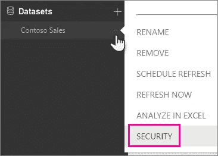
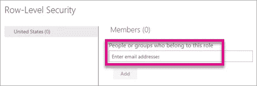
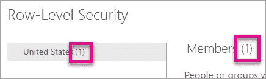

# 如何在 Power BI 中实现行级安全性

> 原文：<https://medium.com/edureka/row-level-security-in-power-bi-ffa61ad32685?source=collection_archive---------2----------------------->

当涉及到任何数据的安全方面时，限制用户对任何数据的访问是使用的关键技术之一。在本文中，我们将了解如何在 Power BI 中实现行级安全性:

*   Power BI 中的行级安全性是什么？
*   在 Power BI Desktop 中定义角色和规则
*   管理模型的安全性
*   与成员一起工作
*   Power BI 中行级安全性的局限性

# Power BI 中的行级安全性是什么？

Power BI 中的行级安全性可用于限制给定用户的数据访问。筛选器在行级别限制数据访问，您可以在角色中定义筛选器。请注意，在 Power BI 服务中，工作空间的成员可以访问工作空间中的数据集。RLS 不限制这种数据访问。

您可以使用 Power BI Desktop 为导入到 Power BI 中的数据模型配置 RLS。还可以在使用 DirectQuery 的数据集(如 SQL Server)上配置 RLS。以前，您只能在 Power BI 之外的内部分析服务模型中实施 RLS。对于 Analysis Services 实时连接，您可以在内部模型上配置行级安全性。对于实时连接数据集，不会显示安全选项。

# 在 Power BI Desktop 中定义角色和规则

您可以在 Power BI 桌面中定义角色和规则。当您发布到 Power BI 时，它还会发布角色定义。这是 Power BI 中行级安全性的一个重要方面。要定义安全角色，请按照下列步骤操作。

1.  将数据导入 Power BI Desktop 报告，或配置 DirectQuery 连接。
2.  **注意:**您不能在 Power BI Desktop 中为 Analysis Services live connections 定义角色。您需要在 Analysis Services 模型中这样做。
3.  选择**管理角色**。
4.  选择**造型**选项卡。
5.  选择**建模**选项卡。
6.  选择**管理角色**。

4.选择**创建**。

5.提供角色的名称。

6.选择要应用 DAX 规则的表。

7.输入 DAX 表达式。该表达式应返回 true 或 false。例如:[实体 ID] = "值"。

**注意:**您可以在这个表达式中使用 *username()* 。请注意，在 Power BI 桌面中，*用户名()*的格式为*域名用户名*。在 Power BI 服务和 Power BI 报告服务器中，它采用用户的用户主体名称(UPN)的格式。或者，您可以使用 *userprincipalname()* ，它总是以用户主要名称*username@contoso.com*的格式返回用户。

8.创建 DAX 表达式后，可以选择表达式框上方的复选标记来验证表达式。

**注意:**在这个表达式框中，使用逗号分隔 DAX 函数参数，即使您使用的是通常使用分号分隔符的语言环境(例如法语或德语)。

9.选择**保存**。

您不能在 Power BI Desktop 中为用户分配角色。您可以在 Power BI 服务中分配它们。通过使用*用户名()*或 *userprincipalname()* DAX 函数并配置适当的关系，您可以在 Power BI Desktop 中启用动态安全性。

默认情况下，无论关系设置为单向还是双向，行级安全筛选都使用单向筛选器。通过选择关系并选中**在两个方向应用安全过滤器**复选框，您可以手动启用具有行级安全性的双向交叉过滤器。当您还在服务器级实现了动态行级安全性时，您应该选中此框，其中行级安全性基于用户名或登录 ID。

**验证 Power BI Desktop 中的角色**

创建角色后，在 Power BI 桌面中测试角色的结果。

1.  选择**查看角色**。

2.在**角色视图**中，您可以看到您创建的角色。

3.选择您创建的角色>**确定**应用该角色。该报告呈现了与该角色相关的数据。

4.您也可以选择**其他用户**并提供给定用户。最好提供用户主体名称(UPN ),因为这是 Power BI 服务和 Power BI 报告服务器使用的名称。

6.选择 **OK** ，报告将根据用户看到的内容进行渲染。

在 Power BI Desktop 中，**其他用户**仅在您使用基于 DAX 表达式的动态安全性时才会显示不同的结果。

# 管理模型的安全性

要管理数据模型的安全性，您需要执行以下操作。

1.  为数据集选择**椭圆(…)** 。
2.  选择**安全**。

这将带您进入 RLS 页面，您可以向在 Power BI Desktop 中创建的角色添加成员。只有数据集的所有者会看到可用的安全性。如果数据集在一个组中，则只有该组的管理员才能看到安全选项。

您只能在 Power BI Desktop 中创建或修改角色。

# 与成员一起工作

## 添加成员

您可以通过键入要添加的用户、安全组或分发列表的电子邮件地址或名称来为角色添加成员。您不能添加在 Power BI 中创建的组。您可以添加组织外部的成员。

您还可以通过角色名称旁边或成员旁边的括号中的数字来查看有多少成员是角色的一部分。

## 移除成员

您可以通过选择成员名称旁边的 X 来删除成员。

**验证 Power BI 服务中的角色**

您可以通过测试角色来验证您定义的角色是否正常工作。

然后，您将看到适用于该角色的报告。此视图中不显示仪表板。在上面的蓝色栏中，您将看到正在应用的内容。

您可以通过选择现在显示为的**来测试其他角色或角色组合。**

您可以选择以特定人员的身份查看数据，也可以选择可用角色的组合来验证他们正在工作。

要返回正常查看，选择**返回行级安全**。

**使用 username()或 userprincipalname() DAX 函数**

您可以利用数据集中的 DAX 函数 *username()* 或 *userprincipalname()* 。您可以在 Power BI Desktop 的表达式中使用它们。当您发布您的模型时，它将在 Power BI 服务中使用。

在 Power BI Desktop 中， *username()* 将以 *DOMAINUser* 的格式返回用户， *userprincipalname()* 将以*user@contoso.com*的格式返回用户。

在 Power BI 服务中， *username()* 和 *userprincipalname()* 都将返回用户的用户主体名称(UPN)。这看起来像一个电子邮件地址。

**使用 RLS 和 Power BI 中的应用工作区**

如果您将 Power BI Desktop 报告发布到 Power BI 服务中的应用工作区，这些角色将应用于只读成员。您需要指明成员只能在应用工作区设置中查看 Power BI 内容。

**警告:**如果您已配置应用工作区，使成员拥有编辑权限，则 RLS 角色将不会应用于他们。用户将能够看到所有的数据。

# Power BI 中的限制行级安全性

下面列出了云模型中行级安全性的当前限制。

*   如果您以前在 Power BI 服务中定义了角色和规则，则必须在 Power BI Desktop 中重新创建它们。
*   您只能在使用 Power BI Desktop 创建的数据集上定义 RLS。如果要为用 Excel 创建的数据集启用 RLS，必须先将文件转换为 Power BI Desktop (PBIX)文件。
*   仅支持 ETL 和 DirectQuery 连接。与 Analysis Services 的实时连接是在内部模型中处理的。
*   RLS 目前不支持 Cortana。

至此，我们结束了 Power BI 中的这种行级安全性。我希望您对行级安全性有所了解。

如果你想查看更多关于人工智能、DevOps、道德黑客等市场最热门技术的文章，你可以参考 Edureka 的官方网站。

请留意本系列中的其他文章，它们将解释 PowerBI 的各个方面。

> *1。* [*动力 BI 仪表盘*](/edureka/power-bi-dashboard-fe37c2b9292c)
> 
> *2。* [*电力匕桌面*](/edureka/power-bi-desktop-42c867c712ca)
> 
> *3。*[*power bi KPI*](/edureka/power-bi-kpi-c256a3749da5)
> 
> *4。* [*电力毕报道*](/edureka/power-bi-reports-c64ee557e346)
> 
> *5。* [*小技巧做出有影响力的&互动力量 BI 报道*](/edureka/power-bi-reports-c64ee557e346)
> 
> *6。*[*DAX in Power BI*](/edureka/power-bi-dax-basics-27008f4f7978)
> 
> *7。*[*vs 权力毕*](/edureka/msbi-vs-power-bi-ef5dab26c463)
> 
> *8。* [*电力 BI 开发人员工资*](/edureka/power-bi-developer-salary-1ce0577f1013)
> 
> *9。* [*电力 BI 架构*](/edureka/power-bi-architecture-270bdd8b5e25)

*原载于 2019 年 10 月 11 日*[*https://www.edureka.co*](https://www.edureka.co/blog/row-level-security-in-power-bi/)*。*