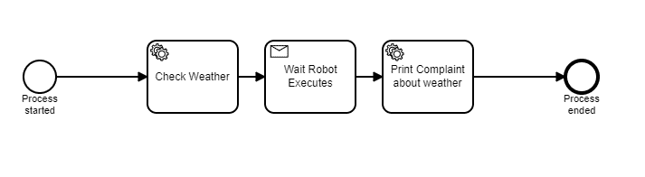
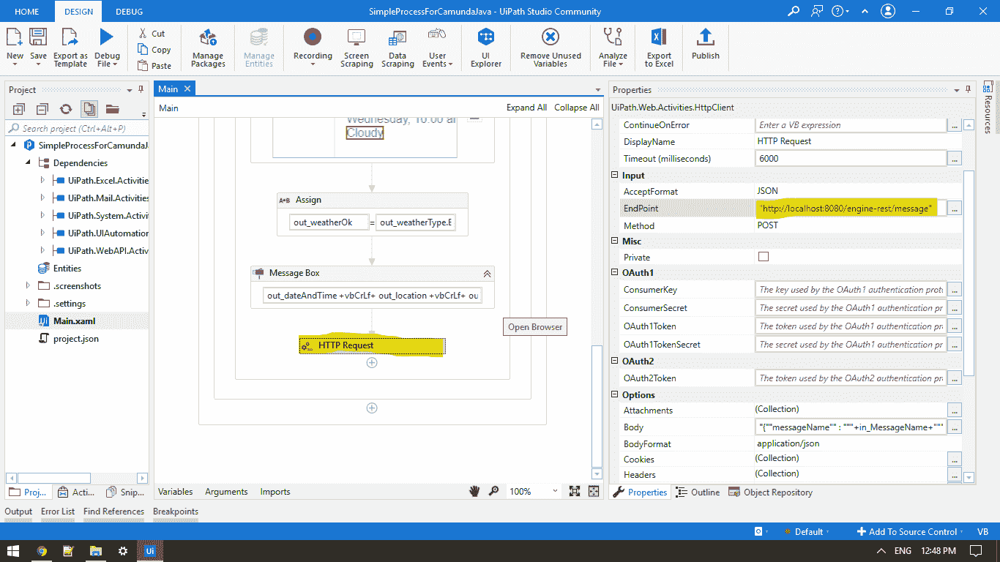

# RPA 和 BPM 一起—自动化组合

> 原文：<https://medium.com/globant/rpa-and-bpm-together-an-automation-combo-df0e007730c?source=collection_archive---------0----------------------->

*ui path 和 Camunda BPM 的集成*

**什么是 RPA？**

让我们从机器人流程自动化(RPA)开始，它由 UiPath 定义为一种技术，允许任何人配置计算机软件，或“机器人”模拟和集成数字系统中的人类交互动作，以执行业务流程。RPA 机器人像人类一样利用用户界面来捕获数据和操作应用程序。它们解释、触发响应，并与其他系统通信，以执行各种各样的重复任务。只有实质上更好:RPA 软件机器人从不睡觉，不会犯任何错误(如果编码很好)。

**什么是 BPM？**

UiPath 将业务流程管理(BPM)定义为:“一种简化业务流程以获得最大效率和价值的方法。这是对流程运行方式的深入观察。BPM 通过识别需要改进的领域并构建解决方案来做到这一点——通常是从头开始。BPM 就是要确保业务流程的基础设施是稳固的。”因此，BPM 的重点更加广泛，它是一种从端到端管理整个业务流程的综合方法。企业不需要在 RPA 或 BPM 之间做出决定，因为 RPA 可以很好地补充 BPM。

**RPA 与 BPM 的对比**

每项业务最终都是任务、事件和决策的总和，这些任务、事件和决策构成了整个业务流程。在工作流自动化的世界中，BPM 可以被视为一个从头到尾涉及多个活动的全面自动化的业务流程。另一方面，RPA 是一种处理更小的重复性任务的技术，这些任务可以由只构成业务流程一部分的机器人来执行。

**RPA 和 BPM** 一起提供自动化组合

如果我们将 RPA 和 BPM 结合在一起会怎么样。这对自动化行业来说可能是一个改变游戏规则的组合。两者可以互相替代。为了详细解释这一点，我将选择一个名为 Camunda 的 BPM 工具和一个简单的用例。

**端到端流程自动化的用例**

几乎每个组织都在运行数百甚至数千个不同的应用程序，这些应用程序要么是现成的，要么是他们自己构建的，都与执行他们的业务流程有关。因此，大多数业务流程跨越不同的系统或服务，它们从开始到结束(“端到端”)都不是在一个系统中执行的。这通常是不可避免的，有时甚至是所期望的。

该示例可应用于任何需要用自动化任务取代人工工作(BPMN 的用户任务)的场景，以及外部应用程序或其他系统未公开其 API 或没有 API 的场景，因此在 GUI 的帮助下，我们可以通过自动化这些任务来完成工作，并且可以直接从 Camunda 调用。因此，通过 UiPath，我们让机器人执行任务，从 Camunda 执行这些任务，并等待完成任务，直到从 Orchestrator 获得回调。

**架构概述:**

Camunda 如何与 UiPath 交互？

高级解决方案:

> 将您的自动化发布给 Orchestrator
> Camunda Task 有一个 Java 类的实现。
> 创建一个能够调用 Orchestrator API 的 Java 类。
> (UiPath Orchestrator 正在公开 API，如获取信息和运行流程、作业、机器人等)
> Camunda 还公开了一个类似回调函数的 API，从 Camunda 我们触发流程，在流程结束时，我们再次调用 camunda API，这有助于我们恢复流程

**举例-**

这是我们正在执行在 orchestrator 中创建的作业的检查方法的图像。在等待中，机器人执行它将等待通过 orchestrator 开始执行的进程的响应。

在流程工作流中，我们可以在最后向 BPM 服务器发送一个 REST HTTP 请求，该服务器已经处于接收请求并继续下一个操作的监听模式。

> 工具:
> BPMN:卡蒙达
> RPA: UiPath

**优点:**

BPM 与 RPA 的协同优势

1.  今天的高度自动化包括多种工具的组合。因此，从这个意义上说，RPA 产品和 Camunda 等端到端过程自动化产品是互补的。您可以通过让 Camunda 将 RPA 机器人与业务流程的其他部分编排在一起，从而将它们结合起来。
2.  加速 BPM 机器，有时需要手动干预，这种结合有助于我们实现高度自动化
3.  RPA 使您能够管理更精简、更高效的员工队伍。
4.  无缝集成，但不会损害您现有的环境
5.  直接结果
6.  不同应用交互将是可能的
7.  消除瓶颈
8.  优化 API