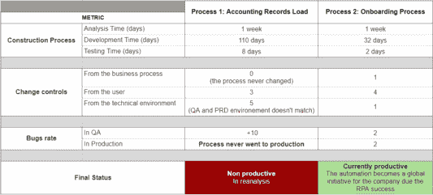

# 爱国军和 BPMN:一个简要的研究案例

> 原文：<https://medium.com/globant/rpa-and-bpmn-a-brief-study-case-4e5653bfbe6a?source=collection_archive---------1----------------------->

## 展示了这种组合在推动业务流程方面的力量

你好伙计们！自从我们的第一篇文章以来，已经有一段时间了，在第一篇文章中，我们讨论了什么是“[在开始 RPA…](/globant/nice-to-know-before-start-with-rpa-e80416f25860) 之前很高兴知道的”，一些了解 RPA(机器人流程自动化)的好处和坏处的技巧，以及 RPA 技术的发展方向。

这一次我们在这里谈一点 RPA 和 BPMN(业务流程建模符号)之间的关系。这似乎是显而易见的，但根本不是。一些项目使用另一种标准进行流程建模；甚至在一些情况下，过程没有被记录。BPMN 和 RPA 共同制定了一个强大的战略来提高 RPA 的成功率，并通过自动化不断推进业务流程转型。本文将展示在实践中结合 RPA 和 BPMN 的优势。

# 关于爱国军和 BPMN

作为介绍，我们想了解一下我们今天要讨论的两个主题的官方定义是什么:

> [RPA](https://www.uipath.com/rpa/robotic-process-automation) 是一项强大的技术，它可以通过软件用户界面模拟几乎任何类型的人类行为，但几乎删除了人类最常见的两个弱点:操作能力下降和高错误风险；并且当没有可用的 API 资源时(通常在遗留软件中)特别有用。诞生于众所周知的 BPM(业务流程管理)和管理所有业务流程的需求。一旦公司达到管理它们的重要里程碑，下一步就是优化。

另一方面，

> [BPMN](https://www.bpmn.org/) 是 OMG 集团开发的一个著名的建模流程图，它为流程建模提供了一个标准，便于不同的利益相关者理解:开发者、客户、CEO 和业务分析师。BPMN 为组织提供了以标准方式传达这些程序的能力。此外，图形符号将有助于理解组织之间的绩效协作和业务交易。

# 为什么要将 RPA 技术与 BPMN 标准相结合？

在流程自动化的定义阶段，有必要了解当前流程的行为，如果我们实施 RPA，会有哪些改进，以及控制 RPA 在每个流程中的行为的备选途径。在这个场景中，BPMN 作为流程如何工作的图形化表示和识别可能的自动化点的一个选项出现。总而言之，结合 RPA 和 BPMN 的优势在于:

*   在 BPMN 中使用流程文档是一种很好的方式，可以识别自动化的强有力候选对象，甚至检测哪些流程步骤是开始自动化的理想步骤(在这种情况下，流程将分阶段自动化)。
*   您拥有强大的技术工具，如 BPMS(业务流程管理软件)，您可以将这些工具与 RPA 技术集成，直接从业务流程设计中自动化重复性和标准任务。
*   过程定义对于任何涉众来说都更容易理解，比用纯文本记录过程更容易理解。此外，更容易显示自动化将改进业务流程的点。
*   自动化设计让您可以快速识别替代路径并处理可能的错误。
*   额外的需求(与业务流程无关)，比如流程通知和日志生成，可能会被识别并包含在自动化中。

# 两个 RPA 业务案例

在以下部分中，我们将讨论实施 RPA 技术的两个不同业务案例，展示如何从实施可行性的角度分析和评估它们，以及它们的最终结果。每个案例都有 [A/B 测试](https://hbr.org/2017/06/a-refresher-on-ab-testing)，证明在分析过程中采用 BPMN 标准的重要性。

## 流程#1:自动化会计记录加载的 RPA

该业务流程负责通过内部 ERP 上传会计记录。此处描述了该过程的摘要:

1.  选择一个 SFTP 目录并下载文件。
2.  打开 Google 工作表，验证所需的选项卡及其相应的标题是否存在。
3.  验证多个字段中的业务规则，以确保信息正确填写，并保存中的每个选项卡。txt 格式。
4.  打开 ERP，选择相应的菜单并上传文件。
5.  等待成功上传消息，从 ERP 获取验证号，并通过电子邮件向业务流程所有者发送通知，告知此信息。如果失败，向业务流程所有者发送一封错误通知电子邮件。

在下表中，我们可以看到流程 1 的可行性评估结果，该结果显示了 RPA 实施中先验的高成功概率:

Table 1\. Quantitative analysis for process 1.

## 流程#2:自动化入职流程的 RPA

这个业务流程负责执行欢迎新人的活动，特别是针对公司的一个站点。该过程的总结如下:

1.  选择一个特定的 Google Drive 链接，打开 Google sheet 并验证两个搜索标准以获得新的收入。
2.  对于结果行，获取多列的信息以执行以下步骤。
3.  点击电子邮件分发列表链接，使用从谷歌表单中提取的电子邮件添加新收入。
4.  打开 Gmail 帐户，选择电子邮件模板，添加收件人，编辑新收入的名称，然后发送电子邮件。
5.  打开 Slack，选择特定的频道，添加新成员并编写欢迎消息。
6.  通过电子邮件发送通知，报告流程结果。

与流程 1 一样，对于流程 2，我们有一个显示实施可行性评估结果的表格:

Table 2\. Quantitative analysis for process 2.

与前面的过程相反，在这种情况下，BPMN 实现了:

[Image 1\. Onboarding Process](https://drive.google.com/file/d/1VckfwdCex-tb7V1Wr-oEQkyh8BVcWd-2/view?usp=sharing): Generic BPMN without full details to protect the business process confidentiality.

尽管这不是一个严格的规则，这个简短的研究案例显示了所分析的流程(其中包括 BPMN 实现)相对于没有活动流设计的流程的显著优势。这两个过程都非常复杂，有相当多的操作场景。尽管如此，两者在 RPA 实施方面取得成功的可能性是一样的，因为它们的重复过程在执行之间没有可变性，并且除了具有结构化数据输入之外，还具有中高的稳定性。

然而，作为**过程 2** 分析的一部分，BPMN 的加入允许功能和技术设计团队检测所有现有的路径，并分析过程的临界点，其中存在控制机器人响应的决策分支。虽然在**流程 2** 中，分析中定义的操作场景数量相当准确，但在**流程 1** 的自动化过程中，我们发现至少有十个操作场景在 RPA 构建中不受控制，导致高错误率、多次控制变更、比预期更多的支持工作量增加以及最终用户受益较少。

Table 3\. Results comparison table.

# 推荐的良好做法

从之前的练习中，我们获得了一些有助于更成功实施 RPA 的提示，因为使用 BPMN 标准加强业务案例分析将有助于更好地理解流程:

*   在实施 RPA 项目之前，定义一个流程管理系统非常重要，在该系统中，所有流程(或者至少是要自动化的流程)都已记录在案。
*   永远不要自动化未记录的过程，因为这可能意味着在实现中重新处理。正如您在第一个案例中所看到的，没有一条清晰的路径，这将增加事件的数量，并且不容易稳定该过程。
*   在 RPA 项目的需求工件中，当前的(现在的)和期望的(将来的)过程的文档是“必须的”。使用 BPMN 为两种场景的图流建模，这将帮助您识别“现状”和“未来”流程中的所有常规和例外路径。
*   并非所有完整的流程都适合使用 RPA 实现自动化。使用 BPMN 图表来着色/突出候选人可以使用 RPA 实施的步骤。这将允许团队关注将要自动化的活动以及这些活动所遵循的路径。

**参与文章创作的作者:**

Check out the profile of some of the authors: [Chabeli Sinisterra Pussey](/@chabe.sp), [Fredy Eduardo Carvajal](/@fredy.carvajal), [Ana Maria Ochoa](/@ana.ochoa), [David Leonardo Galindo](/@david.galindo_32533).