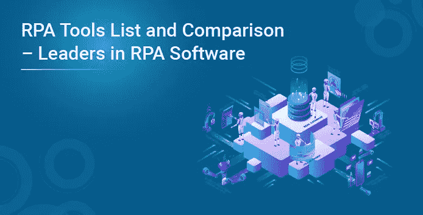
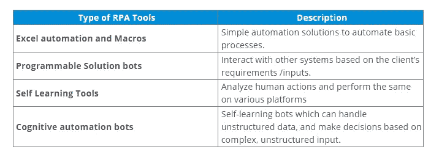
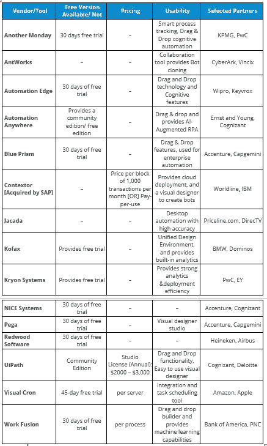
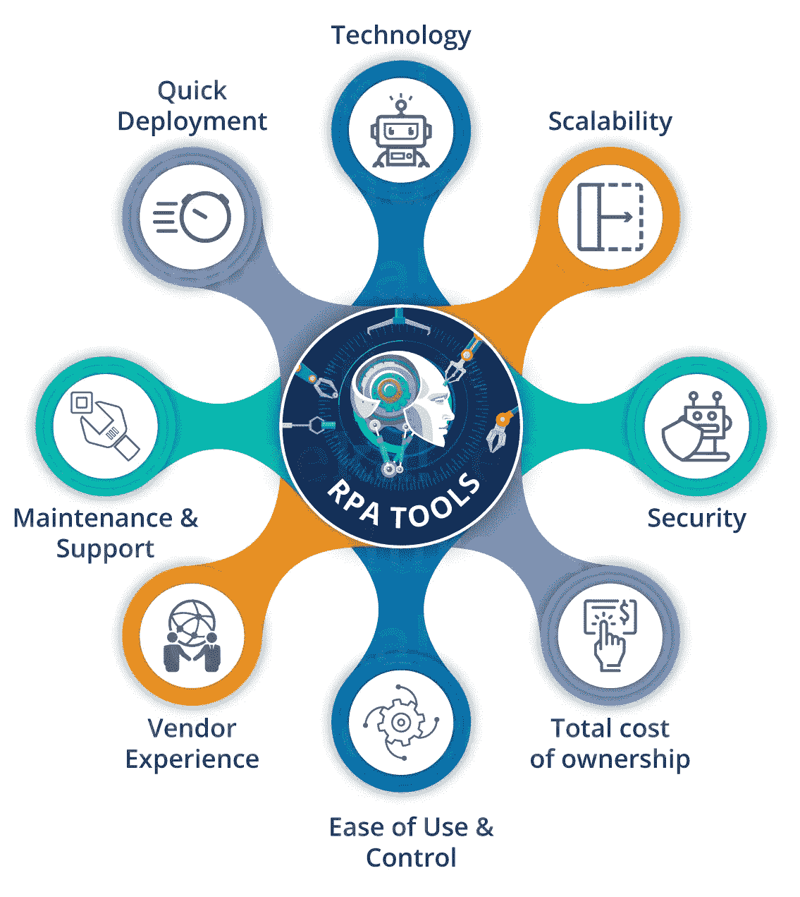
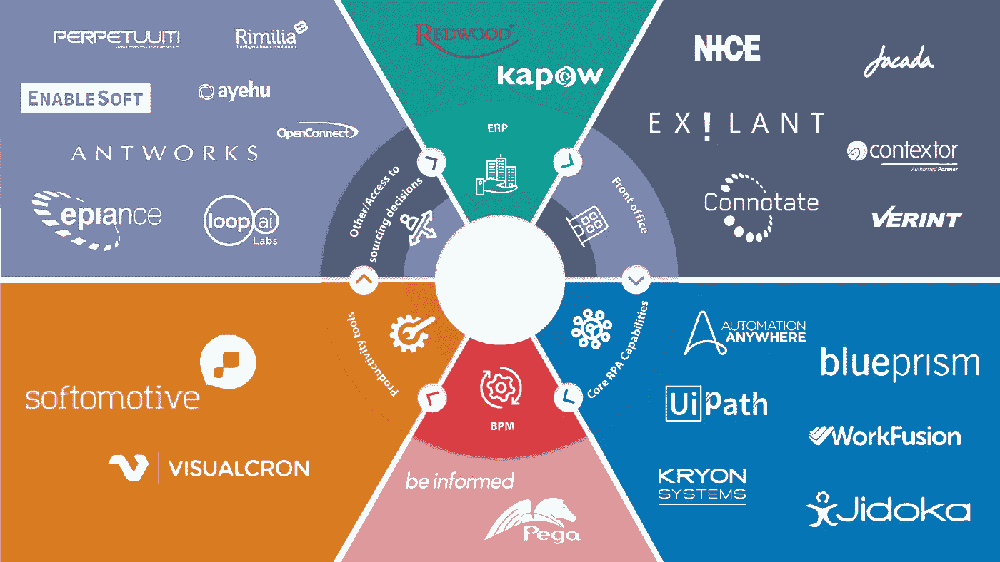

# RPA 工具列表和比较—RPA 软件的领导者

> 原文：<https://medium.com/edureka/rpa-tools-list-and-comparison-rpa-software-ef92c5254de0?source=collection_archive---------5----------------------->

机器人流程自动化是当今市场上用于自动化日常任务的新时代技术，为此我们需要 RPA 工具。为了提升您在 RPA 领域的职业技能，必须接受 UiPath 培训或 Automation Anywhere 培训，因为这可以帮助您成为一名 RPA 开发人员。在这篇关于 RPA 工具的文章中，将涵盖以下主题:

*   RPA 工具的类型
*   RPA 工具列表
*   RPA 工具比较:ui path vs Blue Prism vs Automation Anywhere
*   选择 RPA 工具的清单

在我详细列出当今市场上的顶级 RPA 工具之前，让我告诉你可用的不同类型的 RPA 工具。

# RPA 工具的类型

所有 RPA 工具可以分为 4 种不同类型的工具，它们是上一代机器人的扩展。同样请参考下表。

既然您已经对可用的工具类型有所了解，那么让我们来看看当今市场上的顶级 RPA 工具列表。

# RPA 工具列表

嗯，正如你在上面看到的，每个工具都有其积极和消极的因素。但是，如果你谈论市场领导者，它是著名的三巨头，即蓝棱镜，UiPath 和自动化无处不在。请参考下表了解这些工具之间的差异。

# RPA 工具比较:ui path vs Blue Prism vs Automation Anywhere

uipath blue PrismAutomation anywhere has Community Edition/Free Edition 最近推出了一个免费版本。最近推出了社区版最受欢迎的工具比自动化更受欢迎比其他人更不受欢迎编程知识要求提供允许用户编写代码的功能，但用户可以不需要它。无需编程知识，免费在线培训和认证计划提供官方认证计划，最近推出了 50 美元的认证。提供专为 Citrix automation for BPO 设计的桌面、web 和 Citrix 自动化。所有媒介都合理。

现在，我已经解释了顶级工具之间的区别，您可以考虑下面的清单来选择适合您的工具。

# 选择正确工具的清单

*   **技术**:大多数组织通过使用虚拟机或 Citrix 环境，在本地桌面之外执行日常任务。因此，该工具应该支持任何类型的应用程序，并且必须是平台独立的。
*   **可扩展性**:在选择 RPA 工具时，您必须考虑该工具高效响应客户/业务需求和变化的难易程度。
*   **安全性**:安全性是任何技术领域的一个重要方面。由于 RPA 工具是软件，所以在生产中部署 bot 时，您需要考虑许多安全措施。
*   **总拥有成本**:包括初始安装成本、维护成本和持续的供应商许可费用。这是选择工具时必须考虑的一个非常重要的参数。
*   **易用性&控制**:你选择的任何工具都必须是用户友好的，以提高员工的满意度和效率。
*   **供应商经验**:建议选择一家在规模和行业方面与你的公司相似的供应商。这有助于你提高执行速度。
*   **维护&支持:**供应商必须遵循支持模型，以确保满足所需的服务水平协议。

既然您知道了选择工具时必须考虑的参数，那么您应该对何时选择哪个工具有所了解。参考下图，了解哪些工具最适合您的需求。

看看上面的工具，如果你想提升你在 RPA 领域的职业技能，那么我们 Edureka 在 UiPath 上提供了一个结构化的课程来帮助你掌握这个工具。我们也是 Automation Anywhere 的官方培训合作伙伴之一，我们将为您提供企业版。如果你想掌握，那么看看我们在 [UiPath](https://www.edureka.co/robotic-process-automation-training) 和 [Automation Anywhere](https://www.edureka.co/automation-anywhere-certification-training) 上的课程。

如果你想查看更多关于人工智能、DevOps、道德黑客等市场最热门技术的文章，那么你可以参考 [Edureka 的官方网站](https://www.edureka.co/blog/?utm_source=medium&utm_medium=content-link&utm_campaign=rpa-tools-list-and-comparison)

*原载于 2018 年 5 月 30 日*[*https://www.edureka.co*](https://www.edureka.co/blog/rpa-tools-list-and-comparison/)*。*