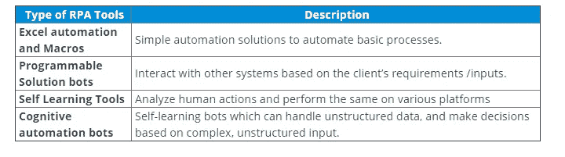
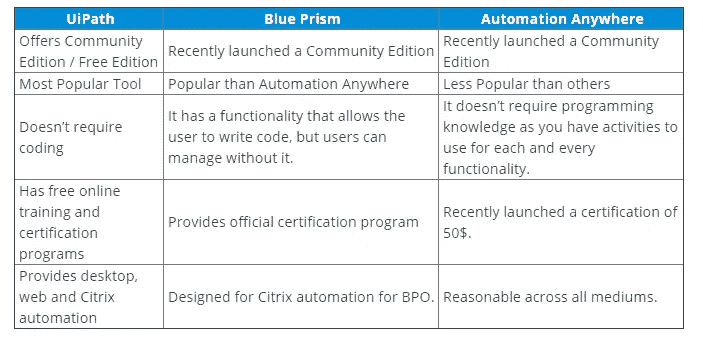
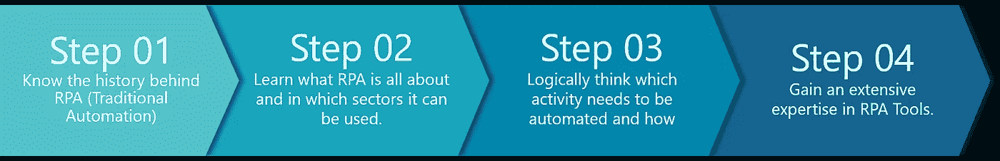
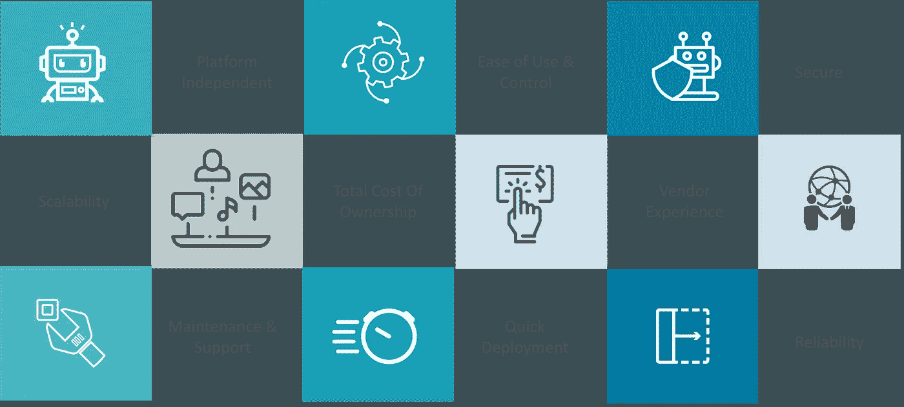
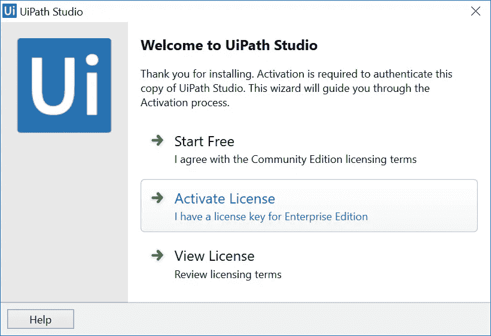
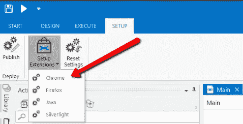
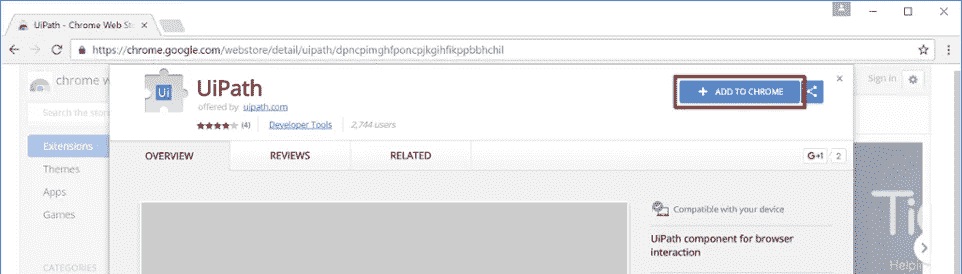
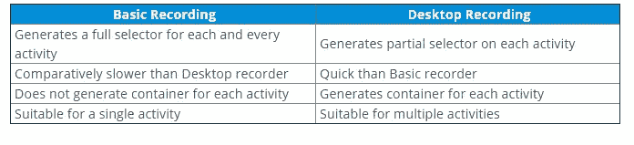

# 2021 年你必须准备的 RPA UiPath 面试问题

> 原文：<https://medium.com/edureka/rpa-uipath-interview-questions-94fa248e4221?source=collection_archive---------3----------------------->

如果您是一名 RPA 开发人员，对工具、流程和技术利用有战略性的了解，并且正在为有经验的学生和新生寻找 RPA UiPath 面试问题和答案，那么您来对地方了。请放心，2021 年将是你的一年。据研究，RPA 的市场份额约为 7.3%。我们收集了一系列 RPA 面试问题，这些问题将有助于你在 RPA 面试中脱颖而出，获得你梦想中的 RPA 开发人员职业。

如果你计划面试一个以 RPA 为中心的角色，这里有一个最受欢迎的 RPA UiPath 面试问题的综合列表。我设身处地为你着想，这篇博客中的大部分答案都是以第一人称写的——一个潜在的 RPA 专家。

为了让您更好地理解，我将这篇文章分为以下几类:

*   通用 RPA 面试问题
*   基本 UiPath 面试问题
*   中级 UiPath 面试问题
*   高级 UiPath 面试问题
*   多项选择问题

# RPA UiPath 面试常见问题

以下是您在任何 RPA 工作面试中可能会遇到的最常见的 RPA UiPath 面试问题:

# RPA UiPath 面试问题:一般 RPA 问题

## Q1。什么是 RPA——机器人过程自动化？

总而言之，在没有任何人类干预的情况下，模仿人类的行动来执行一系列步骤，从而实现有意义的活动，这就是所谓的机器人流程自动化。

这是 RPA 面试问题中最常见的问题。现在让我们向前看，看看它的好处。

## Q2。使用 RPA 有什么好处？

RPA 的优势如下:

1.  **节省成本:**由于它可以自动化几乎所有的手动和重复性任务，您可以减少员工数量，从而降低成本。
2.  **在更短的时间内更准确:**犯错是人之常情，但计算机或机器不会犯任何错误，它们会完全按照指令行事，因此更准确。
3.  **易于实现和学习:**如前所述，不需要编码。任何自动化都可以通过简单的拖放来创建。
4.  **不需要编码！:**可以实施 RPA 来自动化在计算机上完成的任何重复流程。这个过程可以与任何桌面工具或 web 应用程序相关，如果这个过程是重复的，它可以是自动化的，这也需要最少的编码。

## Q3。列出不同类型的 RPA 工具。

## Q4。您能列出一些您在项目期间必须面对的 RPA 挑战吗？

以下是您在项目过程中可能遇到的最常见的挑战:

*   技能资源短缺
*   自动化端到端用例的挑战
*   缺乏必要的业务支持
*   缺乏适当的团队结构
*   定义模糊的业务连续性计划
*   文化冲击
*   自动化用例识别错误
*   不遵循最佳实践
*   RPA 平台供应商提供的支持不够
*   实施后采用

## Q5。提及 RPA 市场上流行的不同工具。

当今市场上使用的不同 RPA 工具如下:

*   UiPath
*   蓝色棱镜
*   自动化无处不在
*   佩加
*   不错的系统
*   视觉克隆
*   科发克斯
*   雅卡达
*   蚂蚁作品
*   又是一个星期一

## Q6。RPA 软件中你必须寻找的因素是什么？

RPA 软件中需要考虑的因素如下:

*   **简单:**企业要确保自己的产品简单，易于学习和实现。
*   **速度:**该软件应该能够设计和测试新的进程，以优化机器人快速工作。
*   **可扩展性:**选择的 RPA 软件应该能够快速扩展，并且能够集中管理。
*   智能:软件应该能够支持简单的基于任务的活动，执行数据操作。
*   **可靠:**工具应具有内置的监控和支持系统，以监控系统的健康状况。
*   **企业级:**软件应该通过提供可扩展性、可靠性来满足公司的需求。

## Q7。ui path vs blue prism vs Automation Anywhere 有什么区别？

## Q8。RPA 有什么特点？

*   **代码自由:** RPA 不需要编程技能。具有任何主题专业知识的员工都可以接受培训，立即自动操作 RPA 工具。整个工作围绕 RPA 图表展开，该图表提供了一个流程图设计器，以图形方式链接、拖放图标来表示流程中的步骤。
*   **用户友好:** RPA 的采用源于业务运营部门，而非 IT 部门。RPA 项目需要较少的 IT 技能和投资。最终，自动化程度大幅降低。
*   **无中断:** RPA 避免了复杂性和风险。软件机器人通过受控的用户界面访问终端用户的系统，因此减少了底层系统编程的必要性。

## Q9。RPA 生命周期的重要阶段是什么？

RPA 生命周期的各个阶段:

*   **分析**:RPA 的第一阶段从分析开始。业务团队和 RPA 架构师一起工作来理解 RPA 开发的业务流程。
*   Bot 开发 : RPA 开发人员(团队)开始在他们的环境中工作，可能是一个独特的开发环境。
*   **测试**:一些公司由单独的测试团队进行测试，而一些公司有专门的测试团队，像正常的 SDLC 流程一样执行专门的 QA。最佳实践是有一个专门的测试团队对开发的 bot 进行 QA。
*   **部署和维护**:在开发和测试阶段之后，一个 bot 就可以发布并进入维护阶段。

## Q10。能不能提一下如何入门 RPA 的步骤？

如下图所示，要开始使用 RPA，您需要遵循以下步骤。

*   **步骤 1:** 在您实际开始使用 RPA 之前，您需要了解 RPA 背后的历史。也就是说，学习所有传统的自动化方法。
*   **第二步:**一旦你了解了 RPA 背后的历史，你就应该了解什么是 RPA，并了解它可以用在哪些部门。
*   一旦你掌握了机器人流程自动化的所有基础知识，你就可以开始自动化你的任务了。为了自动化任务，你必须首先了解它的工作流程，并知道哪些重复性的任务可以自动化。
*   **第 4 步:**最后，您需要获得大量 RPA 工具方面的专业知识，例如 UiPath、Blue Prism&Automation Anywhere。

## Q11。聊天机器人与机器人流程自动化有什么不同？

聊天机器人和 RPA 引擎之间的差异类似于鼠标和猛犸象之间的差异。从名字上看，

聊天机器人(ChatBot)—一个被编程为像人类一样与用户(人类)聊天的机器人。可能会针对用户面临的特定问题推荐预先学习的解决方案，或者提出请求并指示后端系统提供请求。

**RPA(机器人流程自动化)** —一个机器人，被编程为自动执行业务功能内的任务或活动的手动业务流程。业务职能可以是人力资源/财务/采购等。聊天机器人可以是向 RPA 引擎提供输入的媒介，但不能复制 RPA 引擎的功能。

## Q12。传统/ IT 自动化和 RPA 有什么区别？

*   传统的 IT 自动化耗时很长，需要大量的人力、时间、精力和成本。
*   RPA 是一种快速解决方案，可以立即带来改进。
*   传统自动化和 RPA 都需要可靠的战略和规划，但 RPA 的实施很快。
*   虽然两者都旨在实现自动化的共同目标，但 RPA 比传统自动化更快、更好、更便宜。因此，传统自动化是一项战略举措，RPA 是一项战术举措。
*   简而言之，如果你有时间和预算，就去找传统的自动化。如果您现在面临时间和资金方面的业务压力，请选择 RPA。

## Q13。建立运营敏捷性框架需要多长时间？

从项目启动开始，建立初始运营敏捷性框架的平均时间在 4 到 12 周之间。

## Q14。UiPath 和 Selenium 有什么区别？

**Selenium** 是专门为测试 web 应用程序和网站而设计的**，在 Selenium 中不可能与多个应用程序交互并将一个应用程序的输出作为其他应用程序的输入。它根本无法与 Citrix 等虚拟环境一起工作。而 **UiPath** 是一个 **RPA 工具，它被设计成自动化任何类型的现有软件过程**，以取代任何类型的可以由人类执行的活动。**

所以我们可以说 RPA 是现有自动化工具的下一个级别。它允许人们用很少的软件开发技能来构建一个非常复杂的基于规则的过程。您可以使用 UiPath 完成 Selenium 可以完成的所有事情，但反之则不可能。你也可以看看我下面的文章，了解更多关于这些工具的细节。

## Q15。RPA 对前后台处理的一般要求是什么？

事实上，RPA 以其灵活性而闻名，它能够在不影响安全性的情况下满足强大的 it 标准。有可能将机器人软件用于前台和后台办公室。两者的大部分要求是相同的，因此用户不必担心。相同的配置可以很容易地部署，并且可以得到的结果总是在各个方面都是优越的。

## Q16。在自动化的规划阶段，需要优先考虑哪些方面？

在选择工具之后，这是第一个任务，下一个重要的事情是选择正确的**框架**。根据任务的类型，需要选择范围内的**和范围** **外的**项。此后，要考虑测试**环境**。如果需要，用户需要准备项目时间表的图表。同时，**交付物**的**标识**也是需要考虑的一个重要因素。****

## Q17。RPA 中的术语信息收集是什么意思？

在 RPA 中，机器人需要原始数据或信息来平稳可靠地执行操作。他们通常从不同的资源收集该信息，并且也可能手动向他们提供该信息。

## Q18。使用 RPA，需要采用这种方法的组织是否总是必须改变其整个基础架构？为什么或为什么不？

并不总是有必要采用 RPA，组织中的一切都需要改变。事实上，它可以很容易地与现有的基础设施兼容。这主要是因为 RPA 中的最新机器人软件和工具不容易面临任何兼容性问题，并且可以让组织跟上步伐。

## Q19。你怎么能说机器人过程自动化是一种安全可靠的方法呢？

在几个层面上，RPA 也有同样的内容。对所有的供应商来说，好的一面是运行时间因素完全不同于与编辑任何东西相关的过程。没有必要给所有用户相同的操作，但事实上，他们可以被限制。这通常包括创建、设计、运行以及编辑流程。创建的每个日志都能够提供大范围的完整信息。与手动流程相比，RPA 提供了额外的控制和安全性。

## 问题 20。机器人自动化是像屏幕抓取还是宏？

不，管理机器人自动化是从旧技术如屏幕抓图或宏指令发展而来的一代。主要区别是:**机器人是通用的应用程序协调器** —任何可以由人类使用的应用程序都可以由当今的机器人使用，无论是大型机、定制应用程序、传统应用程序、支持 web 服务的应用程序，还是一个紧密的第三方 API 托管服务。机器人收集程序知识，经过一段时间后，这些程序知识加入一个共享库，可以被其他机器人或设备重用。

机器人“读取”应用程序，或者通过提交的 API(如果存在的话)，或者在应用程序出现之前通过操作系统，或者通过关于本机应用程序的屏幕。在最后一种情况下，现代机器人在上下文中以与用户相同的方式“阅读”应用程序屏幕。作为机器人培训的一部分，它显示了如何阅读应用程序的显示，就像显示用户一样。

## 问题 21。瘦客户端和胖客户端有什么区别？

*   **瘦客户端**:这是一个我们在使用任何 RPA 工具进行间谍活动时无法获得质量属性的应用，例如任何虚拟环境。
*   **胖客户端**:这是一个应用程序，我们使用 RPA 工具(如计算器、Internet Explorer)获得相当多的属性特征

## 问题 22。大型机和非大型机应用程序有什么区别？

**大型机应用:**

*   这是一个基于单一屏幕和键盘的应用程序。
*   Blue Prism 支持单独的一组内置命令，尤其适用于大型机应用程序

**非大型机应用:**

*   它包括多个屏幕
*   控件从一个屏幕移动到另一个屏幕。

## 问题 23。什么是会话变量？

会话变量是特定于流程实例的。如果同一个流程的两个实例同时继续，它们都有相同的会话变量，但是会话变量的值会不同。

## 问题 24。提及机器人过程自动化的应用

机器人过程自动化的一些应用如下:

*   **数据提取:**所有企业都需要在日记账中记录自己的交易，以便在以后的流程中使用。代替手工劳动，并时刻牢记交易存储是否正确的问题，机器人可以用来收集和整合交易。
*   **执行财务结算&报告:**通过 RPA 可以轻松处理将各种来源的数据发布到公司子分类账以创建和提交财务文件的繁琐过程。
*   **获取市场报告:**组织可能需要每天获取一些参数的市场情况报告，以与其竞争对手竞争。可以让一个机器人来做这项工作，按时提交一份完整的市场报告。
*   **异常订单的处理:**经常可以观察到销售订单在很多天内保持价格不变。在这种情况下，机器人可以对该特定产品进行价格检查，并用保留价格验证当前价格。
*   **维护客户数据:**在一个企业中，每天可能会有许多客户与业务相关联。现在，每个公司都需要维护每个客户的数据。如果是人来做，那么可能比机器人花的时间更长。但是，如果机器人做这项工作，那么数据可以定期验证和更新。

## 问题 25。选择 RPA 工具时，您必须考虑的几个要点是什么

以下是您在选择 RPA 工具时需要考虑的一些参数。

*   **独立于平台**:许多组织使用 Citrix 或虚拟机在本地桌面之外执行日常任务。所以这个工具必须是独立于平台的，并且应该支持任何类型的应用程序。
*   **易用性&控制**:您选择的 RPA 工具必须是用户友好的，以提高效率和用户满意度。此外，您选择的工具应该需要更少的培训，并具有更好的控制。
*   **安全**:您制定的任何自动化工作流都应该是安全的，以保护您的数据。因此，您需要确保您的工具足够安全以保护您的数据。
*   **可扩展性**:在选择 RPA 工具时，您必须考虑该工具响应业务需求、变更、异常或增加的操作的速度和难易程度。
*   **总拥有成本**:RPA 的总成本包括 RPA 系统的初始安装成本、持续的供应商许可证费用和维护成本。当您希望为您的工作选择工具时，必须考虑所有这些成本。
*   **供应商经验**:你应该选择一家在规模和行业方面与你的公司相似的供应商。这种体验通过减少实施 RPA 软件所需的工作，极大地提高了实施速度。
*   **维护&支持:**您选择的 RPA 工具必须提供良好的维护和 24*7 支持论坛，以便您可以解决您收到的任何查询。
*   **快速部署**:该工具应该能够作为一个真正的最终用户，通过与表示层的应用程序进行交互，使用屏幕、验证和业务规则，因为它们是通过虚拟桌面呈现的。
*   **可靠性:**该工具必须能够执行您希望的任何类型的自动化，并且应该能够满足您公司的需求。

# RPA UiPath 面试问题:基本 UiPath 问题

## Q1。如何在 UiPath 中将字符串转换成整数？

要在 UiPath 中将字符串转换为整数，可以使用方法:convert。ToInt32(字符串变量名称)

*示例:*

`String sampleage= 45`

`int convertedage = Convert.ToInt32(sampleage)`

## Q2。提及将输出字符串变量转换为输出数据表的步骤

要将输出字符串变量转换为输出数据表，可以使用如下的**生成数据表活动**:

*   从“活动”窗格中拖动“生成数据表”活动。
*   转到属性部分，将输入变量指定为字符串输出。
*   然后，在变量中提到输出数据表
*   您将看到字符串值被分配给数据表变量

## Q3。计算机视觉活动是用来做什么的？

由于虚拟桌面基础架构环境的自动化是一项复杂的任务，因此最近引入了 UiPath 的计算机 AI 视觉活动，以直接识别流式图像。

## Q4。UiPath 中的项目调试是什么？

调试是从给定项目中识别和消除错误的**过程。加上日志记录，它成为一个强大的功能，为您提供有关项目的信息和逐步突出显示，以便您可以确保它是没有错误的。日志记录使您能够在**输出**面板中显示项目中正在发生的事情的详细信息。这反过来又使您更容易调试自动化。断点使您能够暂停项目的执行，以便您可以检查它在给定点的状态。**

## Q5。在 UiPath 中追加范围是什么意思？

UiPath 中的追加区域用于编辑数据或向现有工作簿中插入数据。此外，每当新数据被追加到文件中时，现有数据不会被覆盖。

## Q6。在 UiPath studio 中，哪种记录仪适合虚拟环境自动化？

适用于虚拟环境自动化的记录器是 **Citrix Recorder。**

## Q7。如何在 UiPath Studio 中识别数据库中的列？

我们可以通过以下方式识别一个列:

*   使用列索引
*   使用列名

## Q8。在 UiPath Studio 中，哪些活动可以用来遍历数组？

以下是可用于在 UiPath Studio 中迭代数组的活动

*   对于每项活动
*   While 活动

## Q9。如果我们抓取一些文本，并且我们知道它只包含数字，我们如何能更好地抓取呢？

通过使用谷歌光学字符识别与“数字选项”。

## Q10。有没有可能在没有设计器窗格活动的情况下创建一个变量？

不，这是不可能的，因为您至少需要创建一次活动。

## Q11。如果肉眼看不到按钮，是否可以使用单击图像活动来单击按钮？

不，这只能通过选择器来实现。

## Q12。提及 PGP 的用法

PGP 用于通过分配密码来解密和加密文件。

## Q13。如果应用程序在每次交易中都会发生变化，那么如何从应用程序中获取值呢？

这可以通过找到一个静态元素，然后使用相对抓取功能提取值来完成。

## Q14。点击图像活动中的准确性属性代表什么？

它是一个从 0 到 1 的度量单位，表示您正在搜索的图像和要查找的图像之间的最小相似度。

## Q15。提及元素存在的用法

exists 元素用于标识 UI 元素在执行过程中是否存在。

## Q16。你所理解的 UiPath 是什么？

与编程知识类似，变量被用作存储一个或多个值的命名约定。

## Q17。在 UiPath studio 中，如何在屏幕上识别元素？

它们可以通过 UI 元素的属性来识别。

## Q18。你所理解的 UiPath 中的值和作用域是什么？

众所周知，变量是用来存储信息的。值和范围用于定义哪个变量将存储哪些值，以及该变量必须在哪个活动下是活动的。

## Q19。在 UiPath Automation Studio 中发布是什么意思？

自动化包的发布表示将它和存在于特定文件夹中的相关文件存档，以便将其发送给机器人，然后执行它。当您将连接到 orchestrator 时，项目将转到 orchestrator 字段，然后它将显示在 packages 页面上。从这个地方，你可以很容易地把它们分发给其他机器人，在你把一些包分配给环境之后。否则，它将被本地存储在 Studio feed 中。

## 问题 20。提及在 UiPath 中创建变量的不同方法。

在 UiPath 中创建变量的不同方法如下:

*   属性窗格->输出部分->右键单击鼠标并选择创建变量/按 CTRL + K
*   控制栏->选择变量选项卡->创建变量
*   从功能区选项卡中选择创建变量

# RPA UiPath 面试问题:中级 UiPath 问题

## Q1。UiPath 中的单块活动是什么？

单块活动是最小的项目类型，主要称为序列。它们适用于线性流程，因为它们使您能够无缝地从一个活动转到另一个活动，并作为单个块活动。它们可以重复使用，作为独立的自动化或作为状态机或流程图的一部分。

## Q2。UiPath 中的控制流活动是什么？

**控制流**是从计算机科学中借用的概念，指自动化中执行动作的顺序。适当的**控制流**可以通过变量和活动的智能使用来实现。

## Q3。UiPath 中的分配活动是什么？

**赋值**活动是一个很重要的活动，会经常用到，因为它**允许你给变量**赋值。您可以使用一个 **Assign** 活动来**在一个循环**中递增一个变量的值，对两个或更多变量的值求和并将结果赋给另一个变量，将值赋给一个数组，等等。默认情况下，该活动也包含在**收藏夹**组中。要移除它，右击它并选择**移除**。

## Q4。UiPath 中的延迟活动是什么？

**延迟**活动**可让您将自动化暂停一段自定义时间(以 hh : mm: ss 格式)**。事实证明，这个活动在需要良好计时的项目中非常有用，例如等待特定应用程序启动，或者等待一些信息被处理，以便您可以在另一个活动中使用它。

## Q5。UiPath 中的 Do While 活动是什么？

**Do While** 活动**使您能够在条件满足时执行自动化的指定部分**。当不再满足指定的条件时，项目退出循环。这种类型的活动对于遍历数组的所有元素或者多次执行特定的活动非常有用。您可以递增计数器来浏览数组索引或单步执行项目列表。

## Q6。UiPath 中的 If 活动是什么？

**If** 活动包含一个语句和两个条件。如果语句为真，则执行第一个条件，如果语句为假，则执行第二个条件(在 **Else** 部分中的活动)。**如果**活动可以根据变量的值做出有用的决策。

## Q7。UiPath 中的交换机活动是什么？

根据指定表达式的值，**开关**活动**使您能够从多个**中选择一个选项。默认情况下，**开关**活动使用整数参数，但是您可以从**属性**面板的**类型参数**列表中对其进行更改。**开关**活动对于根据自定义的案例数量对数据进行分类非常有用。例如，您可以使用它将数据存储到多个电子表格中，或者对员工姓名进行排序。

## Q8。UiPath 中每个活动的是什么？

每个活动都使您能够遍历数组、列表、数据表或其他类型的集合，以便您能够遍历数据并单独处理每条信息。

## Q9。UiPath 中的 Break 活动是什么？

**中断**活动使您能够在选定点停止循环，然后继续下一个活动。

## Q10。UiPath 中的 While 活动是什么？

当满足特定条件时，While activity 使**您可以重复执行特定流程**。这与 **Do While** 活动的主要区别在于，在第一个活动中，**在执行循环体之前评估条件**。这种类型的活动对于遍历数组的所有元素或者多次执行特定的活动非常有用。您可以递增计数器来浏览数组索引或单步执行项目列表。

## Q11。你理解的 UiPath 中的选择器和通配符是什么？

与 SQL 中的类似，通配符是允许您替换字符串中 0 个/多个字符的符号。它们主要用于动态改变选择器中的属性。

使用了以下通配符:

*   星号(*) —替换零个或多个字符
*   问号(？)—替换单个字符

选择器用于以 XML 片段的形式存储 GUI 元素及其父元素的属性。

## Q12。UiPath Orchestrator 中的系统管理员是什么？

安装 UiPath Orchestrator 时创建的默认主机管理员是系统管理员。主机管理员(通常称为系统管理员)有权创建新租户、审核密码更改、创建、更新、删除设置操作以及更改应用程序设置。配置文件页面使主机管理员能够更改他们的信息和密码，并查看上次登录尝试。不仅如此，管理员还可以随时启用或禁用租户 T21。

## Q13。如何激活 UiPath Studio 许可证？

**在线激活**

*   点击**激活许可**显示 UiPath 注册窗口。
*   用您的电子邮件地址填写**电子邮件地址**字段。
*   用您收到的许可证密钥填写**许可证密钥**字段。
*   选择**自动激活**
*   单击**激活**您的 UiPath 许可证现已激活，您可以开始创建自动化工作流。

## Q14。UiPath 中的状态机是什么？

**状态机**是一种自动化类型，**在其执行过程中使用有限数量的状态**。当它被一个活动触发时，它可以进入一个状态，当另一个活动被触发时，它退出那个状态。它们还使我们能够添加从一种状态跳到另一种状态的条件。这些由状态之间的箭头或分支表示。

## Q15。如何安装 UiPath Studio 的 chrome 扩展？

**来自 UiPath Studio**

*   在设置功能区选项卡中，从**设置扩展**菜单中选择 **Chrome** 。Chrome 网络商店在谷歌 Chrome 中打开。

*   点击**添加到 Chrome** 显示确认对话框。
*   点击**添加扩展**扩展现已安装。

**注意:**一般默认分机是关闭的。

## Q16。如何在 UiPath 中导入名称空间？

要向资源库添加新的名称空间:

*   打开**进口**
*   在**输入或选择名称空间**字段中，开始输入您感兴趣的名称空间。请注意，在您键入时会提供一些建议，以防您不确定要查找什么。
*   单击下拉箭头查看和浏览所有可用的名称空间。
*   选择所需的名称空间。该名称空间被添加到**导入的名称空间中。**要删除名称空间，请选择它并按下 Delete 键。请注意，名称空间只有在不使用时才能被删除。例如，如果项目不再引用包含命名空间的程序集，则可以删除该命名空间。

## Q17。如果在包管理器中没有所需的包，那么在 UiPath studio 中获得它的步骤是什么？

您必须遵循的步骤如下:

1.  到这个**代理站点**获取包。这将列出所有软件包及其网址和最新版本。
2.  接下来，转到 URL，后跟包名，并将其下载到本地驱动器。
3.  然后打开 UiPath 包管理器，右键单击任何节点，比如 Installed->All..，可用->全部。
4.  ***配置源*** 会弹出，指向本地下载包的目录。这将在 UiPath 包管理器上显示所有下载的包。

现在继续按照正常的过程从 UiPath 包管理器安装这个包。

## Q18。基本录音和桌面录音有什么区别？

# Q19。UiPath 中有哪些参数？

参数**用于将数据从一个项目传递到另一个项目**。在全局意义上，它们类似于变量，因为它们动态地存储数据并传递数据。变量在活动之间传递数据，而参数在自动化之间传递数据。因此，它们使您能够一次又一次地重用自动化。UiPath Studio 支持大量的参数类型，这些参数类型与变量的类型一致。

因此，您可以创建泛型值、字符串、布尔值、对象、数组或数据表参数，还可以浏览。NET 类型，就像处理变量一样。此外，参数有特定的方向( **In** 、 **Out** 、 **In/Out** 、 **Property** )，告诉应用程序存储在其中的信息应该放在哪里。

# 问题 20。什么是跟踪，如何在 UiPath 中启用跟踪？

默认情况下，UiPath 会生成日志文件来跟踪 Studio 和机器人的活动。通过点击**打开日志**按钮，可以从**执行**功能区选项卡访问这些日志。对于复杂的问题，需要更多关于你的自动化的细节。要收集它们，必须启用跟踪。在 **UiPath Studio** 中，跟踪生成一个. etl 文件。它包含跟踪级别的二进制日志数据，如磁盘访问或页面错误，用于记录高频事件，同时跟踪操作系统的性能。

# RPA UiPath 面试问题:高级 UiPath 问题

# Q1。UiPath 可以用一个机器人在一个系统中同时运行同一个流程的多个实例吗？

是的，它可以在两个机器人上同时运行相同的程序，其中每个系统都注册为一个机器人。在装有 Windows Server (2008 R2 或 2012 R2 或 2016)操作系统的计算机上:

*   你可以用所有的机器人同时运行同样的流程；
*   您可以同时运行所有机器人的不同流程。

这些被称为**高密度**机器人。

# Q2。如何使用 UiPath 在网页中展开树视图结构？

如果您正在讨论展开一个折叠树的根节点，您可能会使用 **Click Image** ，因为这可能是唯一的。如果您试图扩展一个特定的节点，您可能会使用**单击文本**，并在位置属性中给它一个特定的**负 X 偏移，这样当它指向您想要扩展节点的文本时，它将最终单击 **+** 。**

# Q3。您将如何向客户定价 RDA 项目？

首先，我们将确定自动化的**范围**，如下所示:

*   业务流程如何流动。
*   涉及多少应用程序？
*   这些应用程序之间的交互有多复杂。

一旦我们知道所有这些，然后我们将计算出要部署的机器人的数量，并估计每个机器人的开发和部署成本。这是我们在高水平上的做法。通常根据所涉及的复杂程度，项目可能会持续 6-12 个月。

# Q4。您何时会选择系统集成而非 RPA？

如果投资回报(ROI)优于部署 RPA，我会选择系统集成。但是你会发现只有少数项目会有这种情况。

如果您在本地环境中工作，并且有类似的平台/软件，请尝试系统集成。系统集成通常需要对后端脚本的完全访问权限，并且部署的时间表很可能比 RPA 更长。如果您在后台办公，那么您可能会发现多个平台，如 legacy、GUI 和基于 web 的平台都在一起使用。这增加了系统集成的复杂性。

另一方面，RPA 软件与平台无关。它们也可以从前端配置任何类型的平台。时间表更短，并且很容易培训或找到 RPA 开发人员。因此，使用 RPA 是更好的选择。

# Q5。我如何评估 RPA 流程并计算 FTE 节约量？

没有硬性规定，但以下是您确定的流程应该具备的一些理想属性:

*   高交易量
*   手动数据输入和/或提取
*   基于规则
*   相同数据的多重处理
*   不同的系统(尤其是遗留系统)
*   稳定的过程

关于全时当量(FTE)储蓄，概念相当简单。您需要确定员工当前完成交易需要多长时间，并估计机器人完成相同交易需要的时间。完成每笔交易节省的时间乘以交易的数量将得出您需要的数字。

请注意，以上是对 FTE 节约的粗略计算。此外，计算 FTE 节约(在实施 RPA 之前)的挑战在于证明和验证您所做的假设。

# Q6。考虑一个场景，您已经使用 UiPath Community Edition 开发了自动化。现在，假设您想要将部署的机器人移动到客户端环境中。你将如何实现这一目标？

为了将您的机器人部署到客户端环境，您必须使用 UiPath 企业版。一旦有了企业版，就可以将代码转移到环境中，并发布到 Orchestrator 的许可版本上，以执行部署的 bot。

# Q7。如何让 UiPath 机器人作为 REST 端点来启动和管理流程？

由于 UiPath 早先提供的机器人 API 已经贬值，现在可以使用 UiPath Orchestrator 服务在 web 服务中使用机器人。

# Q8。在 UiPath 中将机器人连接到 orchestrator 有哪些步骤？

要将机器人连接到 UiPath 中的 orchestrator，请遵循以下步骤:

1.  在你的**指挥器**中创建一个**机器人**。
2.  在系统托盘中，点击 **UiPath 机器人**图标。显示 **UiPath 机器人**托盘。
3.  点击**选项**按钮，然后选择**设置**。显示 **UiPath 机器人设置**窗口。
4.  在**机器密钥**字段中，输入从 Orchestrator 中创建机器人的用户处收到的密钥。
5.  在 **Orchestrator URL** 字段中，输入 Orchestrator 的地址，如[http://platform.uipath.com](http://platform.uipath.com/)。
6.  点击**确定**。机器人现已部署到 Orchestrator，并具有可用状态。每次机器人注册到 Orchestrator 时，都会自动创建一个机器人用户，并为其分配机器人角色。(可以在 [**用户**](https://orchestrator.uipath.com/docs/about-users) 页面查看。)

# Q9。能不能提一下如何在 UiPath 中传递选择器中的变量？

要在选择器中传递变量，必须通过字符串数据类型的变量传递整个选择器。

# Q10。将数据库连接到 UiPath 并读取数据的步骤是什么？

您可以按照以下步骤将数据库连接到 UiPath。

1.  您首先需要安装**数据库活动包**。您可以使用软件包管理器安装这个软件包。
2.  现在，您可以使用“ **Connect** ”活动来建立 UiPath studio 和数据库之间的连接。
3.  接下来，点击**配置连接**按钮配置连接。
4.  选择所需的连接设置并进行连接测试。测试连接成功后，单击确定。
5.  一旦建立了连接，使用“**执行查询”**活动编写所需的 SQL 查询来读取数据。

# RPA UiPath 面试问题:多项选择问题

# Q1。UiPath 中的获取 outlook 邮件活动有哪些替代方法？

1.  获取 SMTP 邮件
2.  获取 IMAP 邮件
3.  获取 POP3 消息
4.  两个 b & c

Ans。(四)

Q2。使用计算机视觉活动需要什么凭证？

1.  所选 OCR 引擎的服务器 Url
2.  所选 OCR 引擎的 API 密钥
3.  甲乙双方
4.  UiPath ID 凭据

Ans。

**Q3。创建与 Excel 相关的自动化的第一步是什么？**

1.  拖动 Excel 应用程序范围>必需的活动
2.  阅读范围>要求的活动
3.  要求的活动
4.  获取工作簿

Ans。(一)

**Q4。在 UiPath 社区版中我们有多少机器人？**

1.  1
2.  2
3.  3
4.  4

Ans。(二)

## Q5。变量和自变量的区别是什么？

1.  两者是一样的
2.  可用于整个工作流程
3.  具有相同的内存地址
4.  变量是分配对象的内存分配，而参数用于将值传递给用户创建的不同工作流

Ans。(四)

## Q6。在自动化过程中，我们如何使用键盘快捷键？

1.  使用发送热键活动
2.  手动尝试
3.  使用不同的活动来获得最终结果
4.  选择项目活动

答复(答)

## Q7。为什么我们使用 Try Catch 活动？

1.  为了更好的可读性
2.  要注释您的工作流程
3.  Try catch 活动在发生错误时执行一组函数
4.  为了减少错误

十三之暗恋

## Q8。为什么在虚拟环境中使用计算机视觉活动？

1.  虚拟环境& VDIs(虚拟桌面基础架构)将图像流式传输到没有元数据的远程桌面。计算机视觉活动识别流式图像的 UI 元素。
2.  计算机视觉用于从文档中提取文本。
3.  计算机视觉用于处理工作簿中的数据。
4.  计算机视觉用于从剪贴板复制文本。

答复(答)

## Q9。如何通过 UiPath orchestrator 控制您的工作流程？

1.  发布您的项目
2.  转换成包
3.  通过机器人执行
4.  计划您的机器人

答复(答)

## Q10。哪种类型的记录最适合本地机器的自动化？

1.  桌面录音
2.  屏幕录制
3.  基本记录
4.  Citrix 录制

答复(答)

## Q11。“调试”选项卡有哪些组件？

1.  突出显示元素
2.  另存为模板
3.  出版
4.  用户界面浏览器

答复(答)

## Q12。Gmail 的 SMTP 端口号是多少？

1.  465
2.  586
3.  472
4.  587

答复(D)

## Q13。哪个模板用于大规模部署？

1.  编排流程
2.  机器人企业框架
3.  过程
4.  流程图

答复(B)

## Q14。以下哪一项用于启用/禁用发送匿名使用数据？

1.  出版
2.  用户界面浏览器
3.  遥感勘测
4.  UI 框架

十三之暗恋

## Q15。默认情况下，重试范围活动有多少次重试？

1.  1
2.  2
3.  3
4.  4

十三之暗恋

## Q16。以下哪种数据类型可以存储为资产？

1.  小数
2.  凭据
3.  整数
4.  b 和 c 都是

答复(D)

## Q17。以下哪个活动与 UiPath Orchestrator 中的 Stop 命令相关联？

1.  调试活动
2.  应该停止活动
3.  应该开始活动
4.  突出显示元素

答复(B)

## Q18。以下哪个选项用于停止正在运行的进程？

1.  杀
2.  停止
3.  结束
4.  奔跑

答复(B)

## Q19。以下哪项活动可用于从资产中检索信息？

1.  检索数据
2.  得到资产
3.  获取数据库
4.  获取 Excel

答复(B)

## 问题 20。orchestrator 中的参数可以覆盖现有的参数吗？

1.  是
2.  不

答复(答)

## 问题 21。创建新环境时，必须定义以下哪个参数？

1.  类型
2.  描述
3.  机器人
4.  名字

答复(D)

## 问题 22。创建新机器模板时，必须提及以下哪些字段？

1.  模板名称
2.  模板类型
3.  环境名称
4.  名字

答复(答)

## 问题 23。机器模板的名称可以更改吗？

1.  不
2.  是，仅当计算机上有编辑权限时
3.  是的，没有限制
4.  是的，只有在机器人拥有编辑权限的情况下

答复(B)

## 问题 24。你所理解的交易是什么？

1.  添加到队列中的一组参数
2.  添加到队列中的一组作业
3.  添加到队列中的一组进程
4.  流程的执行

答复(答)

## 问题 25。能不能把标准机器人改成漂浮机器人？

1.  不
2.  是
3.  可以，但仅限有人值守的机器人
4.  是的，但只适用于无人值守的机器人

十三之暗恋

这就是 RPA UiPath 面试问题。如果你对学习机器人过程自动化有进一步的兴趣，这个博客系列将会经常更新。如果您参加过 RPA 面试，或者有任何其他 RPA UiPath 面试问题希望我们回答，请在下面的 RPA 面试问题评论部分提出。祝你面试顺利！

*原载于 2019 年 3 月 29 日*[*【https://www.edureka.co】*](https://www.edureka.co/blog/interview-questions/rpa-uipath-interview-questions/)*。*