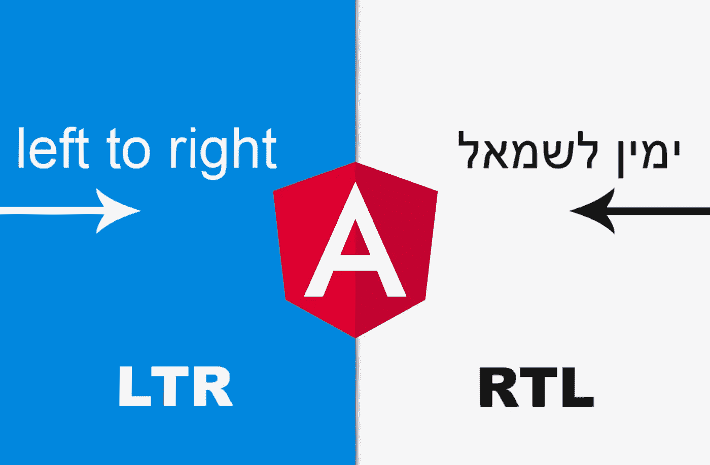
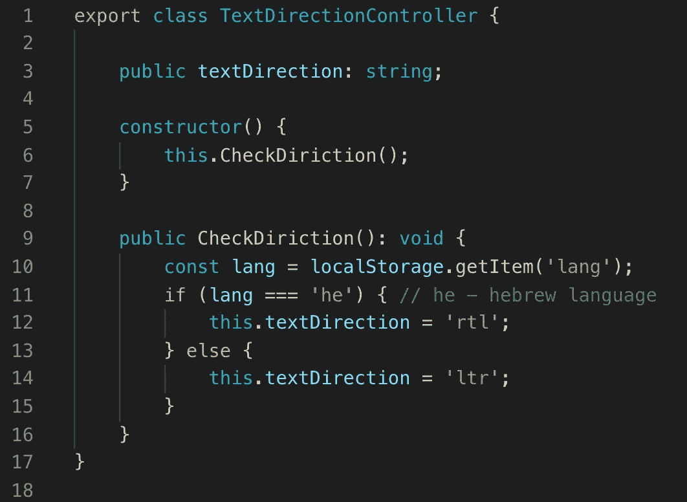
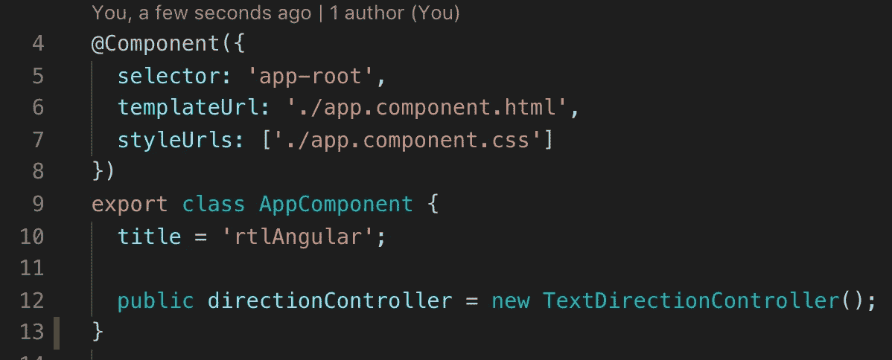
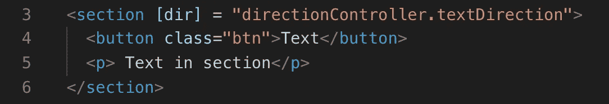
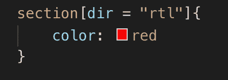
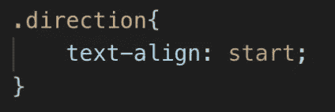
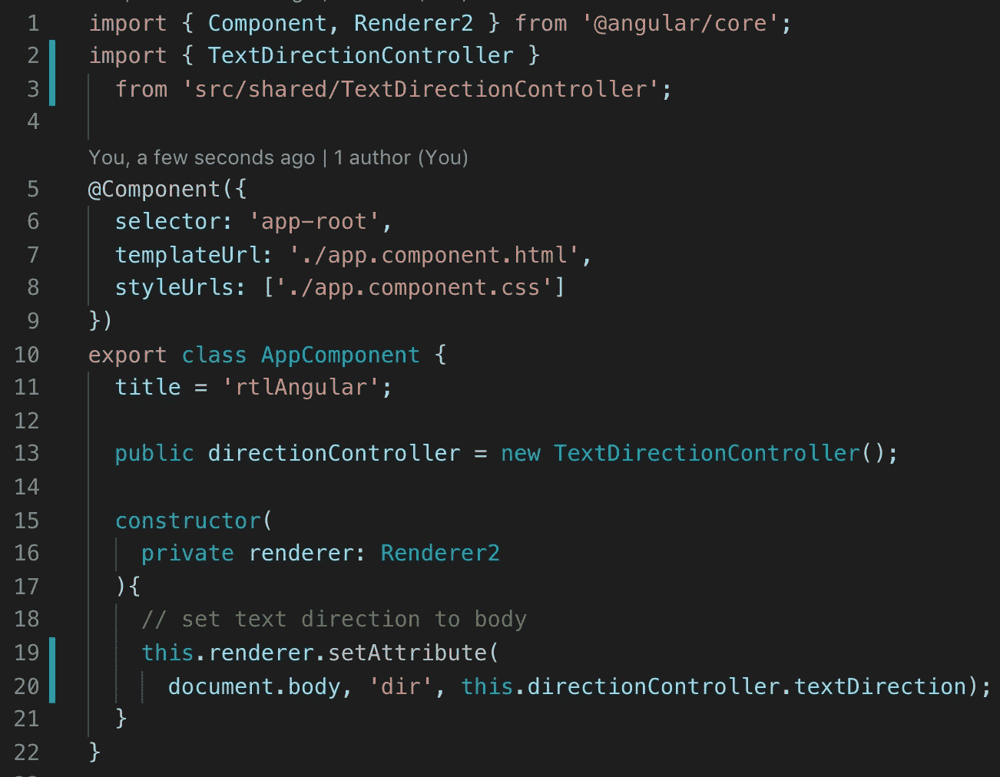

# RTL 角形支架

> 原文：<https://medium.com/quick-code/rtl-support-in-angular-b7de22946972?source=collection_archive---------0----------------------->

## 角度示例

## 如何在用户界面中支持不同的语言

假设你有一个 Angular 的大项目，有很多组件和文件。现在我们的委托人想让 RTL 支持。

我想和你分享一个最简单的解决方法。在那之后，RTL 的支持将不是问题。

首先，我们需要创建一个简单的类，它将根据所选择的语言来控制文本的方向。如您所见，我们需要将当前语言保存在“localStorage”中。

TS file

这个类很容易扩展。如果在未来的项目将支持其他 RTL 语言，我们需要做的就是在一个方法中添加一个新的条件，整个项目将永远不会注意到这些变化。

以下是我们应该如何使用 TextDirectionController 类的示例。

TS file

HTML file

RTL 的支持也快完成了。在 RTL 模式下，我们可能会有一些 CSS 错误，为了解决这个问题，我们只需在 CSS 文件中编写所有特定的修复程序。

CSS file

我们应该避免使用:
;
文本对齐:右对齐；

相反，让我们使用:
；

这意味着浏览器将根据用户的 LTR 或 RTL 偏好选择最佳对齐方式。

CSS file

此外，我们可能需要在 body 标签中设置 dir 属性。我们可以在主组件的构造函数中这样做，为此我们将使用 Renderer2 类。

TS file

仅此而已。现在你知道如何在 Angular 项目中支持 RTL 了。你可以在我的 [GitHub](https://github.com/8Tesla8/rtl-angular/blob/master/README.md) 库下载这个例子。

*原载于 2019 年 2 月 8 日*[*tomorrowmeannever.wordpress.com*](https://tomorrowmeannever.wordpress.com/2019/02/08/rtl-support-in-angular/)*。*