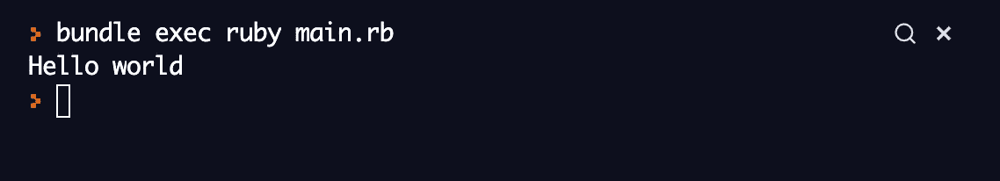

# Ruby — Part 0

> 原文：<https://medium.easyread.co/ruby-part-0-279ac337587?source=collection_archive---------5----------------------->

Beberapa hari terakhir ini lagi iseng ngulik-ngulik Ruby. Belajar itu biar semakin lengket ilmunya selain dibaca dan sering dipraktekin, tambahannya ditulis ulang dengan kata-kata sendiri, dengan pemahaman sendiri. Semoga yang sama sedang belajar bahasa ini dimudahkan proses belajarnya. Aamiin.

[https://portswigger.net/daily-swig/popular-ruby-gem-strong-password-backdoored](https://portswigger.net/daily-swig/popular-ruby-gem-strong-password-backdoored)

# Table of Content

*   Kenalan sama Ruby
*   Kelebihan Ruby
*   Praktek
*   Konklusi
*   Referensi

## Kenalan sama Ruby

Ruby merupakan bahasa yang powerful dan fleksibel. Ruby tergolong dalam bahasa pemrograman dinamis berbasis skrip berorientasi objek.

Kalau dari website resminya, mereka bilang gini

> Ruby adalah…
> 
> Bahasa pemrograman open source dinamis, mudah dimengerti dan produktif. Sintaks Ruby elegan, natural, mudah dibaca dan ditulis.

Sekarang Ruby sudah di versi 3.0.0-preview2.

## Kelebihan Ruby

1.  Sintaks sederhana
2.  High-level
3.  Interpreted
4.  Berorientasi Objek
5.  Mudah digunakan

## Praktek

Pada Part 0 kali ini praktek yang akan didokumentasikan dalam tulisan kali ini adalah bagaimana kamu mencetak text.

[https://repl.it/@PandhuWibowo/Ruby-Part-0#main.rb](https://repl.it/@PandhuWibowo/Ruby-Part-0#main.rb)

Untuk outputnya akan seperti dibawah ini.

[https://repl.it/@PandhuWibowo/Ruby-Part-0#main.rb](https://repl.it/@PandhuWibowo/Ruby-Part-0#main.rb)

## Konklusi

Jadi Ruby merupakan bahasa yang ramah terhadap kamu yang baru pertama kali tau dan pertama kali belajar. Selamat kamu sudah berhasil mencetak teks dengan bahasa Ruby. Ada satu lagi syntax yang sama-sama untuk mencetak, saran saya bermain-main ke websitenya. Nanti juga langsung ketemu syntaxnya apa dan bagaimana membuatnya.

Terima kasih yang sudah membaca tulisan ini, maaf kalau tulisan kali ini begitu singkat. Assalamu’alaikum, selamat belajar dan memperluaskan kebaikan!

## Referensi

 [## Belajar Ruby: Pengenalan dasar Pemrograman Ruby untuk Pemula

### "Ruby adalah sahabat terbaik programmer" - ruby-lang.org Ruby adalah &mldr; Bahasa pemrograman open source dinamis…

www.petanikode.com](https://www.petanikode.com/ruby-untuk-pemula/)  [## Ruby

### Kami dengan senang hati mengumumkan rilis dari Ruby 3.0.0-preview2\. Baca Selengkapnya... Ditulis oleh naruse tanggal…

www.ruby-lang.org](https://www.ruby-lang.org/id/)  [## Ruby (bahasa pemrograman)

### Dirancang oleh Yukihiro Matsumoto pengembang Yukihiro Matsumoto (among others) Rilis perdana 1995 Tipe Sistem dynamic…

id.wikipedia.org](https://id.wikipedia.org/wiki/Ruby_%28bahasa_pemrograman%29) 

**[Call Friends]**

Halo teman teman, untuk mendukung agar saya tetap bisa membuat tulisan-tulisan menarik lainnya. Kamu bisa support saya dengan membeli produk-produk asli produksi sendiri, homemade, dan yang pastinya brand lokal hanya di [@beneteen](https://www.instagram.com/beneteen/) atau ke [beneteen.com](https://beneteen.com/)