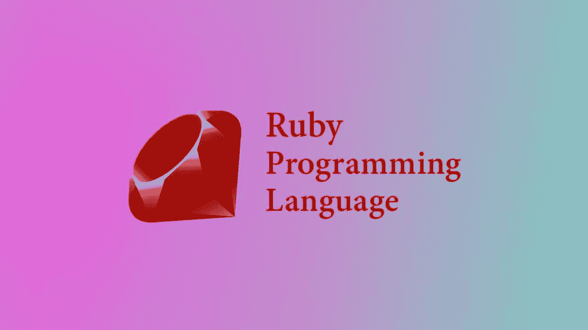
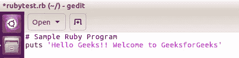
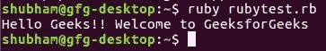

# 面向初学者的 Ruby 编程语言(入门)

> 原文：<https://medium.com/quick-code/ruby-programming-language-introduction-for-beginners-e9e300fb6654?source=collection_archive---------0----------------------->



Ruby 是一种纯面向对象的语言，由 Yukihiro Matsumoto(在 Ruby 社区中也称为 Matz)在 20 世纪 90 年代中期在日本开发。除了块，Ruby 中的所有东西都是对象，但是也有替代对象，比如 procs 和 lambda。Ruby 开发的目标是让它在人类程序员和底层计算机器之间充当一个合理的缓冲。Ruby 与 C 和 Java 等许多编程语言的语法相似，因此 Java 和 C 程序员很容易学习。它支持几乎所有的平台，如 Windows，Mac，Linux。

Ruby 基于许多其他语言，如 Perl、Lisp、Smalltalk、Eiffel 和 Ada。它是一种解释型脚本语言，这意味着它的大多数实现都是直接自由地执行指令，而不需要事先将程序编译成机器语言指令。Ruby 程序员也可以访问强大的 RubyGems (RubyGems 为 Ruby 程序和库提供了标准格式)。要获得关于 Ruby 的深入知识，请在 [**上注册免费现场演示 Ruby On Rails 在线培训**](https://onlineitguru.com/ruby-on-rails-online-training-placement.html)

**开始用红宝石编程:**
**1。找编译器:**
在开始用 Ruby 编程之前，需要一个编译器来编译运行我们的程序。有很多在线编译器可以用来启动 Ruby，而不需要安装编译器。

有很多免费的编译器可以用来编译 Ruby 程序。

**2。用 Ruby 编程:**
用 Ruby 编程很容易学会，因为它的语法与已经广泛使用的语言相似。

**用 Ruby 编写程序:**
程序可以在任何广泛使用的文本编辑器中用 Ruby 编写，如 Notepad++和 gedit 等。编写完程序后，用扩展名**保存文件。rb**

我们来看看编程的一些基本要点:
**注释:**在 Ruby 程序中添加单行注释，使用的是# (hash)。
**语法:**

```
# Comment
```

为了在 Ruby 中添加多行注释，使用了=begin 和= end(Ruby 的保留关键字)块。
**语法:**

```
=begin
Statement 1
Statement 2
...
Statement n
=end
```

**例子:**一个简单的程序打印**“你好极客们！！欢迎来到 GeeksforGeeks"**



**输出:**



**注:**在输出屏幕中，可以看到程序是如何根据提示运行的。

**解释:**第一行由以 **"#"** 为前缀的单行注释组成。第二行由要打印的信息组成，**按钮**用于在屏幕上打印信息 [**红宝石轨道**](https://onlineitguru.com/ruby-on-rails-online-training-placement.html) 。

正如任何事物都有优点和缺点一样，Ruby 也有一些优点和缺点。
**红宝石的优点:**

*   用 Ruby 编写的代码很小，优雅而强大，因为它的代码行数很少。
*   Ruby 允许简单快速地创建 Web 应用程序，从而减少了工作量。
*   由于 Ruby 是免费的，即 Ruby 可以自由复制、使用和修改，它允许程序员在需要时进行必要的修改。
*   Ruby 是一种动态编程语言，因此对于如何内置特性没有严格的规则，它非常接近口语。

**Ruby 的缺点:**

*   Ruby 是相当新的，它有自己独特的编码语言，这使得程序员很难马上用它编码，但经过一些练习后，它很容易使用。许多程序员更喜欢坚持他们已经知道并且能够开发的东西。
*   用 Ruby 编写的代码更难调试，因为大部分时间是在运行时生成的，所以在调试时很难阅读。
*   与其他编程语言相比，Ruby 没有丰富的信息资源。
*   Ruby 是一种解释脚本语言，脚本语言通常比编译语言慢，因此，Ruby 比许多其他语言都慢。

**应用:**

*   Ruby 用于创建不同种类的 web 应用程序。创建 web 应用程序是目前的热点技术之一。
*   Ruby 提供了一个很棒的特性，叫做 Ruby on Rails (RoR)。它是一个 web 框架，程序员使用它来加快开发过程并节省时间。

Ruby 是一种动态的、反射式的、面向对象的、通用的编程语言。它是由日本的松本幸宏(Yukihiro“Matz ”)在 20 世纪 90 年代中期设计和开发的。本文将介绍它的基本语法和一些基本程序。本文分为不同主题的不同部分。
**1。设置:**让我们从设置 Ruby 编程语言开始。

对于 **Linux 用户**，进入终端并输入:

```
apt-get install ruby
```

Ruby 将被安装到您的系统中。

为了编译一个 ruby 程序，打开你的文本编辑器，用'保存程序。rb '扩展。在这之后，进入终端(或命令提示符)并键入:ruby 'file.rb '其中 file 是您刚刚创建的程序的名称，因此程序将被编译。

**2。一个好的第一个程序**
用 Ruby 在控制台上打印一些东西。例如，一根绳子

```
puts "Hello World"
puts "Hello Again"
```

**3。评论**

*   #在 ruby 中被称为磅字符，它用于向代码添加注释。
*   =begin、=end 用于多行注释

> 获得 [**红宝石认证**](https://onlineitguru.com/ruby-on-rails-online-training-placement.html) ，将您的职业生涯推向新的成功高度

示例:

```
# this is a comment and wont be executed
= begin
this is 
a multi line
comment in ruby
= end
```

**4。Maths:** 简单的数学函数可以在 puts 语句中执行。就像我们在 C 中使用' %d '或' %f '和'&'一样，我们将在 Ruby 中使用' #{ } '来完成我们的工作。

```
puts "Alok has #{25+30/6} Rupees in his pocket"
```

**输出:Alok 口袋里有 30 卢比**
使用#{ }可以将 Ruby 计算插入到文本字符串中。

**5。变量和名称:**ruby 中的变量和其他任何动态编程语言中的变量是一样的。你只需要不提及它的类型，ruby 就会自动知道它的类型。
举例:

```
cars = 100
drivers = 30
puts "There are #{cars} cars and #{drivers} drivers."
```

**输出:有 100 辆车，30 个司机。**

**6。获取输入**

*   “gets.chomp”用于从用户处获取输入。
*   “print”可以代替“puts”来打印，不换行。

示例:

```
print "How old are you ? "
age = gets.chomp
print "How tall are you ?"
height = gets.chomp
puts " You are #{age} year old and your height is #{height} cms"
```

在您的系统上运行这段代码，因为输出将由用户给出

**7。提示人们输入数字**

*   gets.chomp.to_i 用于从用户处获取整数输入。
*   gets.chomp.to_f 用于从用户处获取浮点(十进制)输入。

示例:

```
print "Give a number"
number = gets.chomp.to_i
puts "You just entered #{number}"
```

这些是 Ruby 最基本的主题，对于 Ruby 编程语言的初学者来说是必不可少的。我们将在接下来的文章中讨论更多的 Ruby 主题。