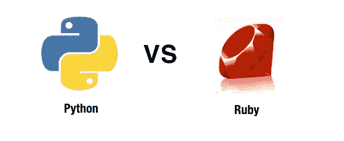
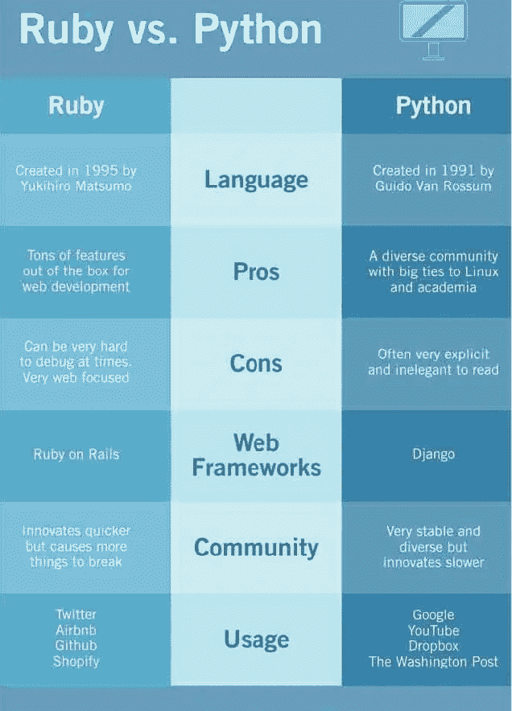

# 红宝石与蟒蛇:有什么区别？

> 原文：<https://medium.com/quick-code/ruby-vs-python-whats-the-difference-bc67538445d3?source=collection_archive---------0----------------------->



# 红宝石和蟒蛇哪个更好？

我在工作中使用了 Ruby 和 Python 虽然它们很相似，但在某些关键方面也有所不同。这是一个受欢迎的问题，但也是一个重要的问题，所以让我举例说明 Ruby 和 Python 之间的区别。



Difference Between Ruby and Python

为了做好准备，我首先通过 Python(以及称为 Django 的 Python 框架)学习了网络开发。在花了四年时间构建 Django 应用程序之后，我找到了一份在 Rails 上做 Ruby 的工作，并期望这种转变会很简单。那时我才明白这两种语言和框架有很大的不同，从一种语言跳到另一种语言并不容易。

# 现在观察……它们有什么不同？

## 语言:

Ruby on Rails 网络框架是使用 Ruby 编程语言构建的，而 Django 网络框架是使用 Python 编程语言构建的。

这就是许多差异的所在。这两种语言在视觉上相似，但在解决问题的方法上却截然不同。

Ruby 旨在为程序员提供无限的灵活性和授权。它允许 Rails 上的 Ruby 做很多小技巧来制作一个优雅的网络框架。这有时甚至会让人觉得很神奇，但这种灵活性也可能会给[**Ruby Certification**](https://onlineitguru.com/ruby-on-rails-online-training-placement.html)带来一些问题。例如，让 Ruby 在你不期望的情况下工作的同样的魔法也会让你很难追踪到臭虫，从而导致你需要花几个小时来梳理代码。

Python 采用了一种更直接的编程方法。它的主要目标是让程序员看到所有的东西。这牺牲了 Ruby 所具有的一些优雅，但是在学习高效地编码和调试问题方面给了 Python 一个很大的优势。

一个很好的例子说明了在应用程序中使用时间的区别。想象一下，你想从现在起一个月内得到时间。以下是您在两种语言中的操作方式:

```
Ruby
require 'active_support/all'
new_time = 1.month.from_nowPython
from datetime import datetime
from dateutil.relativedelta import relativedelta
new_time = datetime.now() + relativedelta(months=1)
```

请注意 Python 是如何要求您从日期时间和日期库导入特定功能的。它是明确的，但这很好，因为您可以很容易地说出所有东西的来源。

有了 Ruby 版本，更多的东西隐藏在窗帘后面。我们导入了一些 active_support 库，现在突然间 Ruby 中的所有整数都有了这些”。“天和”。from_now "方法。它读起来不错，但是不清楚这个功能来自 active_support。此外，用新功能修补语言中所有整数的想法很酷，但也可能导致问题。

两种方法都不对或错；他们强调不同的事情。Ruby 展示了语言的灵活性，而 Python 展示了直接性和可读性。

# 网络框架

Django 和 Rails 都是帮助您构建 web 应用程序的框架。它们有相似的性能，因为 Ruby 和 Python 都是脚本语言。每个框架都为您提供了传统 MVC 框架的所有概念，如模型、视图、控制器和数据库迁移。

每个框架在实现这些特性的方式上有所不同，但在核心上，它们是非常相似的。Python 和 Ruby 也有许多库，可以用来为 web 应用程序添加特性。Ruby 有一个名为 Rubygems 的存储库，Python 有一个名为包索引的存储库。

# 社区

Python 和 Ruby 背后都有强大的社区。每个社区都影响着语言、更新和软件构建方式的方向。然而，Python 拥有比 Ruby 更广泛的社区。Python 在数学和科学领域有大量的学术用例，并且由于这种势头，它还在继续增长。Python 也预装在几乎每台 Linux 计算机上，这使它成为在 Linux 服务器上使用的完美语言(又名。世界上最受欢迎的服务器)。

Ruby 的流行始于 2005 年 Rails 的问世。这个社区围绕着 Rails 迅速发展，并且从那时起就非常关注 web 开发。它也变得更加多样化，但还没有达到 Python 所达到的多样化水平。

[](https://onlineitguru.com/blog/ruby-vs-python) [## Ruby Vs Python |和 Python 的区别| OnlineITGuru

### Ruby 是灵活的，它赋予程序员权力。有了 Ruby on rails，我们可以设计许多漂亮的网站…

onlineitguru.com](https://onlineitguru.com/blog/ruby-vs-python) 

# 使用

谁在使用这些编程语言？相当多公司。Ruby 和 Python 在科技界都很流行。

有许多著名的网站都是用 Python 构建的，包括 Google、Pinterest、Instagram、国家地理、Mozilla Firefox 和华盛顿邮报。类似地，Ruby on Rails 网站上也有很多例子。使用 Ruby on Rails 的著名公司包括苹果、Twitter、Airbnb、Shopify、Github 和 Groupon。

# 我应该先学 Python 还是先学 Ruby？

Ruby 在 2010 年至 2016 年间经历了一个流行高峰，但似乎行业正在向 Python 发展。这里有一个方法可以帮助你做出决定:如果你已经有一个特定的客户、工作或项目需要你了解 Ruby，那就学习 Ruby。如果没有，先学 Python。请记住，Python 2 和 Python 3 是有区别的。如果你是编程新手，那么我建议你从最新版本开始——Python 3

# 结论:Ruby vs. Python？

在 Ruby on Rails 中可以做的任何事情，在 Python 和 Django 中也可以做。哪个框架更好不是能力的问题。更好的问题可能是:哪种语言更适合你或你的团队？

如果您计划坚持构建 web 应用程序，那么可以考虑优先考虑 Ruby on Rails。这个社区很好，他们总是处于风口浪尖。如果你对构建 web 应用感兴趣，那么我建议你学习一下 [**Ruby On Rails 在线培训**](https://onlineitguru.com/ruby-on-rails-online-training-placement.html) **，学习 Python** 也不错

# RUBY Vs PYTHON

## Ruby 概述:-

**语言**

*   更神奇
*   由松本幸弘于 1995 年创作

**优点**

*   为 web 开发提供了大量现成的特性
*   快速接受新事物

**CONS**

*   有时很难调试

**WEB 框架**

*   ruby on Rails-由 David Heinemeier Hansson 于 2005 年创立

**社区**

*   创新更快，但导致更多的东西打破
*   非常注重网络

**用途**

*   苹果
*   推特
*   开源代码库
*   爱彼迎（美国短租平台）
*   开源代码库
*   Groupon
*   购物化

## Python 概述:-

**语言**

*   更直接
*   由 Guido Van Rossum 于 1991 年创建

**赞成者**

*   非常容易学
*   一个与 Linux 和学术界有密切联系的多元化社区

**CONS**

*   通常非常露骨，读起来很不雅观

**WEB 框架**

*   django-由 Adrian Holovaty 和 Simon Willison 于 2003 年创立

**社区**

*   非常稳定和多样化，但创新速度较慢
*   在学术界和 Linux 中广泛使用

**用法**

*   谷歌
*   拼趣
*   油管（国外视频网站）
*   Dropbox
*   国家地理
*   华盛顿邮报