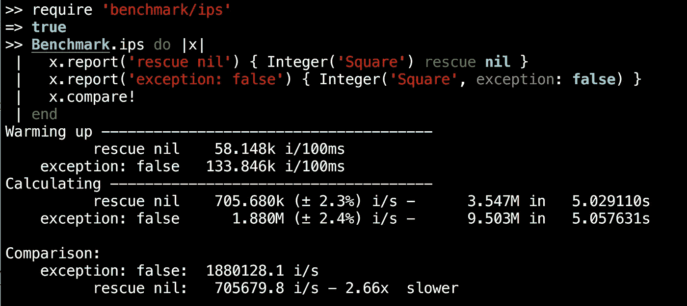

# Ruby 新的异常关键字参数

> 原文：<https://medium.com/square-corner-blog/rubys-new-exception-keyword-arguments-4d5bbb504d37?source=collection_archive---------1----------------------->

## `异常:假'和`异常:真'

> 注意，我们已经行动了！如果您想继续了解 Square 的最新技术内容，请访问我们的新家[https://developer.squareup.com/blog](https://developer.squareup.com/blog)

在 Ruby 2.6 中，多种内核方法获得了一个新的`exception: false`或`exception: true`关键字参数。当内核方法失败时，一些方法会引发错误，一些方法会返回`nil`。这项新功能允许您覆盖默认行为。

## TL；DR:在 Ruby 2.6 中，这些例子都可以工作:

# 背景

当意想不到的事情发生时，Ruby 该怎么办？大声失败？默默进行？看情况。您可能更喜欢用不同的方式处理错误，这是有原因的。

许多方法都有一个默认行为，当出错时要么返回`nil`要么抛出一个错误。Ruby 在逐个方法的基础上选择最合适的缺省值。

Ruby 具有各种默认行为的一个例子是字符串到数字的转换。例如，`'nope'.to_i`是许可的并返回`0`，因为`'nope'`不是一个数字。另一方面，`Integer('nope')`是严格的，会引发错误。这里有几个例子来说明这是如何工作的:

许可字符串#to_i 方法对数字的检测不够严格。当找不到时，它只提供默认值零。或者，严格的 Kernel#Integer 方法会引发一个错误。如果您希望在 Ruby 2.5 和更早的版本中进行严格的解析，但是没有错误，那么您可以手动挽救:

```
Integer('nope') rescue nil
#=> nil
```

# 数值转换异常错误

手动救援的问题是[慢，噪音大](https://bugs.ruby-lang.org/issues/12732#note-6)。在我的机器上，使用`exception: false`几乎快了三倍:



在 Ruby 2.6 中，您将能够使用`Integer('nope', exception: false)`而不是`Integer('nope') rescue nil`来获得更好的性能。这同样适用于`Float`、`Rational`和`Complex`。

> `Float('nope', exception: false)`
> 
> 代替
> 
> `Float('nope') rescue nil`

# 系统出现异常

新的异常关键字参数也可用于 Kernel#system。如果命令执行失败，#system 方法的默认行为是静默失败并返回`nil:`

```
system 'nope'
#=> nil
```

以前，如果您想让#system 在执行失败时引发错误，您必须自己编写消息并引发错误。现在您可以简单地添加`exception: true`，您将得到一条格式良好的错误消息:

```
system 'nope', exception: true
#!> Errno::ENOENT: No such file or directory - nope
```

当命令执行成功但存在非零退出状态时，`exception: true`也将导致产生一个错误，而不是`false`返回值。

# 结论

感谢艾伦·帕特森[提出这个数字转换的功能](https://bugs.ruby-lang.org/issues/12732)。并且感谢 [Takashi Kokubun](https://bugs.ruby-lang.org/users/10073) 为[为#system](https://bugs.ruby-lang.org/issues/14386) 提出这个特性。新的`exception:`关键字参数将在 2018 年 12 月 25 日发布的 Ruby 2.6 中发布。这些变化并没有出现在 ruby-2.6.0-preview1 中，但它们将成为即将发布的 ruby-2.6.0-preview2 的一部分，现在可以在夜间快照中看到。

*我们在 Square 使用 Ruby 做很多事情——包括我们的*[*Square Connect Ruby SDK*](https://github.com/square/connect-ruby-sdk#readme)*和* [*开源 Ruby 项目*](https://github.com/square?language=ruby) *。我们热切期待 Ruby 2.6 的发布！*


The Ruby logo is Copyright © 2006, Yukihiro Matsumoto, distributed under [CC BY-SA 2.5](https://creativecommons.org/licenses/by-sa/2.5).

想要更多吗？ [*注册*](https://www.workwithsquare.com/developer-newsletter.html?channel=Online%20Social&sqmethod=Blog) *为你的每月开发者简讯或* [*顺道拜访*](https://squ.re/2Hks3YE) *方 dev Slack 频道，说声“嗨！”*