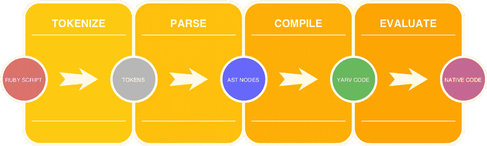
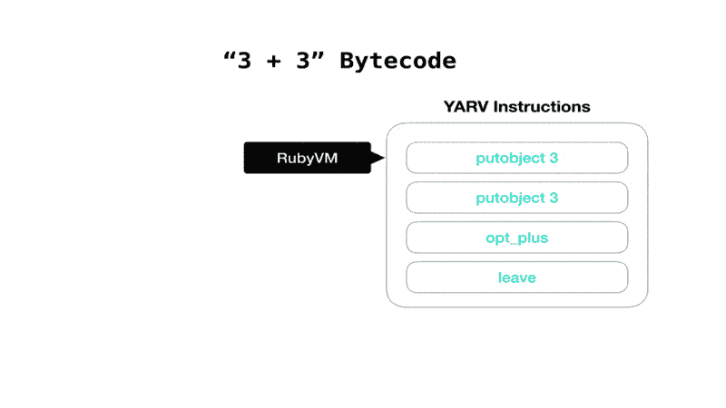
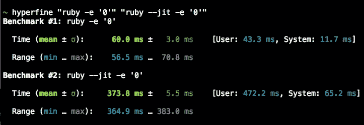
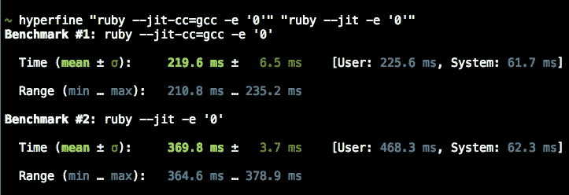
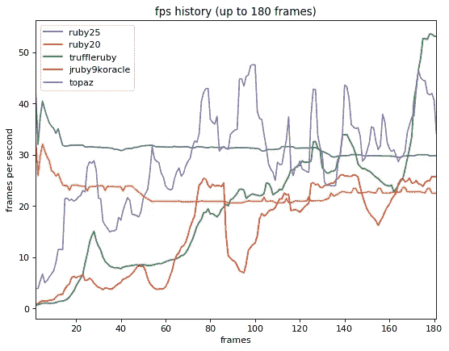
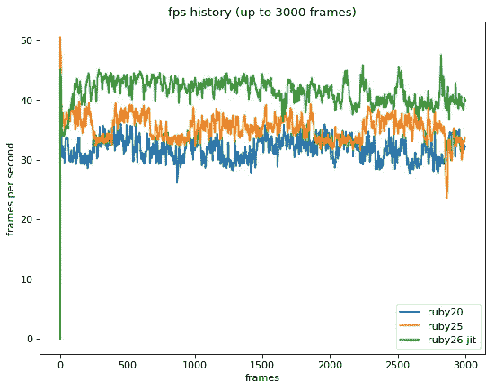
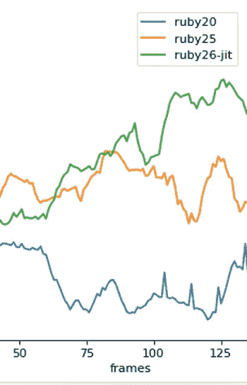

# Ruby 的新 JIT

> 原文：<https://medium.com/square-corner-blog/rubys-new-jit-91a5c864dd10?source=collection_archive---------0----------------------->

*克鲁比刚吃了 JIT！*

> 注意，我们已经行动了！这篇文章现在位于[这里](https://developer.squareup.com/blog/rubys-new-jit)。

已经有很多为 CRuby 实现 JIT 的尝试，cru by 是 Ruby 的参考实现。到目前为止，还没有合并。

```
 ,---.    ,---.     .-./`)  .-./`) ,---------. 
  .     '     ,    |    \  /    |     \ '_ .')\ .-.')\          \ 
    _________      |  ,  \/  ,  |    (_ (_) _)/ `-' \ `--.  ,---' 
   /_\/_ _ \/_\    |  |\_   /|  |      / .  \  `-'`"`    |   \     
    \ \    / /     |  _( )_/ |  | ___  | '`|   .---.     :   :    
  ,   \\  //   .   | (_ J _) |  ||   | |   '   |   |     |   |    
        \/         |  (_,_)  |  ||   `-'  /    |   |     |   | 
     ,      .      |  |      |  | \      /     |   |     |   |  
                   '--'      '--'  `-..-'      '---'     '---'
```

**TL；DR** : Ruby 2.6 将有一个可选的`--jit`标志，它将增加启动时间并占用更多内存，以换取一旦预热后的极快速度。

# 以前的 Ruby JIT 尝试

以前一些针对 Ruby 的 JIT 尝试，如 [rujit](https://github.com/imasahiro/rujit#readme) ，已经成功地加速了 Ruby，但代价是内存的过度使用。其他尝试，如 [OMR + Ruby](https://github.com/rubyomr-preview/rubyomr-preview#readme) ，使用现有的 JIT 库，如 [Eclipse OMR](https://github.com/eclipse/omr#readme) 。另一个例子， [llrb](https://github.com/k0kubun/llrb#readme) ，使用了 [LLVM](https://llvm.org/) 附带的 JIT 库。这些实现的最大问题是 JIT 库是移动的目标，并将 Ruby 的生存与这些底层 JIT 项目的未知未来联系在一起。

# 巨大的飞跃:RTL·米吉特

马卡罗夫对 Ruby 性能并不陌生。他在 Ruby 2.4 中对哈希表的重新实现大大加快了哈希的速度。

2017 年，马卡罗夫承担了一个新的重大项目，名为 [RTL MJIT](https://github.com/vnmakarov/ruby/tree/rtl_mjit_branch#readme) ，重写了 Ruby 的中间表示(IR)的工作方式，同时增加了一个 JIT。在这个令人难以置信的雄心勃勃的项目中，现有的 YARV 指令被一个全新的寄存器传输语言(RTL)指令集完全取代。马卡罗夫还创建了一个名为 MJIT 的 JIT，它从 RTL 指令中产生 C 代码，然后用现有的编译器将 C 代码编译成本机代码。

马卡洛夫实现的问题在于，全新的 RTL 指令意味着 Ruby 内部的重大重写。可能需要几年的时间来完善这项工作，使其稳定，并准备好与 Ruby 合并。Ruby 3 甚至可能会发布新的 RTL 指令，但还没有决定(可能要几年后)。

# JIT 合并成了 Ruby: YARV MJIT

Takashi Kokubun 对 JIT 和 Ruby 性能也不陌生。他是 llrb JIT 的作者，并在 Ruby 2.5 中将 Ruby 的 ERB 和 RDoc 加速了好几倍。

Kokubun 继承了 Makarov 在 RTL MJIT 上的工作，并提取了 JIT 部分，同时保持了 Ruby 现有的 YARV 字节码。他还把 MJIT 精简到最小形式，没有高级优化，所以它的引入不会对 Ruby 的其他部分造成大的破坏。

```
 __  __              _            ___            _____  
      |  \/  |          _ | |          |_ _|          |_   _| 
      | |\/| |         | || |           | |             | |   
      |_|__|_| _____   _\__/   _____   |___|   _____   _|_|_  
     _|"""""|_|"""""|_|"""""|_|"""""|_|"""""|_|"""""|_|"""""|[倭](https://en.wiktionary.org/wiki/%E5%80%AD)
     "`-0-0-'"`-0-0-'"`-0-0-'"`-0-0-'"`-0-0-'"`-0-0-'"`-0-0-'
```

Kokubun 的作品被[合并到 Ruby](https://github.com/ruby/ruby/commit/ed935aa5be0e5e6b8d53c3e7d76a9ce395dfa18b) 中，将于 2018 年圣诞节与 Ruby 2.6 一同发布。如果你现在想尝试 JIT，你可以用 Ruby 的每夜构建来做。目前性能的提升相当有限，但是在 Ruby 2.6 发布之前还有足够的时间来添加优化。Kokubun 的安全、渐进改善策略奏效了。露比有 JIT！

# 它是如何工作的

## 获得 YARV 说明



Ruby 必须经过几个步骤才能运行你的代码。首先，代码被标记化、解析并编译成 YARV 指令。这部分过程大约占 Ruby 程序总时间的 30%。


我们可以从 stdlib 中使用 RubyVM::InstructionSequence 和 Ripper 来查看这些步骤。

像 [yomikomu](https://github.com/ko1/yomikomu#readme) 和[bootssnap](https://github.com/Shopify/bootsnap#readme)这样的项目展示了如何通过将 YARV 指令缓存到磁盘来加速 Ruby。这样做的话，在第一次运行 Ruby 脚本之后，指令就不必被解析和编译成 YARV 指令，除非代码发生了变化。这并没有在第一次运行时提高 Ruby 的速度，但是在没有代码更改的情况下，后续的执行将会快 30%左右——因为它们可以跳过解析和编译成 YARV 指令。

这种缓存编译后的 YARV 指令的策略实际上与 JIT 无关，但是这种策略将会在 Rails 5.2 中使用(通过 bootsnap)，并且很可能在 Ruby 的未来版本中使用。JIT 只有在 YARV 指令存在后才发挥作用。

## JIT 编译 YARV 指令

一旦 YARV 指令存在，RubyVM 就有责任在运行时将这些指令转换成适合您所使用的操作系统和 CPU 的本机代码。这个过程消耗了运行一个 Ruby 程序大约 70%的时间，所以它是运行时的主体。

这就是 JIT 发挥作用的地方。不需要每次遇到 YARV 指令时都进行评估，某些调用可以转换成本机代码，所以当 RubyVM 第二次或以后看到它时，可以直接使用本机代码。

> "这是一个 ERB 模板，生成 Ruby 代码，生成 C 代码，生成 JIT-ed C 代码."~ [mjit_compile.inc.erb](https://github.com/ruby/ruby/blob/trunk/tool/ruby_vm/views/mjit_compile.inc.erb)

使用 MJIT，某些 Ruby YARV 指令被转换成 C 代码，放入一个`.c`文件，由 GCC 或 Clang 编译成一个`.so`动态库文件。RubyVM 可以在下一次看到相同的 YARV 指令时使用来自动态库的缓存的、预编译的本机代码。

## 去优化

然而，Ruby 是一种动态语言，甚至核心类方法也可以在运行时重新定义。需要有某种机制来检查缓存在本机代码中的调用是否已被重新定义。如果调用已经被重新定义，则需要刷新缓存，并且需要解释指令，就好像没有 JIT 一样。当发生变化时，这种退回到评估指令的过程称为[去优化](http://chrisseaton.com/rubytruffle/deoptimizing/)。

```
##
# YARV instructions for `3 + 3`:RubyVM::InstructionSequence.compile('3 + 3').to_a.last
#=> [1,
 :RUBY_EVENT_LINE,
 [:putobject, 3],
 [:putobject, 3],
 [:opt_plus, {:mid=>:+, :flag=>16, :orig_argc=>1}, false],
 [:leave]]##
# MJIT C code created from the `:opt_plus` instruction above:VALUE opt_plus(a, b) {
  if (not_redefined(int_plus)) {
    return a + b;
  } else {
    return vm_exec();
  }
}
```

注意，在上面的例子中，如果调用被重新定义，MJIT 产生的 C 代码将会去优化和重新评估指令。这利用了这样一个事实，即大多数时候我们没有重新定义加法，所以我们可以使用编译好的本机代码和 JIT。每次评估 C 代码时，它都会确保它所优化的操作没有改变。如果有变化，它会被去优化，指令会被 RubyVM 重新评估。



# 使用 JIT

您可以通过添加`--jit`标志来使用 JIT。

```
$ ruby --jit -e "puts RubyVM::MJIT.enabled?"
true
```

还有许多与 JIT 相关的试验性标志选项:

```
MJIT options (experimental):
  --jit-warnings  Enable printing MJIT warnings
  --jit-debug     Enable MJIT debugging (very slow)
  --jit-wait      Wait until JIT compilation is finished everytime (for testing)
  --jit-save-temps
                  Save MJIT temporary files in $TMP or /tmp (for testing)
  --jit-verbose=num
                  Print MJIT logs of level num or less to stderr (default: 0)
  --jit-max-cache=num
                  Max number of methods to be JIT-ed in a cache (default: 1000)
  --jit-min-calls=num
                  Number of calls to trigger JIT (for testing, default: 5)
```

您可以在 IRB 中交互地尝试 JIT。

```
$ ruby --jit -S irb
irb(main):001:0> RubyVM::MJIT.enabled?
=> true
```

这在早期似乎有点问题，但是 JIT 也可以和 Pry 一起工作。

```
$ ruby --jit -S pry
pry(main)> RubyVM::MJIT.enabled?
=> true
```

# 启动时间

在考虑使用新的 JIT 时，启动时间是需要考虑的一个因素。用 JIT 启动 Ruby 要多花六倍的时间。



你用 [GCC](https://gcc.gnu.org/) 还是 [Clang](https://clang.llvm.org/) 也会影响启动时间。目前，GCC 比 Clang 快得多，但在没有 JIT 的情况下，它仍然比 Ruby 慢三倍多。



Note: The --jit-cc flag may have to be removed for compatibility with the precompiled MJIT header.

因此，您可能不想将 JIT 用于寿命非常短的程序。JIT 不仅需要启动，而且要有效，还需要时间预热。长时间运行的程序是 JIT 的亮点——它可以预热并有机会使用缓存的本地代码。

# 表演

2015 年，Matz 宣布了 3x3 initiate，使 Ruby 3.0 比 Ruby 2.0 快三倍(3 倍)。Ruby 3x3 的官方基准是[opt 胡萝卜](https://github.com/mame/optcarrot#readme)，这是一个用纯 Ruby 编写的任天堂模拟器。

真正的任天堂运行速度是 60 FPS。 [Kokubun 在一个 4.0 GHz i7–4790k 的 8 核处理器上进行的 opt 胡萝卜](https://github.com/ruby/ruby/commit/ed935aa5be0e5e6b8d53c3e7d76a9ce395dfa18b)基准测试显示，Ruby 2.0 的速度为 35 FPS。Ruby 2.5 在 46 FPS 时性能提升了 30%。启用 JIT 后，Ruby 2.6 在 63 FPS 时比 Ruby 2.0 快 80%。这是 opt carrot(*opt*imization*胡萝卜*)的胡萝卜部分，这是一款可以以 60+ FPS 玩的 NES 游戏。


optcarrot FPS comparison

这是一个很大的进步！给 Ruby 添加 JIT 已经让 Ruby 2.6 朝着 3x3 的目标前进了一大步。最初的 JIT 改进是相当适度的，因为 MJIT 的引入没有许多在最初的 RTL MJIT 中发现的优化。即使没有这些优化，也有显著的性能改进。随着更多优化的加入，这些改进将变得更加深远。

下面的基准测试显示了 optro 在各种 Ruby 实现中前 180 个视频帧的性能。Ruby 2.0 和 2.5 表现相当平淡。 [TruffleRuby](https://github.com/oracle/truffleruby#readme) 、 [JRuby](http://jruby.org/) 和 [Topaz](https://github.com/topazproject/topaz) 是已经有 JIT 的 Ruby 实现。您可以看到 JIT 实现(下面的绿色、红色和紫色线)启动缓慢，然后需要几帧时间开始预热。



Image by Yusuke Endoh, distributed under MIT license.

预热之后， [TruffleRuby](https://github.com/oracle/truffleruby#readme) 凭借其高度优化的 [GraalVM](http://www.oracle.com/technetwork/oracle-labs/program-languages/downloads/index.html) JIT 遥遥领先。(另见[truffle ruby with substrate VM](https://github.com/oracle/truffleruby/blob/master/doc/user/svm.md)，它显著改善了启动时间，预热后速度略有下降。)


Image by Yusuke Endoh, distributed under MIT license.

官方 optroub 基准测试还没有包括启用了 JIT 的 Ruby 2.6-dev，但是在这一点上它还无法与 TruffleRuby 竞争。TruffleRuby 远远领先于其他产品，但还没有准备好投入生产。

修改 optcarrot 基准以显示启用了基于 GCC 的 JIT 的 Ruby 2.6-dev，我们可以看到它需要几帧来预热。在预热 JIT 之后，即使当前大多数优化都没有启用，它还是领先了。请注意绿线开始时很慢，但随后逐渐上升，并保持领先。



如果我们放大，我们可以看到带有 GCC JIT 的 Ruby 2.6-dev 在大约 80 帧之后达到了转折点，领先于 Ruby 2.5 仅仅是基准测试的几秒钟。



如果你的 Ruby 程序是短命的，几秒钟后就退出了，那么你可能不想启用新的 JIT。如果您的程序运行时间较长，并且您有一点内存空间，那么 JIT 可能会带来显著的性能优势。

# 未来

在 Square，我们在内部广泛使用 Ruby，我们维护着[几十个开源 Ruby 项目](https://github.com/square?language=ruby)，包括[Square Connect Ruby SDK](https://github.com/square/connect-ruby-sdk#readme)。所以对我们来说，克鲁比的新 JIT 是令人兴奋的。在今年圣诞节发布之前，仍然有许多问题需要解决，还有许多低悬的优化需要利用。请在 Ruby trunk 或夜间快照上试用 JIT now，并[报告您遇到的任何问题](https://bugs.ruby-lang.org/projects/ruby-trunk/issues)。

马卡罗夫和 [Takashi Kokubun](https://github.com/k0kubun) 应该为推动 Ruby 前进而受到高度赞扬，他们加入了 JIT，这将在未来几年继续带来新的速度改进！

*想要更多？* [*注册*](https://www.workwithsquare.com/developer-newsletter.html?channel=Online%20Social&sqmethod=Blog) *获取我们每月的开发者简讯。*