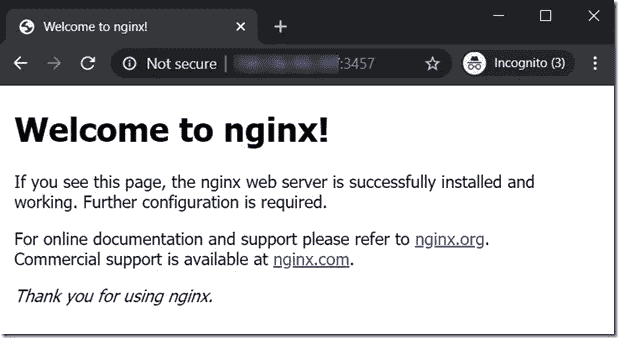

# 在 Oracle 云基础设施上运行始终免费的 Docker 容器

> 原文：<https://medium.com/oracledevs/run-always-free-docker-container-on-oracle-cloud-infrastructure-c88e36b65610?source=collection_archive---------0----------------------->

在本文中，我想展示如何在 Oracle 云基础设施上快速免费运行 Docker 容器——在 OCI 的永远免费层使用虚拟机。例如，我将运行一个 NGINX 容器映像，并通过公共互联网从客户端访问它


一些提醒:容器的工作负载必须符合这个总是空闲的 VM: VM 的形状。Standard.E2.1.Micro，1/8 OCPU，1 GB RAM 和高达 480 Mbps 的网络带宽(参见[文档](https://docs.cloud.oracle.com/en-us/iaas/Content/FreeTier/resourceref.htm))。启动卷提供 45GB 多一点的磁盘存储空间。为了能够访问容器，还必须在安全列表的入口规则中配置虚拟机上映射到容器的端口。我们需要在 VM 中自己安装 Docker 它只配置了一个 Oracle Linux 映像。

本文在很大程度上依赖于 Todd Sharp 的文章:[Oracle Cloud 中的 RabbitMQ 入门](https://blogs.oracle.com/developers/getting-started-with-rabbitmq-in-the-oracle-cloud)。

步骤:

1.  给自己找一份 OCI 的租约(可以免费试用)；登录到控制台
2.  生成 SSH 密钥对
3.  创建一个总是自由形状的计算实例；配置 SSH 密钥，并记下分配给虚拟机的公共 IP
4.  在虚拟机的安全列表中设置入口规则，以打开您想要运行的任何容器所需的端口
5.  SSH 进入虚拟机，安装 Docker
6.  运行 Docker 容器映像
7.  在虚拟机的公共 IP 地址访问容器映像提供的服务

本文将这些步骤描述为手动步骤。在下一次迭代中，我希望自动化这个过程，并使之成为红色专家联盟正在 Katacoda 上制作的 [OCI 在线动手实验室](https://katacoda.com/redexpertalliance/courses/oci-course)的一部分。

# 1.获得一份租约，并确保您可以创建永远免费的虚拟机形状的实例

一旦您获得了 OCI 租赁(无论是免费试用还是付费帐户)，您应该能够创建 shape VM.Standard.E2.1.Micro 的两个免费虚拟机实例。但是，我发现在我的几个 Ashburn 租赁中，始终免费的 shape 的服务限制设置为 0。


我认为这是一个小故障，你不应该也不会遇到。但是，如果您这样做了，您可以决定创建一个非自由的 VM 实例或者请求提高限制。您可以直接从控制台很容易地做到这一点，尽管需要一些时间来处理:


# 2.生成 SSH 密钥对

使用 Linux 上的 ssh-keygen 或 Windows 上的 PuTTY Key Generator 等工具生成 SSH 密钥对。详见 [OCI 文件](https://docs.cloud.oracle.com/en-us/iaas/Content/GSG/Tasks/creatingkeys.htm?Highlight=ssh%20key)。

以下是我在 Linux 上做的事情:

```
ssh-keygen -t rsa -N "" -b 2048 -C "docker-vm-key" -f ./docker-vm-key
```


生成了两个文件:


文件 docker-vm-key 包含私钥(不受密码保护),文件 docker-vm-key.pub 包含公钥，我们将把它粘贴到 OCI 上的虚拟机定义中。

# 3.创建计算实例

在 OCI 控制台菜单中，导航至计算|实例:


单击创建实例:


我已经接受了大部分默认值。我为实例定义了名称: *free-docker-runner* ，并选择了一个预先存在的区间。我选择了一个现有的虚拟网络和该网络中的一个公共子网。我还表示，我希望分配一个公共 IP 地址。


最后，粘贴 SSH **Public** 键并点击 Create。


现在将调配虚拟机，如下所示:


过了一会儿，虚拟机启动并运行，并分配了一个公共 IP 地址:


下图显示了此时的情况:


# 4.在虚拟机的安全列表中设置入口规则，以打开您想要运行的任何容器所需的端口

虚拟机与虚拟云网络中的公共子网相关联。在我的例子中，这是 VCN vcn-lab 中的公共子网 vcn-lab。此子网的(一个)安全列表应配置有入口规则，使所需的流量能够到达将映射到容器映像的端口。打开公共子网的详细信息页面。点击安全列表(或创建一个新列表)


让我们假设我们将运行 NGINX 容器映像。我们将在 VM 中映射到 NGINX 容器的端口是我们可以自己选择的。让我们选择 3456 和 3457——没有很好的理由。如果我们希望虚拟机上的端口 3456 和 3457 能够接收来自公共互联网的请求，我们需要相应地配置一个入口规则:


源 CIDR 设置为 0 . 0 . 0 . 0/0；将源端口范围留空(即 *All* )意味着此规则适用于任何客户端。

# 5.SSH 进入虚拟机，安装 Docker

此时，我们有一个正在运行的 VM 实例。它拥有全新的 Oracle Linux 7.7 操作系统。但还不是码头工人。让我们使用 SSH(或在 Windows 上使用 PuTTY)在虚拟机中打开一个终端窗口，使用以下命令:

```
ssh opc@public-id-address -i rsa-private-key-file
```

将 public-id-address 替换为分配给虚拟机的公共 IP。将 *rsa-private-key-file* 替换为包含 SSH 私有密钥的文件的引用:


要安装 Docker，请执行以下命令:

```
sudo yum-config-manager --enable ol7_addons 
sudo yum install docker-engine -y 
sudo systemctl start docker 
sudo systemctl enable docker
```


要以非根用户身份运行 Docker，请阅读这些说明。

# 6.运行 Docker 容器映像

安装 Docker 后，我们现在可以运行我们选择的容器映像了。对于本文，我选择了 nginx——因为它非常简单。它也可以是任何其他图像。

使用以下命令运行 nginx 容器映像:

```
sudo docker run -d \
 --restart always \ 
 --hostname nginx.lucasjellema.com \
 -p 3456:443 \
 -p 3457:80 \
 --name my-nginx \
 nginx
```


使用 *sudo docker ps* 验证集装箱是否正在运行。如你所见，它正在运行。

并尝试从 nginx 容器获得响应，映射到 VM 中的端口 3457(和 3456):

```
curl [http://localhost:3457](http://localhost:3457)
```


# 7.在空闲虚拟机的公共 IP 地址访问容器映像提供的服务

打开浏览器，在端口 3457 分配给容器的公共 IP 上打开。nginx 的欢迎页面应该出现在浏览器中。



此时，一个 Docker 容器正在 OCI 上一个始终免费的 VM 中运行，为来自公共互联网上任何地方的 HTTP 请求提供服务。


代替 nginx，我们当然可以运行任何容器映像(如果它符合自由 VM 的形状)。

*原载于 2020 年 2 月 6 日*[*https://technology . amis . nl*](https://technology.amis.nl/2020/02/06/run-always-free-docker-container-on-oracle-cloud-infrastructure/)*。*