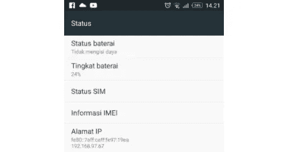
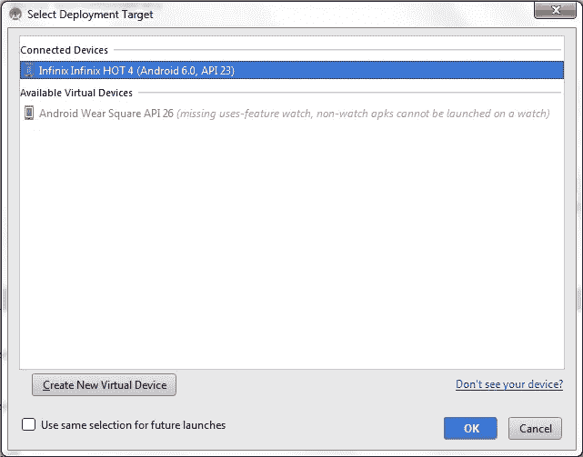

# Run Android Via Wireless? Why Not?

> 原文：<https://medium.easyread.co/run-android-via-wireless-why-not-4b560a361b8d?source=collection_archive---------0----------------------->


Apa jadinya jika kita ngadain workshop, mau ngetes aplikasi di device tapi pada lupa bawa kabel? mau minjam temen, temen juga make.. ini solusinya..

Cekitout..

Sambungkan laptop dengan device pada jaringan yang sama

Lihat IP Address yang terdapat pada menu Setting > About Phone > Status > IP Address



terlihat alamat ip-nya yaitu 192.168.97.67

kalu sudah tinggal kita klik

```
adb connect 192.168.97.67
```

Jika muncul tulisan **“connected to 192.168.97.67:5555"**
Maka device telah tersambung dan akan muncul saat kita coba run



**Beberapa Error**

```
adb not found
```

**Solusi - >** tambahkan direktori Platform Tools SDK di Environment Variabel bagian Path (untuk masuk ke environment variabel bisa via search atau klik kanan pada My Computer > Properties > Advanced system settings > environment variable)

C:\Users\idn\AppData\Local\Android\sdk\platform-tools
(lokasi bisa jadi berbeda, direktori di atas adalah default jika tidak dirubah-rubah)

```
unable toC:\Users\idn\AppData\Local\Android\sdk\platform-tools connect to 192.168.97.67:5555: cannot connect to 192.168.3.101:5555: A connection attempt failed because the connected party did not properly respond after a period of time, or established connection failed because connected host has failed to respond. (10060)
```

**Solusi - >** Ini bisa jadi karena antara HP dan Laptop tidak satu jaringan (wifi yang sama). Cek lagi.

```
unable to connect to 192.168.97.67:5555: cannot connect to 192.168.97.67:5555: No connection could be made because the target machine actively refused it. (10061)
```

**Solusi - >** Bisa jadi karena port yang berbeda. Untuk case ini kita perlu menyambungkan dulu melalui kabel data sekali untuk menyamakan port (ini cukup sekali saat pertama kali)

Tes dulu via terminal apakah device terdeteksi

```
adb devices
```

Lalu

```
adb tcpip 5555
```

Jika sudah coba lagi adb connect 192.168.97.67

> Things Positive! and Positive things will happen

*Aku mengikuti sangkaan hambaKu padaKu, jika sangkaannya baik maka baiklah yang didapatkan, jika sangkaannya buruk maka buruklah yang didapatkan” (HR Ahmad)*