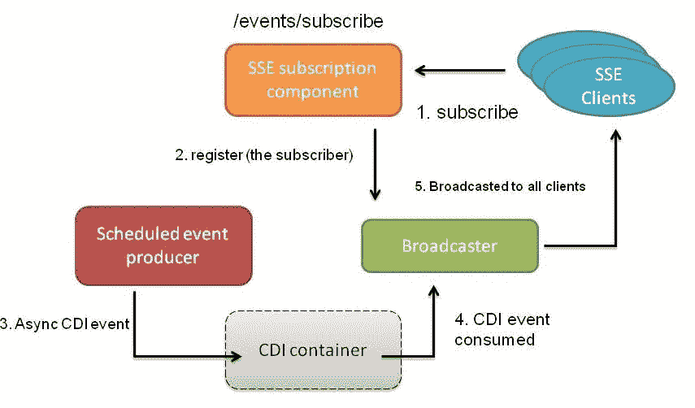
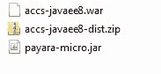
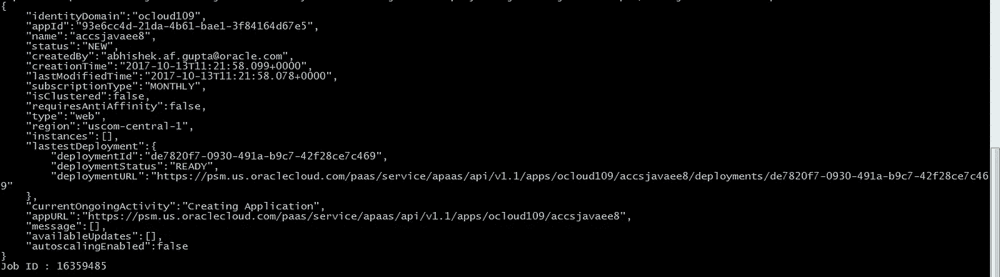
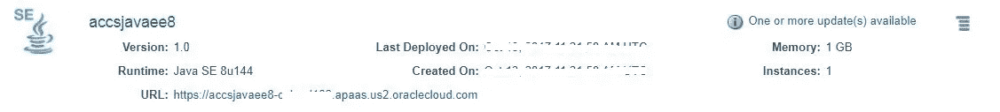
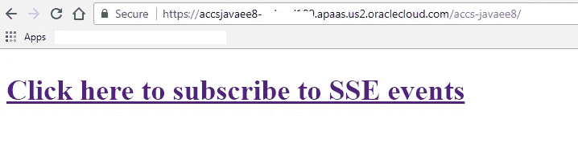
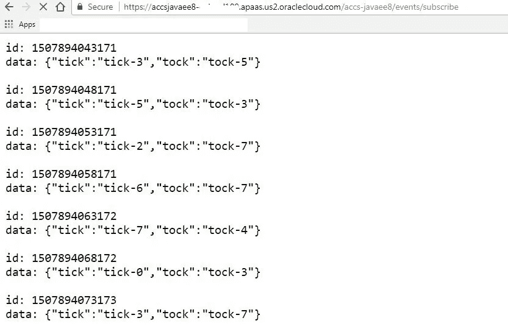

# 借助 Payara Micro 在 Oracle 云上运行 Java EE 8 应用

> 原文：<https://medium.com/oracledevs/run-java-ee-8-apps-on-oracle-cloud-with-payara-micro-d9b527adaac9?source=collection_archive---------0----------------------->

这篇博客将展示如何在 Oracle 云上构建和部署一个 [Java EE 8](https://jcp.org/en/jsr/detail?id=366) 微服务

*   [使用 Oracle 应用容器云](https://cloud.oracle.com/en_US/application-container-cloud)作为运行时平台
*   该应用程序是一个简单的 Java EE WAR 文件，与**Payara Micro 5**(*alpha*release)容器( *bring-your-own-runtime* )打包在一起。关于发布公告[的更多信息，请点击](http://blog.payara.fish/payara-server-5-alpha-1-release-is-here)

这使得利用 Java EE 8 中的平台增强和在云中运行云原生、轻量级和可伸缩的应用变得容易

> *如果你没有听说过 Payara Micro，你可以从* [*开始探索它的网站*](https://www.payara.fish/payara_micro)

# Java EE 8 规范

与每个平台版本一样， [Java EE 8 包含新的规范](http://www.oracle.com/technetwork/java/javaee/tech/index.html)以及对许多现有组件的增强。博客中的示例应用程序展示了下述规范中的以下特性

*   **上下文和依赖注入**(CDI)2.0——异步事件生产者和消费者
*   **JAX-RS 2.1** —具体的服务器发送事件功能
*   **JSON-B 1.0** (JSON 绑定)与 JAX RS 的集成

# 示例应用程序

这是一个高层次的流程



overview of the solution

*   该服务由定时发出事件的计时器组件组成。
*   这由另一个组件使用，该组件使事件通过服务器发送事件(SSE)可用—任何(SSE)客户端(包括您的浏览器或 JavaScript 应用程序)都可以连接接收这些事件

> [*这个项目在 Github*](https://github.com/abhirockzz/accs-javaee8) *上有，你可以进一步搜索*

让我们看看一些实现细节

## 这是怎么回事？

下面是 Java EE 8 规范及其各自组件的概要

**预定(事件生产者)组件**

*   一个`@ApplicationScoped` CDI bean 产生**异步** CDI 事件(Java EE 8 的 CDI 2.0 中的新特性)——这是使用`Event.fireAsync()`完成的
*   `ManagedExecutorService`(来自 Java EE 并发实用程序规范)线程池用于执行定时器/调度程序
*   这些 CDI 事件是合格的(使用自定义的`@Qualifier`)

**服务器发送事件组件**

为客户端公开一个端点以注册/订阅事件

**广播组件**

*   一张`javax.ws.rs.sse.SseBroadcaster`的包装纸
*   处理客户端注册并维护活动/连接的客户端
*   异步接收 CDI 事件(使用`@ObservesAsync`)并将其广播给连接的客户端
*   POJO 到 JSON(对于客户端)由内置的`JAX-RS`和`JSON-B`集成处理

# 构建和部署

让我们使用云来构建和推动我们的应用程序

## 建设

*   `git clone [https://github.com/abhirockzz/accs-javaee8.git](https://github.com/abhirockzz/accs-javaee8.git)`
*   `mvn clean install`

构建过程在`target`目录中创建以下工件

*   **WAR** —我们的 Java EE 应用
*   **罐子** —这是 Payara Micro 5 容器本身
*   **ZIP** —这是由 WAR 和 JAR ( *自带运行时*)组成的可部署工件



**Build artifacts**

## 部署描述符

快速了解一下部署描述符——你可以在这里阅读详细的[文档](http://docs.oracle.com/en/cloud/paas/app-container-cloud/dvcjv/creating-meta-data-files.html)(这些只是元数据文件)

*   **manifest.json** —定义我们的应用程序将如何启动。在这种情况下，我们使用 Payara 微运行时来运行 WAR 文件

```
{
 “runtime”:{“majorVersion”:”8"},
 “command”:”**java -jar payara-micro.jar --deploy accs-javaee8.war --port $PORT**”,
 “notes”:”Java EE 8 application on ACCS”
}
```

*   我们定义应用程序的拓扑结构。在本例中，我们部署了 1 个具有 1 GB 内存的实例(您可以自由选择所需的形状&大小)

```
{
 “instances”:1,
 “memory”:”1G”
}
```

是时候将我们的 Java EE 8 应用程序部署到云中了！

## 推至云

借助 Oracle Application Container Cloud，您在部署应用程序方面有多种选择。这个博客将利用 PSM CLI，这是一个用于管理 Oracle 云服务的强大命令行界面

> *其他部署选项包括*[*REST API*](https://docs.oracle.com/en/cloud/paas/app-container-cloud/apcsr/index.html)*[*Oracle 开发者云*](https://docs.oracle.com/en/cloud/paas/developer-cloud/csdcs/deploying-application-oracle-developer-cloud-service.html#GUID-6FE6D850-65DC-471D-A249-F7CCA9CAB56F) *当然还有* [*控制台/UI*](https://docs.oracle.com/en/cloud/paas/app-container-cloud/csjse/creating-application.html)*

*   *在您的机器上下载并设置 PSM CLI(使用`psm setup` ) — [详细信息请点击](https://docs.oracle.com/en/cloud/paas/java-cloud/pscli/using-command-line-interface-1.html)*
*   *`cd <code_directory>`*
*   *`psm accs push -n accsjavaee8 -r java -s hourly -m manifest.json -d deployment.json -p target/accs-javaee8-dist.zip`*

*一旦执行，异步进程就会启动，CLI 会返回其作业 ID，以便您跟踪应用程序的创建*

**

*Pushing an ACCS application using PSM CLI*

> **点击这里* 查看 Docker 博客上的 [*PSM CLI*](/oracledevs/quick-start-docker-ized-paas-service-manager-cli-f54eaf4ebcc7)*

## *检查您的应用程序*

*您的应用程序应该部署在 Oracle Application Container Cloud 上，并且它的 URL 可供您访问*

**

*Java EE 8 app on Oracle App Container Cloud*

# *测试应用程序*

*简单—使用浏览器导航至应用程序 URL*

*例如[https://](https://javaee8sample-ocloud109.apaas.us2.oraclecloud.com/accs-javaee8/test/events/subscribe)accsjavaee 8[-<**id _ domain**>. apaas . us2 . Oracle cloud . com/accs-javaee 8](https://javaee8sample-ocloud109.apaas.us2.oraclecloud.com/accs-javaee8/test/events/subscribe)*

> **请注意，根据您的身份域，URL 会有所不同**

*接下来您需要做的事情应该是不言自明的:-)。*

**

*one click away….*

*您应该看到一个连续的(SSE)事件流——( SSE)**id**是一个(长)时间戳,( SSE) **数据**是`TickTock` POJO 的 JSON 有效负载*

**

*Stream of SSE events…*

*这个博客到此为止..*

# *别忘了去看看…*

*   *Oracle 应用容器云的[教程](https://docs.oracle.com/en/cloud/paas/app-container-cloud/create-first-applications.html)——每个运行时都有一些东西！*
*   *[应用容器云上的其他博客](http://bit.ly/2gR3nrV)*

# *进一步阅读*

*   *[Java EE 8 规范](http://www.oracle.com/technetwork/java/javaee/tech/index.html)*
*   *[Java EE 8 javadoc](https://javaee.github.io/javaee-spec/javadocs/)*
*   *[Java EE 8 教程](https://javaee.github.io/tutorial/toc.html)*

*干杯！*

> *本文表达的观点是我个人的观点，不一定代表甲骨文的观点。*