# 使用 Oracle Container Registry 中的预烘焙映像在 Docker 中运行 Oracle 数据库——两分钟指南

> 原文：<https://medium.com/oracledevs/run-oracle-database-in-docker-using-prebaked-image-from-oracle-container-registry-a-two-minute-395b1467e44c?source=collection_archive---------0----------------------->

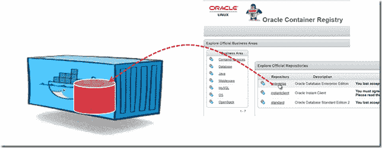

本文将展示如何使用 Oracle Continer Registry 上的预烘焙映像在 Docker 主机上运行 Oracle 数据库。我希望运行完整的 12.2.0.1 Oracle 企业数据库只需很少的手动工作——只需拉出并运行 Docker 映像。一旦它运行，我得到了 Docker 通常的好处，如干净的环境管理，从其他容器链接，快速停止和启动，在容器内运行脚本等。

容器的最低要求是 8GB 磁盘空间和 2GB 内存。有一个需要较少资源的 slim 替代方案:EE 的 slim ( `12.2.0.1-slim`)版本不支持 Analytics、Oracle R、Oracle Label Security、Oracle Text、Oracle Application Express 和 Oracle DataVault。我还不确定这将削减多少资源需求。

我最近的文章[Oracle Container Registry 快速介绍——运行 Oracle 的预烘焙映像之一](https://technology.amis.nl/2017/11/17/quick-introduction-to-oracle-container-registry-running-one-of-oracles-prebaked-images/)解释了开始使用 Oracle Container Registry 的第一步，包括如何注册和接受单个映像的条款和条件。

一旦解决了这个问题，我们就可以开始运行数据库了。

这些步骤是:

1.  启动 docker
2.  登录到 Oracle 容器注册表
3.  Oracle 数据库的拉映像——在本文中，我将使用企业版数据库映像
4.  基于该映像运行 docker 容器
5.  开始与数据库交互，例如从 SQL 或 SQL Developer。

工作方面，会占用你不到两分钟的时间。数据库运行之前的时间主要由下载映像所需的时间决定。之后，运行容器只需要几十秒钟。

Oracle 数据库映像发布在容器注册网站上:

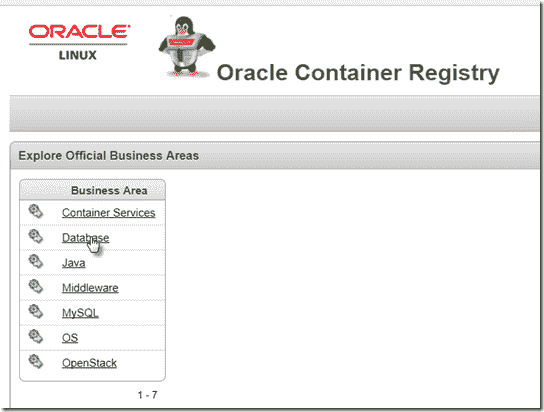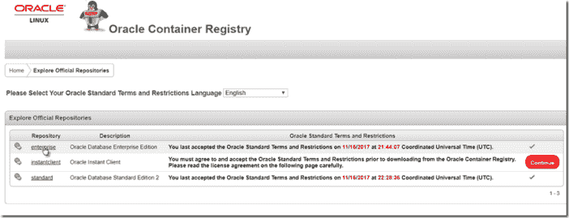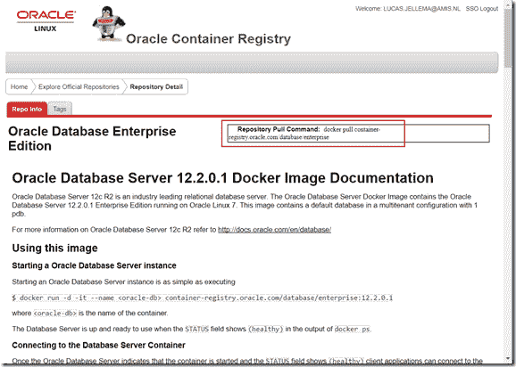

将右上角的 docker pull 命令复制到剪贴板。记住 docker run 命令来运行数据库映像也是值得的。

请注意，此网页包含更多有用的信息:

*   如何从容器中运行 SQL 脚本
*   如何在容器外部公开数据库[端口]
*   如何指定 SID(默认为 ORCLCDB)、PDB(默认为 ORCLPDB1)、域(默认为 localdomain)和分配的内存(默认为 2 GB)
*   如何更改系统密码(默认为 Oradoc_db1)
*   如何利用数据库容器外部的卷来存储数据文件、重做日志、审计日志、预警日志和跟踪文件
*   如何针对一组现有的数据库文件运行数据库服务器映像

# 让我们运行一个数据库

启动 Docker 后(在我的笔记本电脑上，我正在使用 Docker 工具箱中的 Docker 快速启动终端)，使用您的 Oracle 帐户登录到容器注册中心。

然后使用以下命令提取数据库映像

> *码头工人拉 container-registry.oracle.com/database/enterprise*

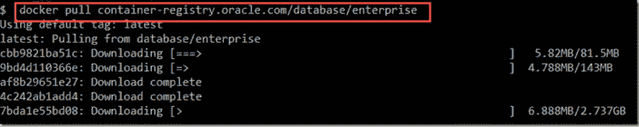

07:09 开始拉动

10:28 开始提取

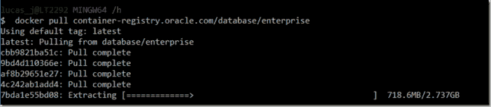

10.30 图像可用，现成容器关闭

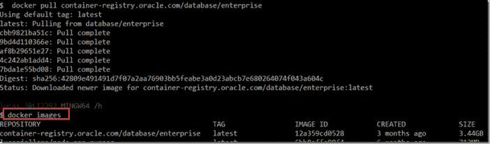

下载花了三个半小时。那段时间我一直在做事情，所以没有浪费时间。

完成提取后，图像被添加到 Docker 图像的本地缓存中。我现在可以运行数据库了。

> 【container-registry.oracle.com/database/enterprise:12.2.0.1 

值 ORA12201_1 是容器的自选名称。

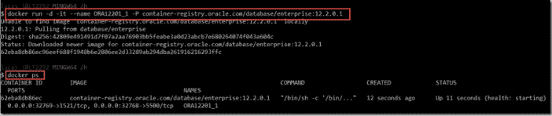

这里-P 表示端口可以由 docker 选择。可以通过执行以下命令来发现映射的端口

> *docker port ORA12201_1*

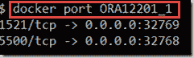

几分钟后—我不确定具体需要多长时间—容器状态正常:

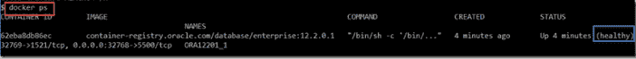

当容器状态为*Healthy*时，可以通过在容器内执行 sqlplus 来连接数据库服务器

> *docker exec-it ora 12201 _ 1 bash-c " source/home/Oracle/。bashrcsqlplus /nolog"*

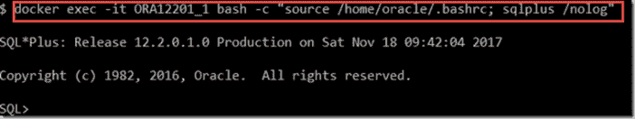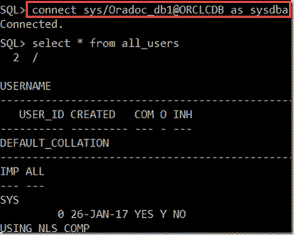

除了从容器内部连接到数据库——我们还可以把运行数据库的容器看作一个在端口 32769 公开数据库内部端口 1521 的后台程序。并且可以以常规方式使用任何能够与数据库通信的工具——前提是我们还拥有 Docker 主机的 IP 地址，如果不是从该机器本身进行连接的话:

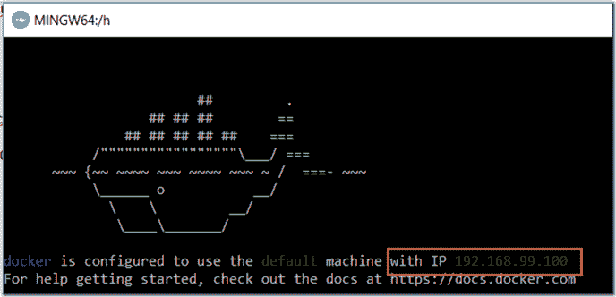

在 SQL Developer 中创建数据库连接的过程如下:

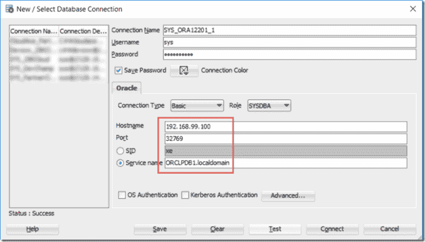

使用 SYS/Oradoc_db1 作为凭证，Docker 主机 IP 地址作为主机名，端口由 Docker 映射到容器中的端口 1521，在本例中为 32769。服务名由 PDB 名和域名组成:ORCLPDB1.localdomain

一个示例查询:

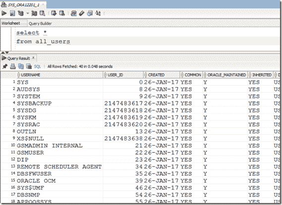

使用 SQL 连接是类似的:

> *SQL sys/Oradoc _ db1 @ 192 . 168 . 99 . 100:32769/orclpdb 1 . local domain as SYSDBA*

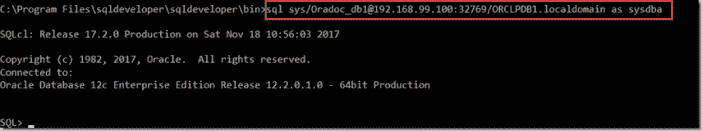

要停止容器和数据库:

> *停靠站 62eb*

干净利落地停下来需要几秒钟。

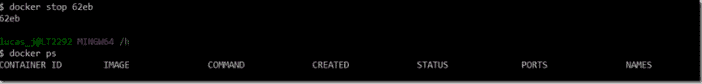

在数据库启动并运行之前，重新启动大约需要 1 分钟:

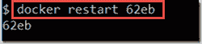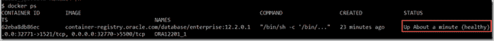

注意:使用这种基本方法，所有数据库文件都是在容器的文件系统中创建的。并且不能在别处获得，也不能在容器移除后存活。处理这些文件的更好方法是通过安装用于存储文件的主机文件夹或通过 Docker 卷。

*原载于 2017 年 11 月 18 日*[*technology . amis . nl*](https://technology.amis.nl/2017/11/18/run-oracle-database-in-docker-using-prebaked-image-from-oracle-container-registry-a-two-minute-guide/)*。*