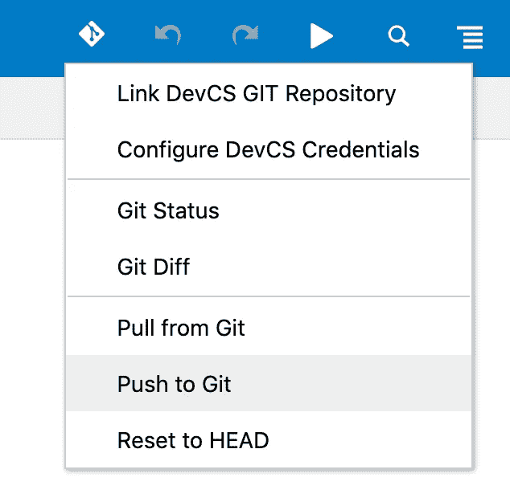

# 在您自己的服务器上运行 Oracle VBCS 应用程序

> 原文：<https://medium.com/oracledevs/run-oracle-vbcs-application-on-your-own-server-4ff25ec8fb3c?source=collection_archive---------0----------------------->

最新的 VBCS 版本带来了一个选项，可以导出 VBCS 应用程序，并在您自己的服务器(或不同的云提供商)上运行。对 VCBS 来说，这确实是向前迈出的一大步。在 Shay Shmeltzer 的博客[帖子](https://blogs.oracle.com/vbcs/running-visual-builder-apps-on-other-servers-and-on-premises)中了解更多信息。如果您决定继续在 VBCS 境内运行 VBCS 应用程序，那么您将获得 VBCS 商业服务、甲骨文云安全等附加功能。开箱即用。如果您导出 VBCS 应用程序并在您自己的环境中运行，这些功能不包括在内，但您不需要在托管应用程序时支付 VBCS 云运行时的费用。有替代方案是很好的，根据客户的不同，这种或那种用例都可以工作。

用例之一—客户甚至不需要拥有自己的 VBCS 实例。我们可以在我们的 VBCS 实例中开发 Oracle JET 应用程序，将其导出并部署到客户环境中。以后我们可以提供版本升级支持。

我已经用外部 REST 服务调用( [REST 服务](https://restcountries.eu/))导出了示例 VBCS 应用程序。在我们自己的服务器上部署应用程序。你可以自己试试——【http://138.68.79.219:7001/vbcsapp/webApps/countries】T4/:

我必须说，这是简单的出口 VBCS 应用程序，没有任何麻烦。确保您要导出的 VBCS 应用程序设置为匿名访问(这将禁用 Oracle 云安全模型)。您需要自己实现安全性和后端安全调用:

接下来转到 REST 服务控制并指定绕过代理选项(这将允许从 VBCS 应用程序直接调用 REST 服务，绕过 Oracle 云代理服务)。**重要提示**:要使用旁路代理选项，必须通过 HTTPS 调用 REST 服务:

VBCS 这边没别的了。接下来需要将应用程序代码推送到 Oracle Developer Cloud Service Git 存储库，并构建可以导出的工件。我建议阅读 Shay Shmeltzer 的博客[帖子](https://blogs.oracle.com/vbcs/automating-cicd-and-app-optimization-for-visual-builder-apps-with-developer-cloud)关于如何进行 VBCS 和甲骨文开发者云服务的设置。

在 VBCS，请推送所选应用的 Git:

如果是第一次使用 Oracle Developer Cloud Service，您将需要设置(参考上面提到的 Shay post)一个*构建作业*。创建构建作业配置，指向 Git repo:

为构建作业提供一组参数:

将 Unix Shell 脚本添加到构建作业中。该脚本将执行 Node.js NPM 命令来运行 *vb-build* 作业，以构建可以在您自己的环境中导出和部署的工件。确保脚本中使用的属性值与之前构建作业中定义的属性值相匹配非常重要。要执行 npm 命令，请确保使用支持 Node.js 的 Oracle Developer Cloud Service 计算机:

运行作业，一旦完成，如果没有错误，转到作业工件并下载*优化. zip* —这是您可以部署的 VBCS 应用程序的存档:

**重要提示**:当访问导出的 VCBS 应用时，它会加载一堆脚本并执行 HTTPS 请求。有一个请求会降低 VBCS 应用程序的初始加载速度——调用 *_currentuser* 。它试图在 VBCS 实例上执行 *_currentuser* 请求，但是如果该实例关闭，它将等待超时，然后才继续加载应用程序。要解决这个问题，在导出的代码中搜索 *_currentuser* URL，并将 URL 更改为某个虚拟值，这样这个请求将立即失败，并且不会阻止 VBCS 应用程序继续加载:

*原载于*[*http://andrejusb.blogspot.com*](http://andrejusb.blogspot.com/2019/04/running-oracle-vbcs-application-on-your.html)*。*